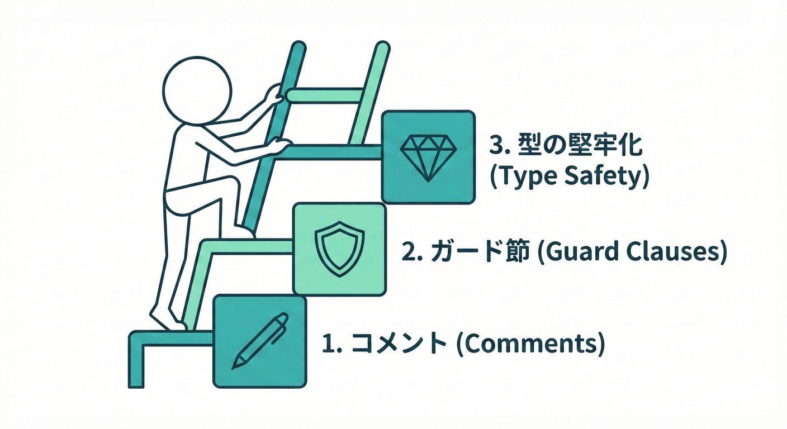
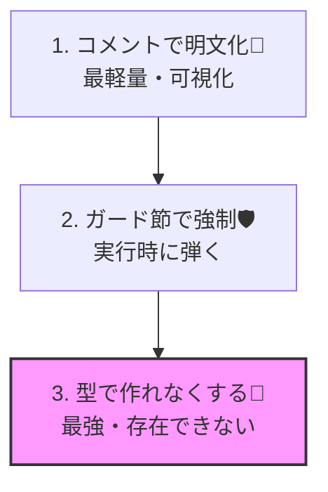
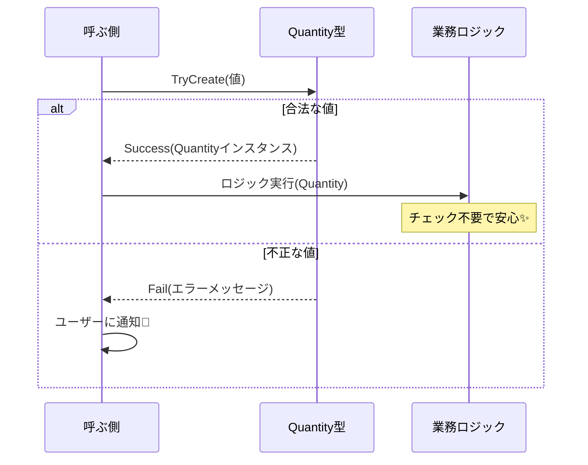

# 第5章 DbCの導入スタイル3つ（軽く→強く）🪜🌱

## 5.1 自分に合ったスタイルで始めよう🪜😊



DbCは、一気に全部やろうとしなくて大丈夫🌱

DbC（Design by Contract）を、いきなり“最強形”で始めずに…

* ③ 型（値オブジェクト等）で作れなくする（最強）💎🔒

…の3段階で、現実的に導入できるようになります😊🌸



---

## 2026年1月時点のC#メモ🧠✨

DbCは「考え方」なのでバージョンに左右されにくいけど、書きやすさは進化してます💡
2026年1月時点では、C# 13（.NET 9）が現行の安定ラインとして整理しやすいです。([Microsoft for Developers][1])
また、C# 14 は .NET 10 と一緒に来る（＝今は“これから”の領域）という扱いです。([Microsoft for Developers][2])

---

## まず結論：3スタイルの使い分け早見表👀✨

| スタイル                | 何をする？             | 強さ💪 | こんな時におすすめ🌷                   |
| ------------------- | ----------------- | ---: | ----------------------------- |
| ① コメントで明文化📝        | 「守るルール」を文章で書く     |  ★☆☆ | まず迷子を減らしたい／既存コードが多い           |
| ② ガード節＋例外/Result🛡️ | 実行時に“破ったら止める/返す”  |  ★★☆ | public境界の入力を守りたい／バグ混入を早期発見したい |
| ③ 型で作れなくする💎        | そもそも“不正な値”が存在できない |  ★★★ | 重要ルールを堅牢化したい／同じチェックを何度も書きたくない |

ポイントはこれ👇
**「いきなり③」にしない」**のがコツです😊🪜✨
（いきなり全部型にすると、設計が重くなって挫折しやすい…！😵‍💫💦）

---

## 今回の題材（同じルールを3方式で表現）🎨✅

例として、ショッピングカートに追加する処理を考えます🛒✨

* ルールA：商品ID（productId）は空じゃダメ🙅‍♀️
* ルールB：数量（quantity）は 1〜99 だけOK📦✨

この2つを「①→②→③」で表現していきます😊🌸

---

## ① コメントで明文化（最軽量）📝🌱

### 何がうれしい？🎁✨

* 「このメソッドって何を期待してるの？」が一瞬で分かる👀💡
* チームや未来の自分にやさしい💌
* まずはここから始めると挫折しにくい😊☕️

### 例：コメントで契約を書く📝

```csharp
public sealed class CartService
{
    /// <summary>
    /// カートに商品を追加する。
    /// 【Pre】productId は null/空/空白ではないこと
    /// 【Pre】quantity は 1〜99 の範囲であること
    /// </summary>
    public void AddItem(string productId, int quantity)
    {
        // まだ強制はしない（まずは契約の可視化）
        // 実装…
    }
}
```

### よくある落とし穴⚠️

* コメントだけだと「破っても動いちゃう」😅
* 気づいたらコメントと実装がズレる（あるある）😵‍💫

なので、次の②へ進みます🪜✨

---

## ② ガード節＋例外/Resultで強制（実行時）🛡️🔥

### ガード節ってなに？🧠

**「入口で弾いて、下をスッキリさせる」**書き方です🚪✨
上でチェック→NGなら即終了、OKなら下は信頼して読むだけ😊🌸

---

### ②-1：例外で強制する（契約違反＝開発者のミス向き）💥🧯

```csharp
public sealed class CartService
{
    public void AddItem(string productId, int quantity)
    {
        if (string.IsNullOrWhiteSpace(productId))
            throw new ArgumentException("productId must not be empty.", nameof(productId));

        if (quantity < 1 || quantity > 99)
            throw new ArgumentOutOfRangeException(nameof(quantity), "quantity must be between 1 and 99.");

        // ここから下は「契約を満たしてる」前提で書ける✨
        // 実装…
    }
}
```

#### うれしいポイント🎀

* 不正入力が来た瞬間に止まる＝バグの混入点が早く見える🔍✨
* 下の実装が読みやすくなる📖🌸

---

### ②-2：Resultで返す（仕様エラー＝ユーザー入力ミス向き）📩🙂

例外は強いけど、「入力ミスは起きうる」場面では Result が便利です💡✨

まずは最小の Result を自作してみます🧰

```csharp
public readonly record struct Result(bool IsSuccess, string? Error)
{
    public static Result Ok() => new(true, null);
    public static Result Fail(string error) => new(false, error);
}
```

使う側：

```csharp
public sealed class CartService
{
    public Result TryAddItem(string productId, int quantity)
    {
        if (string.IsNullOrWhiteSpace(productId))
            return Result.Fail("商品IDが未指定です。");

        if (quantity < 1 || quantity > 99)
            return Result.Fail("数量は1〜99で入力してください。");

        // 実装…
        return Result.Ok();
    }
}
```

#### うれしいポイント🎀

* 呼び出し側が「失敗を扱う」流れを作りやすい🧩✨
* 画面に丁寧なエラーを出したいときに自然😊🌸

---

### ②の小まとめ🧠✨

* 「これは開発者のミスだよね？」→ 例外💥
* 「これはユーザーが起こしうるよね？」→ Result📩

この使い分けができると、DbCが一気に実戦的になります🛡️✨

---

## ③ 型（値オブジェクト等）でそもそも作れなくする（最強）💎🔒

### どうして“最強”？👑✨

* ②だと、ついこうなりがち👇

* いろんな場所で同じチェックを繰り返す😵‍💫
* チェック漏れが起きる（怖い）😱

③は、**「不正な値がこの世に存在できない」**を目指します💎🔒



---

### 例：Quantity（数量）を専用型にする📦💠

```csharp
public readonly record struct Quantity
{
    public int Value { get; }

    private Quantity(int value) => Value = value;

    public static Result<Quantity> TryCreate(int value)
    {
        if (value < 1 || value > 99)
            return Result<Quantity>.Fail("数量は1〜99です。");

        return Result<Quantity>.Ok(new Quantity(value));
    }
}

public readonly record struct Result<T>(bool IsSuccess, T? Value, string? Error)
{
    public static Result<T> Ok(T value) => new(true, value, null);
    public static Result<T> Fail(string error) => new(false, default, error);
}
```

使う側（AddItem がスッキリ！）✨

```csharp
public sealed class CartService
{
    public Result TryAddItem(string productId, Quantity quantity)
    {
        if (string.IsNullOrWhiteSpace(productId))
            return Result.Fail("商品IDが未指定です。");

        // quantity は「作れた時点で合法」なので、ここでは範囲チェック不要✨
        // 実装…
        return Result.Ok();
    }
}
```

#### うれしいポイント🎀

* 数量のルールが1箇所に集約される🧲✨
* 「Quantity を受け取る」だけで、読む人が安心できる😊🌸
* チェックの書き忘れが減る🧯✨

---

## 3方式を“段階導入”するテンプレ🪜✨

### ステップ1：コメントでルールを可視化📝

* 既存コードに影響が少ない
* まず迷子を減らす

### ステップ2：重要な入口だけガード節🛡️

* publicメソッド、API、UI入力など
* バグ混入点を早期発見

### ステップ3：繰り返し出るルールを型に昇格💎

* 金額、数量、期間、メール、IDなど
* “同じチェックを3回書いたら型にする”くらいがちょうどいい😊✨

---

## ミニ演習（この章のゴール）🎓✨

### お題：同じルールを3方式で書いてみよう🎨✅

ルール：

* ユーザー名（userName）は「1〜20文字」
* 空白だけはNG🙅‍♀️

やること👇

1. コメントで Pre を書く📝
2. ガード節で弾く🛡️（例外 or Result）
3. UserName 型を作って “作れない” にする💎

---

## AI活用ミニ（速く上達するコツ）🤖⚡️

“お願いの仕方”を固定すると、品質が安定します🎀✨

* 「このルールの Pre/Post を日本語で1行ずつ」📝
* 「ガード節のコードをC#で。例外版とResult版を両方」🛡️
* 「値オブジェクト化して、TryCreate と CreateOrThrow を提案して」💎

最後に、人間がここだけチェック👇

* エラーメッセージが“利用者に伝わる言葉”になってる？🙂💬
* 例外とResultの役割が混ざってない？🧩🚫
* チェックが散らばってない？🧹✨

---

## 仕上げチェックリスト✅🌸

* [ ] ルールがコメントで1行で言える📝
* [ ] 入口（public/境界）でガード節がある🚪🛡️
* [ ] 同じチェックを何度も書いてない（型に寄せられる）💎
* [ ] “不正な状態”がドメイン内部に入りにくい設計になってる🔒✨

[1]: https://devblogs.microsoft.com/dotnet/announcing-dotnet-9/?utm_source=chatgpt.com "Announcing .NET 9"
[2]: https://devblogs.microsoft.com/dotnet/introducing-csharp-14/?utm_source=chatgpt.com "Introducing C# 14 - .NET Blog"
