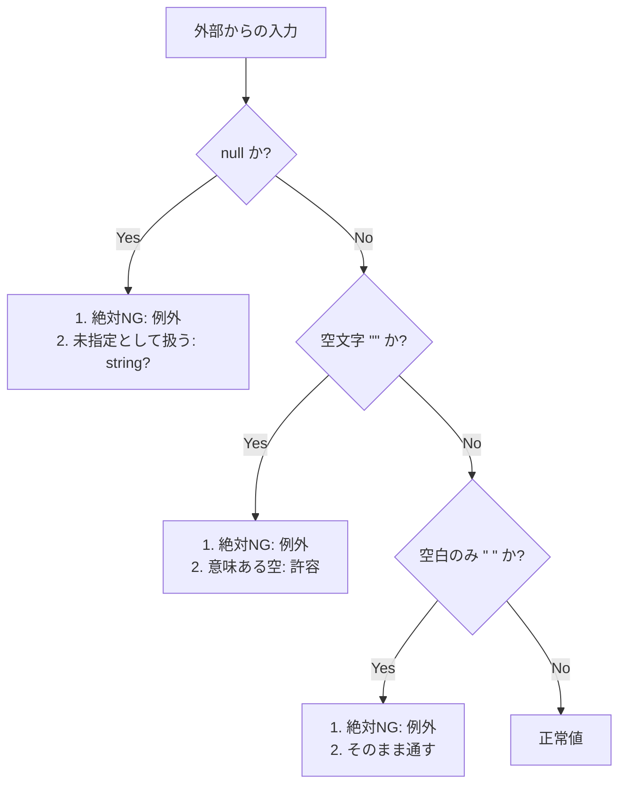
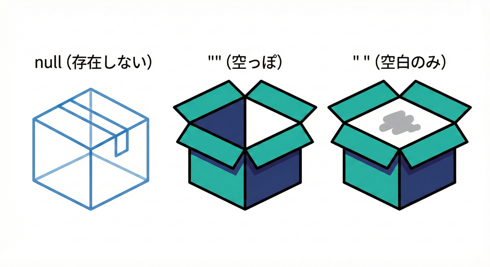
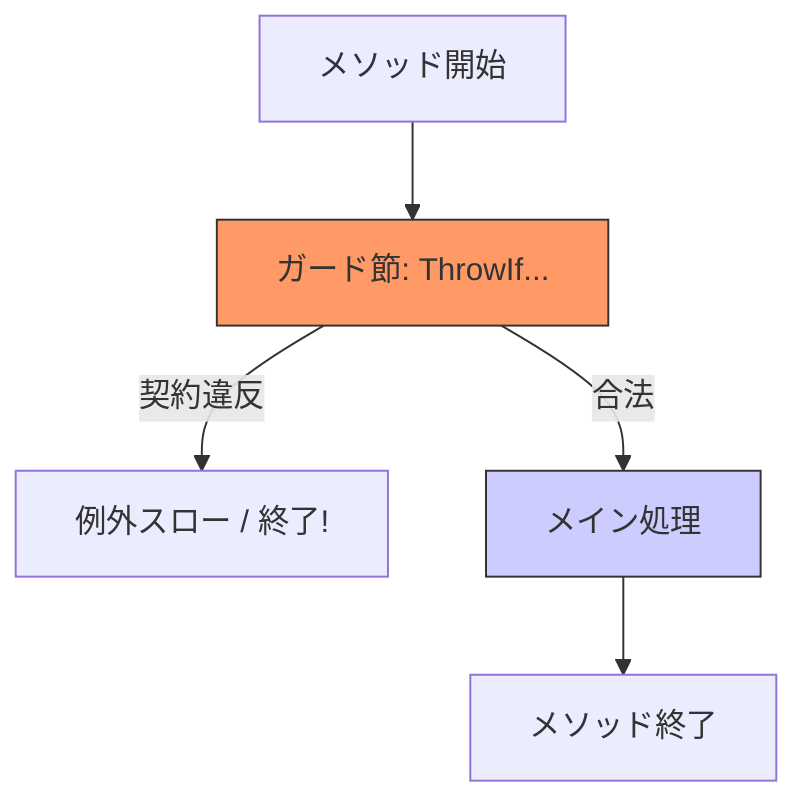

# 第6章 Preの基本：null・空・未指定を守る🚫🕳️

DbCの「Pre（事前条件）」は、**“呼び出し側が守る約束”**だよ〜🤝✨
特に最初に躓きやすいのが、**null / 空 / 未指定**の扱い🤯💦
ここを整理すると、入口チェック（ガード節）が一気にラクになるよ🛡️🌸

---

## 6.1 まずは3つをハッキリ分けよう🧠✨

同じ「入ってない」でも意味が違うよ👇

* **null**：値そのものが無い（参照が無い）🕳️
* **空**：値はあるけど中身が空（例：""、Count==0）📭
* **未指定**：「わざと入れてない」ことを表したいケース（オプション）🫥

ここで大事なのは…
**あなたのAPI（publicメソッド）が“どれを許すか”を決めること**だよ🚪🔑




---

## 6.2 ありがちな事故あるある😵‍💫💥

### ✅ 事故①：nullと空を混ぜて「なんとなく通す」

* 例：ユーザー名が "" でも通ってしまい、表示崩れ・検索不能・重複判定バグ…など💣

### ✅ 事故②：未指定のつもりで null を使って、別の意味に見える

* 「未指定＝デフォルトを使ってね」なのか
* 「値が壊れてる（契約違反）」なのか
  が曖昧になって事故るよ〜⚠️

---

## 6.3 “許す・許さない”を決めるミニ基準⚖️🌸

迷ったらこのルールが便利👇

### ルールA：受け取らないものは入口で弾く🚪🛡️

* 「nullは受け取らない」→ 入口で即例外
* 「空は受け取らない」→ 入口で即例外
* 「空配列は受け取らない」→ 入口で即例外

### ルールB：「未指定」を表したいなら、表現を固定する📌

おすすめは2択だよ✨

* **選択肢1：オプションは nullable（string? など）で表現**🫥

  * null = 未指定（意味がある）
* **選択肢2：オーバーロード / 引数省略で “未指定” を表現**🧩

  * 引数を渡さない = 未指定（意味がある）

どっちでもいいけど、**1つのAPI内で混ぜない**のが超大事だよ💡

---

## 6.2 null, "", " " の違い（超重要！）🧱📦



「未入力」と言っても、C#の世界ではこの3つを区別することが超大事だよ🧠✨

---

## 6.4 ガード節の基本形：「上で弾いて下をスッキリ」🛡️📐

入口チェックは、**最初にまとめて短く**が読みやすい✨
.NET 9〜10あたりでは、ガード用のThrowIf系がかなり便利になってるよ💖



（.NET 10は2025-11-11リリースのLTSで、いま現場の基準になりやすい版だよ📌） ([Microsoft][1])

---

## 6.5 文字列のPre：null / 空 / 空白だけ を分ける📛🧻

### ✅ ケース1：nullはNG、空もNG、空白もNG（いちばん多い）✨

```csharp
public static void UpdateDisplayName(string displayName)
{
    // null / "" / "   " を全部NGにする
    ArgumentException.ThrowIfNullOrWhiteSpace(displayName);

    // ここから下は「displayNameはちゃんと入ってる」世界🌈
    // ...
}
```

* “null/空/空白”をまとめて弾けるよ💪
* APIとしても読みやすいし、バグが減る✨ ([Microsoft Learn][2])

### ✅ ケース2：nullはNGだけど、空文字は「意味がある」なら許す

例：メモ欄は "" を許す（ただしnullは困る）みたいなケース📒

```csharp
public static void UpdateMemo(string memo)
{
    ArgumentNullException.ThrowIfNull(memo);

    // memo == "" はOK（仕様として許してる）
}
```

`ArgumentNullException.ThrowIfNull` は、引数名の自動取得とも相性が良いよ🧠✨ ([Microsoft Learn][3])

### ✅ ケース3：nullはNG、空文字だけNG（空白は許す？）

「空白だけはNG」かどうかは、業務によるよ〜🤔
もし「空文字はNG、空白もNG」に寄せたいなら、素直にThrowIfNullOrWhiteSpaceがラクだよ💗 ([Microsoft Learn][2])

---

## 6.6 コレクションのPre：nullと空の意味を決める📦🧺

コレクションはこの2パターンが多いよ👇

### ✅ パターン1：「nullはNG、空はOK」（“0件”が意味を持つ）🧘‍♀️

例：検索フィルタが0個なら「全部対象」など🔍

```csharp
public static void Search(IReadOnlyList<string> tags)
{
    ArgumentNullException.ThrowIfNull(tags);

    // tags.Count == 0 はOK（=指定なし）
}
```

### ✅ パターン2：「nullも空もNG」（“最低1件は必要”）🔥

例：一括更新の対象IDが0件は困る、など

```csharp
public static void BulkDelete(IReadOnlyList<int> ids)
{
    ArgumentNullException.ThrowIfNull(ids);
    if (ids.Count == 0)
        throw new ArgumentException("ids must contain at least one element.", nameof(ids));

    // ここから下は「最低1件ある」世界✨
}
```

---

## 6.7 “未指定”の表現：nullを使うなら、契約として宣言する🫥📌

たとえば「表示名は未指定なら現状維持」みたいなAPIを作りたい時👇

```csharp
public static void UpdateProfile(string userId, string? displayName)
{
    ArgumentException.ThrowIfNullOrEmpty(userId);

    // displayName == null は “未指定” として扱う（意味がある）
    if (displayName is null) return;

    ArgumentException.ThrowIfNullOrWhiteSpace(displayName);
    // 更新処理...
}
```

* `string?` にすることで「nullは意味がある（未指定）」を型でも表現できるよ🧷✨ ([Microsoft Learn][4])
* 既存プロジェクトでも、csprojに Nullable を有効化して型で守りやすくできるよ🔒 ([Microsoft Learn][5])
* 文字列の null/空チェックは `ThrowIfNullOrEmpty` も便利だよ🛠️ ([Microsoft Learn][6])

---

## 6.8 例外の選び方（Preの作法）🎭✅

Pre違反（＝呼び出し側が契約違反）には、だいたいこの3つを使うとキレイ✨

* **null** → `ArgumentNullException` 🕳️ ([Microsoft Learn][3])
* **空文字・不正な文字列** → `ArgumentException` 📛 ([Microsoft Learn][6])
* **範囲外** → `ArgumentOutOfRangeException` 📏 ([Microsoft Learn][7])

---

## 6.9 ミニ演習：引数チェックを“ガード節で統一”しよう🏃‍♀️🛡️

### お題🎯

次のメソッドの入口チェックを、**読みやすいガード節**に統一してね✨
（仕様：emailは必須、displayNameは必須、tagsはnull禁止だけど空はOK）

#### 改善前（わちゃわちゃ例）💦

```csharp
public static void RegisterUser(string email, string displayName, List<string> tags)
{
    if (email == null) throw new ArgumentNullException(nameof(email));
    if (email.Trim().Length == 0) throw new Exception("email invalid");
    if (displayName == null) throw new ArgumentNullException(nameof(displayName));
    if (displayName == "") throw new ArgumentException("bad");
    if (tags == null) throw new Exception("tags null");

    // 本体...
}
```

### ゴール例✅（1つの正解）

```csharp
public static void RegisterUser(string email, string displayName, List<string> tags)
{
    ArgumentException.ThrowIfNullOrWhiteSpace(email);
    ArgumentException.ThrowIfNullOrWhiteSpace(displayName);
    ArgumentNullException.ThrowIfNull(tags);

    // 本体...
}
```

### 追加チャレンジ🌟

* 例外メッセージを揃える（必要なら）💌
* tagsの中に null / 空白だけ が混ざってたら弾く、も追加してみよう🧼✨

---

## 6.10 AI活用（軽め）🤖✨：ガード節の候補を一瞬で出す

AIに頼むときは「仕様（許す/許さない）」を先に渡すのがコツだよ📝💡

* 「このメソッドは email と displayName は null/空/空白NG、tagsはnullNG・空OK。C#のガード節にして」
* 「例外型は ArgumentNullException / ArgumentException を使って、入口だけにまとめて」

最後は**人が読みやすさチェック**してね👀🎀

---

## 6.11 仕上げチェックリスト✅🌈

* [ ] この引数は **nullを許す？許さない？** を決めた？🕳️
* [ ] 空文字/空配列は **意味がある？ただのミス？** を決めた？📭
* [ ] “未指定” を表すなら、**null（型で表現） or 省略（オーバーロード）**に寄せた？🫥
* [ ] 入口チェックは **メソッド冒頭にまとまってる？** 🚪
* [ ] 例外型は **null/空/範囲**で自然に選べてる？🎭

---

次章は、Preを「型」に埋め込んでさらに強くするやつだよ🧷📌（Nullable参照型へ）

[1]: https://dotnet.microsoft.com/en-us/platform/support/policy?utm_source=chatgpt.com "The official .NET support policy"
[2]: https://learn.microsoft.com/en-us/dotnet/api/system.argumentexception.throwifnullorwhitespace?view=net-10.0&utm_source=chatgpt.com "ArgumentException.ThrowIfNullOrWhiteSpace(String ..."
[3]: https://learn.microsoft.com/ja-jp/dotnet/api/system.argumentnullexception.throwifnull?view=net-10.0&utm_source=chatgpt.com "ArgumentNullException.ThrowIfNull Method (System)"
[4]: https://learn.microsoft.com/en-us/dotnet/csharp/nullable-references?utm_source=chatgpt.com "Nullable reference types - C#"
[5]: https://learn.microsoft.com/ja-jp/dotnet/csharp/tutorials/nullable-reference-types?utm_source=chatgpt.com "null 許容参照型を使用して設計する - C#"
[6]: https://learn.microsoft.com/en-us/dotnet/api/system.argumentexception.throwifnullorempty?view=net-10.0&utm_source=chatgpt.com "ArgumentException.ThrowIfNullOrEmpty(String ..."
[7]: https://learn.microsoft.com/en-us/dotnet/api/system.argumentoutofrangeexception.throwifnegative?view=net-10.0&utm_source=chatgpt.com "ArgumentOutOfRangeException.ThrowIfNegative<T>(T, ..."
