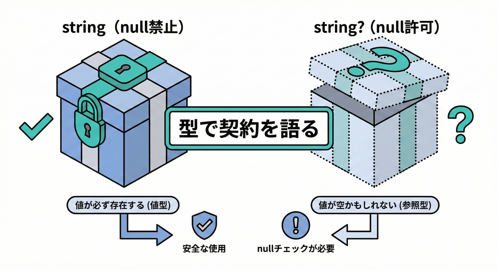
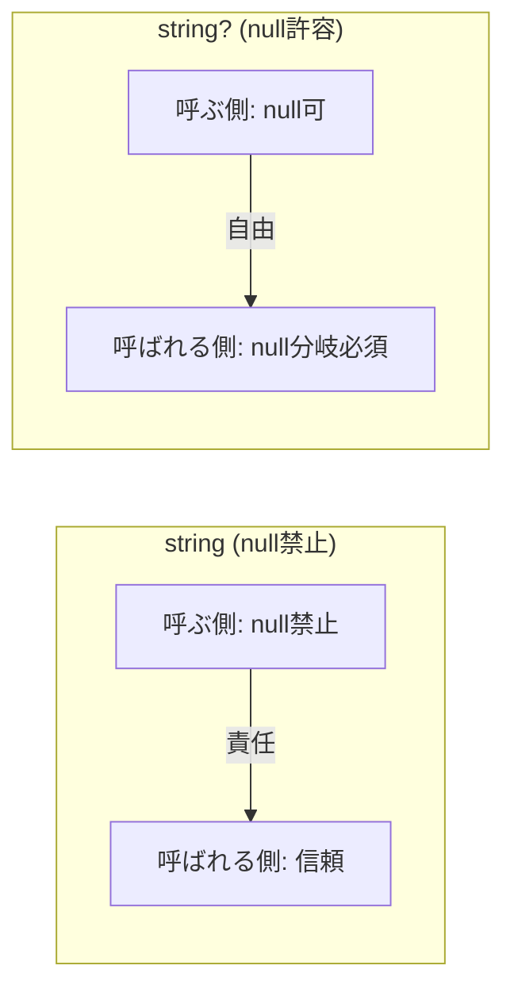
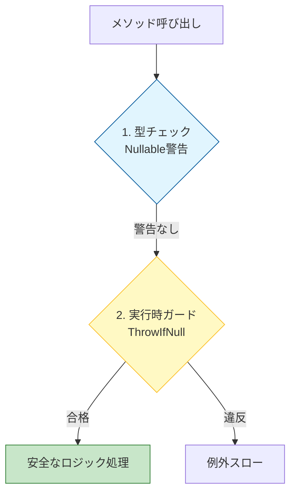

# 第7章 Nullable参照型で“契約”を型に埋め込む🧷📌

## 7.1 Nullable 参照型で「null」を型で語る🧷💎



C# 8.0 から導入された「Nullable 参照型（NRT）」を使うと、
「ここは null かもしれないよ」「ここは絶対 null じゃないよ」を **型で表現** できるようになるよ✨

DbCでいう **Pre（事前条件）** のうち、特に「nullを渡していい？ダメ？」を **型で表現**できるのが Nullable参照型（NRT）だよ😊🌸
C# 14 が最新で、.NET 10 と一緒に使うのが今の基本線だよ〜🪄✨ ([Microsoft Learn][1])

---

## 7.2 いちばん大事：**string** と **string?** は「契約の文章」📜💡

* 呼ばれる側：**nullのときの振る舞い** を必ず決める（返す？代替？エラー？）🎯



Nullable参照型はコンパイル時に「nullかも」を追跡して警告を出してくれる仕組みだよ🔍✨ ([Microsoft Learn][2])

---

## 7.3 「とりあえず ? を付ける」は危険⚠️😵‍💫

Nullable参照型は便利だけど、雑に **何でも string?** にすると、逆に設計が弱くなるの💦

### 🎀 「? を付ける前の3問」

1. **null って“意味がある”？**（未入力・不明・省略…など）🫥
2. **空文字（""）や空配列じゃダメ？**（意味が混ざらない？）🧺
3. **null のときどう扱うか** を説明できる？（返す/補正/拒否）🧠✨

### 🌟 よくある改善例

* 「未入力」→ null じゃなくて **Optional専用の型** や **Result** を検討🎁
* 「必須」→ **string** にして、入口で null を弾く🚪🛡️

---

## 7.4 超重要：Nullableは“コンパイル時”の契約。実行時チェックもまだ必要🧯🧩

Nullable参照型は **実行時に自動で例外を投げてくれるわけじゃない** よ⚠️
呼ぶ側が警告を無視したり、外部入力経由だったりすると、普通に null は来る可能性があるの🥺

Microsoftのドキュメントでも「Nullableはコンパイル時機能。ライブラリ作者は実行時のnullチェックも入れるのが安全」って話が出てるよ📚✨ ([Microsoft Learn][2])

* ガード節：万が一の侵入（外部入力・警告無視）を止める🚧



---

## 7.5 Nullableを有効にする場所🛠️✨（プロジェクト全体 or ファイル単位）

### ✅ プロジェクト全体でON（基本おすすめ）📦

**.csproj** に Nullable を入れるよ✍️
（.NET 6 以降のテンプレは最初からONが多いけど、まず確認が安心だよ😊） ([Microsoft Learn][3])

```xml
<Project Sdk="Microsoft.NET.Sdk">
  <PropertyGroup>
    <Nullable>enable</Nullable>
  </PropertyGroup>
</Project>
```

### ✅ ファイル単位でON（古いコードが多いときの救済策🪜）

「移行が大変…！」なら、まずは一部のファイルだけONにして、徐々に広げる作戦もあるよ🌱
段階移行の考え方も公式で紹介されてる😊✨ ([Microsoft Learn][4])

```csharp
#nullable enable

// このファイルだけ Nullable を有効にしたいときに使う
```

---

## 7.6 代表的な警告の読み方＆直し方🔧💖

NullableをONにすると、よく出る警告があるよ〜！「うわっ」ってならないように、パターンで覚えよ😆✨

### ① 「nullかもを . で参照してるよ」系（例：CS8602）😱

**原因**：string? に対してそのまま Length / Trim など
**直し方**：ガード・分岐・代替値・例外のどれかを決める

```csharp
string? name = GetName();

// 分岐で守る🛡️
if (name is null) return;
Console.WriteLine(name.Length);

// 代替値で守る🍬
Console.WriteLine((name ?? "").Length);

// ここまで来たら絶対必要！なら throw で守る🔥
Console.WriteLine((name ?? throw new InvalidOperationException("name is required")).Length);
```

### ② 「nullかもを引数に渡してるよ」系（例：CS8604）📩⚠️

**原因**：受け取り側が string（null禁止）なのに、渡す側が string?
**直し方**：

* 仕様的に null を許容するなら受け取り側も string? にする
* 許容しないなら、渡す前に **null除去**（ガード/補正/拒否）

```csharp
void SendEmail(string address) { /* ... */ }

string? input = GetAddress();

// null禁止の契約を守るため、入口で止める🚪
ArgumentNullException.ThrowIfNull(input);
SendEmail(input);
```

### ③ 「コンストラクタ抜ける時点で非nullプロパティが未初期化」系（例：CS8618）🏗️💦

**原因**：非nullのはずのプロパティが、初期化されてない
**直し方の王道**：

* コンストラクタで必ず入れる
* もしくは **required** を使って「必須」を表現する（初期化忘れを減らす）🧸✨

```csharp
public sealed class User
{
    public required string Name { get; init; }
}
```

---

## 7.7 DbCっぽく「契約を伝える」テク：Nullable属性を使う🧠🧷

Nullable参照型は、標準ライブラリ側も **属性** を付けて「このメソッドはnullチェックだよ」みたいに伝えてくれてるんだよね✨ ([Microsoft Learn][3])

自分のコードでも、**Try系** と相性バツグンだよ🎯

### ✅ Tryパターンで「成功したら out は非null！」を伝える🎁

```csharp
using System.Diagnostics.CodeAnalysis;

public static bool TryFindUser(
    string id,
    [NotNullWhen(true)] out User? user)
{
    // 例：DB検索のつもり
    if (id == "1")
    {
        user = new User { Name = "Aoi" };
        return true;
    }

    user = null;
    return false;
}

public sealed class User
{
    public required string Name { get; init; }
}
```

これで呼ぶ側は、true の分岐の中で user を安心して使いやすくなるよ😊✨

---

## 7.8 ミニ演習：nullable警告を“ヒント”にAPIを改善しよう🔧🌸

### 演習1：戻り値の契約をハッキリさせる📦✅

次のメソッド、仕様があいまいでバグりやすいよ💦
「空文字を返す」のか「見つからないなら null」なのか、どっち？🤔

```csharp
public string FindDisplayName(string userId)
{
    var user = LoadUser(userId); // 見つからないと null を返す実装だった…
    return user.DisplayName.Trim();
}
```

✅ やること🎀

* 仕様を決める（例：見つからなければ null を返す）
* 型に反映する（戻り値を string? にする、など）
* そのうえで、呼ぶ側が分岐できるようにする🪄

### 演習2：「null許可」を減らして、値オブジェクトで強くする💎🔒

メールは null 許可より「そもそも不正なものを作らせない」ほうが強いことが多いよ📧✨

```csharp
public readonly record struct EmailAddress(string Value)
{
    public static EmailAddress Create(string value)
    {
        ArgumentNullException.ThrowIfNull(value);
        value = value.Trim();

        if (value.Length == 0) throw new ArgumentException("Email is empty.");

        // ここは簡易チェック例（実務なら要件に合わせる）
        if (!value.Contains('@')) throw new ArgumentException("Email is invalid.");

        return new EmailAddress(value);
    }
}
```

こうすると「EmailAddress は常に正しい」っていう **不変条件（Inv）** が作りやすくなるよ🧱💖

---

## 7.9 AIの使いどころ：警告を消すだけじゃなく「契約の文章化」までやる🤖📝✨

Nullable警告が出たら、AIにこう聞くと便利だよ🎀

### ✅ おすすめプロンプト例

* 「この警告（CS8602/CS8604/CS8618）を消したい。
  ただし **null許可を増やしすぎず**、メソッドの **契約（Pre/Post）** が分かる形で直して。
  直した後の呼び出し側の例も出して。」

### 🔍 最終チェック（人間の出番👀✨）

* 「nullの意味」をちゃんと説明できる？🧠
* 入口で止めるべきnullが、奥に入り込んでない？🚪
* ? を増やして“先送り”してない？🧷💦

---

## 7.10 まとめ：Nullable参照型は「Preを型で表す」最強の第一歩🪜💖

* **string / string? は契約文** 📝✨
* でも Nullableは **コンパイル時**。入口では **ガード節もまだ大事** 🛡️ ([Microsoft Learn][2])
* 警告は「怒られてる」じゃなくて「設計を良くするヒント」だよ🌷😊

[1]: https://learn.microsoft.com/en-us/dotnet/csharp/whats-new/csharp-14?utm_source=chatgpt.com "What's new in C# 14"
[2]: https://learn.microsoft.com/en-us/dotnet/csharp/nullable-references "Nullable reference types - C# | Microsoft Learn"
[3]: https://learn.microsoft.com/en-us/dotnet/csharp/language-reference/builtin-types/nullable-reference-types "Nullable reference types - C# reference | Microsoft Learn"
[4]: https://learn.microsoft.com/en-us/dotnet/csharp/nullable-migration-strategies?utm_source=chatgpt.com "Update your codebase to use nullable reference types - C#"
