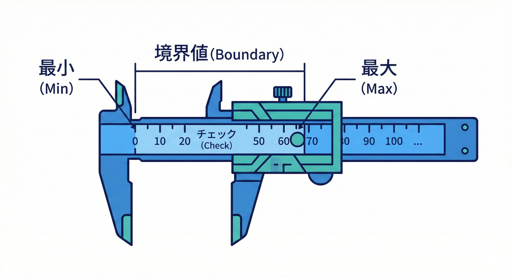
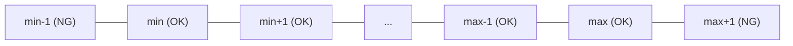
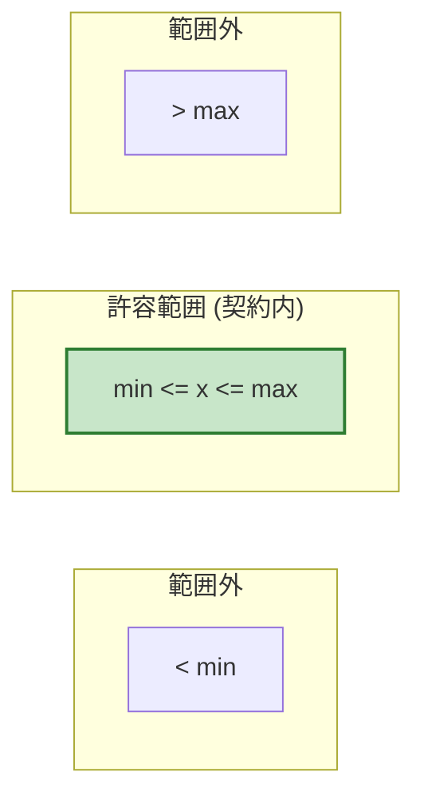
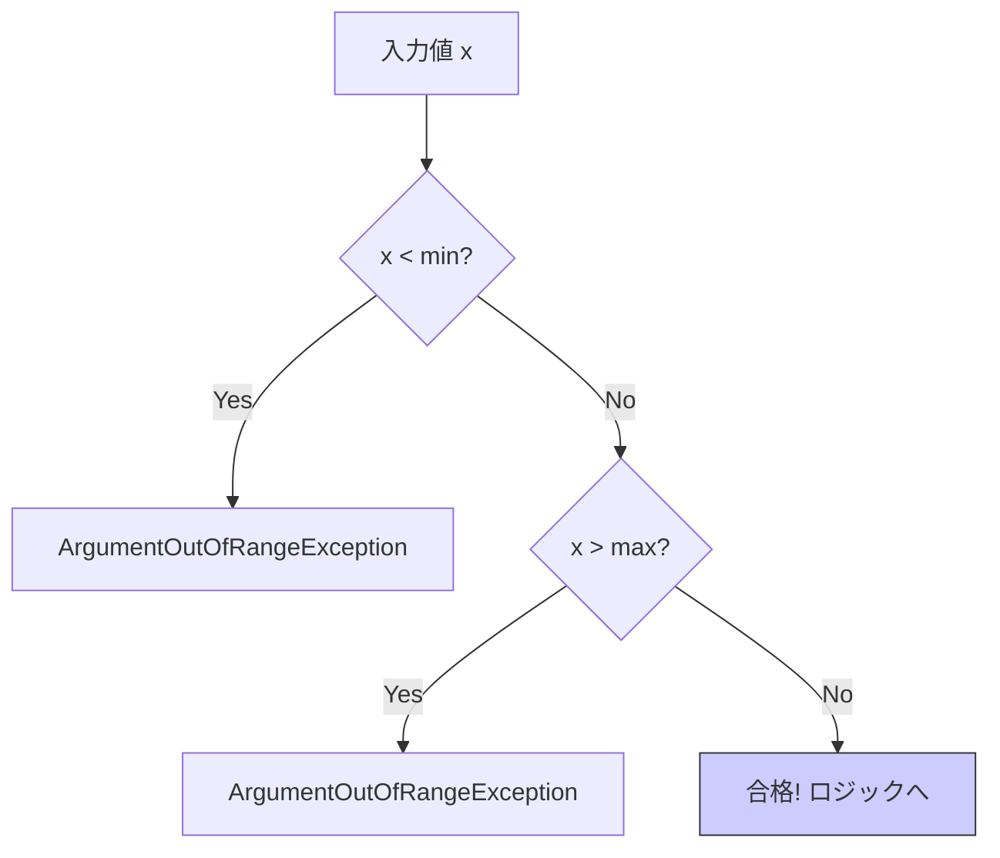

# 第8章 範囲チェック：境界値（0、最大、最小）が主役📏🚧

## 8.1 数値の範囲は「ものさし」で測る📏🚧



DbCの中で、nullチェックの次に多いのが **「数値の範囲（Range）」** のチェックだよ💡

## この章でできるようになること🎯✨

* 「範囲（range）」の契約を、**読みやすいガード節**で書けるようになる🛡️📝
* **境界値（min / max / 0）**からテスト候補を作れるようになる🧪📌
* .NETの **ThrowIf 系ヘルパー**で、チェックを短く・安全に書けるようになる⚡️💎
* AIで「境界値テスト候補」を一瞬で列挙して、人が整える流れを作れる🤖✨✍️

---

## 1) 「範囲チェック」ってなに？📏🙂

範囲チェックは、ざっくり言うとこう👇

* 「この値は **この区間に入っててね**」を守らせるチェック✅
  例：`0以上`, `1〜100`, `開始 <= 終了`, `長さは1〜50` など

DbC的には、範囲は **Pre（事前条件）**になりやすいです🛡️✨
（呼び出す側が守るべき“約束”になりやすい）

---

## 2) 境界値が主役な理由💥🧠

範囲のバグは、だいたい「端っこ」で起きます😵‍💫💦

* `>=` のつもりが `>` になってた
* `max` のつもりが `max - 1` までしか通らない
* `0` を許可するかどうかが曖昧
* 「上限は含む？含まない？」が曖昧（inclusive/exclusive）

だからテストも **境界値中心**が効きます🧪✨

✅ 典型テンプレ（整数の範囲 `min..max` のとき）

* `min - 1`（外）
* `min`（内）
* `min + 1`（内）
* `max - 1`（内）
* `max`（内）
* `max + 1`（外）





---

## 3) よくある範囲ルールのパターン集📚✨

### パターンA：0以上（non-negative）🔢✅

* 個数、在庫、料金、ページ番号オフセットなど
* 例：`quantity >= 0`

### パターンB：1以上（positive）➕✅

* ページサイズ、人数、回数など
* 例：`pageSize >= 1`

### パターンC：区間（min〜max）🧊🔥

* 例：割引率 `0〜100`、音量 `0〜10`、年齢 `0〜150`

### パターンD：長さ・件数の上限📚🚧

* 文字列長 `1〜50`
* リスト件数 `0〜1000`（上限だけ決めることも多い）

### パターンE：double の特殊値に注意🫧⚠️

* `NaN` が混ざると比較が崩れることがある（設計で弾くのが安全）
* 「小数を許す範囲」は、境界が曖昧になりやすいので要注意👀

---

## 4) 実装テンプレ：短く・事故りにくく書く🛡️⚡️

### 4-1) ThrowIf 系ヘルパーで“ガード節”を短くする✨

C# 14 は .NET 10 でサポートされていて、Visual Studio 2026 には .NET 10 SDK が含まれます。 ([Microsoft Learn][1])
.NET 10 は 2025-11-11 リリースの LTS で、2026-01-13 時点の最新パッチは 10.0.2 です。 ([Microsoft][2])

.NET には「引数チェック専用の ThrowIf」が用意されていて、範囲チェックがかなり読みやすくなります😊✨
たとえば `ThrowIfNegative`（負なら例外）があります。 ([Microsoft Learn][3])

```csharp
public static int ClampPercent(int percent)
{
    // percent は 0..100 のはず（範囲の契約）
    ArgumentOutOfRangeException.ThrowIfLessThan(percent, 0);
    ArgumentOutOfRangeException.ThrowIfGreaterThan(percent, 100);

    return percent;
}
```

> ポイント💡
>
> * 入口で弾く → 下のロジックがスッキリ✨
> * `ThrowIfLessThan / ThrowIfGreaterThan` の組み合わせで「区間」を表現しやすい🎀



---

### 4-2) 「長さ」の範囲チェック（文字列・コレクション）📏🧵

文字列そのもののチェックには `ArgumentException.ThrowIfNullOrEmpty` / `ThrowIfNullOrWhiteSpace` が便利です。 ([Microsoft Learn][4])

```csharp
public static void ValidateUserName(string name)
{
    ArgumentException.ThrowIfNullOrWhiteSpace(name);

    // 長さの契約：1..20
    ArgumentOutOfRangeException.ThrowIfLessThan(name.Length, 1);
    ArgumentOutOfRangeException.ThrowIfGreaterThan(name.Length, 20);
}
```

コレクション件数も同じ考え方でOK📚✨

```csharp
public static void ValidatePageSize(int pageSize)
{
    // 例：1..100
    ArgumentOutOfRangeException.ThrowIfLessThan(pageSize, 1);
    ArgumentOutOfRangeException.ThrowIfGreaterThan(pageSize, 100);
}
```

---

### 4-3) 自前 Guard を作って、読みやすさを統一する🎀🛡️

プロジェクト内で「チェックの見た目」を揃えると、レビューが楽になります👀✨

```csharp
public static class Guard
{
    public static int InRange(int value, int minInclusive, int maxInclusive, string? paramName = null)
    {
        ArgumentOutOfRangeException.ThrowIfLessThan(value, minInclusive, paramName);
        ArgumentOutOfRangeException.ThrowIfGreaterThan(value, maxInclusive, paramName);
        return value;
    }

    public static string NotNullOrWhiteSpace(string? value, string? paramName = null)
    {
        ArgumentException.ThrowIfNullOrWhiteSpace(value, paramName);
        return value!;
    }
}
```

使う側はこう👇（読みやすい😍）

```csharp
public static void CreateAccount(string name, int age)
{
    name = Guard.NotNullOrWhiteSpace(name);
    age  = Guard.InRange(age, 0, 150);

    // ここから先は“信頼して”書ける✨
}
```

---

## 5) 例外メッセージ、どこまで書く？💌🧠

ThrowIf はシンプルで良い反面、「許容範囲」が例外メッセージに出ないこともあります。
チームで方針を決めると迷いが減ります🎯✨

* **開発者向けの契約違反**として扱うなら：
  ThrowIf で短く（ログやテストで追える）🛠️✅
* 「調査コストを下げたい」なら：
  追加でメッセージを付ける（ただし盛りすぎ注意）🧁⚠️

例：メッセージをはっきりさせたいとき👇

```csharp
public static void ValidateBatchSize(int batchSize)
{
    if (batchSize is < 1 or > 500)
        throw new ArgumentOutOfRangeException(nameof(batchSize), batchSize, "batchSize must be 1..500.");
}
```

---

## 6) 境界値テストの作り方🧪📌（xUnit例）

### 6-1) 境界値リストを先に書く📝✨

例：`pageSize は 1..100`

* NG：`0`, `101` 🚫
* OK：`1`, `2`, `99`, `100` ✅

ここまで作れたら、テストはほぼ勝ちです🏁✨

---

### 6-2) パラメータ化テスト（Theory）で一気に書く⚡️

```csharp
using Xunit;

public class PageSizeTests
{
    [Theory]
    [InlineData(0)]
    [InlineData(101)]
    public void ValidatePageSize_out_of_range_throws(int pageSize)
    {
        Assert.Throws<ArgumentOutOfRangeException>(() => ValidatePageSize(pageSize));
    }

    [Theory]
    [InlineData(1)]
    [InlineData(2)]
    [InlineData(99)]
    [InlineData(100)]
    public void ValidatePageSize_in_range_ok(int pageSize)
    {
        ValidatePageSize(pageSize); // 例外が出なければOK
    }

    private static void ValidatePageSize(int pageSize)
    {
        ArgumentOutOfRangeException.ThrowIfLessThan(pageSize, 1);
        ArgumentOutOfRangeException.ThrowIfGreaterThan(pageSize, 100);
    }
}
```

---

## 7) Visual Studio の「おすすめ修正」を味方にする💡✨

「引数チェックで if して例外投げてる」と、Visual Studio のコード分析が
`ThrowIf` への置き換えを提案することがあります🧠🔍（.NET 10 で既定有効の提案ルールとして案内されます） ([Microsoft Learn][5])

✅ うれしいこと

* 書き方が揃う🎀
* 例外の種類ミスが減る🧯
* 小さいメソッドほど読みやすくなる✨

---

## 8) AI（Copilot/Codex）で「境界値候補」を秒速で出す🤖⚡️

### 8-1) 境界値の候補出しプロンプト例🪄

* 「`pageSize は 1..100`。テストの入力候補を **境界値中心**で列挙して。OK/NGに分類して」
* 「このメソッドの引数に必要な範囲条件を推測して、“契約文（日本語）”と“ガード節（C#）”をセットで提案して」

### 8-2) AIの出力をチェックするコツ👀✅

* `min/max` の **含む/含まない** がズレてない？
* `0` を許すかの判断が勝手に入ってない？
* 「本当は仕様エラー扱い」なのに、全部契約違反にしてない？

---

## 9) ミニ演習🧩🎓（手を動かす！）

### 演習1：ページングの契約を作る📄✨

**お題**：`pageNumber` と `pageSize` を受け取って、範囲を守らせる

* `pageNumber` は `1..∞`
* `pageSize` は `1..100`

1. `ValidatePaging(pageNumber, pageSize)` を作る🛠️
2. 境界値テストを作る🧪
3. 余裕があれば、`Paging` を **値オブジェクト**にして「不正な状態を作れない」に寄せる💎🔒

ヒント（まずは関数でOK）👇

```csharp
public static void ValidatePaging(int pageNumber, int pageSize)
{
    ArgumentOutOfRangeException.ThrowIfLessThan(pageNumber, 1);

    ArgumentOutOfRangeException.ThrowIfLessThan(pageSize, 1);
    ArgumentOutOfRangeException.ThrowIfGreaterThan(pageSize, 100);
}
```

---

### 演習2：文字列長の契約を作る🧵📏

**お題**：`displayName` は「空白だけNG、長さは 1..20」

* `null / "" / "   "` をNGにする🚫
* `Length` を 1..20 にする✅
* テスト候補を境界値で作る🧪✨（0,1,2,19,20,21）

---

## まとめ🌸✅

* 範囲チェックは「端っこ（境界値）」が主役📏🚧
* ガード節は **入口で短く**、下をスッキリ🛡️✨
* .NET の `ThrowIf` を使うと、読みやすさと統一感が上がる⚡️😊 ([Microsoft Learn][3])
* テストは「min/max ± 1」と「0」をまず疑う🧪🔍

[1]: https://learn.microsoft.com/en-us/dotnet/csharp/whats-new/csharp-14?utm_source=chatgpt.com "What's new in C# 14"
[2]: https://dotnet.microsoft.com/ja-jp/platform/support/policy/dotnet-core?utm_source=chatgpt.com ".NET および .NET Core の公式サポート ポリシー"
[3]: https://learn.microsoft.com/en-us/dotnet/api/system.argumentoutofrangeexception.throwifnegative?view=net-10.0&utm_source=chatgpt.com "ArgumentOutOfRangeException.ThrowIfNegative<T>(T, ..."
[4]: https://learn.microsoft.com/ja-jp/dotnet/api/system.argumentexception.throwifnullorempty?view=net-9.0&utm_source=chatgpt.com "ArgumentException.ThrowIfNullOrEmpty(String ..."
[5]: https://learn.microsoft.com/ja-jp/dotnet/fundamentals/code-analysis/quality-rules/ca1512?utm_source=chatgpt.com "ArgumentOutOfRangeException throw ヘルパーを使用する"
