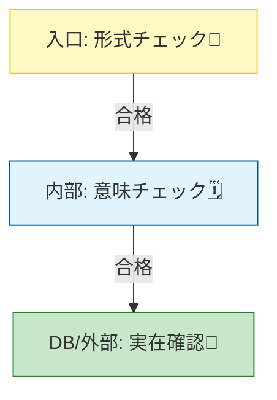
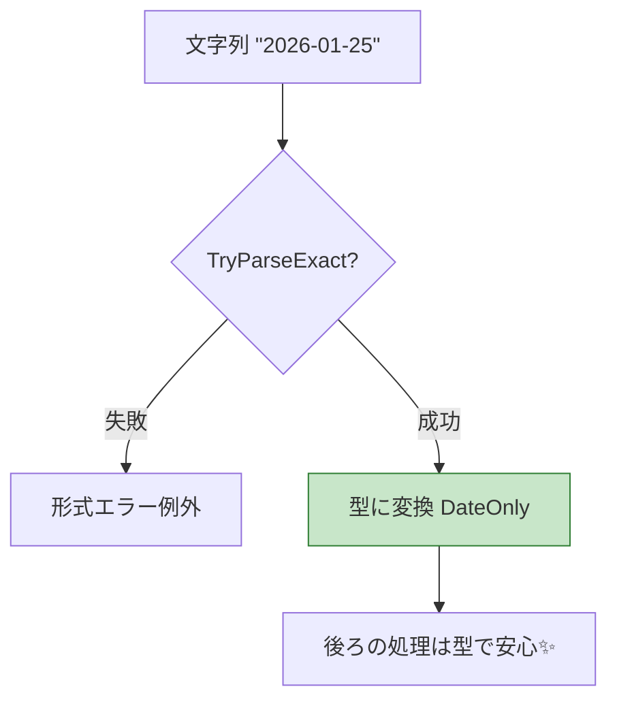

# 第9章 形式チェック：メール/日付/IDの“形”を守る📧🗓️🪪

## 9.0 この章でできるようになるよ💪✨

* 「形式チェック」って何を守る話なのかが分かる🧠✨
* メール📧／日付🗓️／ID（GUID）🪪 を、読みやすく安全にチェックできるようになる✅
* 正規表現（regex）を“使いすぎない”コツが身につく🧁
* 境界（public入口）でのガード節として、きれいに実装できる🚪🛡️

---

## 9.1 形式チェックってなに？📧🗓️🪪


「形式チェック（Formatting Check）」は、値の **“見た目（形）”** が正しい約束どおりかをチェックすることだよ✨

**形式チェック =「文字列の“見た目のルール”が守られてる？」を見るチェック**だよ✅

たとえば…

* 📧 メール：`@` がある、ドメインっぽい、空白なし…など
* 🗓️ 日付：`2026-01-25` みたいな **決めたフォーマット** で読めるか
* 🪪 ID：`Guid` として **パースできる形** か

ここで大事なのは👇
**形式がOKでも、意味がOKとは限らない**ってこと🥺

* 📧 形式がOKでも、そのメールが実在するとは限らない（最終的には確認メールが必要）([Microsoft Learn][1])
* 🗓️ 形式がOKでも、あり得ない日付（例：2/30）ならパースで落ちる
* 🪪 形式がOKでも、そのIDがDBに存在するかは別問題



---

## 9.2 形式チェックは「まずパース」→「必要ならregex」がおすすめ🍰✅

### ① いちばん読みやすい：型に変換できるかで判定🧩✨

* 日付なら `DateOnly.TryParseExact` が超つよい🗓️💪([Microsoft Learn][2])
* GUIDなら `Guid.TryParseExact` が超つよい🪪💪([Microsoft Learn][3])

**“型にできた＝形が合ってる”**って考え方は、読みやすいしバグりにくいよ😊✨

### ② regexは「小さく・分かりやすく」だけ使う📏🙂

メールみたいに「型にしづらい」ものは、**簡単なregex**で“それっぽい形”をチェックしてOK🙆‍♀️
ただし、**regexだけで完璧を目指さない**のが鉄則だよ🧯([Microsoft Learn][1])

### ③ regexを使うならタイムアウトを付けよう⏱️🛡️

ユーザー入力みたいな **信用できない文字列** をregexで処理するなら、**タイムアウト必須**だよ（DoS対策）🧨([Microsoft Learn][1])

---

## 9.3 例① メールアドレスの形式チェック📧✅

### 9.3.1 “やりすぎ厳密”は避けよう🥺

メールはルールが超広いので、

* 「完璧なregex」を作ろうとすると地獄👹
* しかも **実在確認はできない**（最終的には確認メールが必要）📨([Microsoft Learn][1])

なので方針はこれ👇

* ✅ **小さなチェックで入力ミスを減らす**
* ✅ **本当に必要なら確認メールで確定**📩([Microsoft Learn][1])

### 9.3.2 “分かる実装”サンプル（GeneratedRegex＋タイムアウト）🧁✨

ポイント👇

* source generator を使うと、起動や実行が速くなったり、トリミングに強くなったりして嬉しいよ🚀([Microsoft Learn][4])
* `GeneratedRegexAttribute` は **timeout（ミリ秒）** も指定できるよ⏱️([Microsoft Learn][5])

```csharp
using System.Text.RegularExpressions;

public static partial class EmailFormat
{
    // ざっくり「それっぽい」チェック（入力ミス対策用）
    // ・空白なし
    // ・@が1つ
    // ・ドメインにドットがある
    [GeneratedRegex(@"^[^@\s]+@[^@\s]+\.[^@\s]+$",
        RegexOptions.IgnoreCase,
        matchTimeoutMilliseconds: 250)]
    private static partial Regex EmailLikeRegex();

    public static bool IsProbablyValid(string? email)
    {
        if (string.IsNullOrWhiteSpace(email)) return false;

        // “完璧な正しさ”ではなく、“入力ミスを減らす”目的で使う
        return EmailLikeRegex().IsMatch(email);
    }
}
```

> 💡ここでOKになっても「存在するメール」かは別だよ📨（確認メールが最終手段）([Microsoft Learn][1])

---

## 9.4 例② 日付の形式チェック🗓️✅

### 9.4.1 日付は「フォーマットを決めてTryParseExact」が正義✨

日付は **文化圏（例：1/2が1月2日？2月1日？）**で事故りやすいので、
「入力フォーマットを固定」して `TryParseExact` が安心だよ🧯✨([Microsoft Learn][2])

### 9.4.2 DateOnlyで「日付だけ」を安全に扱う🌸

* 誕生日・予約日・締め日…みたいに **時刻がいらない** 場面で便利🎀

```csharp
using System.Globalization;

public static class DateFormat
{
    // 例："2026-01-25" を受け取りたい（ISOっぽい固定形式）
    public static bool TryParseYyyyMmDd(string? text, out DateOnly date)
    {
        if (string.IsNullOrWhiteSpace(text))
        {
            date = default;
            return false;
        }

        return DateOnly.TryParseExact(
            text,
            "yyyy-MM-dd",
            CultureInfo.InvariantCulture,
            DateTimeStyles.None,
            out date
        );
    }
}
```

`DateOnly.TryParseExact` は「指定フォーマットに完全一致」が条件だよ✅([Microsoft Learn][2])

### 9.4.3 “時刻とタイムゾーン”が絡むなら DateTimeOffset も候補⏰🌍

APIやログで `2026-01-25T10:30:00+09:00` みたいにオフセット込みなら、`DateTimeOffset.TryParseExact` が便利だよ✨([Microsoft Learn][6])

---

## 9.5 例③ ID（GUID）の形式チェック🪪✅

### 9.5.1 文字列IDは「Guidにできる？」で判定しよう✨

`Guid.TryParseExact` を使うと **フォーマット指定** までできて便利だよ🧁([Microsoft Learn][3])

よく使うformat（代表）👇

* `"D"` : `xxxxxxxx-xxxx-xxxx-xxxx-xxxxxxxxxxxx`（ハイフンあり）
* `"N"` : `xxxxxxxxxxxxxxxxxxxxxxxxxxxxxxxx`（ハイフンなし）
* `"B"` : `{...}`
* `"P"` : `(...)`

```csharp
public static class IdFormat
{
    // 例：ハイフンありの "D" 形式だけ許可したい
    public static bool TryParseGuidD(string? text, out Guid id)
    {
        if (string.IsNullOrWhiteSpace(text))
        {
            id = default;
            return false;
        }

        return Guid.TryParseExact(text, "D", out id);
    }
}
```

`Guid.TryParseExact` は「指定形式ならOK、それ以外はNG」にできるよ✅([Microsoft Learn][3])



---

## 9.6 “入口ガード節”としてまとめるテンプレ🛡️🚪

「入力DTO → まず形式チェック → OKなら型にして次へ」って流れにすると、
後ろのコードがスッキリするよ🧘‍♀️✨

```csharp
using System.Globalization;

public static partial class Guard
{
    // メール（ざっくり）
    [GeneratedRegex(@"^[^@\s]+@[^@\s]+\.[^@\s]+$",
        RegexOptions.IgnoreCase,
        matchTimeoutMilliseconds: 250)]
    private static partial Regex EmailLikeRegex();

    public static string Email(string? value, string paramName)
    {
        if (string.IsNullOrWhiteSpace(value))
            throw new ArgumentException("メールアドレスが未入力です🥺", paramName);

        if (!EmailLikeRegex().IsMatch(value))
            throw new ArgumentException("メールアドレスの形式が変です📧💦", paramName);

        return value;
    }

    // 日付（yyyy-MM-dd固定）
    public static DateOnly DateYyyyMmDd(string? value, string paramName)
    {
        if (string.IsNullOrWhiteSpace(value))
            throw new ArgumentException("日付が未入力です🥺", paramName);

        if (!DateOnly.TryParseExact(value, "yyyy-MM-dd",
                CultureInfo.InvariantCulture, DateTimeStyles.None, out var date))
            throw new ArgumentException("日付の形式は yyyy-MM-dd で入れてね🗓️✨", paramName);

        return date;
    }

    // GUID（D形式固定）
    public static Guid GuidD(string? value, string paramName)
    {
        if (string.IsNullOrWhiteSpace(value))
            throw new ArgumentException("IDが未入力です🥺", paramName);

        if (!Guid.TryParseExact(value, "D", out var id))
            throw new ArgumentException("IDの形式が変です（GUIDのD形式）🪪💦", paramName);

        return id;
    }
}
```

---

## 9.7 ミニ演習：会員登録の入力チェックを作ろう🎓🌸

### お題📘✨

次の3つを受け取って、**入口で形式チェック**してから次へ渡そう✅

* Email（string）📧
* BirthDate（string：yyyy-MM-dd）🗓️
* UserId（string：GUID D形式）🪪

### やることリスト✅

1. `Guard.Email` / `Guard.DateYyyyMmDd` / `Guard.GuidD` を呼ぶ
2. 戻り値（型）に変換できたら「次の処理へ」進める
3. 例外メッセージは“人が見て分かる文”にする💌🙂

### テストも書こう🧪✨（例）

* Email: `a@b.com` OK / `a@b` NG / `a b@c.com` NG
* Date: `2026-01-25` OK / `2026/01/25` NG / `2026-02-30` NG
* Guid: `9D2B0228-4D0D-4C23-8B49-01A698857709` OK / `9D2B...`（崩れ）NG

---

## 9.8 AI活用（Copilot/Codex）で爆速にする🤖⚡️

### 使えるお願い文（そのまま貼ってOK）📋✨

* 「C#で `DateOnly.TryParseExact` を使って yyyy-MM-dd をパースする関数と、失敗ケースのテストを作って」
* 「GUIDのD形式だけ許可する `TryParseGuidD` とテストケースを列挙して」
* 「メールの“入力ミス検出用”の小さいregex案を2つ出して。読みやすさ優先で。タイムアウトも付けて」

### AIの出力をレビューする観点👀🧯

* regexが“完璧”を狙って巨大化してない？（やめよ🥺）([Microsoft Learn][1])
* `TryParseExact` のフォーマットが要件と一致してる？🗓️
* 例外メッセージが「次に何をすればいいか」分かる？💌🙂

---

## 9.9 よくある落とし穴あるある😵‍💫💦

* 📧 メールをregexだけで“完全検証”しようとして沼る（存在確認はできない）([Microsoft Learn][1])
* 📧 regexにタイムアウトを付け忘れて、入力で重くなる🧨([Microsoft Learn][1])
* 🗓️ `TryParse` で通して文化圏差分で事故る（`TryParseExact`推奨）([Microsoft Learn][7])
* 🪪 GUIDを「長さだけ」で見てしまう（`TryParseExact`の方が安心）([Microsoft Learn][3])

---

## 9.10 まとめチェックリスト✅🌈

* [ ] 入口（public境界）で形式チェックしてる？🚪🛡️
* [ ] 日付は `TryParseExact` でフォーマット固定してる？🗓️✨([Microsoft Learn][2])
* [ ] GUIDは `TryParseExact` で形式まで指定してる？🪪✨([Microsoft Learn][3])
* [ ] メールは“入力ミス対策”として小さくチェックして、必要なら確認メールの設計？📧📨([Microsoft Learn][1])
* [ ] regexにタイムアウト付けた？⏱️🛡️([Microsoft Learn][1])

---

### ちょい豆知識（2026年1月の今どき）🫘✨

.NET は年1回（だいたい11月）メジャーが出る流れで、**.NET 10 は LTS**としてサポート中だよ🧡（2026-01-13時点の最新パッチは 10.0.2）([Microsoft][8])
C# 14 の新機能も .NET 10 世代で案内されてるよ🪄([Microsoft Learn][9])

[1]: https://learn.microsoft.com/en-us/dotnet/standard/base-types/how-to-verify-that-strings-are-in-valid-email-format "How to verify that strings are in valid email format - .NET | Microsoft Learn"
[2]: https://learn.microsoft.com/ja-jp/dotnet/api/system.dateonly.tryparseexact?view=net-10.0&utm_source=chatgpt.com "DateOnly.TryParseExact Method (System)"
[3]: https://learn.microsoft.com/en-us/dotnet/api/system.guid.tryparseexact?view=net-10.0&utm_source=chatgpt.com "Guid.TryParseExact Method (System)"
[4]: https://learn.microsoft.com/ja-jp/dotnet/standard/base-types/regular-expression-source-generators ".NET 正規表現ソース ジェネレーター - .NET | Microsoft Learn"
[5]: https://learn.microsoft.com/en-us/dotnet/api/system.text.regularexpressions.generatedregexattribute?view=net-10.0 "GeneratedRegexAttribute Class (System.Text.RegularExpressions) | Microsoft Learn"
[6]: https://learn.microsoft.com/en-us/dotnet/api/system.datetimeoffset.tryparseexact?view=net-10.0&utm_source=chatgpt.com "DateTimeOffset.TryParseExact Method (System)"
[7]: https://learn.microsoft.com/ja-jp/dotnet/standard/base-types/custom-date-and-time-format-strings?utm_source=chatgpt.com "カスタム日時形式文字列 - .NET"
[8]: https://dotnet.microsoft.com/en-us/platform/support/policy?utm_source=chatgpt.com "The official .NET support policy"
[9]: https://learn.microsoft.com/en-us/dotnet/csharp/whats-new/csharp-14?utm_source=chatgpt.com "What's new in C# 14"
