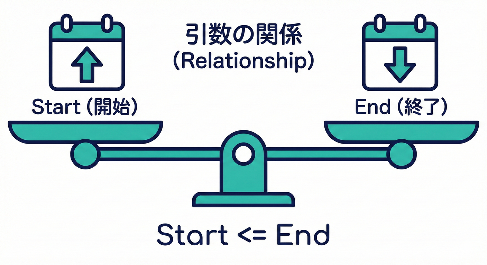
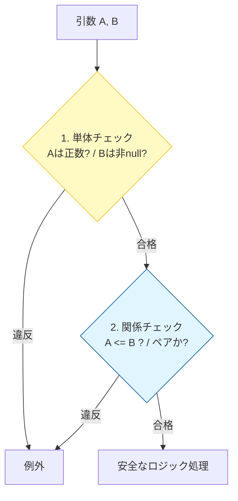
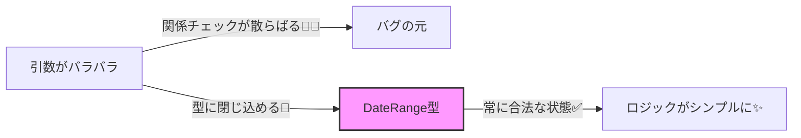

# 第10章 引数同士の関係：開始<=終了、合計<=上限など🔗✅

## この章でできるようになること🎯✨

* 「引数ひとつずつは正しいのに、組み合わせると不正」なケースを見抜ける👀💡
* ガード節で **読みやすく・壊れにくく** 関係チェックを書ける🛡️🧠
* 関係が複雑になったときに「設計を変えるサイン」を判断できる🚦✂️

---

## 1) “単体チェック”と“関係チェック”は別物🧩🔗



これまでやってきたのは、主に「その引数ひとつだけで完結する」チェックだったよね💡

### 単体チェック（バラでOK？）✅

* `count > 0` 🔢
* `max <= 100` 📏
* `name` が null/空じゃない ✍️

### 関係チェック（組み合わせてOK？）🔗✅
  * `start <= end`（開始日が終了日より後はダメ）📅
  * `min <= max`（最小が最大を超えるのはダメ）📏
  * `a + b <= limit`（合計が上限超えはダメ）🧮
  * `from` があるなら `to` も必須（ペア条件）👫
  * `discountRate` と `discountAmount` は同時に指定できない（排他）🚫



ポイント：**単体チェックを通っても、関係チェックで落ちる**のは普通にあるよ😊🌸

---

## 2) まずは王道パターン：開始と終了（start <= end）📅🔰

「予約期間」を受け取るメソッドを想像してみよ〜💭✨
例：ホテル予約の検索（開始日〜終了日）

**契約（Pre）** の言い方📝💗

* `start` と `end` は有効な日付
* **start は end 以下**（start <= end）
* `guests` は 1 以上
* `guests` は `maxGuests` 以下

---

## 3) ガード節で書くコツ：単体 → 関係 の順が安定🛡️✨

最近の .NET では `ThrowIfNull` / `ThrowIfNullOrEmpty` / `ThrowIfNullOrWhiteSpace` みたいな **引数チェック用ヘルパー**が充実してるよ💎（`paramName` を省略すると引数名が自動で入る設計になってる）✨ ([Microsoft Learn][1])

```csharp
using System;

public static class HotelSearch
{
    // 日付だけ欲しいなら DateOnly がスッキリ✨（.NET 6 で導入）
    public static void Search(DateOnly start, DateOnly end, int guests, int maxGuests)
    {
        // ✅ 単体チェック（それぞれ単体で正しい？）
        if (guests <= 0) throw new ArgumentOutOfRangeException(nameof(guests), "guests は 1 以上だよ🍀");
        if (maxGuests <= 0) throw new ArgumentOutOfRangeException(nameof(maxGuests), "maxGuests は 1 以上だよ🍀");

        // ✅ 関係チェック（組み合わせとして正しい？）
        if (start > end)
            throw new ArgumentException("start は end 以下にしてね📅（start <= end）");

        if (guests > maxGuests)
            throw new ArgumentException("guests は maxGuests 以下にしてね👥（guests <= maxGuests）");

        // ここから下は「もう安全」✨
        // ...検索処理...
    }
}
```

DateOnly/TimeOnly は「日付だけ」「時刻だけ」を素直に表せる型だよ🗓️⏰ ([Microsoft Learn][2])

### ✨“関係チェック”の例外は何を投げる？

* **範囲の問題**（`guests <= 0` など）→ `ArgumentOutOfRangeException` が分かりやすい📏
* **引数の組み合わせが不正**（`start > end` など）→ `ArgumentException` が王道🔗

---

## 4) ありがち関係パターン集🧁✅

### A. min/max（最小 <= 最大）📏

```csharp
public static void SetRange(int min, int max)
{
    if (min > max) throw new ArgumentException("min は max 以下にしてね📏");
}
```

### B. 合計 <= 上限（a + b <= limit）🧮

```csharp
public static void Allocate(int a, int b, int limit)
{
    if (a < 0) throw new ArgumentOutOfRangeException(nameof(a));
    if (b < 0) throw new ArgumentOutOfRangeException(nameof(b));
    if (limit < 0) throw new ArgumentOutOfRangeException(nameof(limit));

    // overflow が気になるなら checked を使うのもアリ🧯
    if (a + b > limit) throw new ArgumentException("合計が上限を超えてるよ🧮");
}
```

### C. ペア条件（片方があるなら片方も必要）👫

```csharp
public static void SearchWithOptionalPeriod(DateOnly? start, DateOnly? end)
{
    // 片方だけ指定はダメ🙅‍♀️
    if (start is null ^ end is null)
        throw new ArgumentException("start と end はセットで指定してね👫");

    // start と end が両方あるなら関係チェック📅
    if (start is not null && end is not null && start > end)
        throw new ArgumentException("start は end 以下にしてね📅");
}
```

`^`（XOR）で「どっちか片方だけ」を判定できるの便利✨

### D. 排他（同時に指定できない）🚫

```csharp
public static void ApplyDiscount(decimal? rate, decimal? amount)
{
    if (rate is not null && amount is not null)
        throw new ArgumentException("rate と amount は同時に指定できないよ🚫");
}
```

---

## 5) 「関係が複雑」になったら設計サイン✂️🚦

関係チェックが増えてきて、こんな感じになってきたら要注意😵‍💫💦

* `if` が 10 個以上…
* 「start と end と timezone と includeEnd と …」みたいに引数が増殖🌱
* “この2つの組は常に一緒” が多い👫👫👫

そのときは、**ペアやルールごとに“専用型”を作る**のが強いよ💎🔒
（次の部の「値オブジェクト」につながるやつ！）

### 例：DateRange（期間）型に閉じ込める📦✨

```csharp
public readonly record struct DateRange(DateOnly Start, DateOnly End)
{
    public static DateRange Create(DateOnly start, DateOnly end)
    {
        if (start > end) throw new ArgumentException("start は end 以下にしてね📅");
        return new DateRange(start, end);
    }

    public int DaysInclusive => End.DayNumber - Start.DayNumber + 1; // 例：両端含む
}
```

こうすると、呼び出し側は **不正な期間を作れない** ＝ 事故が減るよ🧯💕



---

## 6) テストで守る：境界は“関係”にもあるよ🧪📏✨

関係チェックで特に大事なのはこの3つ👇

* **等しい**（start == end）✅
* **1つ違い**（start が 1 日後）❌
* **上限ぴったり**（a + b == limit）✅

```csharp
using System;
using Xunit;

public class HotelSearchTests
{
    [Fact]
    public void start_equal_end_is_ok()
    {
        var d = new DateOnly(2026, 1, 25);
        HotelSearch.Search(d, d, guests: 1, maxGuests: 1);
    }

    [Fact]
    public void start_after_end_throws()
    {
        var start = new DateOnly(2026, 1, 26);
        var end   = new DateOnly(2026, 1, 25);

        Assert.Throws<ArgumentException>(() =>
            HotelSearch.Search(start, end, guests: 1, maxGuests: 3));
    }

    [Fact]
    public void guests_over_maxGuests_throws()
    {
        var d = new DateOnly(2026, 1, 25);

        Assert.Throws<ArgumentException>(() =>
            HotelSearch.Search(d, d, guests: 4, maxGuests: 3));
    }
}
```

---

## 7) AI（Copilot/Codex）に頼むときのコツ🤖💡✨

AIは「関係チェックの漏れ」や「テスト候補」を出すのが得意だよ🧠⚡️
ただし、**仕様（契約）を文章で先に渡す**のがコツ📝💗

### 使える指示の例（そのまま貼ってOK）📎✨

* 「このメソッドの Pre 条件を箇条書きにして。次に、その条件を満たすガード節コードを C# で提案して」🤖🛡️
* 「start/end の境界値テストを xUnit で列挙して（OK/NG を両方）」🧪📏
* 「関係が増えたので、専用型（DateRange）にまとめる案を出して」📦✨

最後に人間がチェックするポイント✅

* 「等しいとき OK？」（start==end）
* 「両端含む？含まない？」（期限系でよく事故る⚠️）
* 「例外メッセージは読める？」（未来の自分に優しく💌）

---

## 8) ミニ演習（手を動かす）🧁💪✨

### 演習1：期間の安全化📅🔒

* `DateRange.Create(start, end)` を作る
* `start == end` を OK にする
* `start > end` を例外にする

### 演習2：合計<=上限🧮📏

* `Allocate(a, b, limit)` を作る
* テストで `(a+b)==limit` OK、`(a+b)==limit+1` NG を書く

### 演習3：排他パラメータ🚫

* `rate` と `amount` の同時指定を禁止する
* どっちか片方、または両方 null は OK にする

---

## まとめ📌✨

* **単体チェック**と**関係チェック**は別スキル🧩🔗
* 書く順番は「単体 → 関係」で読みやすい🛡️😊
* 関係が増えてきたら **専用型に閉じ込める**のが強い💎🔒
* 最近の .NET には `ThrowIfNull` 系の便利ヘルパーもあるよ✨ ([Microsoft Learn][1])

（ちなみに 2026年1月13日時点では .NET 10.0.2 が最新リリースとして案内されてるよ📦✨） ([Microsoft][3])

[1]: https://learn.microsoft.com/ja-jp/dotnet/api/system.argumentnullexception.throwifnull?view=net-10.0&utm_source=chatgpt.com "ArgumentNullException.ThrowIfNull Method (System)"
[2]: https://learn.microsoft.com/ja-jp/dotnet/standard/datetime/how-to-use-dateonly-timeonly?utm_source=chatgpt.com "DateOnly と TimeOnly の使用方法 - .NET"
[3]: https://dotnet.microsoft.com/en-US/download/dotnet/10.0?utm_source=chatgpt.com "Download .NET 10.0 (Linux, macOS, and Windows) | .NET"
