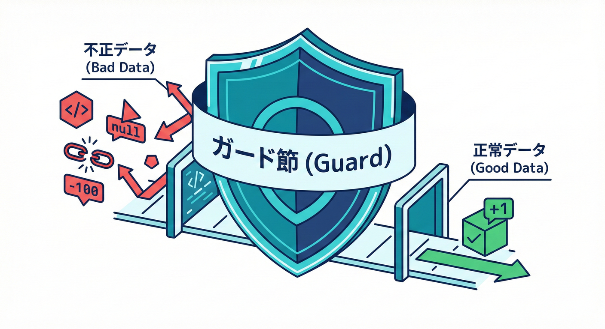
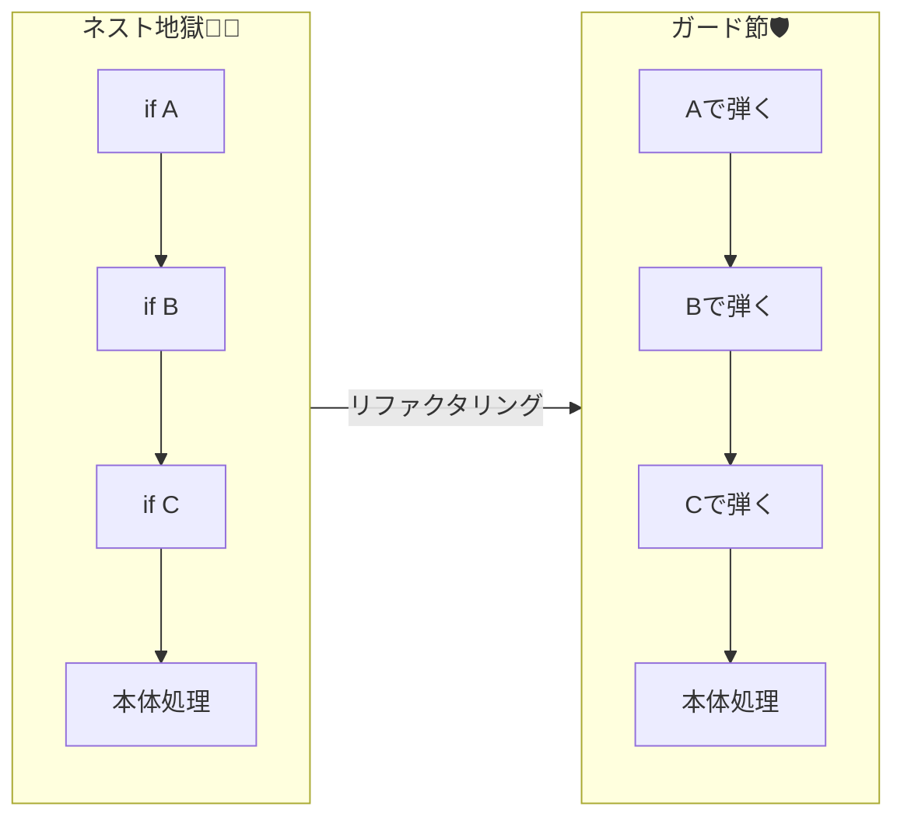
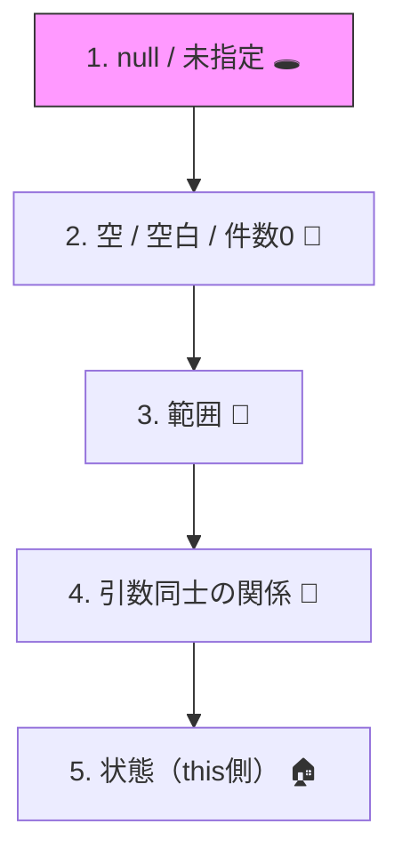

# 第11章 ガード節の書き方：読みやすさの型を作る🛡️📐
 
 
 
 ガード節には、**「読みやすさの王道パターン（型）」** があるよ✨

* 「入口で弾く」コードを**読みやすく統一**できるようになる😊🧹
* 例外の種類（`ArgumentNullException` / `ArgumentException` / `ArgumentOutOfRangeException` など）を**迷わず選べる**ようになる🎁✅
* **.NET 10 / C# 14**の“ThrowIf 系”を使って、短く安全なガード節を書けるようになる🚀💻 ([Microsoft Learn][1])

---

## 1. ガード節ってなに？🛡️📐



**「ガード節（Guard Clause）」** は、メソッドのいちばん最初（入口）で
不正な値を弾いてしまう書き方のことだよ🛡️✨
ガード節（guard clause）は、メソッドの冒頭で
「この条件だと処理できないよ！」を**先に弾いて**、下の本体をスッキリさせる書き方だよ✨

* ✅ **契約（Pre条件）をコードで強制**できる🤝📝



---

## 2. “読みやすいガード節”の基本形（型）🎀

ガード節は、だいたいこの並びにすると超読みやすいよ😊✨

### ✅ 型：上から順に「軽い・単純・重要」へ🪜

5. **状態（this側）の前提**（Dispose済み等）🏠⚠️



---

## 3. 例外は何を投げる？ミニ辞書📚✨

ここがブレると、チームのコードが読みにくくなるよ〜🥺💦
まずは“鉄板”だけ覚えよう💪🌸

* `ArgumentNullException`：引数が `null` 🕳️
* `ArgumentException`：引数の内容がダメ（空、形式違い、関係違いなど）🧩
* `ArgumentOutOfRangeException`：引数が範囲外（負、上限超えなど）📉📈
* `InvalidOperationException`：オブジェクト状態がダメ（順序違い、初期化前など）🚫
* `ObjectDisposedException`：破棄済みで使えない🗑️

---

## 4. .NET 10 世代の「ThrowIf」でガード節を短くする💨✨

### 4.1 null チェックはこれでOK🕳️✅

```csharp
public void Save(Customer customer)
{
    ArgumentNullException.ThrowIfNull(customer);
    // ↓ここから本体（前提を信じてOK）
}
```

`ThrowIfNull` は `paramName` を省略してOK（引数名を自動で取れる仕組みがあるよ）🧠✨ ([Microsoft Learn][2])

さらに、こういう分析ルールも「ifでnew例外作るより ThrowIf が良いよ」って推してるよ📏🔍 ([Microsoft Learn][3])

---

### 4.2 文字列：null/空/空白を一発で弾く📛🧁

```csharp
public void ChangeDisplayName(string displayName)
{
    ArgumentException.ThrowIfNullOrWhiteSpace(displayName);
    // ここから本体
}
```

`ThrowIfNullOrWhiteSpace` は **null/空/空白だけ** をまとめて弾けるよ✨ ([Microsoft Learn][4])

「null か空なら ArgumentException を投げる」みたいなパターンも、専用の推奨ルールがあるよ📌 ([Microsoft Learn][5])

---

### 4.3 数値：範囲チェックは ThrowIf 系が超便利📏🚧

```csharp
public void SetQuantity(int quantity)
{
    ArgumentOutOfRangeException.ThrowIfNegativeOrZero(quantity);
    // quantity >= 1 が保証された✨
}
```

* `ThrowIfNegative` / `ThrowIfNegativeOrZero` / `ThrowIfLessThan` / `ThrowIfGreaterThan` などが使えるよ🧰✨ ([Microsoft Learn][6])

---

## 5. “ThrowIf だけで足りない”ときの書き方🧠🛠️

ThrowIf は短くて最高なんだけど、弱点もあるよ👇

* 「エラーメッセージを細かく書きたい」💌
* 「引数同士の関係チェック」🔗
* 「業務エラー（仕様エラー）は例外じゃなく Result で返したい」📩

こういう時は **素直に if + throw** でOK😊✨

### 5.1 引数同士の関係（期間チェック）⏳🔗

```csharp
public void Reserve(DateOnly start, DateOnly end)
{
    // 単体チェック（ここでは例として省略）

    if (start > end)
        throw new ArgumentException("start must be <= end.");

    // ここから本体
}
```

### 5.2 メッセージの型（テンプレ）💌🧁

未来の自分が助かるメッセージはこれ👇

* ✅ **何がダメ？**（ルール）
* ✅ **どの引数？**（名前）
* ✅ **できれば値も**（ログで助かる）

例：

```csharp
if (maxItems is < 1 or > 1000)
    throw new ArgumentOutOfRangeException(nameof(maxItems), maxItems, "maxItems must be between 1 and 1000.");
```

---

## 6. “ガード節が汚くなる”よくある事故と対策😵‍💫🧯

### 事故①：if のネスト地獄🌋

```csharp
// 😵‍💫読みにくい例
if (customer != null)
{
    if (!string.IsNullOrWhiteSpace(customer.Name))
    {
        // ...
    }
}
```

✅ 対策：上で弾く（ガード節）✨

```csharp
ArgumentNullException.ThrowIfNull(customer);
ArgumentException.ThrowIfNullOrWhiteSpace(customer.Name);
// ... 本体
```

---

### 事故②：ガード節が散らかる（同じチェックがあちこち）🧹💦

✅ 対策：**入口のpublicメソッドに寄せる**＆**テンプレで統一**🎀

---

### 事故③：例外の種類が毎回バラバラ🎭

✅ 対策：この章の「ミニ辞書📚」に寄せる（チームで固定）🤝✨

---

## 7. ガード節テンプレ（コピペ用）🧩🎀

「毎回書くのめんどい！」を減らすための、超よくある形だよ😊

### 7.1 文字列

```csharp
ArgumentException.ThrowIfNullOrWhiteSpace(name);
```

### 7.2 数値（1以上）

```csharp
ArgumentOutOfRangeException.ThrowIfNegativeOrZero(count);
```

### 7.3 範囲（min〜max）

```csharp
if (value < min || value > max)
    throw new ArgumentOutOfRangeException(nameof(value), value, $"value must be between {min} and {max}.");
```

### 7.4 関係（start <= end）

```csharp
if (start > end)
    throw new ArgumentException("start must be <= end.");
```

---

## 8. ミニ演習①：ネスト地獄を“ガード節スタイル”に直す🧪✨

### お題（Before）😵‍💫

```csharp
public static int CalcTotalPrice(string? couponCode, int quantity, int unitPrice)
{
    if (couponCode != null)
    {
        if (couponCode.Trim().Length > 0)
        {
            if (quantity > 0)
            {
                if (unitPrice > 0)
                {
                    // 本体（例）
                    return quantity * unitPrice;
                }
            }
        }
    }
    return 0;
}
```

### やること✅

* `couponCode`：null/空白は「クーポンなし扱い」にしてOK（= ガードで弾かない）🙂
* `quantity` と `unitPrice`：1以上じゃないとダメ（= ガードで弾く）🛡️

### 例（After：ガード節でスッキリ）🌸

```csharp
public static int CalcTotalPrice(string? couponCode, int quantity, int unitPrice)
{
    ArgumentOutOfRangeException.ThrowIfNegativeOrZero(quantity);
    ArgumentOutOfRangeException.ThrowIfNegativeOrZero(unitPrice);

    // couponCode は optional（null/空白ならクーポンなし）
    var hasCoupon = !string.IsNullOrWhiteSpace(couponCode);

    return quantity * unitPrice;
}
```

---

## 9. ミニ演習②：自分のプロジェクトに“ガード節の型”を入れる🏗️✨

次の3つのメソッドを1つ選んで、**ガード節だけ**書いてみよう😊📝

* `CreateUser(string email, string displayName, int age)` 📧
* `PlaceOrder(Guid customerId, IReadOnlyList<OrderItem> items)` 🛒
* `Reserve(DateOnly start, DateOnly end, int guests)` 🗓️

### ヒント💡

* 文字列 → `ThrowIfNullOrWhiteSpace`
* 数値（1以上）→ `ThrowIfNegativeOrZero`
* items → `null` と `Count==0` を分けるか決める（設計）🧠✨

---

## 10. ミニ演習③：AIに“ガード節案”を出させて、人が整える🤖✍️✨

AIは速いけど、**最終判断は人間**が握るのがコツだよ🤝🌸

### そのまま使える依頼文（コピペOK）🧁

* 「このメソッドの **Pre条件** を箇条書きで出して」📝
* 「Pre条件を **ガード節** にして。例外の型も選んで」🛡️
* 「例外メッセージは **短く・ルールが分かる**感じにして」💌

### 仕上げチェック✅

* 例外の種類が適切？（nullなのに `ArgumentException` になってない？）🧐
* ガード節が“入口”に集まってる？🚪
* メッセージが未来の自分に優しい？😊

---

## まとめ：ガード節チェックリスト✅🛡️✨

* [ ] 上で弾いて、下の本体をスッキリさせた？🧹
* [ ] null / 空 / 範囲 / 関係 の順で並んでる？🪜
* [ ] 例外の種類が統一されてる？📚
* [ ] ThrowIf を使えるところは使った？（短くなる）💨 ([Microsoft Learn][7])
* [ ] “何がダメか”が一瞬で分かる？👀💡

[1]: https://learn.microsoft.com/en-us/dotnet/csharp/whats-new/csharp-14?utm_source=chatgpt.com "What's new in C# 14"
[2]: https://learn.microsoft.com/ja-jp/dotnet/api/system.argumentnullexception.throwifnull?view=net-10.0&utm_source=chatgpt.com "ArgumentNullException.ThrowIfNull Method (System)"
[3]: https://learn.microsoft.com/en-us/dotnet/fundamentals/code-analysis/quality-rules/ca1510?utm_source=chatgpt.com "CA1510: Use ArgumentNullException throw helper - .NET"
[4]: https://learn.microsoft.com/en-us/dotnet/api/system.argumentexception.throwifnullorwhitespace?view=net-10.0&utm_source=chatgpt.com "ArgumentException.ThrowIfNullOrWhiteSpace(String ..."
[5]: https://learn.microsoft.com/en-us/dotnet/fundamentals/code-analysis/quality-rules/ca1511?utm_source=chatgpt.com "CA1511: Use ArgumentException throw helper - .NET"
[6]: https://learn.microsoft.com/ja-jp/dotnet/api/system.argumentoutofrangeexception.throwifnegative?view=net-9.0&utm_source=chatgpt.com "ArgumentOutOfRangeException.ThrowIfNegative<T>(T, ..."
[7]: https://learn.microsoft.com/ja-jp/dotnet/api/system.argumentexception.throwifnullorempty?view=net-9.0&utm_source=chatgpt.com "ArgumentException.ThrowIfNullOrEmpty(String ..."
