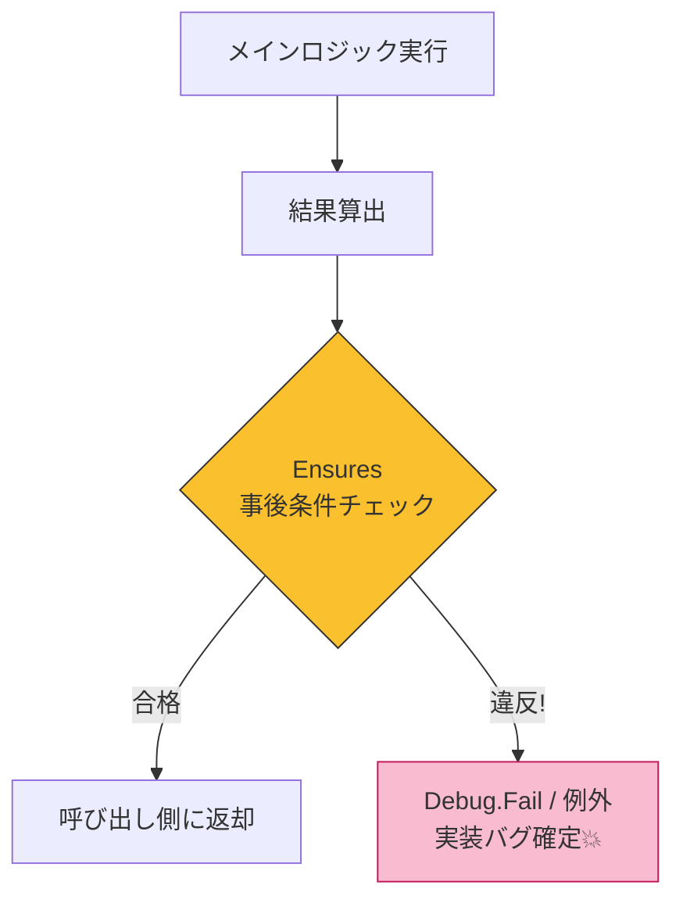

# 第12章 Postの基本：戻り値の保証を言語化する📦✅

## この章でやること🧭✨

* 「Post（事後条件）」＝**“戻り値が必ず満たす約束”**を、言葉で書けるようになる✍️💖
* その約束を、**型・実装・テスト**の3点セットで“守れる形”にする🧩🛡️🧪
* 「保証が書けない…😵‍💫」を**設計の改善サイン**として読めるようになる👀✨

---

## 2026年の“いま”のC#メモ🗒️✨

* 最新の .NET は **.NET 10（LTS）**、C# は **C# 14** が現行の最新として案内されてるよ📌✨ ([Microsoft][1])
* C# 14 は .NET 10 でサポートされ、.NET 10 SDK は Visual Studio の新しいメジャー版にも同梱されるよ🧰✨ ([Microsoft Learn][2])

> ※この章では「最新機能の紹介」よりも、**“戻り値の保証”という設計スキル**に集中するよ🎯💕

---

## 12.1 Post（事後条件）ってなに？📦✅


* Inv（不変条件）🧱：いつでも成立しててほしい約束（第16章で！）


### Postは“戻り値の説明書”📦📝

たとえばこんな保証👇

* 「成功したら **null を返さない**」🙅‍♀️🕳️
* 「返す数値は **0〜100 の範囲**」📏✅
* 「返す文字列は **正規化済み（トリム＋小文字化）**」🧼🔤
* 「返すリストは **重複なし**」📚✨（コレクションは第15章で深掘り）

## 12.2 まず“保証文”を日本語で書こう✍️🌸
 
 Postは、**コードより先に文章**が超大事だよ🫶✨
 
 
 
 おすすめテンプレはこれ👇

### ✅ Postテンプレ（覚えやすい版）🧠💡

* このメソッドは、Pre を満たす入力に対して、**必ず `◯◯` を返す**。
* 返す値は、**常に `△△` を満たす**。
* さらに、**`□□` である（必要なら）**。

### 例🌰

`CalculateDiscountedPrice(price, percent)` の Post を書くなら👇

* 返す値は **0 以上**である✅
* 返す値は **元の price 以下**である✅
* 返す値は **小数2桁に丸められている**✅

文章が書けると、次が一気にラクになるよ💃✨

* 型をどうする？🧩
* 実装でどこを守る？🛡️
* テストで何を固定する？🧪

---

## 12.3 Postでよくある“保証パターン”まとめ🍱✨

### パターンA：null を返さない🙅‍♀️🕳️

* `string`（非null）で返す
* “返せない場合”の表現を別に用意する（例：例外、Result、Try～）🎭

> どれにするかは第14章でも比較するよ⚖️✨

### パターンB：範囲に入る📏✅

* 割合：0〜100
* 金額：0以上
* インデックス：0以上 & length未満
  → **「上限・下限」**がはっきりしてるほど強い保証🌈

### パターンC：形が整ってる🧼🔤

* `Trim()` 済み
* 正規化（小文字化など）済み
* 期待フォーマットに整形済み
  → 「呼び出し側が安心して扱える」💗

### パターンD：関係が成立してる🔗✅

* `start <= end` を満たす Period を返す
* `min <= value <= max` を満たす設定値を返す
  → 単体チェックより“設計の匂い”が出やすいよ👃✨

---

## 12.4 例題：割引価格を返すメソッドで“保証”を作る🛒💰✨

### 仕様（保証文）📝

`CalculateDiscountedPrice(price, discountPercent)` は…

* 返す値は **0以上** ✅
* 返す値は **price以下** ✅
* 返す値は **小数2桁に丸められている** ✅

---

## 12.5 実装：Postをコードに“落とす”🧩🛡️

### ① まずは小さな Contract（軽量DbC）を用意📌✨

* Pre はガード節で止める🚪🛡️
* Post は「**バグ検知のためにチェック**」する（まずは Debug でOK）🐞🔔

```csharp
using System;
using System.Diagnostics;

public static class Contract
{
    public static void Requires(bool condition, string message)
    {
        if (!condition) throw new ArgumentException(message);
    }

    [Conditional("DEBUG")]
    public static void Ensures(bool condition, string message)
    {
        if (!condition)
        {
            Debug.Fail(message); // デバッグ中に分かりやすく止まる💥
        }
    }
}
```

> だからまずは **デバッグで早期発見**できる形にするのが相性いいよ🐣✨



---

### ② Postつきでメソッドを書く✍️✨

```csharp
using System;

public static class PriceCalculator
{
    public static decimal CalculateDiscountedPrice(decimal price, int discountPercent)
    {
        // Pre（入口チェック）🛡️
        Contract.Requires(price >= 0m, "price must be >= 0");
        Contract.Requires(discountPercent is >= 0 and <= 100, "discountPercent must be 0..100");

        // 計算💡
        var raw = price * (100 - discountPercent) / 100m;
        var result = Math.Round(raw, 2, MidpointRounding.AwayFromZero);

        // Post（戻り値の保証チェック）🎁✅
        Contract.Ensures(result >= 0m, "result must be >= 0");
        Contract.Ensures(result <= price, "result must be <= price");
        Contract.Ensures(decimal.Round(result, 2) == result, "result must be rounded to 2 decimals");

        return result;
    }
}
```

#### ここがポイント💡✨

* Postは**「呼ぶ側のミス」ではなく「作る側のバグ検知」**に向いてる🐞
* 文章で書いた保証が、そのまま `Ensures` になってるよね📝➡️✅

---

## 12.6 テスト：Postは“テストで固定”すると強い🧪🧷✨

Postはテストと相性が良すぎる👑✨

* **境界値（0, 100, 最小, 最大）**をまず固める📏
* そのうえで「いつでも成立してほしい性質」を増やす🌈

### xUnitでテスト例🧪✨

xUnit は v3 系の情報も公開されていて、.NET の最新世代でも使われてるよ🧰✨ ([xunit.net][3])

```csharp
using Xunit;

public class PriceCalculatorTests
{
    [Theory]
    [InlineData(0, 0, 0)]
    [InlineData(100, 0, 100)]
    [InlineData(100, 100, 0)]
    [InlineData(100, 25, 75)]
    public void CalculateDiscountedPrice_BasicCases(decimal price, int percent, decimal expected)
    {
        var result = PriceCalculator.CalculateDiscountedPrice(price, percent);
        Assert.Equal(expected, result);
    }

    [Theory]
    [InlineData(100, 0)]
    [InlineData(100, 1)]
    [InlineData(100, 50)]
    [InlineData(100, 99)]
    [InlineData(100, 100)]
    public void CalculateDiscountedPrice_PostGuarantees(decimal price, int percent)
    {
        var result = PriceCalculator.CalculateDiscountedPrice(price, percent);

        Assert.True(result >= 0m);
        Assert.True(result <= price);
        Assert.Equal(decimal.Round(result, 2), result);
    }

    [Fact]
    public void CalculateDiscountedPrice_Throws_WhenPreIsBroken()
    {
        Assert.Throws<ArgumentException>(() => PriceCalculator.CalculateDiscountedPrice(-1m, 10));
        Assert.Throws<ArgumentException>(() => PriceCalculator.CalculateDiscountedPrice(10m, 101));
    }
}
```

### テストを書く順番（迷子にならない）🗺️✨

1. まずは **代表ケース**（0%, 100%, 25%）🍞
2. 次に **境界値**（0, 100）📏
3. 最後に **Postの性質**をまとめて固定🎁✅

---

## 12.7 「保証が書けない…」は設計を良くするチャンス👀✨

### ありがちな詰まりポイント😵‍💫

#### ① 「失敗したら何返すの？」が曖昧

例：`FindUser(string id)`

* 見つからなかったら `null`？例外？空User？🤔
  → まず **“見つからない”は仕様として起こり得る？** を決めよう📌
  （この分岐は第14章の「例外 vs Result」で超スッキリするよ🎭⚖️）

#### ② 戻り値がプリミティブすぎて保証できない

例：`string GetEmail()`

* 「この string はメール形式です」って保証したいのに、`string` だと弱い🥺
  → **専用型（値オブジェクト）**のサイン💎🔒（第18章〜へ）

#### ③ 1メソッドで“やりたいこと”が多すぎる

Postが長文になるほど、責務が重い可能性大🧳💦
→ 分割 or 専用メソッド化のチャンス✂️✨

---

## 12.8 ミニ演習：保証文を“自然言語→テスト”にする📝🌸🧪

### 演習1：保証文を書こう✍️✨

次のメソッドの Post を、箇条書きで3つずつ書いてみよう👇

1. `string CreateSlug(string title)` 🏷️
   ヒント：空白、大小文字、使える文字…など

2. `int Clamp(int value, int min, int max)` 📏
   ヒント：返す値の範囲、min/max関係

3. `decimal CalculateTaxIncluded(decimal price, decimal taxRate)` 🧾
   ヒント：0以上、丸め、税率の扱い

---

### 演習2：Postをテストに変換しよう🧪✨

演習1で書いた Post を、そのまま `Assert.True(...)` / `Assert.Equal(...)` に置き換えてみよう✅
コツはこれ👇

* “必ず〜” → `Assert.True(...)`
* “〜に等しい” → `Assert.Equal(...)`
* “丸め済み” → `Assert.Equal(Round(...), result)`

---

### 演習3：AIで加速🤖⚡️（人が最終チェック！）

Copilot / Codex に、こう頼むとサクッと下書きが出るよ📝✨

* 「次のPost条件を満たすxUnitテストを作って：

  1. result >= 0
  2. result <= price
  3. result is rounded to 2 decimals」🧪🎯
* 「境界値（0, 100）中心でテストケース候補を10個出して」📏✨

出てきたテストは、**読める・意図が分かる**形に整えるのが大事だよ🧼👀✨

---

## まとめ：Postは“戻り値の安心感”を作る🎁💖

* Postは「戻り値が必ず満たす約束」📦✅
* まずは **保証文を日本語で書く**✍️
* 次に **型・実装・テスト**で守れる形にする🧩🛡️🧪
* 「保証が書けない」は **設計改善のヒント**👀✨

---

## 仕上げチェックリスト✅🌈

* 戻り値について「必ず◯◯」が3つ書ける？📝✨
* その保証はテストで固定されてる？🧪✅
* “返せない場合”の扱いが曖昧になってない？🎭💭
* Postが長すぎて、メソッドが肥大化してない？🧳💦

[1]: https://dotnet.microsoft.com/ja-jp/platform/support/policy/dotnet-core?utm_source=chatgpt.com ".NET および .NET Core の公式サポート ポリシー"
[2]: https://learn.microsoft.com/en-us/dotnet/csharp/whats-new/csharp-14?utm_source=chatgpt.com "What's new in C# 14"
[3]: https://xunit.net/docs/getting-started/v3/whats-new?utm_source=chatgpt.com "What's New in v3? [2025 August 14]"
