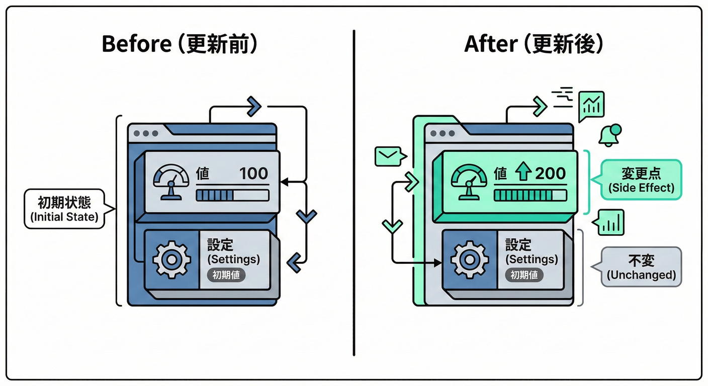
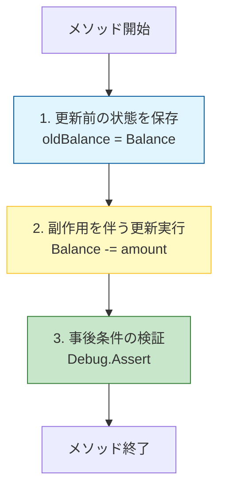
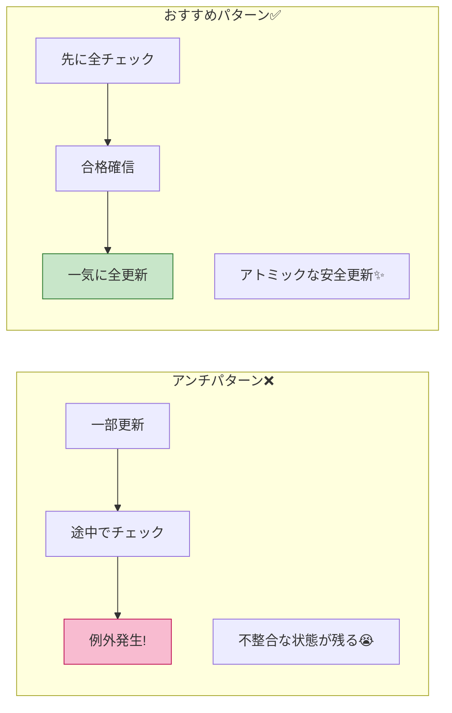

# 第13章 副作用の保証：状態がどう変わるかを明確に🔄🧾

## この章でできるようになること🎯✨

* 更新系メソッド（＝副作用あり）の**「更新後の姿」**を、言葉とコードでハッキリ書けるようになる📝✅
* 「変わるもの／変わらないもの」を整理して、**事故りにくい設計**にできる🚧💗
* 仕様を**テストで固定**して、将来の改修で壊れた瞬間に気づける🧪🔔

---

## 13.1 「副作用」ってなに？🤔💭



前回までは「戻り値」の保証（契約）を見てきたけど、
世の中には **「値を返さないけど、何かの状態を変える」** メソッドもたくさんあるよね🔄✨

### よくある副作用の例📌

* オブジェクトの状態が変わる（`Balance` が減る、`Status` が変わる）💰➡️💰
* コレクションが増減する（注文明細が追加される）🧺➕
* 外部へ影響（DB保存、ファイル書き込み、メール送信、API呼び出し）💾📩🌐

この章では特に、**オブジェクト状態の更新**にフォーカスして、Post（事後条件）で保証していくよ🎁✨

---

## 13.2 更新系メソッドの「事後条件」テンプレ🧩✅

更新系のPostは、だいたいこの3点セットで考えると超ラクだよ🌸

### ✅テンプレ（日本語でOK）

1. **何がどう変わる？**（例：残高は `old - amount` になる）💸
2. **何は変わらない？**（例：口座IDや作成日は変わらない）🧱
3. **更新後に必ず成り立つ条件は？**（＝不変条件も含む）🏥✅

> 「変更されるもの／されないもの」を明記するのは、設計用語だと *Frame condition*（フレーム条件）っぽい考え方だよ🖼️✨
> DbCで副作用を扱うときのコツは、ここを曖昧にしないこと💡

---

## 13.3 例①：銀行口座の Withdraw で「更新後」を保証する💰🏦

### 仕様（契約）を書いてみる📝✨

* Pre（事前）：`amount > 0`、`amount <= Balance`
* Post（事後）：

  * `Balance` は **必ず** `oldBalance - amount`
  * 取引履歴は **必ず** 1件増える
  * 追加された履歴の金額は **必ず** `-amount`
  * `LastUpdated` は **必ず** `now`

### コード例（ガード節＋更新＋PostをDebugで確認）🛡️🔄✅

```csharp
using System.Diagnostics;

public sealed class BankAccount
{
    public Guid AccountId { get; }
    public decimal Balance { get; private set; }
    public DateTimeOffset CreatedAt { get; }
    public DateTimeOffset LastUpdated { get; private set; }

    private readonly List<Transaction> _transactions = new();
    public IReadOnlyList<Transaction> Transactions => _transactions;

    public BankAccount(Guid accountId, decimal initialBalance, DateTimeOffset now)
    {
        AccountId = accountId;
        CreatedAt = now;
        LastUpdated = now;
        Balance = initialBalance;

        // ここでは不変条件を簡単に：残高はマイナス禁止、とか
        if (Balance < 0) throw new ArgumentOutOfRangeException(nameof(initialBalance));
    }

    public void Withdraw(decimal amount, DateTimeOffset now)
    {
        // Pre（呼ぶ側が守るべき条件を、入口でチェック）
        ArgumentOutOfRangeException.ThrowIfNegativeOrZero(amount); // .NETのThrowIf系🧁✨ :contentReference[oaicite:0]{index=0}
        if (amount > Balance) throw new InvalidOperationException("残高不足です💦");

        // --- 事後条件を書くために「更新前」を保存（oldを取る） ---
        var oldBalance = Balance;
        var oldCount = _transactions.Count;
        var oldAccountId = AccountId;
        var oldCreatedAt = CreatedAt;

        // --- 更新（副作用） ---
        Balance -= amount;
        _transactions.Add(new Transaction(-amount, now));
        LastUpdated = now;

        // Post（デバッグ時に“更新後の姿”を確認）
        Debug.Assert(Balance == oldBalance - amount);
        Debug.Assert(_transactions.Count == oldCount + 1);
        Debug.Assert(_transactions[^1].Amount == -amount);
        Debug.Assert(LastUpdated == now);

        // 「変わらないもの」もチェックしておくと安心🧸✨
        Debug.Assert(AccountId == oldAccountId);
        Debug.Assert(CreatedAt == oldCreatedAt);
    }
}

public readonly record struct Transaction(decimal Amount, DateTimeOffset At);


```

### ここがポイント💡🌸

* Postを書くには、**更新前（old）を保持**するのが定番だよ📸✨
* 「変わらないもの」も一緒に置くと、**思わぬ代入事故**に気づける🚨💗

---

## 13.4 「変わらないもの」を書くと何が嬉しいの？🧠💞

副作用の事故って、だいたいこのパターン😵‍💫

* 更新のついでに、関係ないプロパティまで変えてしまう（例：`CreatedAt` が更新される）⛔️
* 途中で例外が出て、**半分だけ更新**された状態が残る🧨
* 履歴追加を忘れて、後で監査ログが欠ける📉

だから、Postでこう書けると強い💪✨

* ✅ 変えるもの：`Balance`, `Transactions`, `LastUpdated`
* ✅ 変えないもの：`AccountId`, `CreatedAt`

---

## 13.5 「半分だけ更新」を防ぐコツ🛟🧯

更新系は **順番**が超大事だよ⏳✨

### コツ①：失敗しうるチェックは“先に全部やる”🛡️

* そうすると「更新してから落ちる」が減る🌈



### コツ②：外部副作用があるなら、境界で分ける🚪🌐

* ドメイン（純粋な状態更新）と、DB保存やAPI呼び出しを混ぜると、Postが書きづらい😖
* まずは「状態更新メソッドは状態だけ変える」寄りにすると、契約がキレイになる✨

---

## 13.6 ThrowIf系で“契約チェック”をスッキリ書く🧁✨

C# / .NET には、ガード節を短く書ける ThrowIf系があるよ🛡️
たとえば `null` や「空文字」はこれでOK✅

```csharp
ArgumentNullException.ThrowIfNull(customer);                  // null禁止 :contentReference[oaicite:1]{index=1}
ArgumentException.ThrowIfNullOrEmpty(customer.Name);          // null/空禁止 :contentReference[oaicite:2]{index=2}
ArgumentOutOfRangeException.ThrowIfNegativeOrZero(amount);    // 0以下禁止 :contentReference[oaicite:3]{index=3}
```

> こういう最新の標準APIを使うと、コードがスッキリして読みやすいよ✨
> （C# 14 は .NET 10 でサポートされてるよ📦✨） ([Microsoft Learn][1])

---

## 13.7 「Postはテストで固定」がいちばん強い🧪🧷

Debug.Assert は便利だけど、**テストに落とす**とさらに強いよ💪✨
なぜなら、CIで毎回守れるから🔁✅

### xUnitで「更新後」をテストする例🧪💗

```csharp
using Xunit;

public class BankAccountTests
{
    [Fact]
    public void Withdraw_updates_balance_and_adds_transaction()
    {
        var now = DateTimeOffset.UtcNow;
        var acc = new BankAccount(Guid.NewGuid(), initialBalance: 100m, now);

        acc.Withdraw(amount: 30m, now);

        Assert.Equal(70m, acc.Balance);
        Assert.Single(acc.Transactions);
        Assert.Equal(-30m, acc.Transactions[0].Amount);
        Assert.Equal(now, acc.LastUpdated);
    }

    [Fact]
    public void Withdraw_throws_when_insufficient_balance()
    {
        var now = DateTimeOffset.UtcNow;
        var acc = new BankAccount(Guid.NewGuid(), initialBalance: 10m, now);

        Assert.Throws<InvalidOperationException>(() => acc.Withdraw(30m, now));

        // 失敗したら「状態が変わってない」も大事💡
        Assert.Equal(10m, acc.Balance);
        Assert.Empty(acc.Transactions);
    }
}
```

### ここも大事ポイント💡

失敗ケースでは、**「例外が出る」だけじゃなくて「状態が変わってない」**も契約だよ🌸🧾

---

## 13.8 ありがちな失敗パターン集😵‍💫💥（あるある）

### ❌ 失敗①：仕様が「成功時」しか書かれてない

* 成功のPostは書いたけど、失敗時に状態がどうなるか不明…😇
  ✅ 失敗時は「状態が変わらない」を契約に入れよ🧊✨

### ❌ 失敗②：更新したあとにチェックして例外

* 先に `Balance -= amount` して、後で残高不足に気づいて例外…💥
  ✅ “落ちうるものは先にチェック”が基本🛡️

### ❌ 失敗③：どこが更新責任者かわからない

* あちこちから `List.Add` されて、いつ何が増えたのか追えない🌀
  ✅ 更新は**専用メソッドに集約**しよ（後の章でさらに強化するよ）🏛️✨

---

## 13.9 ミニ演習①：副作用のPostを「チェック項目化」してみよう✅📋✨

次の仕様の Post（事後条件）を、チェックリストにしてね📝💗

### お題：プロフィール更新🧑‍🎓🌸

* `DisplayName` と `Bio` を更新する `UpdateProfile(displayName, bio, now)`
* 更新できたら `LastUpdated = now`
* `UserId` と `CreatedAt` は絶対に変えない

### ✅ 解答例（チェック項目）

* [ ] `DisplayName == newDisplayName`
* [ ] `Bio == newBio`
* [ ] `LastUpdated == now`
* [ ] `UserId` は変わらない
* [ ] `CreatedAt` は変わらない

---

## 13.10 ミニ演習②：コードに落としてみよう🛠️🎀

以下のクラスに、契約（Pre/Post）を入れてね✅✨

```csharp
public sealed class UserProfile
{
    public Guid UserId { get; }
    public string DisplayName { get; private set; }
    public string Bio { get; private set; }
    public DateTimeOffset CreatedAt { get; }
    public DateTimeOffset LastUpdated { get; private set; }

    public UserProfile(Guid userId, string displayName, string bio, DateTimeOffset now)
    {
        UserId = userId;
        CreatedAt = now;
        LastUpdated = now;
        DisplayName = displayName;
        Bio = bio;
    }

    public void UpdateProfile(string displayName, string bio, DateTimeOffset now)
    {
        // TODO: Pre
        // TODO: oldを取る
        // TODO: 更新
        // TODO: Post（Debug.Assert）
    }
}
```

### ✅ 参考解答（1つの形）✨

```csharp
using System.Diagnostics;

public void UpdateProfile(string displayName, string bio, DateTimeOffset now)
{
    // Pre
    ArgumentException.ThrowIfNullOrEmpty(displayName); // :contentReference[oaicite:5]{index=5}
    ArgumentNullException.ThrowIfNull(bio);            // :contentReference[oaicite:6]{index=6}

    var oldUserId = UserId;
    var oldCreatedAt = CreatedAt;

    // 更新
    DisplayName = displayName;
    Bio = bio;
    LastUpdated = now;

    // Post
    Debug.Assert(DisplayName == displayName);
    Debug.Assert(Bio == bio);
    Debug.Assert(LastUpdated == now);

    Debug.Assert(UserId == oldUserId);
    Debug.Assert(CreatedAt == oldCreatedAt);
}
```

---

## 13.11 Visual Studioで動かして確かめよう💻🔎✨

### ① プロジェクト作成🧁

* 「新しいプロジェクトの作成」→ 「xUnit テスト プロジェクト」✅
* もう1つ「クラス ライブラリ」も作って、テストから参照する（分けると気持ちいい）🎀

### ② テスト実行🧪

* テストエクスプローラーで「すべて実行」▶️
* 失敗したら、Postが破れてるサイン🚨✨

### ③ デバッグで“更新の順番”を見る🐞

* `Withdraw` の中にブレークポイント📌
* `oldBalance` → 更新 → Debug.Assert の流れを追う👀💕

---

## 13.12 AI活用：Post（保証）を「文章→チェック」に変換する🤖🪄

AIはここでめちゃ便利✨（でも最後は人が判断ね🫶）

### 使えるお願い文（そのままコピペOK）📝🤖

* 「この仕様のPostconditionsを、箇条書きで10個以内にして」📋✨
* 「成功時と失敗時で、状態がどうなるべきかを分けて書いて」🔀✅
* 「テスト（xUnit）に落として。成功/失敗それぞれ」🧪💗

### AIの出力をレビューする観点👀🧯

* 「変わらないもの」まで触れてる？🧱
* 失敗時に“部分更新”してない？🧨
* Postが“曖昧な日本語”のままになってない？（例：「適切に更新される」←ダメ🙅‍♀️）

---

## まとめ🌟🎁

* 副作用ありメソッドは、Postで **「更新後の姿」**を約束するのが超大事🔄🧾
* コツは **oldを取る**＋**変わる/変わらない**を明記すること📸🧱
* そして最強は **テストで固定**🧪🔒

---

### 参考：コード契約APIについて（知識として）📚

`System.Diagnostics.Contracts`（Contractクラス）は .NET のドキュメント上は存在するよ📖✨ ([Microsoft Learn][2])
ただ、昔の「Code Contracts」ツール（リライタ等）が現代の .NET（.NET Core系）と相性が良くない点は長く議論されてきたので、実務では **ガード節＋テスト**を主軸にするのが無難だよ🛡️🧪 ([github.com][3])

[1]: https://learn.microsoft.com/en-us/dotnet/csharp/whats-new/csharp-14?utm_source=chatgpt.com "What's new in C# 14"
[2]: https://learn.microsoft.com/ja-jp/dotnet/api/system.diagnostics.contracts.contract?view=net-10.0&utm_source=chatgpt.com "Contract Class (System.Diagnostics.Contracts)"
[3]: https://github.com/dotnet/runtime/issues/23869?utm_source=chatgpt.com "Then, what's the status of Code Contracts usage in .NET ..."
