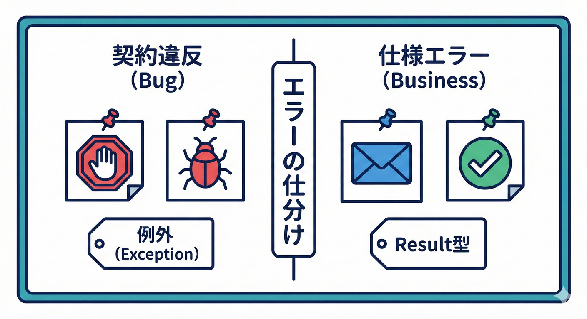
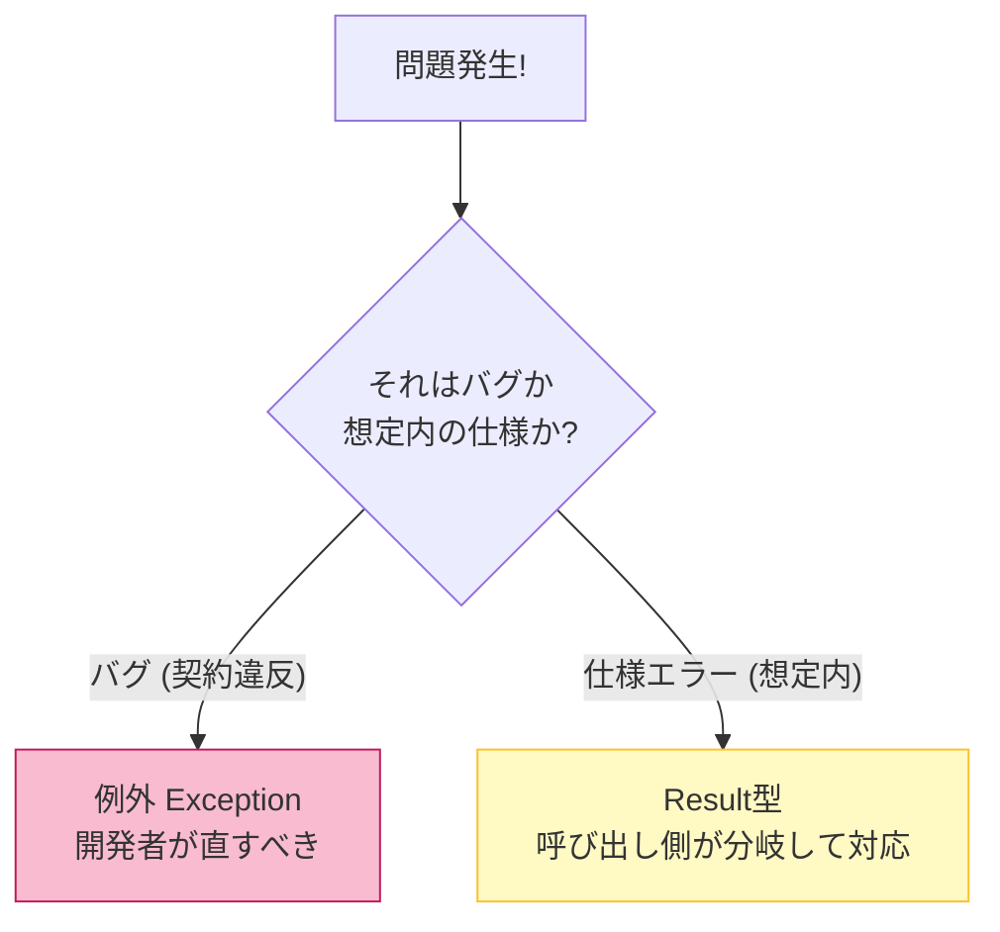
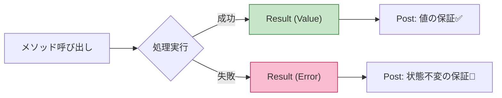

# 第14章 例外かResultか：Postとセットで考える🎭⚖️

## 14.1 この章でできるようになること🎯✨

この章を読み終わると、こんな判断ができるようになります😊🌸

* 「ここは **例外**（throw）で止めるべき？」それとも「**Result**で返すべき？」を迷わず選べる🧠✨
* Post（事後条件）とセットで、「成功したら何を保証する？」「失敗したら何を保証する？」を言葉とコードで書ける📝✅
* 例外版 / Result版を同じ題材で作って、読みやすさ・使いやすさを比較できる🔁💡

---

## 14.2 まず超重要：失敗には2種類あるよ🎭⚖️



これまでの章（特に第4章）でも触れてきたけど、
DbCを実務で使う上で絶対に外せないのが **「失敗の仕分け」** だよ🧠✨
はざっくり2つに分かれます👇✨

### A) 契約違反（バグ）🧨👩‍💻

* 呼ぶ側/作る側が契約を破った（= 開発者のミス）
* 例：`null`禁止なのに `null` を渡した、範囲外の値を渡した、内部不変条件を壊した

➡️ これは **例外で落としてOK**（むしろ落として早く直す）🧯✨
※ .NETの設計ガイドでも「通常の制御フローに例外を使わない」方針が明確です（逆に言うと、例外は“通常じゃない”時に使う）📌 ([Microsoft Learn][1])

### B) 仕様エラー（起こりうる・回復可能）🙂📩

* ユーザー入力ミス、在庫切れ、重複登録、権限不足…など
* “想定内の失敗”で、呼ぶ側が分岐して対応したい

➡️ これは **Resultで返す**と扱いやすいです🎁✨
（例外で毎回catchして分岐…はしんどい＆遅い＆読みづらいになりがち🥺）



---

## 14.3 例外（throw）を選ぶのはどんな時？🧯🔥

例外は「**呼び方が間違ってる**」「**続行が危険**」に向いてます💡

### 例外が向いてるケース✅

* **契約違反（バグ）**：Preを破った、Invが壊れた
* **回復不能**：その場でどうにもならない（プログラム的に続けると壊れる）
* **本当に稀**：頻繁に起きる可能性が低い（例外は“通常ルート”にしない） ([Microsoft Learn][1])

### 例外の設計で大事なこと📌💗

* **例外を通常フローにしない**（分岐したい失敗はResultへ） ([Microsoft Learn][1])
* 例外メッセージは「未来の自分への手紙」💌✨（何がダメで、どう直す？）
* 例外が起きたら **状態を中途半端にしない**（途中で更新して落ちるの最悪😭） ([Microsoft Learn][2])

---

## 14.4 Resultを選ぶのはどんな時？🎁📩

Resultは「**想定内の失敗**」を、呼び出し側が素直に分岐できる形にする考え方です😊✨

### Resultが向いてるケース✅

* ユーザー入力・業務ルールで **よく起こる失敗**（在庫切れ、重複、期限切れなど）🛒⛔
* 呼び出し側が **回復/再入力/別手段** を取りたい🙂🔁
* API境界（Web/API/GUI）で **HTTP 400/409** などに変換したい🌐🧩

### .NETの“お手本”パターン：Try〜✨

.NET標準ライブラリでも、失敗しうる処理で **TryParse** みたいに `bool` を返して、呼ぶ側が分岐できる形が用意されています😊
（例外を通常フローにしない代表例💡） ([Microsoft Learn][3])

---

## 14.5 迷ったらこれ！判断チャート🗺️✨

次の順に考えると、ほぼ迷子になりません😊🌸

1. その失敗は **バグ（契約違反）**？ 👉 **例外**🧯
2. それとも **想定内（仕様エラー）**？ 👉 **Result**🎁
3. 呼び出し側が分岐して回復したい？ 👉 **Result**🎁
4. 本当に稀で、続行が危険？ 👉 **例外**🧯 ([Microsoft Learn][1])

---

## 14.6 実装例①：例外版（CreateOrThrow）💥✋

題材：メールアドレスを“正しい状態だけ”で作りたい📧✨
成功したら「必ず正しいEmailが返る」＝Postが超強い💪✅

```csharp
public sealed record Email
{
    public string Value { get; }

    private Email(string value) => Value = value;

    // ✅ 成功したら「必ず有効なEmail」が返る（Post）
    // 💥 失敗したら例外（契約違反 or 仕様として許さない入力）
    public static Email CreateOrThrow(string value)
    {
        if (value is null) throw new ArgumentNullException(nameof(value));
        if (value.Length == 0) throw new ArgumentException("Email must not be empty.", nameof(value));

        // ※ 厳密なメール検証は奥が深いので、ここでは「教材用の簡易」ルールにするよ🙂
        if (!value.Contains('@'))
            throw new ArgumentException("Email must contain '@'.", nameof(value));

        return new Email(value);
    }
}
```

### この設計のいいところ😍✨

* 戻り値がシンプル：呼ぶ側は `Email` を受け取るだけ📦
* 「作れた＝正しい」なので、その後のコードがスッキリ🧘‍♀️🌸

### 注意点🥺⚠️

* ユーザー入力から直接これを呼ぶと、例外が“通常フロー”になりがち
  ➡️ UI/API境界では Result を使うか、例外をキャッチして丁寧に変換しよう🚪🧩 ([Microsoft Learn][1])

---

## 14.7 実装例②：Result版（TryCreate / Result<T>）🎁✨

「入力が間違うのは普通だよね🙂」という文脈だと、Resultがめっちゃ便利です💗

### まずは Result 型を用意🎀

```csharp
public sealed record Error(string Code, string Message);

public readonly record struct Result<T>(T? Value, Error? Error)
{
    public bool IsSuccess => Error is null;

    public static Result<T> Ok(T value) => new(value, null);

    public static Result<T> Fail(string code, string message)
        => new(default, new Error(code, message));
}
```

### Email.TryCreate を作る📧🧪

```csharp
public sealed record Email
{
    public string Value { get; }

    private Email(string value) => Value = value;

    public static Result<Email> TryCreate(string? value)
    {
        if (value is null)
            return Result<Email>.Fail("EMAIL_NULL", "メールアドレスが未入力です。");

        if (value.Length == 0)
            return Result<Email>.Fail("EMAIL_EMPTY", "メールアドレスが空です。");

        if (!value.Contains('@'))
            return Result<Email>.Fail("EMAIL_INVALID", "'@' を含めてください。");

        return Result<Email>.Ok(new Email(value));
    }
}
```

### 呼ぶ側はこうなる😊✨

```csharp
var result = Email.TryCreate(input);

if (!result.IsSuccess)
{
    Console.WriteLine($"{result.Error!.Code}: {result.Error.Message}");
    return;
}

Email email = result.Value!;
Console.WriteLine($"OK: {email.Value}");


```

✅ 分岐が自然！
✅ 例外のcatchに頼らない！
（例外を通常フローにしないのが設計ガイド的にも安心💡） ([Microsoft Learn][1])

---

## 14.8 同じ処理を2方式で比較してみよう🔁🛒✨

題材：注文を確定する（在庫切れは“想定内”）📦🛍️

### 方式A：例外中心（つらくなりがち）🥺

* 在庫切れのたびに例外 → catchで分岐
* 頻繁に起きうる失敗が例外になると、コードが読みにくい＆設計ガイドとも相性悪い💦 ([Microsoft Learn][1])

### 方式B：Result中心（おすすめ）😍

* 在庫切れ → `Fail("OUT_OF_STOCK", "...")`
* 呼び出し側は `switch` / `if` で分岐しやすい🎁✨

例（Result中心のイメージ）👇

```csharp
public sealed record OrderId(Guid Value);

public static class OrderErrors
{
    public const string OutOfStock = "OUT_OF_STOCK";
    public const string PaymentDeclined = "PAYMENT_DECLINED";
}

public sealed class OrderService
{
    // ✅ 成功したら「注文が確定して OrderId が返る」＝Post
    // ✅ 失敗したら「理由コード付きで返る」＝Post
    public Result<OrderId> PlaceOrder(int productId, int quantity)
    {
        // 契約違反（バグ）っぽいものは例外でもOK（quantity<=0 など）
        if (quantity <= 0) throw new ArgumentOutOfRangeException(nameof(quantity));

        // 想定内の失敗は Result
        if (!HasStock(productId, quantity))
            return Result<OrderId>.Fail(OrderErrors.OutOfStock, "在庫が足りません。数量を減らしてね🥺");

        if (!CanPay())
            return Result<OrderId>.Fail(OrderErrors.PaymentDeclined, "お支払いが通りませんでした💳💦");

        // ここまで来たら成功！🎉
        var id = new OrderId(Guid.NewGuid());
        CommitOrder(id);
        return Result<OrderId>.Ok(id);
    }

    private bool HasStock(int productId, int quantity) => true;
    private bool CanPay() => true;
    private void CommitOrder(OrderId id) { /* DB保存など */ }
}
```

---

## 14.9 Postconditionsを“成功/失敗”でちゃんと書くコツ🧷✅✨

例外でもResultでも、Postは **「戻り方ごと」** に書けます😊

### ✅ 成功したときのPost（強く書ける！）

* `Result.IsSuccess == true` のとき

  * `Value != null`（参照型の場合）
  * 値の範囲や整合性が成立している
  * 状態更新が完了している（注文が作られている等）

### ✅ 失敗したときのPost（Resultの強み✨）

* `Result.IsSuccess == false` のとき

  * `Error != null`
  * `Error.Code` は機械的に分岐できる（表示文言と分離できる）
  * **状態は変更されていない**（超大事！） ([Microsoft Learn][2])

### ✅ 例外で返すときのPost

* 例外が投げられる条件を明確に（Pre/Inv違反、回復不能など）
* 例外発生時も状態は壊さない（ロールバック/不変を守る） ([Microsoft Learn][2])

---

## 14.10 境界（UI/API）での扱い🚪🌐✨

境界は「外から変なものが来る場所」なので、ここで整理するとスッキリします🧼🫧

* ドメイン内部：契約違反は例外で落として早期発見🧯
* 境界：仕様エラーは Result で受けて、画面/HTTP に変換📩
* 境界で例外が出たら：ログ＆想定外として扱う（500など）🧨

「例外を通常フローにしない」方向は .NET の設計ガイドでも推奨です📌 ([Microsoft Learn][1])

---

## 14.11 テストで“契約”を固めよう🧪💗

### 例外版のテスト（xUnit例）✨

```csharp
using Xunit;

public class EmailExceptionTests
{
    [Fact]
    public void CreateOrThrow_AtMissing_Throws()
    {
        Assert.Throws<ArgumentException>(() => Email.CreateOrThrow("abc.example.com"));
    }
}
```

### Result版のテスト✨

```csharp
using Xunit;

public class EmailResultTests
{
    [Fact]
    public void TryCreate_AtMissing_FailsWithCode()
    {
        var r = Email.TryCreate("abc.example.com");

        Assert.False(r.IsSuccess);
        Assert.Equal("EMAIL_INVALID", r.Error!.Code);
    }

    [Fact]
    public void TryCreate_Valid_Succeeds()
    {
        var r = Email.TryCreate("a@b.com");

        Assert.True(r.IsSuccess);
        Assert.NotNull(r.Value);
    }
}
```

---

## 14.12 Copilot/Codex活用プロンプト例🤖✨

そのまま貼って使える形にしておくね😊🌸

* 「このメソッドの **成功時Post / 失敗時Post** を箇条書きで提案して。失敗は Result で、Error.Code案も出して」📝✨
* 「Result<T> を使った実装にして。**失敗時は状態変更しない**ことを守って」🧱✅
* 「xUnitで、成功/失敗のテストを各3本ずつ。境界値も入れて」🧪🎯

（出てきたコードは、**命名**と**責務の分離**だけは人間が最後に整えてね😉💗）

---

## 14.13 ミニ演習（例外/Resultの設計比較）🔁✨

### 演習1：分類ゲーム🎮🧠

次の失敗は「例外」？「Result」？理由も一言で✍️💕

1. `quantity = -1` が渡された
2. 在庫が足りない
3. DB接続が切れた
4. メールアドレスに `@` がない（ユーザー入力）

### 演習2：同じ仕様を2方式で実装💪✨

題材：`Money`（金額）を作る💴

* ルール：0以上、上限100万円まで
* 例外版：`CreateOrThrow(int amount)`
* Result版：`TryCreate(int amount)`（Error.Code を3種類くらい用意）

### 演習3：Postを言語化📝🌸

作った `Money` について、

* 成功時に保証すること（Post）
* 失敗時に保証すること（Post）
  をそれぞれ3つ書いてみてね✅✨

---

## 14.14 まとめ🎀✅

* **契約違反（バグ）** → 例外で落として早く直す🧯💥
* **想定内（仕様エラー）** → Resultで返して分岐しやすく🎁📩
* Postは「成功/失敗の戻り方ごと」に書くと強くなる💪✨
* .NETの設計ガイド的にも、**例外を通常フローにしない**方向が安心😊📌 ([Microsoft Learn][1])
* いまのC#は **C# 14 / .NET 10** が現行（LTS）なので、この章の書き方がそのまま“今の主流”で使えるよ📘✨ ([Microsoft Learn][4])

[1]: https://learn.microsoft.com/en-us/dotnet/standard/design-guidelines/exception-throwing?utm_source=chatgpt.com "Exception Throwing - Framework Design Guidelines"
[2]: https://learn.microsoft.com/en-us/dotnet/standard/exceptions/best-practices-for-exceptions?utm_source=chatgpt.com "Best practices for exceptions - .NET"
[3]: https://learn.microsoft.com/en-us/dotnet/api/system.int32.tryparse?view=net-10.0&utm_source=chatgpt.com "Int32.TryParse Method (System)"
[4]: https://learn.microsoft.com/en-us/dotnet/csharp/whats-new/csharp-14?utm_source=chatgpt.com "What's new in C# 14"
