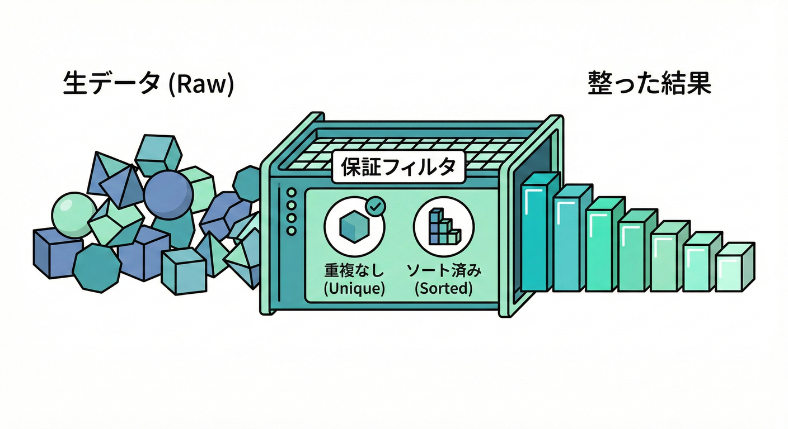
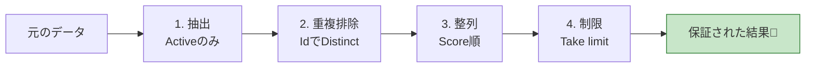
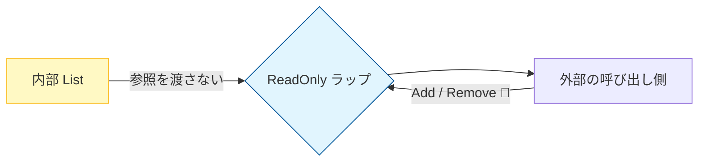

# 第15章 コレクションのPost：重複なし・ソート済み・フィルタ済み📚✨

この章は「メソッドが返す“コレクション”に、どんな保証（Post）を付けると強いか？」を、**言語化 → 実装 → テストで確認**までやるよ〜🧸🌸
サンプルは **.NET 10 / C# 14** 前提で書くね✍️✨ ([Microsoft for Developers][1])

---

## 15.1 「コレクションのPost」ってなに？🎁📦



メソッドが返す結果が「1つ」じゃなくて、「リストや配列（コレクション）」のとき、
どんな契約（Post）をしてあげると呼ぶ側は嬉しいかな？😊✨
「Post（事後条件）」は、メソッドを呼んだ側に対しての**約束（保証）**だよね😊
コレクションを返すメソッドだと、よくある保証はこんな感じ👇✨

* ✅ **nullを返さない**（空なら空コレクション）
* ✅ **件数の保証**（最大N件、必ず1件以上、など）
* ✅ **フィルタ済み**（例：Activeだけ、条件に合うものだけ）
* ✅ **重複なし**（例：Idがユニーク）
* ✅ **並び順の保証**（例：Score降順、作成日昇順）
* ✅ **スナップショット**（呼んだ瞬間の結果で固定、後から変化しない）

この「保証」をちゃんと決めると、呼び出し側が安心してコードを書けるよ〜🥰✨



---

## 15.2 ありがちな事故あるある💥😵‍💫

### 事故①：順序が“たまたま”で決まってる

「今はソートされて見えるけど、たまたま」だと、将来ちょっと変更しただけで順序が崩れてUIがバグる…😭

### 事故②：重複が混ざって、表示が2回出る

DBのJOINや集計の途中で同じIdが2回混ざるの、めっちゃある🥺
「重複なし」を保証しておくと、呼び出し側が毎回Distinctしなくて済む💕

### 事故③：返したListを呼び出し側がいじって壊す

`List<T>`をそのまま返すと、呼び出し側が`Add`できちゃう⚠️
「返り値は読み取り専用」を意識すると平和になるよ〜🕊️✨

---

## 15.3 “保証文テンプレ”を作っちゃおう📝🎀

コレクション系は、まずこの形で書くとまとまりやすいよ✨

* 戻り値は **nullではない**
* 戻り値は **最大N件**
* 戻り値は **条件Pを満たす要素だけ**
* 戻り値は **キーKで重複しない**
* 戻り値は **並び順がS（キーと昇順/降順）**

例（日本語の保証文）👇

* 「戻り値はnullではない（0件なら空）」
* 「戻り値は最大 `limit` 件」
* 「戻り値の全要素は `IsActive == true`」
* 「戻り値は `Id` が重複しない」
* 「戻り値は `Score` 降順、同点は `Id` 昇順」

これがそのまま **テスト観点** になるのが気持ちいいポイント🥹✨

---

## 15.4 実装例：検索メソッドに“3つの保証”を付ける🔍✅✅✅

ここでは「商品検索」を例にして、次の3つを保証するよ📚✨

* ✅ フィルタ済み（Activeだけ）
* ✅ 重複なし（Idでユニーク）
* ✅ ソート済み（Score降順 → Id昇順）

```csharp
using System;
using System.Collections.Generic;
using System.Collections.ObjectModel;
using System.Linq;

public sealed record Product(Guid Id, string Name, bool IsActive, int Score);

public sealed record ProductSummary(Guid Id, string Name, int Score);

public sealed class ProductCatalog
{
    private readonly List<Product> _products;

    public ProductCatalog(IEnumerable<Product> products)
    {
        _products = products?.ToList() ?? throw new ArgumentNullException(nameof(products));
    }

    /// <summary>
    /// Post（保証）:
    /// - 戻り値は null ではない（0件なら空）
    /// - 戻り値の全要素は IsActive == true
    /// - 戻り値は Id が重複しない
    /// - 戻り値は Score 降順、同点は Id 昇順
    /// - 戻り値は最大 limit 件
    /// </summary>
    public IReadOnlyList<ProductSummary> SearchActive(string keyword, int limit)
    {
        if (keyword is null) throw new ArgumentNullException(nameof(keyword));
        if (keyword.Length == 0) throw new ArgumentException("keyword must not be empty.", nameof(keyword));
        if (limit <= 0) throw new ArgumentOutOfRangeException(nameof(limit), "limit must be >= 1.");
        if (limit > 1000) throw new ArgumentOutOfRangeException(nameof(limit), "limit is too large.");

        var list = _products
            .Where(p => p.IsActive)
            .Where(p => p.Name.Contains(keyword, StringComparison.OrdinalIgnoreCase))
            .DistinctBy(p => p.Id) // 重複なし（Id）
            .OrderByDescending(p => p.Score) // ソート（Score降順）
            .ThenBy(p => p.Id)               // 同点の並び順固定
            .Take(limit)
            .Select(p => new ProductSummary(p.Id, p.Name, p.Score))
            .ToList();

        // 読み取り専用で返す（呼び出し側に壊されにくい）
        return new ReadOnlyCollection<ProductSummary>(list);
    }
}
```

### ポイント🌟

* `ThenBy`で「同点のときの順序」を決めると、結果がブレなくなるよ😊✨
* `ReadOnlyCollection`で返すと、呼び出し側がうっかり変更しにくい👍💕



---

## 15.5 Postは“テストで固定”すると最強🧪💪✨

保証は書いただけだと、いつか崩れる😢
だから **保証 = テスト** にして固定しよう🎀

xUnitはv3系が用意されていて、VSのTest Explorer対応アダプタもNuGetで提供されてるよ🧪✨ ([xunit.net][2])

### 例：テストプロジェクトのcsproj（参考）📦

```xml
<ItemGroup>
  <PackageReference Include="Microsoft.NET.Test.Sdk" Version="17.*" />
  <PackageReference Include="xunit.v3" Version="3.*" />
  <PackageReference Include="xunit.runner.visualstudio" Version="3.*" />
</ItemGroup>
```

### テスト例：保証をそのまま検査する✅✅✅

```csharp
using System;
using System.Linq;
using Xunit;

public sealed class ProductCatalogTests
{
    [Fact]
    public void SearchActive_guarantees_filtered_distinct_sorted_and_limited()
    {
        var id = Guid.NewGuid();

        var catalog = new ProductCatalog(new[]
        {
            new Product(id, "Apple",  true, 10),
            new Product(id, "Apple",  true, 10), // わざと重複
            new Product(Guid.NewGuid(), "Apple", false, 999), // inactiveは除外
            new Product(Guid.NewGuid(), "Apple", true,  5),
            new Product(Guid.NewGuid(), "Pine",  true,  999), // keywordに合わない
        });

        var result = catalog.SearchActive("app", limit: 10);

        // Post1: nullじゃない（ここではresult自体がnullなら落ちるのでOK）
        Assert.NotNull(result);

        // Post2: 全要素がActive（結果はSummaryなので、元の条件が守られてることを性質として確認したいなら
        // ここは「inactiveが混ざらないデータで検証」でもOK。今回はデータ設計上、inactiveが混ざると件数が増えるので検出できる）
        // → さらに確実にしたいなら、SummaryにIsActiveを含める設計もアリ🧠✨

        // Post3: Idの重複なし
        var ids = result.Select(x => x.Id).ToList();
        Assert.Equal(ids.Count, ids.Distinct().Count());

        // Post4: Score降順、同点はId昇順
        var expected = result
            .OrderByDescending(x => x.Score)
            .ThenBy(x => x.Id)
            .ToList();

        Assert.True(result.SequenceEqual(expected));

        // Post5: limit以内
        Assert.True(result.Count <= 10);
    }
}
```

> 補足💡：`Summary`に`IsActive`が無いと「Activeだけ」を直接assertしにくいことがあるよね。
> その場合は、**保証として本当に必要ならSummaryに情報を足す**（または別の形で検証できる設計にする）のも立派な設計判断だよ🧠✨

---

## 15.6 「表示用（読み取り）」と「更新用（書き込み）」を分ける発想🧠📌

コレクションの保証は、**表示用（クエリ）**で特に効くよ✨

* 🔍 表示用：**整形済み（フィルタ・重複排除・ソート済み）**で返してOK
* ✍️ 更新用：**更新メソッドは別**にして、そっちは別の契約（Pre/Inv）でガチガチに守る

これやると「検索結果が毎回バラバラ」みたいなUI事故が減る🥹✨

---

## 15.7 AI（Copilot/Codex）に頼るときの“勝ち筋”🤖✨

### 使えるお願いの例💌

* 「このメソッドのPost（保証）を、箇条書きで5つ提案して」
* 「この保証（重複なし・ソート済み・フィルタ済み）を満たすC#実装を出して」
* 「このPostを検証するxUnitテストを“性質ベース”で列挙して」

### 注意ポイント⚠️

* AIは `Distinct()` を適当に入れがち → **“何で重複なし？”（Id？Name？）を必ず指定**しよ🥺
* ソートが片手落ちになりがち → **同点の順序（ThenBy）まで決める**のが大事😊✨

---

## 15.8 ミニ演習：検索メソッドの保証を3つ作る🔍📝✨

次のうち **3つ** を選んで、保証文（Post）を書いてみよう🎀
（できたら、そのままテスト名にもしてね🧪✨）

1. ✅ 「戻り値はnullではない（0件なら空）」
2. ✅ 「戻り値は最大 `limit` 件」
3. ✅ 「戻り値は `Id` が重複しない」
4. ✅ 「戻り値は `Score` 降順、同点は `Id` 昇順」
5. ✅ 「戻り値の全要素は `keyword` を含む（大文字小文字無視）」

仕上げに、`keyword = ""` や `limit = 0` のときの挙動も決めてみよ〜🧸✨
（それはPreだけど、仕様が固まるとPostも安定するよ💕

---

## まとめ：コレクションのPostは“性質”で固定する📌🌈

* 🎁 **保証（Post）**は呼び出し側へのプレゼント
* 📚 コレクションは特に「重複なし・ソート済み・フィルタ済み」を決めると強い
* 🧪 **保証はテストにする**と、未来の改修でも壊れにくい
* 🤖 AIは速いけど、**キー（何でユニーク？）と順序（同点ルール）**は人が決めるのが勝ち✨

[1]: https://devblogs.microsoft.com/dotnet/announcing-dotnet-10/?utm_source=chatgpt.com "Announcing .NET 10"
[2]: https://xunit.net/docs/getting-started/netcore/cmdline?utm_source=chatgpt.com "Getting Started with xUnit.net v3 [2025 August 13]"
