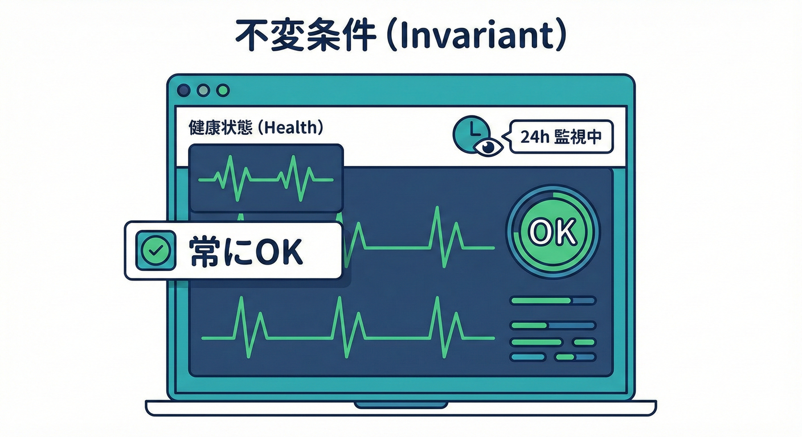
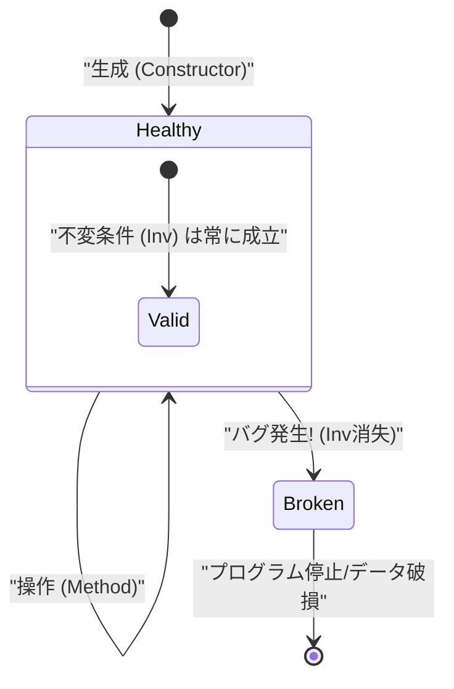
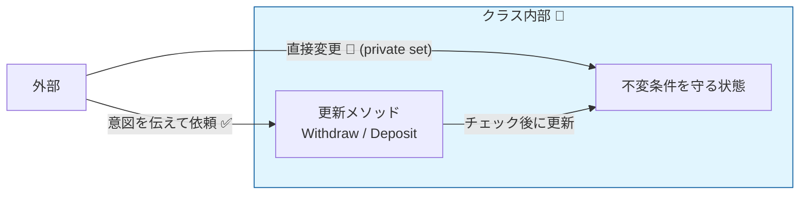

# 第16章 不変条件とは？クラスの健康診断ルール🏥🧱

## 16.0 この章でわかること🎯✨

* **不変条件（Invariant）**って何？を、ふわっとじゃなくスッと理解する😊
* 「Pre（入口の約束）」「Post（出口の保証）」と何が違うの？を整理する🧠✅
* C#で「壊れないクラス」を作るための、**超実用パターン**が身につく🛠️💗

---

## 16.1 まず結論：不変条件＝「そのクラスが健康でいるための最低条件」🏥🌿



不変条件（Invariant）は一言でいうと、**「そのクラスが生きている間、ずーっと守り抜くべきルール」** だよ🛡️✨

不変条件（Invariant）は、ざっくり言うと👇

* クラスのインスタンスが「ちゃんとした状態（＝健康）」であるために
* **いつ見ても成立していてほしいルール**📏✅



たとえば、銀行口座クラスなら：

* 残高は **0以上** 💰✅
* 通貨は **必ず設定されている** 💴✅

この2つが守れていない口座は…もう口座として壊れてるよね😵‍💫💥

---

## 16.2 Pre / Post / Inv の違い（ここで迷子になりがち）🗺️🐣

### Pre（事前条件）☎️🚪

* メソッドを呼ぶ側が守る約束
* 例：`Deposit(amount)` の `amount > 0`

### Post（事後条件）🎁🚪

* メソッドが終わったときに、呼ばれた側が保証すること
* 例：`Deposit(amount)` 後は「残高が amount 分増えている」

### Inv（不変条件）🧱🏥

* **そのクラスの“存在ルール”**みたいなもの
* 例：いつでも「残高 >= 0」が成り立つ

**イメージはこれ**👇✨

* Pre/Post は「メソッドの契約」
* Inv は「クラスの憲法」📜🧱

---

## 16.3 不変条件が弱いと起きる事故😵‍💫💥（あるある）

### 事故パターン1：途中で壊れたまま放置される🧨

「一時的に壊れてても、あとで直すから…」って設計は危険⚠️
例：

* `Withdraw` で残高がマイナスになった
* でも「後で調整するメソッド」を呼び忘れた
  → **壊れた口座がシステム内に残る**😱

### 事故パターン2：別のメソッドが“壊れてない前提”で動いて爆発💣

* `GetStatement()` が「残高>=0」の前提で計算
* 残高が -100 の状態が混入
  → 表示が崩れる、例外、データ破損…😭

---

## 16.4 「不変条件はバグ」🧯🐞（仕様エラーじゃない）

不変条件が破れるのは、ほぼ確実に👇

* **開発者側のミス（契約違反）**🧑‍💻💥

ユーザー入力ミスみたいに「丁寧に返す」対象じゃなくて、
**直すべきバグ**として見つけやすくするのが大事だよ🔍✨

---

## 16.5 2026年のC#での現実的なやり方（大事）🧠🛠️

2026年1月時点の最新ラインだと、.NET 10（LTS）とC# 14が現行として案内されてるよ📌✨ ([Microsoft][1])

昔の「Code Contracts（コードコントラクト）」は .NET 5+（つまり現行の .NET）では**サポート対象外**として案内されてるので、基本は使わない方針でOK🙅‍♀️💦 ([Microsoft Learn][2])
（`System.Diagnostics.Contracts` 自体のAPI説明は今もあるけど、実運用の主流にはなりにくいよ、という温度感） ([Microsoft Learn][3])

なのでこの章では、**今どきの王道**👇でいくよ💗

* 入口（public）でガード節🛡️
* クラス内部は「壊れない更新手順」へ✨
* 必要なら **Debug時に不変条件チェック**で即発見🐞🔔
* テストで守る🧪🌈

---

## 16.6 実例：BankAccountで“不変条件”を体に入れる💰🏦✨

### 不変条件を決めよう🧠📌

このクラスは「口座」なので、最低限これ👇は守りたい：

* `Currency` は `null` や空じゃない💴✅
* `Balance` は 0以上💰✅

### 実装例（不変条件を壊さないクラス）🛠️✨

```csharp
using System;
using System.Diagnostics;

public sealed class BankAccount
{
    public string Currency { get; }
    public decimal Balance { get; private set; }

    public BankAccount(string currency, decimal initialBalance)
    {
        if (string.IsNullOrWhiteSpace(currency))
            throw new ArgumentException("Currency is required.", nameof(currency));
        if (initialBalance < 0)
            throw new ArgumentOutOfRangeException(nameof(initialBalance), "Initial balance must be >= 0.");

        Currency = currency;
        Balance = initialBalance;

        AssertInvariants();
    }

    public void Deposit(decimal amount)
    {
        if (amount <= 0)
            throw new ArgumentOutOfRangeException(nameof(amount), "Deposit amount must be > 0.");

        Balance += amount;

        AssertInvariants();
    }

    public void Withdraw(decimal amount)
    {
        if (amount <= 0)
            throw new ArgumentOutOfRangeException(nameof(amount), "Withdraw amount must be > 0.");

        // ここがポイント：不変条件（Balance >= 0）を壊さない更新しか許可しない
        if (Balance - amount < 0)
            throw new InvalidOperationException("Insufficient funds.");

        Balance -= amount;

        AssertInvariants();
    }

    [Conditional("DEBUG")]
    private void AssertInvariants()
    {
        Debug.Assert(!string.IsNullOrWhiteSpace(Currency), "Invariant failed: Currency must be set.");
        Debug.Assert(Balance >= 0, "Invariant failed: Balance must be >= 0.");
    }
}
```

### ここが超重要ポイント💡✨

* `Balance` を `private set;` にして、**勝手に外から壊せない**ようにした🔒
* `Withdraw` で「マイナスになりそうなら拒否」して、**壊れる道を塞いだ**🚧
* `AssertInvariants()` は Debug のときだけ動くから、開発中に即気づける🐞🔔

---

## 16.7 不変条件の「強さ」を上げるコツ3つ🧱💗

### コツ1：public setter を避ける（壊れる入口が増える）🚫🧨

* `public decimal Balance { get; set; }`
  これ、外からいつでもマイナスにできちゃうよね😵‍💫

### コツ2：更新操作は“メソッド”に寄せる🏗️✨

* `Withdraw` / `Deposit` みたいに、**意図が名前に出る**ようにする😊
* ルールもそこに閉じ込められる🔒



### コツ3：「一時的に壊して後で直す」をやらない🙅‍♀️💥

不変条件は「いつ見ても守られる」だから、
途中で壊す設計は、だいたい事故る🧨😱

---

## 16.8 ちょい難：不変条件が重い場合（合計一致とか）🧾⚖️

例：注文クラスで

* 明細合計とTotalが一致してる
  みたいな不変条件を毎回チェックすると、件数によっては重いかも💦

そんなときは方針を分けるといいよ👇✨

* **軽い不変条件（null禁止・範囲）**は常に守る✅
* **重い不変条件（集計・整合）**は

  * 更新ルートを1本化する（集約ルート方式）🏛️
  * テストで強く守る🧪
  * Debug時だけ検証する🐞
    みたいに設計でカバーする😊💗

---

## 16.9 ミニ演習（手を動かすやつ）📝🌸

### 演習1：不変条件を3つ書く✍️✨

次のクラスを想像して、不変条件を3つ考えてね👇

* `UserProfile`（ユーザープロフィール）
* `ShoppingCart`（カート）
* `EventSchedule`（開始/終了がある）

例（カートなら）🛒

* Items は null じゃない
* 商品IDの重複は禁止
* 個数は 1以上

### 演習2：壊れる入口を塞ぐ🔒🚪

自分のコードでよく見る👇を探して、直してみよ😊

* `public set;` が外に露出してるプロパティ
* どこからでも List に `Add` できる公開コレクション

「更新はメソッド経由」に寄せるのが目標だよ🎯✨

### 演習3：Debugで不変条件チェックを入れる🐞🔔

* `Debug.Assert` を2つ入れてみよう
* それを壊すテスト（または実行パターン）を作って、**ちゃんと気づけるか**確認✅

---

## 16.10 Copilot / Codex に頼るなら（速くて便利🤖⚡️）

### 使えるお願い例💌✨

* 「このクラスの不変条件候補を箇条書きで10個出して」
* 「不変条件を壊さないpublic API設計案を出して」
* 「Debug.Assertを使ってInvariantチェックを追加して」
* 「このクラスの不変条件を守るxUnitテストを提案して」

### でも最後は人が握る✋🧠

AIはたまに👇をやりがち😇💦

* ルールを増やしすぎる（守れない不変条件を作る）
* “一時的に壊す”設計を平気で出す
  だから、**「本当にいつでも守れる？」**で最終判断しよ😊✅

---

## 16.11 まとめ（この章の持ち帰り）🎁🌈

* 不変条件は「クラスの健康ルール」🏥🧱
* 破れたらそれは基本「バグ」🐞💥
* C#では **カプセル化＋更新メソッド化＋Debugチェック＋テスト** が王道🛠️✨
* 「壊れる道を塞ぐ」設計がいちばん強い🔒💗

---

## 参考（最新情報の確認元）📚🔗

* .NET のサポートポリシー（.NET 10 のリリース日・LTS等） ([Microsoft][1])
* C# 14 の公式「新機能」ページ ([Microsoft Learn][4])
* Code Contracts のサポート状況（.NET 5+で非サポート案内） ([Microsoft Learn][2])
* `System.Diagnostics.Contracts.Contract` のAPIリファレンス ([Microsoft Learn][3])

[1]: https://dotnet.microsoft.com/ja-jp/platform/support/policy/dotnet-core?utm_source=chatgpt.com ".NET および .NET Core の公式サポート ポリシー"
[2]: https://learn.microsoft.com/en-us/dotnet/framework/debug-trace-profile/code-contracts?utm_source=chatgpt.com "Code Contracts - .NET Framework"
[3]: https://learn.microsoft.com/en-us/dotnet/api/system.diagnostics.contracts.contract?view=net-10.0&utm_source=chatgpt.com "Contract Class (System.Diagnostics.Contracts)"
[4]: https://learn.microsoft.com/en-us/dotnet/csharp/whats-new/csharp-14?utm_source=chatgpt.com "What's new in C# 14"
