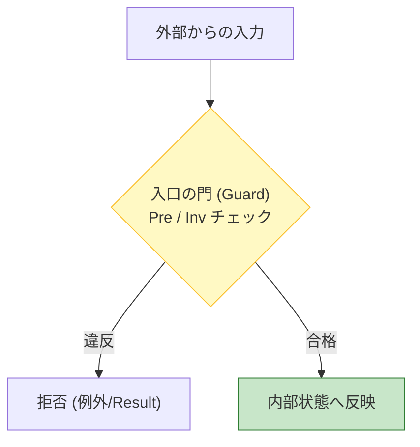
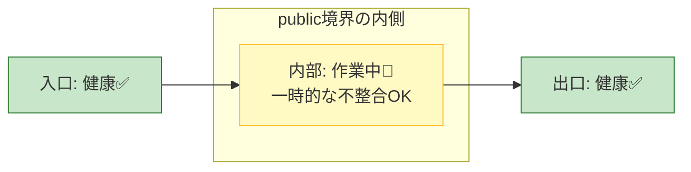

# 第17章 不変条件を守る場所：生成/更新の入口で守る🚪🔒

## 17.0 この章でできるようになること🎯✨

* 「不変条件（Invariant）」を**いつ・どこで**守るのが正解かがわかる🧱✅
* **壊れないクラス**にするために、更新ルート（入口）を**一本化**できる🚪➡️🧠
* 「public setter が危ない理由」と「代わりにどう作るか」が身につく⚠️➡️🛡️
* 例外・Result・Assert を**役割で使い分け**できるようになる🎭⚖️

---

## 17.1 まず結論：不変条件は「入口」で守るのがいちばん強い🧱🔒


不変条件（Invariant）を確実に守るための最大のコツは……
**「不正な値をそもそも中に入れないこと」** です🚪🛡️✨

* **生成の入口**：コンストラクタ / ファクトリ（Create, TryCreate）🏗️🏭
* **更新の入口**：状態を変える public メソッド（例：Deposit / Withdraw）🔁✅



逆に言うと…
**入口以外で状態が変えられる**と、不変条件は一気に守れなくなる😵‍💫💥

---

## 17.2 なんで「入口」が大事なの？（途中で壊れていい時間は“最小”に）⏱️🧠

DbC 的には、こんなイメージが理想だよ🌸

* **外から見えるタイミング（public の境界）では常に不変条件が成立**している🧱✅
* メソッドの中では、作業中に一瞬だけ崩れてもOK（でも最後に戻す）🔧➡️✅

  * ただし、その「一瞬」を外に漏らさないことが大事🚫👀

つまり、**外部公開されてる操作が終わった瞬間に、絶対に健康状態に戻す**🏥✨
これが「壊れないモデル」への近道だよ🧡



---

## 17.3 public setter はなぜ危険？（不変条件を素通りできちゃう）⚠️🚫

例えば「残高は 0 以上」って不変条件があるとするね💰

もしこうだと…👇

```csharp
public class BankAccount
{
    public decimal Balance { get; set; } // ❌危ない
}
```

外からこうされて終わり…😇💥

```csharp
account.Balance = -9999m; // 不変条件が死亡😵‍💫
```

だから基本はこう👇✨

* 値を書き換える経路を **public にしない**🚫
* 変更は **意図があるメソッド** だけにする✅

---

## 17.4 不変条件を守る定番パターン3つ🍡✨

### パターンA：生成は「ファクトリ」に寄せる🏭✅

* コンストラクタを隠す（private / internal）🔒
* `CreateOrThrow`（例外）と `TryCreate`（Result）を用意する🎭📩

### パターンB：更新は「ドメインメソッド」だけ🔁🛡️

* `Balance` みたいな状態は `private set` にする🔐
* `Withdraw(amount)` の中で Pre/Inv を守る✅

### パターンC：コレクションは“触らせない”📚🧤

* `List<T>` をそのまま公開しない🙅‍♀️
* 外には `IReadOnlyList<T>` を見せる👀✨
* 追加/削除は専用メソッドでしかできないようにする🚪✅

---

## 17.5 実装例：BankAccount（残高>=0 を絶対に守る）💳🧱✅

### ① 不変条件（Invariant）を言葉で書く📝💗

* `Balance >= 0` 💰✅
* `OwnerName` は空じゃない（例）👤✅

### ② 生成の入口：Create で守る🏗️🏭

```csharp
public sealed class BankAccount
{
    public string OwnerName { get; }
    public decimal Balance { get; private set; } // ✅ 外からは書き換え不可

    private BankAccount(string ownerName, decimal initialBalance)
    {
        OwnerName = ownerName;
        Balance = initialBalance;

        EnsureInvariants(); // ✅ 生成直後に健康チェック
    }

    public static BankAccount CreateOrThrow(string ownerName, decimal initialBalance)
    {
        // Pre（入口で弾く）🚪🛡️
        if (string.IsNullOrWhiteSpace(ownerName))
            throw new ArgumentException("OwnerName must not be empty.", nameof(ownerName));

        if (initialBalance < 0)
            throw new ArgumentOutOfRangeException(nameof(initialBalance), "Initial balance must be >= 0.");

        return new BankAccount(ownerName, initialBalance);
    }

    // 更新の入口：Deposit / Withdraw ✅
    public void Deposit(decimal amount)
    {
        if (amount <= 0)
            throw new ArgumentOutOfRangeException(nameof(amount), "Deposit amount must be > 0.");

        Balance += amount;

        EnsureInvariants(); // ✅ 更新後に戻す
    }

    public void Withdraw(decimal amount)
    {
        if (amount <= 0)
            throw new ArgumentOutOfRangeException(nameof(amount), "Withdraw amount must be > 0.");

        if (Balance - amount < 0)
            throw new InvalidOperationException("Insufficient funds.");

        Balance -= amount;

        EnsureInvariants(); // ✅ 更新後に戻す
    }

    private void EnsureInvariants()
    {
        // Invariant（クラスの健康診断）🏥🧱
        if (Balance < 0)
            throw new InvalidOperationException("Invariant violation: Balance must be >= 0.");

        if (string.IsNullOrWhiteSpace(OwnerName))
            throw new InvalidOperationException("Invariant violation: OwnerName must not be empty.");
    }
}
```

ここがポイントだよ💡✨

* 生成も更新も、必ず最後に `EnsureInvariants()` を通る🚪➡️✅
* 外から `Balance` を直接壊せない🔒
* “壊れた状態”が外に出る前に止められる🛑💥

---

## 17.6 「EnsureInvariants()」は例外でいいの？Resultでいいの？🎭📩

ここ、混ぜるとグチャるから分けるのがコツだよ🍰✨

* `EnsureInvariants()` が失敗するのは基本「**プログラムのミス**」側（直すべき）🧑‍💻💥

  * → 例外で止めるのが自然なことが多い
* 一方で「ユーザー入力が間違ってる」みたいな**仕様エラー**は Result にしたくなる📩🙂

この章のテーマは「不変条件」なので、
**不変条件違反は“内部の事故”として強く止める**方向がわかりやすいよ🧯✅

---

## 17.7 Assert を併用するとさらに安心🐞🔔（開発中に速攻で気づける）

`Debug.Assert` は **デバッグビルドで主に動く**から、「内部の前提が壊れた」を早めに見つける用途に便利だよ🔍✨
（Release に残したいなら `Trace.Assert` 側を検討する感じ） ([Microsoft Learn][1])

例えばこう👇

```csharp
using System.Diagnostics;

private void EnsureInvariants()
{
    Debug.Assert(Balance >= 0, "Invariant: Balance must be >= 0."); // 🐞 開発中に気づく

    if (Balance < 0)
        throw new InvalidOperationException("Invariant violation: Balance must be >= 0.");
}
```

おすすめは「**Assert + 例外**」の二段構え🎀

* Assert：開発中にすぐ気づける🐞
* 例外：もし混入しても実行時に止める🧯

---

## 17.8 コレクション不変条件の守り方（外に List を出さない）📚🚫

例：注文は「明細が1件以上ある」とか「明細の合計が一致する」みたいな不変条件が出がち🛒🧾✨

```csharp
public sealed class Order
{
    private readonly List<OrderLine> _lines = new();

    public IReadOnlyList<OrderLine> Lines => _lines; // ✅ 触れない形で見せる
    public decimal Total { get; private set; }

    public void AddLine(OrderLine line)
    {
        if (line is null) throw new ArgumentNullException(nameof(line));

        _lines.Add(line);
        RecalculateTotal();

        EnsureInvariants();
    }

    public void RemoveLineAt(int index)
    {
        if (index < 0 || index >= _lines.Count)
            throw new ArgumentOutOfRangeException(nameof(index));

        _lines.RemoveAt(index);
        RecalculateTotal();

        EnsureInvariants();
    }

    private void RecalculateTotal()
        => Total = _lines.Sum(x => x.Price * x.Quantity);

    private void EnsureInvariants()
    {
        if (_lines.Count == 0)
            throw new InvalidOperationException("Invariant violation: Order must have at least 1 line.");

        if (Total < 0)
            throw new InvalidOperationException("Invariant violation: Total must be >= 0.");
    }
}
```

ポイントはこれ👇💗

* 外から `_lines.Add(...)` できない = ルールを破れない🔒✨
* 更新操作をメソッドに閉じ込める = 入口で守れる🚪✅

---

## 17.9 ありがち事故あるある⚠️😵‍💫

* ✅ **プロパティを public set にしてしまう**（最頻出）🚫
* ✅ “更新メソッド”の最後に不変条件チェックを忘れる🧾💦
* ✅ 例外メッセージが雑で、後で原因が追えない📉😢
* ✅ 「仕様エラー」と「不変条件違反」を同じ例外で投げちゃう🧩💥

---

## 17.10 ミニ演習（手を動かすと一気に身につく）🧪🌸

### 演習1：わざと壊して止まるのを確認💥🛑

1. `Withdraw` の `if (Balance - amount < 0)` をコメントアウトしてみる✂️
2. `Withdraw(999999)` を呼ぶ
3. `EnsureInvariants()` が止めるのを確認✅

### 演習2：不変条件を1つ追加してみよう🧱➕

* 例：`OwnerName` は 1〜50 文字
* どこで弾く？（Create）
* どこで保証する？（EnsureInvariants）

### 演習3：public setter を消して API を作り直す🛠️✨

* `Balance { get; set; }` をやめる
* `Deposit/Withdraw` だけで目的が達成できるようにする🎯

---

## 17.11 AI活用（速く書く✨でも入口の設計は人が決める🤖🧠）

AIには「コードを書かせる」よりも、まず「契約を言語化」させるのが超おすすめだよ📝💗

### そのまま使えるお願い文（コピペOK）📋✨

```text
C#で、不変条件を持つクラスの例を作って。
不変条件：Balance >= 0、OwnerNameは空禁止。
生成はCreateOrThrowで入口チェック、更新はDeposit/Withdrawだけで行い、
public setterは禁止。EnsureInvariants()で最後に検証する実装にして。
例外メッセージも読みやすくして。
```

出てきたコードはここを人がチェック👀✅

* 入口（Create/更新メソッド）に検証が集約されてる？🚪
* public setter が残ってない？🔒
* 不変条件が「最後に必ず」確認されてる？🧱✅

---

## 17.12 この章の合言葉💖

**「不変条件は、生成と更新の入口で守る」**🚪🔒
これだけで、クラスの壊れやすさが一気に減るよ🧱✨

（参考：C# 14 は .NET 10 上でサポートされる最新の C# リリースとして案内されているよ📌） ([Microsoft Learn][2])

[1]: https://learn.microsoft.com/en-us/dotnet/api/system.diagnostics.debug.assert?view=net-10.0&utm_source=chatgpt.com "Debug.Assert Method (System.Diagnostics)"
[2]: https://learn.microsoft.com/en-us/dotnet/csharp/whats-new/csharp-14?utm_source=chatgpt.com "What's new in C# 14"
