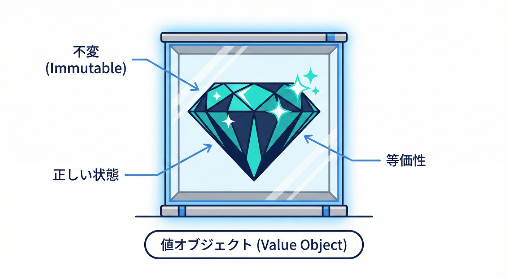
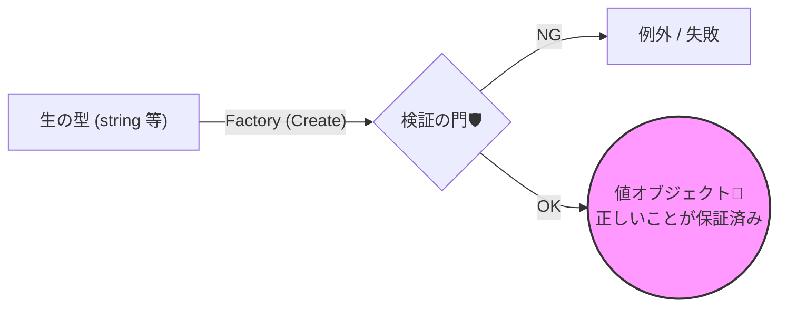
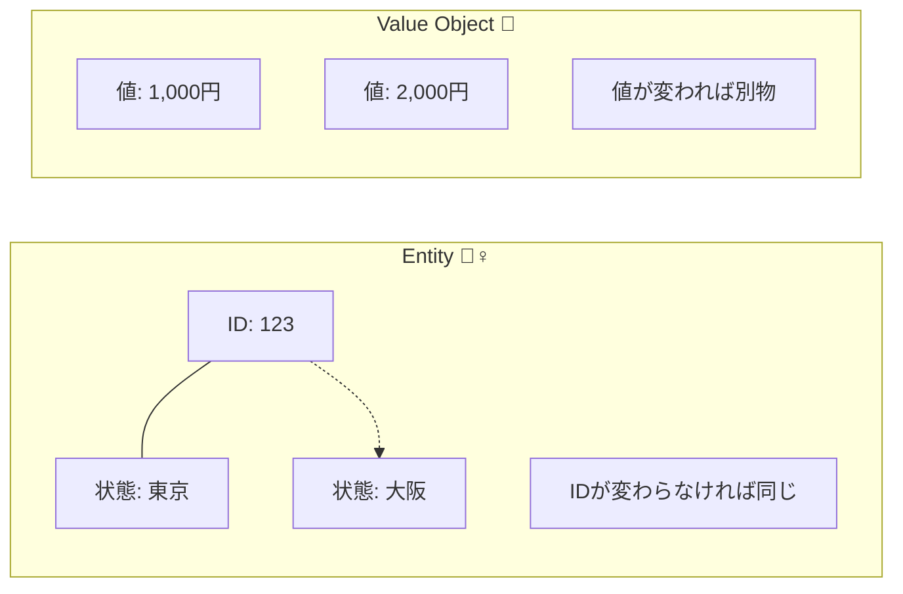

# 第18章 値オブジェクト入門：不正な状態を作れないが最強💎🔒

## この章でできるようになること🎯✨

* 「Entity（エンティティ）」と「Value Object（値オブジェクト）」を、超ざっくり迷わず分けられるようになる😊🧠
* DbC（契約）を **“型” に埋め込む** 発想がつかめる🧩🔧
* 「値オブジェクトにする候補（Money/Email/Period など）」を現場っぽく決められる🎯📦

---

## 1. 値オブジェクトってなに？💎🧸



値オブジェクトは一言でいうと、**“意味のある値”を、専用の型に閉じ込めたもの**だよ📦✨
単なる `string` や `decimal` のままだと「何の文字列？何のお金？」が曖昧で、ルールも散らばりがち😵‍💫💦

例えば👇

* `string email`（メールのつもり）なのに、空文字や変な形式が入る📧💥
* `decimal amount`（金額のつもり）なのに、通貨や小数桁やマイナスの扱いが毎回バラバラ💸🌀
* `DateTime start/end`（期間のつもり）なのに、`start > end` が普通に作れちゃう⏳💥

そこで登場するのが値オブジェクト💎
**作るときに検証して、以後ずっと正しい状態を保つ**のが得意だよ🔒✅



---

## 2. DbC視点だと「値オブジェクトは最強」な理由🛡️💎

DbCの基本は「入口で契約チェック」だよね🚪✅
でも、引数がいつも `string` や `int` だと…

* **どこでもチェックが必要**になりやすい（漏れる）🕳️💦
* 仕様変更で条件が増えると、チェック箇所が増殖する🌱🌱🌱
* 「この値は検証済み？」がコードから読み取れない😢🔍

値オブジェクトにすると、こうなる👇

* 「作れた時点でOK」という **強い保証**が手に入る🎁✨
* public境界で `EmailAddress` を受け取るだけで、「形式OK」を前提にできる📧✅
* 契約（ルール）が **1か所に集まる**から保守がラク🧹💖

つまり、DbCの “契約” を **コメントやガード節だけじゃなく、型でも守れる**ってことだよ🧩🔒

---

## 3. Entity と Value Object の超ざっくり区別🧠✨

ここはまず「覚え方」だけでOK🙆‍♀️🌸

### Entity（エンティティ）🧍‍♀️🆔

* **同一性（ID）で区別する**
* 中身が変わっても「同じ人」「同じ注文」みたいに追跡する👣

例：`User(Id=123)`、`Order(OrderId=...)` 🧾🛒

### Value Object（値オブジェクト）💎

* **中身（値）が同じなら同じ**
* “それ自体のID” を持たない（持たせないのが基本）🎀


* だいたい **不変（immutable）** にするのが相性◎🧊✨

例：「メールアドレス」「金額」「住所」「期間」「座標」📧💰🏠⏳📍
（同じ内容なら同じもの扱いが自然だよね🙂）

> ちなみに C# の `record` は “値が同じなら同じ” を作りやすいよ🎀
> records は value equality（値による等価）をサポートしてるよ。([Microsoft Learn][1])

---

## 4. 値オブジェクトにする候補の見つけ方🔍💡

次のどれかに当てはまったら、候補としてかなりアツい🔥💎

### ✅ 候補サイン1：毎回バリデーションしてる

* 「null禁止」「空禁止」「形式」「範囲」「相関」…を何度も書いてる🧾🌀

### ✅ 候補サイン2：引数の意味が曖昧

* `string value` が何なのか読めない😢
  → `EmailAddress` / `UserName` / `PostalCode` みたいにしたい✨

### ✅ 候補サイン3：同じルールを複数クラスで使う

* ルールが散ってると変更に弱い💥
  → 値オブジェクトに集約すると強い🧹💖

### ✅ 候補サイン4：不正な状態が事故る（バグが痛い）

* 金額・期間・識別子・在庫…あたりは事故が大きい💣💸⏳

---

## 5. 代表例：Money / Email / Period を “候補として決める”🎯📦

### 5.1 Money（お金）💰✨

**なぜ候補？**

* 通貨（JPY? USD?）が必要かも💱
* 小数点の扱い、マイナスの扱いがブレやすい😵‍💫
* うっかり `-100` が入って大事故、とかある💥💸

**契約（例）**

* `Amount >= 0`（用途によってはマイナスOKにすることもあるよ）
* `Currency` は ISO 4217 の3文字（例：JPY）などを採用するなら固定ルールにする🎌🪙

**値オブジェクトにすると嬉しい**

* `Money` を受け取る場所は「金額のルールOK」前提にできる🎁✅

---

### 5.2 Email（メールアドレス）📧✨

**なぜ候補？**

* `string` のままだと何でも入る😵‍💫
* “メールっぽい形” のチェックがあちこちに散る🧩💦

**注意ポイント⚠️**
メールの厳密な仕様（RFC）は激ムズなので、入門では

* 「空じゃない」
* 「ざっくりメールっぽい」
  くらいの **現実的ルール**にするのがちょうどいい😊🧁

---

### 5.3 Period（期間）⏳✨

**なぜ候補？**

* `start <= end` を守らないと破綻しやすい💥
* inclusive/exclusive（終端含む？含まない？）も揺れやすい🌀

**契約（例）**

* `Start <= End`
* 期間の意味が決まったら命名で固定（例：`BookingPeriod`）🏨📅

---

## 6. C#での形（プレビュー）🛠️💠

C# 14 は .NET 10 上でサポートされていて、最新の言語機能を使えるよ✨([Microsoft Learn][2])
値オブジェクトは **record / readonly** と相性がいい🙂🎀
（record は “値が同じなら同じ” を作りやすい！([Microsoft Learn][1])）

ここでは「形だけ」見てね👀✨（詳細は次章でガッツリやるよ🧡）

```csharp
public readonly record struct EmailAddress
{
    public string Value { get; }

    private EmailAddress(string value) => Value = value;

    public static EmailAddress Create(string raw)
    {
        // ここで検証して、OKなら作る（ダメなら例外）
        // 例: null/空/前後空白/ざっくり形式
        return new EmailAddress(raw);
    }

    public override string ToString() => Value;
}
```

ポイントだけ押さえると👇

* **コンストラクタを隠す**（勝手に作れないように）🔒
* **Create/TryCreate に検証を集める**🧹✅
* **immutable（不変）** に寄せる🧊✨

---

## 7. “値オブジェクト化”のコツ（やりすぎ防止）🧯🌸

### 7.1 ルールを詰め込みすぎない🍱💦

値オブジェクトは便利だけど、
「正規表現を鬼のように」「仕様を全部ここへ」
みたいにすると保守がつらくなる😵‍💫

入門のおすすめは👇

* **壊れると困る “核のルール”**だけ入れる🎯
* “業務の細かいルール” は別の層（ユースケース等）で扱うこともある🧩

### 7.2 DTO とドメインは分ける🧳➡️🏠

外から来た `string` をそのままドメインに入れない🧼⚠️

* DTO（文字列いっぱい） → 変換 → 値オブジェクト（綺麗な型）✨
  この流れが作れると、DbCがめっちゃ効くよ🚀💎

---

## 8. ミニ演習：Money/Email/Period の候補を決める🎯📝✨

### 演習1：候補リストを作る📋💡

次の質問に答えて、候補を決めよう😊🧠

* 何度もチェックしてる値はどれ？🔁
* ルールが散ってる値はどれ？🧩
* 壊れたら事故る値はどれ？💥

例（候補）👇

* `Money` 💰
* `EmailAddress` 📧
* `Period` ⏳

### 演習2：契約文を「日本語」で書く📝🌸

各候補について、まずはコードじゃなくて文章でOK✨
例：

* EmailAddress：空じゃない、前後空白なし、ざっくりメール形式📧✅
* Money：金額は0以上、通貨は3文字（JPYなど）💰✅
* Period：StartはEnd以下⏳✅

### 演習3：Create に集約する設計にする🏗️🔒

「検証は全部 Create に寄せる」前提で、最低限の形を書いてみよう💪✨
（実装の中身は次章で完成させるよ🛠️💠）

---

## 9. Copilot / Codex への指示例🤖🪄

そのまま貼って使える指示例だよ✨📌

### 値オブジェクトの雛形を作ってもらう🧩

```text
C# 14 / .NET 10 で、値オブジェクト EmailAddress を readonly record struct で作って。
要件:
- private constructor
- Create(string raw) は不正なら ArgumentException
- TryCreate(string raw, out EmailAddress value) は bool 返す
- 空/前後空白をNG
- 形式は厳密RFCではなく、簡易チェックでOK（読みやすさ優先）
- ToString() は Value を返す
```

### テスト候補を出してもらう🧪

```text
EmailAddress 値オブジェクトのテストケースを境界値中心で列挙して。
OK例/NG例をそれぞれ10個ずつ。
NGは「空」「空白のみ」「前後空白」「@なし」「ドメインなし」などを含めて。
```

---

## 10. まとめ（この章のキモ）💎✨

* 値オブジェクトは **「不正な状態を作れない」** を狙える最強カード🔒💪
* DbCの契約を **型に埋め込む** と、チェック漏れが減って設計が安定する🧩✅
* まずは **Money / Email / Period** みたいな「事故りやすい値」から始めるのがコスパ最強💰📧⏳

次の章では、この候補たちを C# で “ちゃんと作れる形” にしていくよ🛠️💠✨

[1]: https://learn.microsoft.com/en-us/dotnet/csharp/fundamentals/types/records?utm_source=chatgpt.com "Record types - C# | Microsoft Learn"
[2]: https://learn.microsoft.com/en-us/dotnet/csharp/whats-new/csharp-14?utm_source=chatgpt.com "What's new in C# 14"
