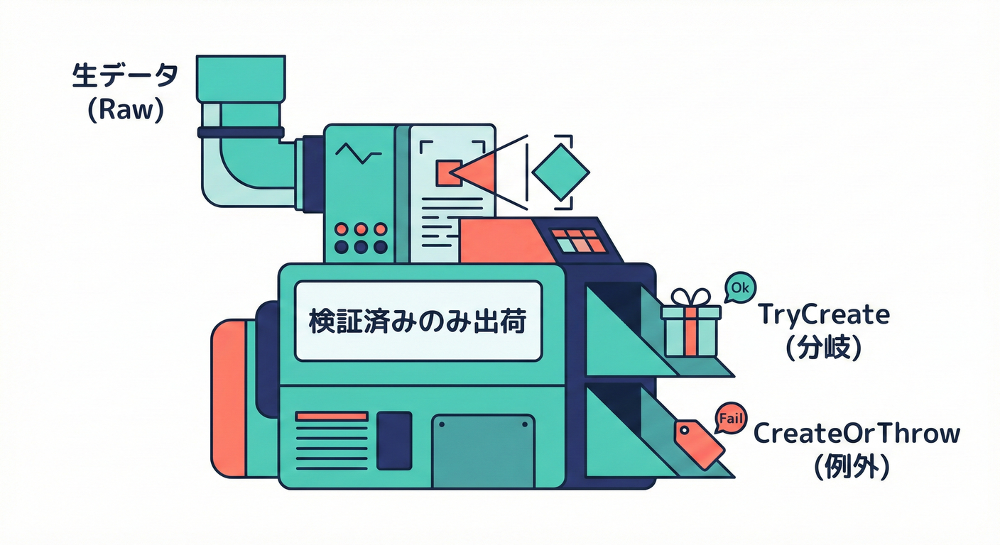
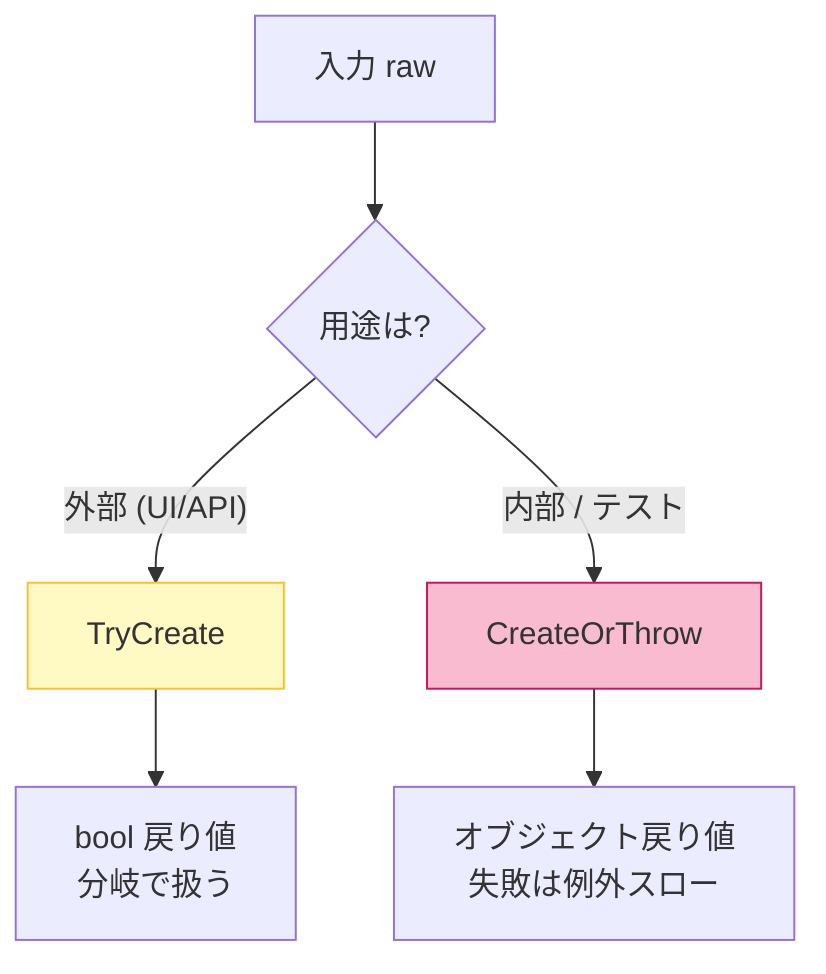
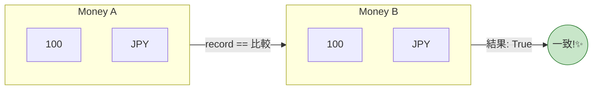

# 第19章 C#で作る値オブジェクト：record / readonly / factory🛠️💠

## 19.1 この章でできるようになること🎯✨

* 「値オブジェクト（Value Object）」を **C#のrecord系**で安全に作れるようになる💎
* **不正な値を“生成時に”必ず止める**（＝不変条件を守る）設計ができる🧱🔒
* 入口向けの「TryCreate」と、内部向けの「CreateOrThrow」を使い分けられる🔁✅

---

## 19.2 値オブジェクトの“3つの約束”📜💗

値オブジェクトは、ざっくりこの3つを守れると強いよ〜😊✨

1. **同じ値なら同じもの（等価性）**
   「金額100円」＝「金額100円」みたいに、値が同じなら“同じ”として扱う🎀
   recordは **値ベースの等価性**が標準でついてくるのが嬉しいポイント！ ([Microsoft Learn][1])

2. **不正な状態を作らない（不変条件）**
   メールが空、金額がマイナス、期間の開始>終了…みたいな状態を “作った瞬間に” 止める🚫💥

3. **作ったら基本変えない（イミュータブル）**
   作った後に中身が変わると事故りやすい😵‍💫
   record（特に「init-only」や「readonly」）はこの方向と相性がいいよ✨ ([Microsoft Learn][1])

---

## 19.3 「record class」か「record struct」か迷ったら？🤔🧭

### まず結論（迷子防止）🗺️✨

* **迷ったら「sealed record class」**がいちばん安全でおすすめ💗
* **「readonly record struct」**は、

  * 小さくて
  * 参照型（stringや配列）を極力持たず
  * default（初期値）が問題になりにくい
    そんなときに選ぶのが安心😊🧩

### record structの注意点⚠️🧨

* 「record struct」には **既定の引数なしコンストラクタ（全部default）**があるよ〜、って仕様があるの🧊
  つまり **defaultで“変な値”が作れてしまう**可能性がある（参照型が混ざると特に）😱 ([Microsoft Learn][1])
* 位置指定（丸括弧のやつ）で「record struct」を作ると、プロパティが書き換え可能（set）になりやすいので、**うっかり変更**が起きがち🥺
  → イミュータブル寄りにしたいなら「readonly record struct」を検討✨ ([Microsoft Learn][1])

### ついでに超重要メモ📝✨

recordは便利だけど、**Entity（同一性が大事なやつ）**には合わないことがあるよ〜（特にEF Coreの追跡の都合）💦
Entityには普通のclass、値オブジェクトにrecord…が王道になりやすいよ😊 ([Microsoft Learn][1])

---

## 19.4 生成口を2つ用意しよう：TryCreate と CreateOrThrow🧰🔁



値オブジェクトは「生成の入口」を2つに分けると、めっちゃ運用がラクになるよ✨

### A) TryCreate（入口向け）🚪🌸

* UI入力、API入力、CSV… **間違った値が来る前提**🙂
* 例外を乱発せず、失敗を分岐で扱える👌
* 失敗理由（エラーメッセージ）も返してあげると親切💌

### B) CreateOrThrow（内部向け）🧠🔥

* ドメイン内部やテストで、**「ここに来る値は正しいはず」**という場面
* もし失敗したら、それは **プログラマのミス（契約違反）**なので例外でドーン💥
* “早く落ちて気づく”が目的✅



---

## 19.5 実装例①：EmailAddress（sealed record class）📧✨

「メールアドレス」は参照型のstringを中心にするので、まずは record class が扱いやすいよ😊🌸

```csharp
using System;

public sealed record EmailAddress
{
    public string Value { get; }

    private EmailAddress(string value)
    {
        Value = value;
    }

    // ✅ 内部向け：失敗＝開発者のミスとして例外
    public static EmailAddress CreateOrThrow(string? input)
    {
        if (!TryCreate(input, out var email, out var error))
            throw new ArgumentException(error ?? "Invalid email.", nameof(input));

        return email;
    }

    // ✅ 入口向け：失敗を分岐で扱う（エラー文も返す）
    public static bool TryCreate(string? input, out EmailAddress email, out string? error)
    {
        email = default!;
        error = null;

        if (string.IsNullOrWhiteSpace(input))
        {
            error = "メールアドレスが未入力だよ🥺";
            return false;
        }

        var trimmed = input.Trim();

        // ここは「超ゆるめ」な例だよ🍀
        // 厳密なRFC準拠は重くなりがちなので、目的に応じて調整しようね😊
        var at = trimmed.IndexOf('@');
        if (at <= 0 || at == trimmed.Length - 1)
        {
            error = "メールアドレスの形が変だよ🥺（@の位置を確認してね）";
            return false;
        }

        // 例：最大長チェック（用途に合わせて）
        if (trimmed.Length > 254)
        {
            error = "メールアドレスが長すぎるよ🥺";
            return false;
        }

        email = new EmailAddress(trimmed);
        return true;
    }

    public override string ToString() => Value;
}
```

### 使い方イメージ🧁✨

```csharp
// 入口（UI/API）：
if (!EmailAddress.TryCreate(dto.Email, out var email, out var error))
{
    return Result.Fail(error!);
}

// 内部（ここは正しいはず）：
var adminEmail = EmailAddress.CreateOrThrow("admin@example.com");
```

---

## 19.6 実装例②：Money（sealed record class）💰✨

金額は「通貨」も絡むことが多いから、まとめて1つの値として扱えると強いよ🧠💗

```csharp
using System;

public sealed record Money
{
    public decimal Amount { get; }
    public string Currency { get; }

    private Money(decimal amount, string currency)
    {
        Amount = amount;
        Currency = currency;
    }

    public static Money CreateOrThrow(decimal amount, string? currency)
    {
        if (!TryCreate(amount, currency, out var money, out var error))
            throw new ArgumentException(error ?? "Invalid money.");

        return money;
    }

    public static bool TryCreate(decimal amount, string? currency, out Money money, out string? error)
    {
        money = default!;
        error = null;

        if (amount < 0)
        {
            error = "金額はマイナスにできないよ🥺";
            return false;
        }

        if (string.IsNullOrWhiteSpace(currency))
        {
            error = "通貨コードが未指定だよ🥺";
            return false;
        }

        var c = currency.Trim().ToUpperInvariant();

        // 例：超ゆるい通貨コードチェック（3文字想定）
        if (c.Length != 3)
        {
            error = "通貨コードは3文字（例：JPY, USD）にしてね🥺";
            return false;
        }

        money = new Money(amount, c);
        return true;
    }

    public override string ToString() => $"{Amount} {Currency}";
}
```

### ここがポイント🎀✨

* 「Amountだけ」だと **通貨が混ざる事故**が起きやすい😱
  → Moneyという値オブジェクトにまとめると安全💎🔒

---

## 19.7 実装例③：Percentage（readonly record struct）📏✨

これは「intだけ」で完結して、default（0%）も意味があるので、readonly record struct にしやすい例だよ😊🌸

```csharp
using System;

public readonly record struct Percentage
{
    public int Value { get; }

    private Percentage(int value)
    {
        Value = value;
    }

    public static Percentage CreateOrThrow(int value)
    {
        if (!TryCreate(value, out var p, out var error))
            throw new ArgumentException(error ?? "Invalid percentage.", nameof(value));

        return p;
    }

    public static bool TryCreate(int value, out Percentage p, out string? error)
    {
        p = default;
        error = null;

        if (value < 0 || value > 100)
        {
            error = "パーセントは0〜100だよ🥺";
            return false;
        }

        p = new Percentage(value);
        return true;
    }

    public override string ToString() => $"{Value}%";
}
```

---

## 19.8 recordの“等価性”を味方にする🍬✨

recordの強みは「同じ中身なら同じ」と扱えること！
比較やDictionaryのキーにも使いやすいよ😊🎀 ([Microsoft Learn][2])

```csharp
var a = Money.CreateOrThrow(100m, "JPY");
var b = Money.CreateOrThrow(100m, "JPY");

Console.WriteLine(a == b); // True ✅（値が同じ）


```

---

## 19.9 AI活用（Copilot / Codex）で爆速にする🤖⚡️✨

AIに頼むときは「仕様」をはっきり書くと成功率が上がるよ〜😊💗
そのまま貼れる指示例👇

### EmailAddressを作らせる指示例📧📝

* 「sealed record classでEmailAddressを作って」
* 「コンストラクタはprivate」
* 「TryCreate(string? input, out EmailAddress value, out string? error)」
* 「CreateOrThrowも用意」
* 「Trimして、@の位置を最低限チェック」
* 「ToStringはValue」

### Moneyを作らせる指示例💰📝

* 「amountは0以上」
* 「currencyは3文字、Trimして大文字化」
* 「TryCreateとCreateOrThrow」
* 「ToStringは “{Amount} {Currency}”」

👉 出てきたコードは、**メッセージ文言・境界条件・命名**だけは人間が最後に整えるのがコツだよ🧠✨

---

## 19.10 ミニ演習（手を動かすよ〜！）🧪🌸

### 演習1：Period（開始<=終了）を作ろう⏳✅

* StartとEndを持つ値オブジェクトを作る
* ルール：Start <= End
* TryCreate / CreateOrThrow を両方用意✨

ヒント（型は DateOnly を使うと気持ちいいよ）🍀

```csharp
// こんな感じのAPIを目指そう
// Period.TryCreate(start, end, out var period, out var error)
```

### 演習2：CustomerId（Guid）を作ろう🪪✨

* Guid.Emptyは禁止
* readonly record struct にチャレンジしてみよう😊

---

## 19.11 仕上げチェックリスト✅💗

* 値オブジェクトは **newで自由に作れない**（生成は工場メソッド経由）🏭🔒
* 不正値は **生成時に止める**（後から直す、は事故る）🚫💥
* 入口は TryCreate、内部は CreateOrThrow で使い分けできてる？🚪🧠
* recordの等価性を活かして「値が同じ＝同じ」で扱えてる？🎀✨ ([Microsoft Learn][2])
* Entityにはrecordを使ってない？（混ぜると追跡で泣くことある）🥺💦 ([Microsoft Learn][1])

---

### おまけ：この章の“最新前提”メモ📌✨

C# 14 は .NET 10 上でサポートされる最新のC#として案内されているよ🪟✨ ([Microsoft Learn][3])

[1]: https://learn.microsoft.com/en-us/dotnet/csharp/language-reference/builtin-types/record?utm_source=chatgpt.com "Records - C# reference"
[2]: https://learn.microsoft.com/en-us/dotnet/csharp/fundamentals/types/records?utm_source=chatgpt.com "Record types - C# | Microsoft Learn"
[3]: https://learn.microsoft.com/ja-jp/dotnet/csharp/whats-new/csharp-14?utm_source=chatgpt.com "C# 14 の新機能"
