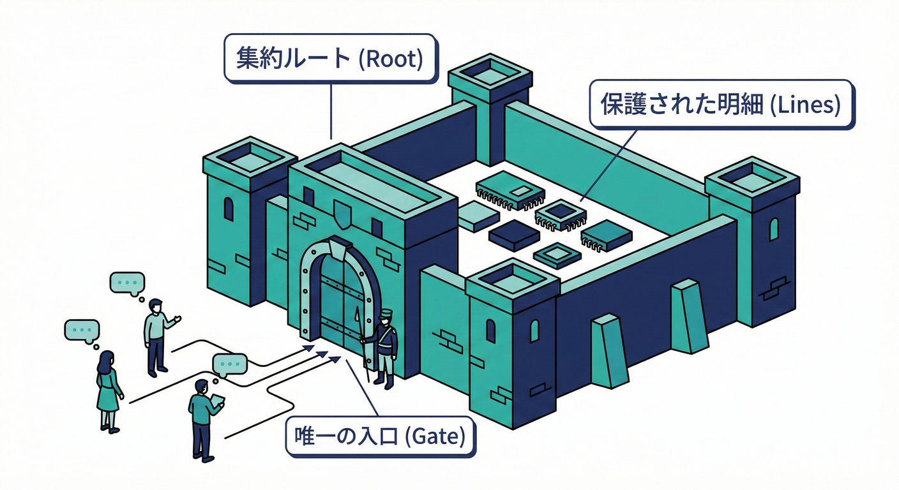
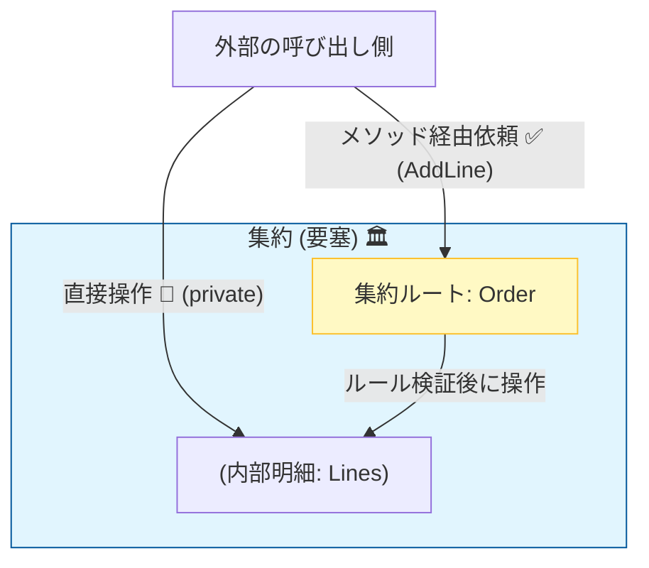
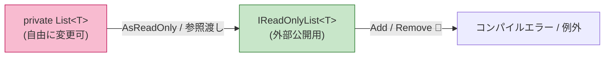

# 第20章 不変条件×コレクション：集約ルートでしか更新しない🏛️🧱

## この章でわかるようになること🎯✨

* 「コレクション（List）が壊れる」典型パターンがわかる😵‍💫📛
* “注文（Order）＋明細（Lines）”みたいなまとまりを、**不変条件で守る設計**ができる🛒🧱
* **「リストを直接触らせない」**ようにして、ルールを1か所に集められる🧤🔒
* テストで「壊れない」を確認できる🧪✅

---

## 1) そもそも、コレクションは壊れやすい📚💥

コレクションは便利だけど、**どこからでも追加・削除・並び替え**できちゃうと、こうなりがち👇😱

* 同じ商品が2行できる（重複）🌀
* 数量が0やマイナスになる（ありえない）➖😵
* 明細を消したら合計金額が合わない（整合性崩壊）🧾💔
* 「確定済み注文」なのに明細が勝手に変わる（事故）🚑💥

こういうのを防ぐのが、**不変条件（Inv）×コレクション**の本番だよ〜🧱✨

---

## 2) ダメな例：public に List を出しちゃう🙅‍♀️📛

「明細がほしいから」といって、こうすると危険⚠️

```csharp
public class Order
{
    public List<OrderLine> Lines { get; } = new(); // 🚨危険
}
```

これだと呼ぶ側が👇を全部できちゃう…😇💣

```csharp
order.Lines.Clear();
order.Lines.Add(new OrderLine(...));
order.Lines[0] = new OrderLine(...);
order.Lines.Sort(...);
```

結果：**Order が守りたいルール（不変条件）が、Order の外から壊される**😵‍💫💥

---

## 3) 正解の考え方：Order（集約ルート）が “唯一の入口” 🚪🏛️



ここからは「注文＋明細」を例にするね🛒✨

* **Order**：注文の“親”（集約ルート）🏛️
* **OrderLine**：明細の“子”📦
* ルールは **Order が責任を持って守る**🧤🔒
* 明細の更新は **Order のメソッド経由だけ**📌

イメージ👇😊

> 「明細のルールを守れるのは、親の Order だけ！」👑✨



---

## 4) まずは “守りたい不変条件” を決める🧱📝

例として、注文のルールをこう決めるよ👇（現場でよくあるやつ🌸）

### 注文（Order）の不変条件（Inv）🧱✨

* 明細は **1件以上**（0件注文は存在しない）📦➕
* 同じ商品は **明細1行まで**（重複禁止）🛑🌀
* 数量は **1以上**（0はダメ）🔢✅
* 注文が **確定（Submitted）**したら、明細は変更できない🚫🧾

---

## 5) 実装の基本ルール3つ🧠✨

### ① コレクションは private に隠す🙈🔒

* `private readonly List<OrderLine> _lines` にする📚🔐
* 外には **読み取り専用**で見せる👀✅

### ② 追加・削除・変更は “専用メソッド” だけ🛠️📌

* `AddLine()` / `RemoveLine()` / `ChangeQuantity()` など
* その中で **不変条件を必ずチェック**🧱✅

### ③ “状態（Status）” でルールを切り替える🎚️🧾

* Draft（編集中）なら変更OK
* Submitted（確定済み）なら変更NG 🚫



---

## 6) 例：Order + OrderLine（C#）🛒✨

### (A) まずは小さめの型（値）を用意（超かんたん版）💎🧷

「不正な値をそもそも持たない」ためのミニ値オブジェクトだよ〜😊

```csharp
public readonly record struct ProductId(Guid Value);

public readonly record struct Money(decimal Value)
{
    public static Money Create(decimal value)
    {
        if (value < 0) throw new ArgumentOutOfRangeException(nameof(value), "Moneyは0以上💰");
        return new Money(value);
    }
}

public readonly record struct Quantity(int Value)
{
    public static Quantity Create(int value)
    {
        if (value <= 0) throw new ArgumentOutOfRangeException(nameof(value), "数量は1以上🔢");
        return new Quantity(value);
    }
}
```

> ポイント：ここで弾くと、以降のコードがスッキリするよ〜🧘‍♀️✨

---

### (B) OrderLine（明細）📦✨

```csharp
public sealed class OrderLine
{
    public ProductId ProductId { get; }
    public Quantity Quantity { get; private set; }
    public Money UnitPrice { get; }

    public Money LineTotal => Money.Create(UnitPrice.Value * Quantity.Value);

    public OrderLine(ProductId productId, Quantity quantity, Money unitPrice)
    {
        ProductId = productId;
        Quantity = quantity;
        UnitPrice = unitPrice;
    }

    public void ChangeQuantity(Quantity newQuantity)
    {
        Quantity = newQuantity;
    }
}
```

---

### (C) Order（集約ルート）🏛️🧱

* 明細リストは **private**
* 外には **読み取り専用**
* 変更は **Order のメソッドだけ**

```csharp
public enum OrderStatus
{
    Draft,
    Submitted
}

public sealed class Order
{
    private readonly List<OrderLine> _lines = new();
    private readonly IReadOnlyList<OrderLine> _readOnlyLines;

    public Guid Id { get; } = Guid.NewGuid();
    public OrderStatus Status { get; private set; } = OrderStatus.Draft;

    public IReadOnlyList<OrderLine> Lines => _readOnlyLines;

    public Order()
    {
        _readOnlyLines = _lines.AsReadOnly(); // 変更不可のビュー👀🔒
    }

    public void Submit()
    {
        EnsureDraft();
        EnsureHasAtLeastOneLine();
        Status = OrderStatus.Submitted;
    }

    public void AddLine(ProductId productId, Quantity quantity, Money unitPrice)
    {
        EnsureDraft();

        // Inv: 同一商品は1行まで🛑🌀
        var existing = _lines.FirstOrDefault(x => x.ProductId == productId);
        if (existing is not null)
        {
            // 既にあるなら「数量を増やす」に寄せるのもアリ🌸
            var newQty = Quantity.Create(existing.Quantity.Value + quantity.Value);
            existing.ChangeQuantity(newQty);
            return;
        }

        _lines.Add(new OrderLine(productId, quantity, unitPrice));

        // Inv: 明細は1件以上（Addなのでここでは基本OKだけど、念のため）📦✅
        EnsureHasAtLeastOneLine();
    }

    public void RemoveLine(ProductId productId)
    {
        EnsureDraft();

        var index = _lines.FindIndex(x => x.ProductId == productId);
        if (index < 0) return; // 仕様として「なかったら何もしない」でもOK🙂

        _lines.RemoveAt(index);

        // Inv: 0件はダメ📦🚫
        EnsureHasAtLeastOneLine();
    }

    public void ChangeQuantity(ProductId productId, Quantity newQuantity)
    {
        EnsureDraft();

        var line = _lines.FirstOrDefault(x => x.ProductId == productId)
            ?? throw new InvalidOperationException("存在しない明細は変更できないよ🧾🚫（契約違反）");

        line.ChangeQuantity(newQuantity);

        // Inv: 数量はQuantity型で守れてるのでここは安心😊✅
    }

    private void EnsureDraft()
    {
        if (Status != OrderStatus.Draft)
            throw new InvalidOperationException("確定済みの注文は変更できないよ🧾🚫");
    }

    private void EnsureHasAtLeastOneLine()
    {
        if (_lines.Count == 0)
            throw new InvalidOperationException("明細0件の注文は作れないよ📦🚫");
    }
}
```

### ここが重要🌟

* **OrderLine を外から追加させない**（= ルール破壊経路を消す）🧤🔒
* ルールは **Order の中で1回だけ**書く（散らばらない）🧹✨
* 「状態で禁止」もできる（確定後の変更NG）🚫🧾

---

## 7) テストで “壊れない” を確認🧪✅（xUnit例）

「不変条件はテストで守る」が超大事だよ〜🌸✨

```csharp
using Xunit;

public class OrderTests
{
    [Fact]
    public void RemoveLine_最後の1件を消すと例外()
    {
        var order = new Order();
        var p1 = new ProductId(Guid.NewGuid());

        order.AddLine(p1, Quantity.Create(1), Money.Create(100));

        var ex = Assert.Throws<InvalidOperationException>(() => order.RemoveLine(p1));
        Assert.Contains("明細0件", ex.Message);
    }

    [Fact]
    public void AddLine_同一商品は行を増やさず数量が増える()
    {
        var order = new Order();
        var p1 = new ProductId(Guid.NewGuid());

        order.AddLine(p1, Quantity.Create(1), Money.Create(100));
        order.AddLine(p1, Quantity.Create(2), Money.Create(100));

        Assert.Single(order.Lines);
        Assert.Equal(3, order.Lines[0].Quantity.Value);
    }

    [Fact]
    public void Submit_確定後はAddLineできない()
    {
        var order = new Order();
        var p1 = new ProductId(Guid.NewGuid());

        order.AddLine(p1, Quantity.Create(1), Money.Create(100));
        order.Submit();

        Assert.Throws<InvalidOperationException>(() =>
            order.AddLine(new ProductId(Guid.NewGuid()), Quantity.Create(1), Money.Create(100)));
    }
}
```

---

## 8) ちょい実務寄り：EF Core を使うときの考え方🧠🛠️
 
 
 
 DB保存に EF Core を使う場合も、**「リストは private のまま」**でOKだよ😊
EF Core 10 は .NET 10 が必要で、LTSとしてサポートも長めなのが安心ポイント🌸 ([Microsoft Learn][1])

### EF Core 側で private フィールドをマッピング（イメージ）🗺️✨

```csharp
// OnModelCreatingの例（概念だけ）
modelBuilder.Entity<Order>()
    .HasMany(typeof(OrderLine), "_lines")
    .WithOne()
    .OnDelete(DeleteBehavior.Cascade);
```

> コツ：**ドメインを壊さないために、ORMに合わせてモデルをpublicにしない**のが大事🧤🔒

---

## 9) AI（Copilot/Codex）で速く作るコツ🤖⚡️

### 使いやすい指示（そのまま貼れる系）📌✨

* 「Orderの不変条件はこれ。Add/Remove/ChangeQuantityの実装とxUnitテストを書いて」🛒🧪
* 「publicにListを出さずに、読み取り専用公開にして。確定後変更NGも入れて」🔒🧾
* 「境界値テスト（0件、重複、確定後更新）を列挙して」🧪📋

### AIがやりがちなミス（ここだけ注意）⚠️👀

* `public set` を付けてしまう（破壊経路復活）😵
* `List` をそのまま返す（キャストで触られる）🌀
* ルールチェックが分散する（別メソッドに散って見失う）🧩💦

---

## 10) ミニ演習：注文＋明細の更新ルールを作る🛒✅

次の追加ルールを入れてみよう✨（実務っぽさUP🌸）

### 追加ルール案（好きなの選んでOK）🎀

1. 明細は最大20行まで📦🔝
2. 合計金額が10万円を超えたら追加NG💰🚫
3. `RemoveLine` は「存在しない商品なら例外」にする（契約を厳しく）🧾⚡️
4. 明細の並びは「追加順を保つ」📚➡️

**やることチェック✅**

* ルールを Order の中にだけ書く🧤🔒
* テストを最低3本追加する🧪✨
* 例外メッセージを未来の自分に優しくする💌😊

---

## この章のまとめ🎁✨

* コレクションは便利だけど、公開すると壊れやすい📚💥
* **集約ルート（Order）だけが更新できる**ようにして、不変条件を守る🏛️🧱
* `private List` ＋ `読み取り専用公開` ＋ `専用メソッド` が基本セット🧤🔒
* 最後はテストで「壊れない」を固定する🧪✅

---

### 参考：2026年1月時点の開発スタック小メモ📝✨

* .NET 10 は 2026/1/13 に 10.0 の更新が出ているよ🛠️✨ ([Microsoftサポート][2])
* Visual Studio 2026 は 2026/1/20 に 18.2.1 がリリースされているよ💻✨ ([Microsoft Learn][3])
* C# 14 は .NET 10 SDK / Visual Studio 2026 で利用できるよ🧠✨ ([Microsoft Learn][4])

[1]: https://learn.microsoft.com/en-us/ef/core/what-is-new/ef-core-10.0/whatsnew?utm_source=chatgpt.com "What's New in EF Core 10"
[2]: https://support.microsoft.com/en-us/topic/-net-10-0-update-january-13-2026-64f1e2a4-3eb6-499e-b067-e55852885ad5?utm_source=chatgpt.com ".NET 10.0 Update - January 13, 2026"
[3]: https://learn.microsoft.com/en-us/visualstudio/releases/2026/release-notes?utm_source=chatgpt.com "Visual Studio 2026 Release Notes"
[4]: https://learn.microsoft.com/en-us/dotnet/csharp/whats-new/csharp-14?utm_source=chatgpt.com "What's new in C# 14"
