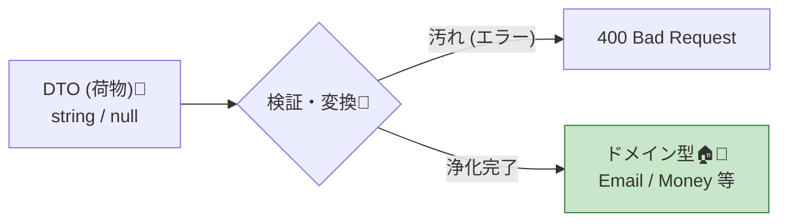
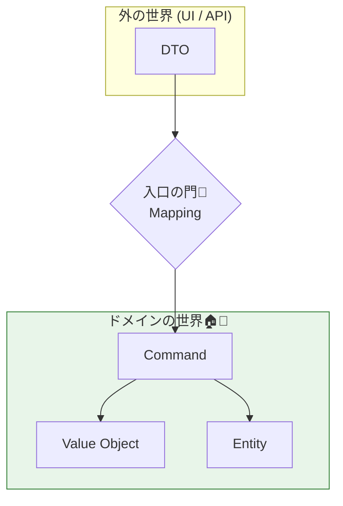

# 第21章 DTO→ドメイン：入口で汚れを落としてから渡す🧳➡️🏠✨

## 21.0 この章でできるようになること🎯💡

* UI / API から来る入力（DTO）をそのまま信用せずに、まず入口で整える🧼⚠️
* 「検証 → 変換 → きれいな型だけでドメインを動かす」の流れを、手癖にする💪🌸
* DTO とドメインモデルを分離して、DbC（契約）を守りやすい境界を作る🚪🔒

---

## 21.1 なんで入口は“汚れやすい”の？🧼😵‍💫

外から来るデータって、こういう特徴があるよ〜💦

* 文字列で何でも来る（数値っぽい文字、日付っぽい文字…）🔤🌀
* 欠ける、空っぽ、想定外の値が普通に来る🕳️🫠
* “形式はOK”でも“意味がダメ”がある（開始日 > 終了日など）📅↯
* クライアント側のバリデーションは信用できない（バイパスされる）🧨

だからこそ、**入口で契約（Pre）をちゃんと確認してから**、ドメインに渡すのが超重要なんだよね🚪✅



---

## 21.2 DTOとドメインを混ぜると起きがちな事故💥😇

* ドメイン型が “null / 空 / 変な値” を抱えて壊れやすくなる🧱💔
* いろんな場所で同じ検証が増殖（コピペ地獄）🌀🌀
* UI都合の項目（表示用の文字列等）がドメインに侵入して責務が崩れる🧟‍♀️
* 結果として「不変条件（Inv）を守る入口」が分からなくなる😵‍💫🔍

👉 解決：**DTOは境界の外側の荷物🧳、ドメインは家の中🏠**。
家に入れる前に、汚れを落として整えてから入れる🧼✨



---

## 21.3 “入口で整える”おすすめ3ステップ🪜✨


### ステップ① 形の検証（DTO検証）📦✅

* 必須か？空じゃないか？範囲は？形式は？（メール形式など）📧📏
* これは「外からの入力の形を整える」作業✨

### ステップ② 意味の検証（ドメインに必要な意味）🧠✅

* 開始日 <= 終了日、金額 > 0、などの“意味”のルール🔗
* ここは **値オブジェクト（第18〜19章）** に寄せるのが強い💎🔒

### ステップ③ 変換（DTO → きれいなドメイン型）🧳➡️💠

* DTO（stringやnullable多め）から、**不正が入りにくい型**に変換する
* 変換に失敗したら、**ドメインに入れない**（入口で止める）🚪🛑

---

## 21.4 ハンズオン：予約APIで「検証→変換→ドメイン」やってみよ〜🏨🧸✨

ここでは .NET 10（LTS）の最新パッチ 10.0.2（2026-01-13）と、C# 14 を使うよ🆕✨ ([Microsoft][1])
（Visual Studio 2026 v18.2 で .NET 10.0.2 / C# 14 が入るよ〜🪟💻） ([Microsoft][2])

---

### 21.4.1 プロジェクト作成（超ショート）🛠️✨

#### Visual Studio（GUI）で作る🪟

1. 「新しいプロジェクトの作成」
2. 「ASP.NET Core Web API」
3. ターゲット：.NET 10
4. 作成🎉

#### CLI（VS CodeでもOK）⌨️

```powershell
dotnet new webapi -n DbcDtoDomainDemo
cd DbcDtoDomainDemo
dotnet run
```

---

### 21.4.2 DTO（外から来る“荷物”）🧳📦

ポイント：DTOは **外の都合** を許す（string多め、nullableもあり得る）🙂

```csharp
using System.ComponentModel.DataAnnotations;

public sealed class CreateReservationRequestDto
{
    [Required]
    [EmailAddress]
    public string? Email { get; init; }

    [Range(1, 10)]
    public int Guests { get; init; }

    // 例：クライアントから "2026-02-01" みたいに来る想定
    [Required]
    public DateOnly? StartDate { get; init; }

    [Required]
    public DateOnly? EndDate { get; init; }

    [Range(1, 1_000_000)]
    public decimal BudgetAmount { get; init; }

    [Required]
    [StringLength(3, MinimumLength = 3)]
    public string? Currency { get; init; }
}
```

* これは「形の検証」向き（必須、範囲、形式）📦✅
* でも「StartDate <= EndDate」みたいな“意味の検証”は弱いことがあるよ〜😵‍💫

---

### 21.4.3 ドメイン側（きれいな型で守る）🏠💎

ここからは “家の中”🏠✨
**不正な状態を作りにくくする**ため、値オブジェクトで入口を固める💎🔒

まずは Result 型（最小構成）👇
（※ 例外にする派でもOKだけど、ここでは「入口で丁寧に止める」ため Result にしてるよ🙂📩）

```csharp
public sealed record Error(string Code, string Message);

public sealed class Result<T>
{
    private Result(T? value, List<Error> errors)
    {
        Value = value;
        Errors = errors;
    }

    public T? Value { get; }
    public List<Error> Errors { get; }
    public bool IsSuccess => Errors.Count == 0;

    public static Result<T> Ok(T value) => new(value, new List<Error>());
    public static Result<T> Fail(params Error[] errors) => new(default, errors.ToList());

    public Result<TOut> Map<TOut>(Func<T, TOut> f)
        => IsSuccess ? Result<TOut>.Ok(f(Value!)) : Result<TOut>.Fail(Errors.ToArray());

    public Result<T> Combine(Result<object> other)
    {
        if (other.IsSuccess) return this;
        var merged = new List<Error>(Errors);
        merged.AddRange(other.Errors);
        return new Result<T>(Value, merged);
    }
}
```

次に、値オブジェクト例👇✨

```csharp
using System.Text.RegularExpressions;

public readonly record struct Email
{
    private static readonly Regex Simple = new(@"^[^@\s]+@[^@\s]+\.[^@\s]+$", RegexOptions.Compiled);

    public string Value { get; }

    private Email(string value) => Value = value;

    public static Result<Email> TryCreate(string? raw)
    {
        if (string.IsNullOrWhiteSpace(raw))
            return Result<Email>.Fail(new Error("email.required", "メールアドレスが必要だよ📧"));

        var trimmed = raw.Trim();
        if (!Simple.IsMatch(trimmed))
            return Result<Email>.Fail(new Error("email.invalid", "メールアドレスの形が変だよ📧💦"));

        return Result<Email>.Ok(new Email(trimmed));
    }
}

public readonly record struct GuestCount
{
    public int Value { get; }
    private GuestCount(int value) => Value = value;

    public static Result<GuestCount> TryCreate(int raw)
    {
        if (raw is < 1 or > 10)
            return Result<GuestCount>.Fail(new Error("guests.range", "人数は1〜10だよ👥"));

        return Result<GuestCount>.Ok(new GuestCount(raw));
    }
}

public readonly record struct Money
{
    public decimal Amount { get; }
    public string Currency { get; }

    private Money(decimal amount, string currency)
    {
        Amount = amount;
        Currency = currency;
    }

    public static Result<Money> TryCreate(decimal amount, string? currency)
    {
        if (amount <= 0)
            return Result<Money>.Fail(new Error("money.amount", "金額は0より大きくしてね💰"));

        if (string.IsNullOrWhiteSpace(currency) || currency.Trim().Length != 3)
            return Result<Money>.Fail(new Error("money.currency", "通貨コードは3文字だよ💱"));

        return Result<Money>.Ok(new Money(amount, currency.Trim().ToUpperInvariant()));
    }
}

public readonly record struct DateRange
{
    public DateOnly Start { get; }
    public DateOnly End { get; }

    private DateRange(DateOnly start, DateOnly end)
    {
        Start = start;
        End = end;
    }

    public static Result<DateRange> TryCreate(DateOnly? start, DateOnly? end)
    {
        if (start is null)
            return Result<DateRange>.Fail(new Error("date.start.required", "開始日が必要だよ📅"));

        if (end is null)
            return Result<DateRange>.Fail(new Error("date.end.required", "終了日が必要だよ📅"));

        if (start.Value > end.Value)
            return Result<DateRange>.Fail(new Error("date.order", "開始日が終了日より後になってるよ📅💥"));

        return Result<DateRange>.Ok(new DateRange(start.Value, end.Value));
    }
}
```

✅ ここがDbCっぽい核心だよ〜！

* 値オブジェクトが **“作れた＝契約を満たした”** になる💎🤝
* ドメイン内部は「作れてるなら正しい」と信頼しやすい🧘‍♀️✨

---

### 21.4.4 DTO → ドメインへの変換（入口で“洗う”）🧼➡️🏠

DTOをそのまま渡さず、**変換メソッド**でドメイン用の型にするよ✨

```csharp
public sealed record CreateReservationCommand(
    Email Email,
    GuestCount Guests,
    DateRange Stay,
    Money Budget
);

public static class ReservationMapping
{
    public static Result<CreateReservationCommand> ToCommand(CreateReservationRequestDto dto)
    {
        var emailR = Email.TryCreate(dto.Email);
        var guestsR = GuestCount.TryCreate(dto.Guests);
        var stayR = DateRange.TryCreate(dto.StartDate, dto.EndDate);
        var moneyR = Money.TryCreate(dto.BudgetAmount, dto.Currency);

        // まとめてエラーを返したいので “全部作ってから” 集める🎁
        var errors = new List<Error>();
        if (!emailR.IsSuccess) errors.AddRange(emailR.Errors);
        if (!guestsR.IsSuccess) errors.AddRange(guestsR.Errors);
        if (!stayR.IsSuccess) errors.AddRange(stayR.Errors);
        if (!moneyR.IsSuccess) errors.AddRange(moneyR.Errors);

        if (errors.Count > 0)
            return Result<CreateReservationCommand>.Fail(errors.ToArray());

        return Result<CreateReservationCommand>.Ok(new CreateReservationCommand(
            emailR.Value!.Value,   // Email (record struct)
            guestsR.Value!.Value,  // GuestCount
            stayR.Value!.Value,    // DateRange
            moneyR.Value!.Value    // Money
        ));
    }
}
```

🎀 ここでの気持ちよさ：

* DTOは “外側の荷物” のまま🧳
* ドメインに入るのは “きれいな型” だけ🏠💎

---

### 21.4.5 エンドポイント側（入口で止める🚪🛑）

ASP.NET Core 側で DTO を受け取って、**ToCommand で変換できたらドメインへ**、無理なら 400 で返す🙂📩

#### Minimal API版（短くて見やすい）✨

```csharp
using Microsoft.AspNetCore.Mvc;

var builder = WebApplication.CreateBuilder(args);
builder.Services.AddEndpointsApiExplorer();
builder.Services.AddSwaggerGen();

var app = builder.Build();
app.UseSwagger();
app.UseSwaggerUI();

app.MapPost("/reservations", ([FromBody] CreateReservationRequestDto dto) =>
{
    var cmdR = ReservationMapping.ToCommand(dto);

    if (!cmdR.IsSuccess)
    {
        // ここでは簡易的に返す（第22章で“変換の作法”を強化するよ）🧩✨
        return Results.BadRequest(new
        {
            title = "入力が正しくないよ😢",
            errors = cmdR.Errors.Select(e => new { e.Code, e.Message })
        });
    }

    var cmd = cmdR.Value!;
    // ✅ ここから先は “きれいな型” しか来ないので安心🌸
    // domainService.CreateReservation(cmd) ... みたいに呼ぶ想定🏠✨

    return Results.Ok(new { message = "予約できたよ〜🎉", cmd.Email.Value });
});

app.Run();
```

---

## 21.5 よくある設計ミス（あるある回避）🧯😵‍💫

### ❌ ミス1：ドメイン型に DataAnnotations を貼る

* ドメインが ASP.NET の都合に汚染されやすい🧟‍♀️
* どのUI/APIからも使う “純粋なルール” なのに、境界が溶ける🫠

✅ 対策：**DTOに貼る / 入口変換で守る / 値オブジェクトで守る** の3点セット💎✨

### ❌ ミス2：DTOをそのままEntityのコンストラクタに入れる

* 不変条件を壊す最短ルート🚪💥
* 「どこで守ってるの？」が迷子になる🗺️😵‍💫

✅ 対策：**ToCommand / ToDomain** を作って、必ずそこを通す🧼➡️🏠

### ❌ ミス3：検証があちこちに散る（Controller/Service/Entity…）

* “契約の入口” が増えてコピペ地獄🌀
* バグ修正時に漏れる😇

✅ 対策：**入口でまとめて検証→変換**（この章の形）🎀✅

---

## 21.6 ミニ演習（手を動かすと覚えるよ✍️🌸）

### 演習A：エラーを“全部まとめて返す”🎁📩

今の実装はまとめ返しできてるけど、次を追加してみてね👇

* Currency が “JPY / USD / EUR” 以外ならエラー💱🚫
* Guests が 7 以上なら “団体扱いフラグ” を Command に追加して true にする（ルールは自分で決めてOK）👥✨

### 演習B：DTOを2種類に分ける🧳🧳

* Create 用 DTO と Update 用 DTO を分ける（必須項目が違うよね？）🧠✨
* それぞれ ToCommand を用意して、ドメインは同じ型で動かす🏠💎

### 演習C：Start/End を “Period文字列” で受けてみる🔤📅

例： "2026-02-01..2026-02-03" みたいな形

* DTOでは string で受ける
* 入口で DateRange に変換する（失敗したらエラー）🧼🛑

---

## 21.7 AI活用（Copilot / Codex）で爆速にする🤖⚡️💗

“入口の変換”はパターン化しやすいから、AIがめっちゃ得意だよ〜✨
（ただし **最終判断は人間**！ ルールの意味は自分が握ろうね🤝🌸）

### プロンプト例1：DTO→値オブジェクト変換を作らせる🧼➡️💎

```text
C# 14 / .NET 10。
CreateReservationRequestDto を入力として、
Email / GuestCount / DateRange / Money の値オブジェクトに変換する ToCommand を作って。
要件:
- 変換失敗は Result でまとめて返す（エラーは Code と Message）
- DTO はドメイン層に持ち込まない
- エラーは「どの項目が」「なぜ」を短く日本語で
コードだけ出して。
```

### プロンプト例2：境界値テスト候補を出させる🧪🎯

```text
このDTOの入力項目ごとに、境界値テスト（OK/NG）を箇条書きで提案して。
Email, Guests(1..10), StartDate/EndDate(開始<=終了), BudgetAmount(>0), Currency(3文字)
それぞれ最低5個ずつ。日本語で。
```

### プロンプト例3：レビュー観点を出させる👀🧯

```text
DTO→ドメイン変換のコードレビュー観点を出して。
特に「責務の混ざり」「検証の散在」「エラーの分かりやすさ」「不変条件の漏れ」を重視して。
チェックリスト形式で。
```

---

## 21.8 まとめ（この章の合言葉）🧳➡️🏠✨

* DTOは荷物、ドメインは家🏠
* **家に入る前に洗う（検証→変換）**🧼✅
* ドメインには **きれいな型だけ** を入れる💎🔒
* 入口が整うと、DbC（契約）が守りやすくなって、設計が一気に安定するよ〜🌸🎉

[1]: https://dotnet.microsoft.com/en-us/platform/support/policy/dotnet-core ".NET and .NET Core official support policy | .NET"
[2]: https://dotnet.microsoft.com/en-US/download/dotnet/10.0 "Download .NET 10.0 (Linux, macOS, and Windows) | .NET"
