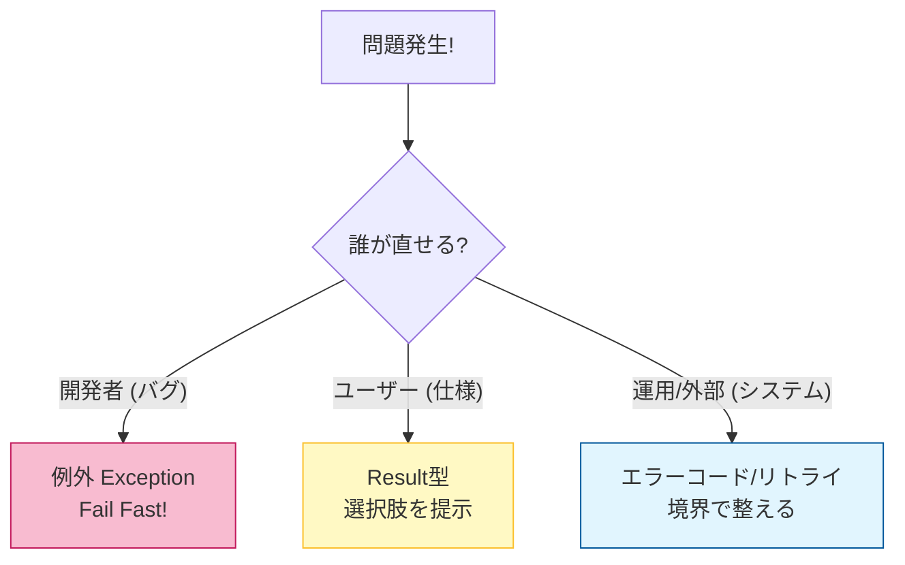
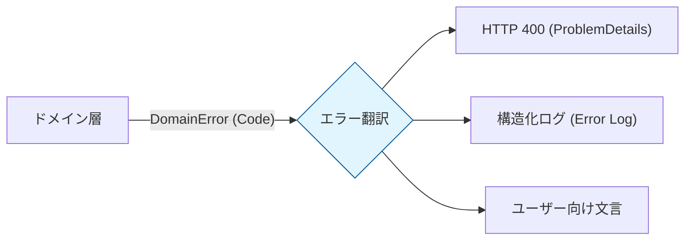

# 第22章 エラーモデリング超入門：分類して境界で変換する🧩🧠

## この章でできるようになること🎯✨

* エラーを「種類」で分けて、迷わず扱えるようになる🧠🧩
* 「例外にする？Resultで返す？」を筋のいい基準で決められる⚖️🎭
* 境界（API/画面/外部I/F）で、エラーをちゃんと“翻訳”できるようになる🌍🔁
* ASP.NET Coreの Problem Details（標準エラーレスポンス）にきれいに変換できる📦🧾

---

## 1. エラーモデリングってなに？🤔💡

エラーモデリングは、「失敗のパターン」を先に整理して、**実装と返し方（見せ方）を揃える**ことだよ〜🧩✨

たとえば同じ“失敗”でも…

* 入力ミス（メール形式が変）📧💦 → ユーザーが直せる
* 在庫切れ（注文できない）📦😢 → 仕様として起こりうる
* DB接続タイムアウト（外部要因）⏳🌩️ → 再試行したら直るかも
* nullが来た（呼び方が間違い）🧨 → 開発者が直すバグ

これを**ごちゃ混ぜ**にすると、呼び出し側が「どう対処すればいいの…😵」ってなるのが事故のはじまり💥

---

## 2. まずは“分類”がすべて🗂️🏷️

### 2.1 いちばん強い分類：誰が直せる？👤🔧

* **契約違反（バグ）**🧨👩‍💻
  呼び出し方・使い方が間違い。直すのは開発者。
  → 基本は **例外（fail fast）** が合う💥
* **業務エラー（仕様）**📩🙂
  入力ミス / 在庫切れ / 権限なし など「起きる前提」。
  → 基本は **Result（失敗を値で返す）** が合う🎁
* **システムエラー（運用・外部要因）**🌩️🖥️
  DB/ネットワーク/外部APIなど。
  → 例外でもResultでもOKだけど、**境界で必ず整理して返す**のが大事🔁✨



---

### 2.2 もう1つの軸：再試行できる？🔁⏳

同じ失敗でも「対処」が変わるから、ラベルを付けておくと超ラク🏷️✨

| 種類       | 例             | 再試行 | 典型アクション |
| -------- | ------------- | --: | ------- |
| 入力・検証エラー | 文字数オーバー、形式違反  |   ❌ | 入力を直す✍️ |
| 業務ルール違反  | 在庫切れ、上限超え     | ❌/△ | 別案を提示🔄 |
| 一時的障害    | タイムアウト、503    |   ✅ | リトライ🔁  |
| バグ（契約違反） | null渡し、状態遷移ミス |   ❌ | 直す🛠️   |

---

## 3. C#での表現：例外 vs Result 🎭⚖️

### 3.1 例外に向いてるもの💥

* **契約違反（バグ）**：引数がnullなのにダメな設計、範囲外、内部不変条件が崩れた…など🧨
* **その場で回復不能**：続行したらデータ破壊の可能性がある時🧯

✅ 例外にするなら「型」と「メッセージ」を丁寧にすると、デバッグが速いよ〜🏃‍♀️💨

---

### 3.2 Resultに向いてるもの🎁

* **業務エラー（仕様）**：起こることが前提で、呼び出し側が分岐して対処できるもの🙂📩
* 「NotFound」「Conflict」「Validation」みたいな “よくある失敗カテゴリ”🧩

Resultにすると、呼び出し側がこう書けるのが強い👇✨
「成功なら進む、失敗ならエラー内容を見て返す」

---

## 4. 最小構成のエラーモデル（まずはこれでOK）🧱✨

ここからは「ドメイン（中身）」が返すエラーを **DomainError** として揃えるよ🧩

### 4.1 DomainErrorの型を作る🏗️

```csharp
namespace Sample.Errors;

public abstract record DomainError(string Code, string Message)
{
    public virtual bool IsRetryable => false;
}

public sealed record ValidationError(string Code, string Message, string? Target = null)
    : DomainError(Code, Message);

public sealed record NotFoundError(string Code, string Message)
    : DomainError(Code, Message);

public sealed record ConflictError(string Code, string Message)
    : DomainError(Code, Message);

public sealed record ForbiddenError(string Code, string Message)
    : DomainError(Code, Message);

public sealed record ExternalDependencyError(string Code, string Message, bool Retryable)
    : DomainError(Code, Message)
{
    public override bool IsRetryable => Retryable;
}
```

ポイント💡

* **Code**：機械的に扱える（ログ集計・UI分岐に便利）🏷️
* **Message**：人が読む用（ただし内部情報は出しすぎない）🙈

---

### 4.2 Result型（成功/失敗の箱）📦✨

```csharp
namespace Sample.Results;

using Sample.Errors;

public readonly record struct Result<T>(T? Value, DomainError? Error)
{
    public bool IsSuccess => Error is null;

    public static Result<T> Ok(T value) => new(value, null);
    public static Result<T> Fail(DomainError error) => new(default, error);

    public TResult Match<TResult>(Func<T, TResult> onOk, Func<DomainError, TResult> onFail)
        => IsSuccess ? onOk(Value!) : onFail(Error!);
}
```

---

## 5. “境界で変換”がこの章の主役🚪🔁🌈


### 5.1 境界ってどこ？🚪

* Web APIの入口（Controller / Minimal API）🌐
* UI（画面・フォーム）🖥️
* 外部API呼び出しの入口/出口🔌

境界の役目はこれ👇✨
**中（ドメイン）の表現を、外（HTTP/画面/他システム）の表現に翻訳する**🗣️➡️🌍
この分離が、あとから増える仕様にも強いよ💪🌸


---

## 6. Web APIなら「Problem Details」で返すのが標準🧾📦

### 6.1 Problem Detailsって？🧾

HTTP APIのエラーを「決まった形」で返すための標準形式だよ✨
最近は RFC 9457 が正式な仕様で、RFC 7807 を置き換えてるよ📘🔁 ([RFC エディタ][1])

ASP.NET Core では `AddProblemDetails` を有効にすると、Problem Details を生成する仕組み（Problem details service）が使えるよ🛠️✨ ([Microsoft Learn][2])

---

### 6.2 まずはアプリ全体でProblem Detailsを有効化✅

最小限の例（Web API）👇

```csharp
using Microsoft.AspNetCore.Http;
using Microsoft.AspNetCore.Mvc;

var builder = WebApplication.CreateBuilder(args);

builder.Services.AddControllers();

// Problem Details を有効化✨
builder.Services.AddProblemDetails(options =>
{
    // 全Problem Detailsに共通でメタ情報を追加（トレースにも便利）🧵✨
    options.CustomizeProblemDetails = ctx =>
    {
        ctx.ProblemDetails.Extensions["traceId"] = ctx.HttpContext.TraceIdentifier;
        ctx.ProblemDetails.Extensions["timestamp"] = DateTimeOffset.UtcNow;
    };
});

var app = builder.Build();

app.UseExceptionHandler();  // 例外をまとめて扱う🧯
app.UseStatusCodePages();   // 404なども統一した形にしやすい📄

app.MapControllers();

app.Run();
```

`CustomizeProblemDetails` は公式に用意されているカスタマイズ口だよ🧁✨ ([Microsoft Learn][3])
また、`AddProblemDetails` を呼ぶと、状況に応じてミドルウェアが Problem Details を生成してくれるよ（例外・ステータスコードなど）🧩 ([Microsoft Learn][2])

---

## 7. DomainError → HTTP（Problem Details）への変換テーブル🗺️🔁

「どのエラーを何HTTPにする？」を先に決めよう✨

| DomainError                              | HTTP Status | だいたいの意味        |
| ---------------------------------------- | ----------: | -------------- |
| ValidationError                          |         400 | 入力が不正✍️        |
| NotFoundError                            |         404 | 対象がない🔍        |
| ConflictError                            |         409 | 競合（重複・状態不一致）⚔️ |
| ForbiddenError                           |         403 | 権限なし🔒         |
| ExternalDependencyError(Retryable=true)  |         503 | 一時障害（再試行してね）⏳  |
| ExternalDependencyError(Retryable=false) |     502/500 | 外部依存の失敗🌩️     |

※ここは“チームの方針”でOK！大事なのは **一貫性** だよ🎀✨

---

## 8. 実装：Resultを返すアプリ層 → 境界でHTTPに変換🧩➡️🌐

### 8.1 例：注文作成（ドメイン/アプリ層）🛒✨

```csharp
using Sample.Errors;
using Sample.Results;

public sealed class OrderAppService
{
    public Result<Guid> CreateOrder(string customerId, int quantity)
    {
        // 契約違反（バグ）なら例外で即止める🧨
        if (string.IsNullOrWhiteSpace(customerId))
            throw new ArgumentException("customerId is required.", nameof(customerId));

        if (quantity <= 0)
            return Result<Guid>.Fail(new ValidationError(
                Code: "quantity.invalid",
                Message: "数量は1以上にしてね🙂",
                Target: "quantity"));

        // 業務エラー（仕様）📩
        if (quantity > 10)
            return Result<Guid>.Fail(new ConflictError(
                Code: "order.limit_exceeded",
                Message: "一度に注文できるのは10個までだよ🍀"));

        // 成功🎉
        return Result<Guid>.Ok(Guid.NewGuid());
    }
}
```

---

### 8.2 Minimal API側：DomainErrorをProblem Detailsに変換🧾🔁

```csharp
using Microsoft.AspNetCore.Mvc;
using Sample.Errors;
using Sample.Results;

var builder = WebApplication.CreateBuilder(args);

builder.Services.AddProblemDetails();
builder.Services.AddSingleton<OrderAppService>();

var app = builder.Build();

app.UseExceptionHandler();
app.UseStatusCodePages();

app.MapPost("/orders", (CreateOrderRequest req, HttpContext http, OrderAppService service) =>
{
    var result = service.CreateOrder(req.CustomerId, req.Quantity);

    return result.Match(
        onOk: id => Results.Created($"/orders/{id}", new { id }),
        onFail: err => err.ToProblemDetailsResult(http)
    );
});

app.Run();

public sealed record CreateOrderRequest(string CustomerId, int Quantity);

static class ErrorMapping
{
    public static IResult ToProblemDetailsResult(this DomainError err, HttpContext http)
    {
        var (status, type, title) = err switch
        {
            ValidationError => (StatusCodes.Status400BadRequest,
                "https://example.com/problems/validation",
                "入力が正しくないよ✍️"),

            NotFoundError => (StatusCodes.Status404NotFound,
                "https://example.com/problems/not-found",
                "見つからなかったよ🔍"),

            ConflictError => (StatusCodes.Status409Conflict,
                "https://example.com/problems/conflict",
                "状態が合わないよ⚔️"),

            ForbiddenError => (StatusCodes.Status403Forbidden,
                "https://example.com/problems/forbidden",
                "権限がないよ🔒"),

            ExternalDependencyError ede when ede.IsRetryable => (StatusCodes.Status503ServiceUnavailable,
                "https://example.com/problems/temporary-unavailable",
                "今ちょっと混んでるみたい⏳"),

            _ => (StatusCodes.Status500InternalServerError,
                "https://example.com/problems/unexpected",
                "予期しないエラーが起きたよ😢")
        };

        var pd = new ProblemDetails
        {
            Status = status,
            Type = type,
            Title = title,
            Detail = err.Message,
            Instance = http.Request.Path
        };

        // 追加情報（クライアントが分岐に使える）🏷️✨
        pd.Extensions["code"] = err.Code;
        pd.Extensions["retryable"] = err.IsRetryable;

        if (err is ValidationError ve && ve.Target is not null)
            pd.Extensions["target"] = ve.Target;

        return Results.Problem(pd);
    }
}
```

ここでやってることはシンプル👇✨

* ドメインは DomainError（意味）を返す🧩
* APIは HTTP（表現）に翻訳する🌐🔁
  この分離が、あとから増える仕様にも強いよ💪🌸

---

## 9. 例外（契約違反）も“境界で”ちゃんとProblem Detailsにする🧯🧾

* ドメイン内部で起きた **契約違反（バグ）例外** は、基本 500 にする
* **入力ミスや業務エラーとして返したい例外** は、境界で握りつぶさず「分類→変換」する

ASP.NET Core には Problem Details を作る仕組みがあり、`AddProblemDetails` で既定のサービスが登録されるよ🛠️✨ ([Microsoft Learn][2])
（なので、例外を丸ごとHTMLで返す…みたいな事故が減るよ〜🧯）

---

## 10. ありがちな失敗と直し方😵‍💫➡️😊

### 失敗①：全部 Exception で返しちゃう💥

* 呼び出し側が「try-catch だらけ」になって読みづらい🌀
  ✅ 起きる前提のもの（業務エラー）は Result に寄せよう🎁✨

### 失敗②：全部 Result にして“バグ”まで握りつぶす🙈

* 重大バグが静かに埋もれて発見が遅れる🐞🕳️
  ✅ 契約違反（バグ）は例外で fail fast🧨

### 失敗③：内部情報（SQL/スタックトレース）を外に出す😱

* セキュリティ・運用の事故につながるよ🚨
  ✅ 外に出すのは「利用者が理解できる情報」だけにする🙊✨

---

## 11. ミニ演習（手を動かそう）✍️🧪✨

### 演習A：エラー分類ゲーム🃏🧠

次の失敗を「契約違反 / 業務エラー / システムエラー」に分けてみてね🏷️✨

1. quantity = -1 を渡した
2. 在庫が0だった
3. 外部決済APIがタイムアウトした
4. customerId が空文字だった
5. 注文IDが存在しなかった

**答えの目安**✅

1. 業務 or 契約（設計次第だけど、API入力なら業務寄りが多い）
2. 業務
3. システム（再試行可にすること多い）
4. 契約（中のAPI）/業務（外の入力）
5. 業務（NotFound）

> ポイント：同じ事象でも「どの境界の話か」で分類が変わるよ🚪✨

---

### 演習B：DomainErrorを3つ増やす➕🧩

* UnauthorizedError（401相当）🔑
* RateLimitError（429相当）🚦
* TimeoutError（再試行可）⏳

そして `ToProblemDetailsResult` の switch に追加してみよう🎀✨

---

### 演習C：テストで“変換表”を守る🧪🛡️

「ValidationError は必ず 400」みたいなルールは、テストで固定すると安心😊🌸

```csharp
using Microsoft.AspNetCore.Http;
using Sample.Errors;
using Xunit;

public class ErrorMappingTests
{
    [Fact]
    public void ValidationError_Should_Map_To_400()
    {
        var http = new DefaultHttpContext();
        http.Request.Path = "/orders";

        var err = new ValidationError("quantity.invalid", "数量が不正", "quantity");
        var result = err.IsRetryable;

        Assert.False(result); // retryable は false のまま
        // ※ IResult の中身検証は統合テスト寄りになるので、
        //    まずは「switchの変換関数」を分離してテストするのがコツだよ🧁
    }
}
```

---

## 12. Copilot / Codex で爆速にするコツ🤖⚡️✨

### 使える指示例（そのまま貼ってOK）📋

* 「DomainError を “Validation/NotFound/Conflict/Forbidden/ExternalDependency” に分けて record で作って。Code と Message と IsRetryable を持たせて」🤖🧩
* 「DomainError → (status,type,title) を返す switch 式を書いて。HTTPは 400/404/409/403/503/500 を使って」🌐🔁
* 「上の変換表を壊さない xUnit テストを書いて。パラメータ化テストも提案して」🧪✨
* 「ProblemDetails の extensions に code / retryable / target を入れる方針で実装して」🧾🏷️

✅ AIに書かせた後はここだけ人が見る！👀✨

* 例外にすべき“バグ”まで Result にしてない？🧨
* 外に出していい情報だけになってる？🙊
* エラーコード（Code）がブレてない？🏷️

---

## 13. 仕上げチェックリスト✅🎀

* [ ] 契約違反（バグ）と業務エラー（仕様）が混ざってない？🧩🚫
* [ ] 再試行可/不可のラベルが付いてる？🔁🏷️
* [ ] 境界（API）で Problem Details に変換してる？🚪🧾
* [ ] HTTPステータスが一貫してる？🌐📏
* [ ] 内部情報を返してない？（セキュリティOK？）🔒🙈

---

## 参考（標準・公式ドキュメント）📚✨

* Problem Details の最新仕様は RFC 9457（RFC 7807 を置き換え）📘 ([RFC エディタ][1])
* ASP.NET Core のエラー処理と Problem Details（`AddProblemDetails` / `IProblemDetailsService` / ミドルウェア）🛠️ ([Microsoft Learn][4])
* `CustomizeProblemDetails` の公式説明（ProblemDetailsOptions）🧁 ([Microsoft Learn][3])
* .NET 10 / C# 14 の「最新世代」情報（2025-11-11に .NET 10 LTS リリース）🆕 ([dotnet.microsoft.com][5])

[1]: https://www.rfc-editor.org/rfc/rfc9457.html?utm_source=chatgpt.com "RFC 9457: Problem Details for HTTP APIs"
[2]: https://learn.microsoft.com/en-us/aspnet/core/fundamentals/error-handling-api?view=aspnetcore-10.0 "Handle errors in ASP.NET Core APIs | Microsoft Learn"
[3]: https://learn.microsoft.com/en-us/aspnet/core/fundamentals/error-handling-api?view=aspnetcore-10.0&utm_source=chatgpt.com "Handle errors in ASP.NET Core APIs"
[4]: https://learn.microsoft.com/ja-jp/aspnet/core/fundamentals/error-handling-api?view=aspnetcore-10.0 "ASP.NET Core API のエラーを処理する | Microsoft Learn"
[5]: https://dotnet.microsoft.com/en-us/platform/support/policy/dotnet-core?utm_source=chatgpt.com ".NET and .NET Core official support policy | .NET"
