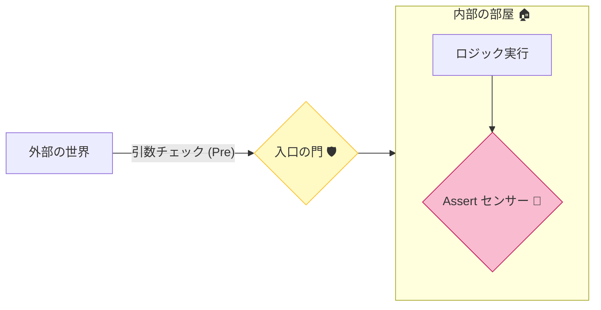
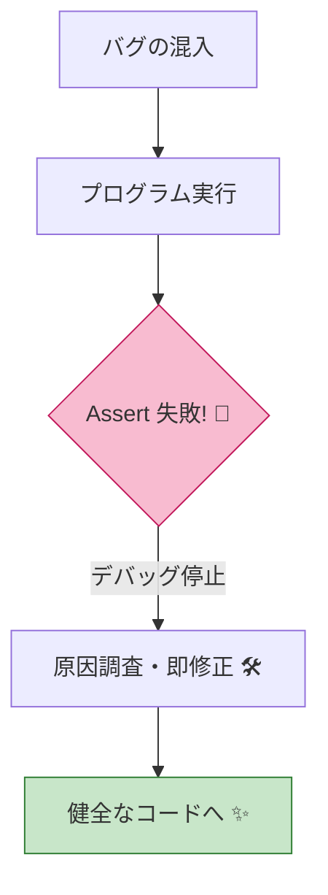

# 第23章 開発時の検知：Assert/Debugチェックの使いどころ🐞🔔

## 23.1 Assertってなに？DbC（契約）とどう違うの？🤝🧠


**Assert（アサーション）**は、「ここまで来たなら**絶対こうなってるはず**」という**内部前提**を壊れた瞬間に見つけるための“警報ベル”だよ🔔💥
つまり、Assertが鳴るときは基本的に **バグ（開発者のミス）** だと思ってOK🙆‍♀️✨

一方でDbCの **Pre/Post/Inv** は、設計としての「約束」を**境界（public API）で守る**ためのもの🚪🛡️
なので、ざっくりこう分けると迷子にならないよ🗺️💕

* **DbC（Pre/Post/Inv）**：境界で契約を守る（呼ぶ側・呼ばれる側の約束）🤝✅
* **Assert**：内部前提が壊れたら“即発見”する（主に開発中）🐞🔍



---

## 23.2 まず結論：Assertを置く“正しい場所”ベスト5🏆✨

Assertは「外から入ってくる入力のチェック」じゃなくて、**内部が壊れてないか**を見る用途が強いよ🧠🔧

### ✅ (1) 不変条件（Inv）が“内部操作のあと”に保たれてるか🧱💎

例：集約（Order）の更新後に「合計金額 = 明細合計」になってるか…みたいなやつ🛒🧾

### ✅ (2) 「この分岐、絶対ここ通らないよね？」の確認（到達不能）🚫🧯

switchのdefaultなどで「来たらバグ」っていう場所に置くと強い🔥

### ✅ (3) キャッシュ/派生値の整合性（同期ミス検知）🧮🔄

例：`_total` を更新してるのに明細計算とズレる…みたいな事故を即発見⚡️

### ✅ (4) “内部専用メソッド”の前提（private/protected 内）🧩🔒

public境界で守った前提を、内部では「信じて簡潔に」しつつ、念のためAssertで監視👀✨

### ✅ (5) テストやデバッグ中にだけ見たい“薄い監視”🧪🕵️‍♀️

重くないチェックなら、開発効率が上がるよ🚀💕

---

## 23.3 逆にNG：Assertを置かないほうがいい場所🙅‍♀️💦

### ❌ (1) public境界（外部入力の検証）🚪

`public`メソッドの引数チェックは **Pre（ガード節）** 側の仕事🛡️
Assertにしちゃうと、リリースでは消えてしまうケースがあるから危険⚠️（後で詳しく）

### ❌ (2) ユーザーの入力ミス・業務上あり得るエラー🙂📩

それは **仕様エラー**（第4章・第22章）なので、例外 or Result で丁寧に返すほうが◎🎀

### ❌ (3) “発生しても回復したい”パス🌈

Assertは「バグを見つける」寄りなので、回復したいなら設計で分岐/Resultに寄せよ🧠✨

---

## 23.4 Debug.Assert と Trace.Assert：超重要な違い🧨✅

C#/.NET では代表的にこの2つがあるよ👇

### 🐞 Debug.Assert（開発中の警報ベル）

* **既定では Debug ビルドでのみ動く**（Releaseでは基本的に入らない） ([Microsoft Learn][1])
* つまり「開発中にバグを早期発見したい」用途にぴったり🧪🔔

### 🛰️ Trace.Assert（Releaseでも残したい場合の選択肢）

* **Releaseビルドでもアサートしたいなら Trace.Assert** が案内されてる ([Microsoft Learn][2])
* ただし、そのままだと“ダイアログが出る/止まる”など運用で困ることもあるので、使うなら出力先（Listener）を整えるのが大事🛠️🧯

### 🧠 なんで挙動が変わるの？

Visual Studioの既定設定ではだいたいこう👇

* `TRACE` は **Debug/Release 両方で定義**
* `DEBUG` は **Debugのみで定義** ([Microsoft Learn][3])

だから、`Debug.*` はDebug寄り、`Trace.*` はReleaseにも残りやすい、って覚えるとスッキリ🌸✨

---

## 23.5 すぐ使える！基本パターン3つ🧁✨

### パターンA：内部不変条件を Debug.Assert で守る（おすすめ）🧱🔔

「Order の合計 `_total` は、明細の合計と必ず一致する」みたいなやつ💡

```csharp
using System.Diagnostics;

public sealed class Order
{
    private readonly List<OrderLine> _lines = new();
    private decimal _total;

    public decimal Total => _total;

    public void AddLine(string productId, int quantity, decimal unitPrice)
    {
        // public境界：ここは契約（Pre）としてガード節で守る
        if (string.IsNullOrWhiteSpace(productId)) throw new ArgumentException("商品IDは必須です", nameof(productId));
        if (quantity <= 0) throw new ArgumentOutOfRangeException(nameof(quantity));
        if (unitPrice < 0m) throw new ArgumentOutOfRangeException(nameof(unitPrice));

        var line = new OrderLine(productId, quantity, unitPrice);
        _lines.Add(line);
        _total += line.Subtotal;

        // 内部前提：ここが壊れたら“バグ”なのでAssertで即発見！
        Debug.Assert(_total >= 0m, $"Totalがマイナスはおかしいよ！ total={_total}");
        Debug.Assert(_total == _lines.Sum(x => x.Subtotal),
            $"合計がズレてる！ total={_total}, sum={_lines.Sum(x => x.Subtotal)}");
    }
}

public sealed record OrderLine(string ProductId, int Quantity, decimal UnitPrice)
{
    public decimal Subtotal => Quantity * UnitPrice;
}
```

ポイント💖

* **public境界はガード節（Pre）**
* **内部整合性は Assert**
  この分業が一番キレイ✨✨

---

### パターンB：Assertを“まとめて”読みやすくする（Invariant専用メソッド）🎀📐

「更新メソッドが増えてくると Assert が散らかる…😭」ってなるから、**Invariantチェックを1箇所に寄せる**と楽だよ🧹✨

```csharp
using System.Diagnostics;

public sealed class Order
{
    private readonly List<OrderLine> _lines = new();
    private decimal _total;

    public decimal Total => _total;

    public void AddLine(OrderLine line)
    {
        _lines.Add(line);
        _total += line.Subtotal;
        AssertInvariants();
    }

    public void RemoveLineAt(int index)
    {
        var removed = _lines[index];
        _lines.RemoveAt(index);
        _total -= removed.Subtotal;
        AssertInvariants();
    }

    [Conditional("DEBUG")]
    private void AssertInvariants()
    {
        Debug.Assert(_total >= 0m);
        Debug.Assert(_total == _lines.Sum(x => x.Subtotal));
    }
}

public sealed record OrderLine(string ProductId, int Quantity, decimal UnitPrice)
{
    public decimal Subtotal => Quantity * UnitPrice;
}
```

`[Conditional("DEBUG")]` にしておくと、Releaseでは呼び出し自体が消えるからスッキリ🌿
（Debug.AssertがDebugビルド中心なのも、この“消える設計”に寄せてある感じだね） ([Microsoft Learn][1])

---

### パターンC：「ここ来たらバグ！」を Debug.Fail で示す🚫🔥

```csharp
using System.Diagnostics;

public static string ToLabel(int status)
{
    return status switch
    {
        0 => "New",
        1 => "Paid",
        2 => "Shipped",
        _ => FailUnexpectedStatus(status)
    };
}

private static string FailUnexpectedStatus(int status)
{
    Debug.Fail($"想定外のstatusだよ！ status={status}");
    // Debugでは止まってほしいけど、式としては返す必要があるので一応：
    return "Unknown";
}
```

「ここは来ない」が読みやすくなるし、バグの匂いが強い場所に超効くよ🐞💥



---

## 23.6 Visual Studioでの“鳴り方”と確認ポイント🔍🪟

### ✅ Assertが失敗したらどうなる？

よくある挙動はこんな感じ👇

* デバッグ実行中に **アサートダイアログが出る**（止まる）🛑
* **出力ウィンドウ**に情報が出る🧾✨

### ✅ 出力ウィンドウを見る

Visual Studio：

* **[デバッグ] → [ウィンドウ] → [出力]** を開く📤👀
* 「デバッグ」出力を見ればOK✨

---

## 23.7 ReleaseでAssertを“使うなら”こうする（Trace + Listener）🛰️🛠️

`Trace.Assert` は Release でも使える方向で案内されてるよ ([Microsoft Learn][2])
ただし、運用で困らないように **UIを出さずログに流す** みたいな設計に寄せるのが安心🧯✨

### ✅ UIを出さない（AssertUiEnabled）

`DefaultTraceListener.AssertUiEnabled` を `false` にできるよ ([Microsoft Learn][4])

```csharp
using System.Diagnostics;

public static class TraceSetup
{
    public static void ConfigureTrace()
    {
        Trace.Listeners.Clear();

        var listener = new DefaultTraceListener
        {
            AssertUiEnabled = false
        };

        Trace.Listeners.Add(listener);
        Trace.AutoFlush = true;
    }
}
```

> 「Releaseでも“何か変”を検知したいけど、ユーザーにダイアログは出したくない😱」
> ってときの基本ムーブだよ🧁✨

---

## 23.8 AIに手伝ってもらう（Copilot/Codex向け）🤖💞

### 🪄 使えるプロンプト例（そのまま貼ってOK）

* 「このクラスの不変条件（Invariant）候補を3〜5個出して、`Debug.Assert` でチェックする場所も提案して」🧱🔍
* 「public境界のガード節（Pre）と、内部のAssert（Invariant）を分離してリファクタして」✂️✨
* 「switchの到達不能分岐を `Debug.Fail` で安全に表現して」🚫🔥
* 「Assertメッセージを“未来の自分が読んで直せる文章”にして」💌😊

AIが出してきたAssertは、**(1) public境界に置いてない？**、**(2) 業務エラーをAssertにしてない？** を最優先でチェックしてね👀🧯

---

## 23.9 ミニ演習（15〜30分）🧪🌸

### 演習1：Orderの不変条件を1つ追加🛒🧱

上の `Order` に、次のどれかを追加して Assert してみてね👇

* 明細件数が0なら `_total == 0`
* quantityは内部に入ってきたら必ず `> 0`（privateメソッド前提）

### 演習2：「ここ来ないはず」を Failにする🚫

`enum` の状態を switch して、defaultで `Debug.Fail` を入れてみよう🔥

### 演習3：Releaseでも検知したい“監視”を Trace に寄せる🛰️

`Trace.Assert` を1箇所だけ入れて、`AssertUiEnabled=false` を設定してみてね🛠️✨
（「ユーザーに迷惑をかけない」が最重要だよ💗）

---

## 23.10 仕上げチェックリスト✅🎀

* public境界の入力チェックを Assert にしてない？🚪🙅‍♀️
* Assertが鳴ったら「仕様エラー」じゃなくて「バグ」になってる？🐞✅
* 不変条件チェックが散らかってない？（1箇所に寄せた？）🧹✨
* Releaseで残すなら Trace + Listener で“運用に優しい形”にしてる？🛰️🧯
* `TRACE/DEBUG` の意味が混ざってない？🧠🧩 ([Microsoft Learn][3])

---

### おまけ：今どきの.NETの“現在地”メモ📌✨

* .NET 10 は **2025-11-11開始のLTS**（サポート期限も公開） ([Microsoft Learn][5])
* ダウンロードページ上では、**.NET 10.0.2（2026-01-13）** の表示があるよ ([dotnet.microsoft.com][6])

[1]: https://learn.microsoft.com/en-us/dotnet/api/system.diagnostics.debug.assert?view=net-10.0&utm_source=chatgpt.com "Debug.Assert Method (System.Diagnostics)"
[2]: https://learn.microsoft.com/en-us/dotnet/api/system.diagnostics.trace.assert?view=net-10.0&utm_source=chatgpt.com "Trace.Assert Method (System.Diagnostics)"
[3]: https://learn.microsoft.com/en-us/visualstudio/debugger/assertions-in-managed-code?view=visualstudio&utm_source=chatgpt.com "Assertions in Managed Code - Visual Studio (Windows)"
[4]: https://learn.microsoft.com/en-us/dotnet/api/system.diagnostics.defaulttracelistener.assertuienabled?view=net-9.0&utm_source=chatgpt.com "DefaultTraceListener.AssertUiEnabled Property"
[5]: https://learn.microsoft.com/ja-jp/lifecycle/products/microsoft-net-and-net-core?utm_source=chatgpt.com "Microsoft .NET および .NET Core - Microsoft Lifecycle"
[6]: https://dotnet.microsoft.com/en-US/download/dotnet/10.0?utm_source=chatgpt.com "Download .NET 10.0 (Linux, macOS, and Windows) | .NET"
