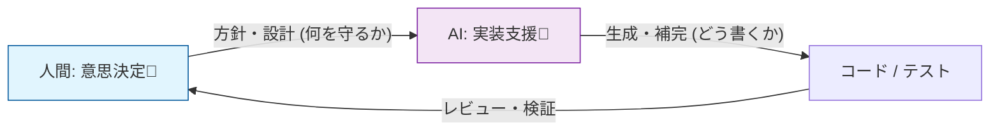
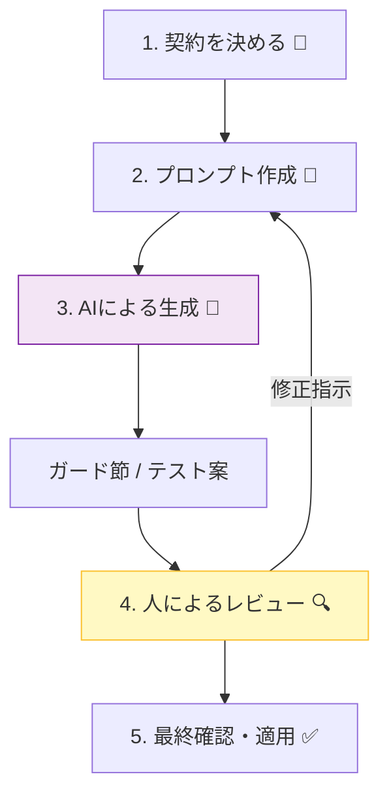

# 第24章 AI活用：契約・ガード節・テストを速く作る🤖⚡️

## 24.1 まず大事：AIは「契約の翻訳機」だよ📝➡️🛡️


DbCでいちばん最初にやることは、**「約束（契約）を言葉でハッキリさせる」**ことでしたね😊
AIはここでめちゃ強いです✨

* 契約文（日本語）を **チェックコード** に落とす🛡️
* その契約を守れてるかの **テスト案** を大量に出す🧪
* ついでに **例外メッセージ** を読みやすく整える💌

ただし逆に、AIが苦手なこともあります👇😵‍💫

* 「その契約は本当に正しいの？」（業務の正解は人間しか知らない）
* 「そのAPI境界でチェックすべき？」（責務の判断）
* 「例外？ Result？」（エラーモデリングの判断）

なのでこの章の合言葉はこれ🌸

> **契約は人が決める。AIは速く“形”にする。最後は人がレビューする。**🤝✨



---

## 24.2 Copilot と Codex の使い分け（2026年1月時点）🧰✨

### GitHub Copilot（IDE内の相棒）👩‍💻🤖

* **入力中の補完**：ガード節や定型コードをサクッと出す⚡️
* **Copilot Chat**：契約文→コード化、テスト案出し、リファクタ案など🧠💬
  Visual Studio 2022 17.10以降は、CopilotとCopilot Chatが**統合された拡張**として扱えます🧩✨ ([Visual Studio][1])

### OpenAI Codex（タスクを進めるエージェント）🧑‍🔧🤖🛠️

* 仕様の説明から **まとまった変更**（実装＋テスト＋レビュー）まで一気に進めるのが得意🚀
* タスク実行中に **ネット接続を許可できる**（必要なときだけでOK）🌐🔐 ([OpenAI][2])
* 2025〜2026にかけて、エージェント型コーディングとして強化が進んでいます（例：Windows環境での改善など）🪟⚙️ ([OpenAI][3])

---

## 24.3 最短セットアップ（Visual Studio / VS Code）⚙️✨

### Visual Studio：Copilotが入ってる？をまず確認✅

Visual Studio 2022 17.10以降だと、Copilotはインストーラーの推奨コンポーネントとして扱われます🧩 ([Visual Studio][1])

* Visual Studio Installer で **GitHub Copilot** が選択されているか確認✅ ([Microsoft Learn][4])
* 右上に **Copilotの状態アイコン** が出る（Active/Inactive/Unavailableなど）👀 ([Microsoft Learn][4])
* Chatはメニューから **View → GitHub Copilot Chat** で開けます💬 ([GitHub Docs][5])

### VS Code：初回セットアップは自動で入りやすい🧩✨

VS Codeでは、初回セットアップ時に必要拡張が自動インストールされる案内があります🧠 ([GitHub Docs][6])

---

## 24.4 AIに頼む順番：この順が事故りにくいよ🪜🛟

1. **契約文（Pre/Post/Inv）を書く**📝
2. AIに **ガード節（Pre）** を作らせる🛡️
3. AIに **テスト案（境界値・異常系）** を作らせる🧪
4. 人が **責務・例外/Result・メッセージ** を整える✍️
5. テスト実行で **本当に守れてるか確認**✅



---

## 24.5 コピペで使える「AIプロンプト」テンプレ集🧁💬

### テンプレA：契約文→ガード節（Pre）🛡️

```text
あなたはC#のコードレビュー担当です。
次の「契約(Preconditions)」を満たすように、publicメソッドの入口にガード節を追加してください。

- 例外は ArgumentException / ArgumentOutOfRangeException / InvalidOperationException のどれが自然かも選んでください
- 例外メッセージは「何がダメか」が一目で分かる日本語で
- ガード節以外のロジックは変えない
- 変更後コードを提示して、最後にチェック項目（抜けがないか）も箇条書きで

契約:
- userId は null/空/空白禁止
- page は 1以上
- pageSize は 1〜200
コード:
(ここに対象メソッドを貼る)
```

### テンプレB：契約→テスト候補（境界値＋異常系）🧪🎯

```text
次の契約(Pre/Post)を満たすテストケースを、境界値中心で列挙してください。
テストフレームワークは xUnit を想定し、Theory/InlineData で書ける形にしてください。
「正常系」「異常系（例外が出る）」「境界値」を分けてください。

契約:
- page は 1以上
- pageSize は 1〜200
- 戻り値は null ではない
- 戻り値の Items は重複なし
```

### テンプレC：AIの“やりすぎ抽象化”を止める呪文🧯😆

```text
今の提案は抽象化しすぎています。
次を守って、最小限の変更にしてください:
- 新しい層/新しいフレームワーク導入は禁止
- 既存の命名規則を維持
- public境界のガード節とテスト追加に集中
- 追加するヘルパーは1つまで（必要なら）
```

---

## 24.6 ガード節をAIに作らせる：良い“型”を先に渡す🎀🛡️

AIは「チームの書き方」を渡すと、出力が安定します😊
たとえばガード節の“型”をこれに固定👇

* 入口で弾く（早期returnじゃなくて例外/Result）🚪
* 例外タイプは意味で選ぶ🧠
* `paramName` は必ず入れる（将来の自分が助かる）💡

例（入口ガード節の基本形）👇

```csharp
public static class Guard
{
    public static string NotNullOrWhiteSpace(string? value, string paramName)
    {
        if (string.IsNullOrWhiteSpace(value))
            throw new ArgumentException("空や空白はダメだよ🥺", paramName);

        return value;
    }

    public static int InRange(int value, int min, int max, string paramName)
    {
        if (value < min || value > max)
            throw new ArgumentOutOfRangeException(paramName, value, $"{min}〜{max}の範囲にしてね🥺");

        return value;
    }
}
```

この“型”をAIに渡して、各メソッドの契約に合わせて呼び出しを作らせると早いです⚡️

---

## 24.7 AIで「例外メッセージ」を整えるコツ💌✨

AIはメッセージ作りが得意だけど、放置するとポエムになりがち😂
なのでルールはこれ👇

* **1行で短く**（ログで読みやすい）📌
* **何がダメか**＋**どうすればいいか**🌱
* **値も入れる**（可能なら）🔢
* 仕様エラーっぽい文言にしない（契約違反は“直す対象”）🧯

AIに頼むときはこう言うと良いよ👇

```text
例外メッセージを、1行で短くして。
「何がダメ」＋「どう直す」を入れて、ポエム禁止。
必要なら実際の値も埋め込んで。
```

---

## 24.8 AIで「テスト候補」を増やす：境界値はAIが得意🧪✨

AIにお願いするときは、**境界値を具体的に指定**すると強いです🎯

* `min-1, min, min+1`
* `max-1, max, max+1`
* `null, "", "   "`
* 空配列、1件、上限、上限+1

そして、出してもらったテスト候補をそのまま使わずに👇
**「契約の意図に合ってる？」**だけ人が確認します😊

---

## 24.9 Visual Studio 2026 の“新しめ便利枠”：Copilot Chat のツール機能🧰🆕

Visual Studio 2026 のリリースノートでは、Copilot Chat から **NuGetのMCPサーバー**を有効化して、依存パッケージの脆弱性対応や更新提案を受けられる流れが説明されています🛡️📦 ([Microsoft Learn][7])

* Copilot Chat を開く💬
* ツール（Tools）メニューから `nuget` を有効化✅
* 例：`Fix my package vulnerabilities` みたいな指示で提案が出る🧯 ([Microsoft Learn][7])

DbCそのものではないけど、**安全に動く前提（依存関係）**を守るのに役立つので、覚えておくと強いです💪✨

---

## 24.10 ミニ演習：AIに「契約文→チェックコード」を提案させて、人が整える✍️🤖✨

### お題：ページング検索の入口を固めよう🔍📄

#### Step 1：契約を書く📝

* Pre:

  * `keyword` は null/空/空白禁止
  * `page` は 1以上
  * `pageSize` は 1〜200
* Post:

  * 戻り値は null ではない
  * `Items` は重複なし（同一IDが2回出ない）

#### Step 2：AIにガード節を作らせる🛡️

テンプレAを使って、対象メソッドを貼ってお願いする💬✨
（このとき、`Guard` を使う方針も一緒に渡すと安定🎀）

#### Step 3：人が“設計判断”だけ入れる⚖️

チェックするのはここ👇

* 例外かResultか？（仕様エラーならResult寄り）🎭⚖️
* チェック場所は入口で合ってる？🚪
* 例外タイプが意味に合ってる？🧠

#### Step 4：AIに境界値テストを作らせる🧪

テンプレBで候補を出させて、xUnitで実装✨
特に `page=0` と `pageSize=201` を忘れがちなので要注意👀

#### Step 5：最後に“AI出力の抜け”を点検✅🔍

* `string.IsNullOrWhiteSpace` を使ってる？（空白だけも弾けてる？）🧼
* 上限/下限の比較が `<=` / `>=` で合ってる？📏
* Postの「重複なし」は **テストで確認**できてる？🧪

  * （AIはPostを“言った気になる”ことがあるので、ここ大事😆）

---

## 24.11 章末チェックリスト（AIを安全に使うコツ）✅🌈

* 契約文は、最初に人が決めた？📝
* AIの提案は、**最小変更**になってる？✂️
* 例外/Resultの責務が混ざってない？🧩🚫
* “やりすぎ抽象化”が混入してない？🧯
* 境界値テストが `min-1/min/max/max+1` で揃ってる？📏🧪
* 重要な契約は、テストで守れてる？✅

---

## 24.12 おまけ：この章のコードはどの.NETで動く？🧷🧠

2026年1月時点では、.NET 10 が LTS（長期サポート）として提供されています🧱✨ ([dotnet.microsoft.com][8])

[1]: https://visualstudio.microsoft.com/github-copilot/ "
	Visual Studio With GitHub Copilot - AI Pair Programming"
[2]: https://openai.com/index/introducing-codex/ "Introducing Codex | OpenAI"
[3]: https://openai.com/ja-JP/index/introducing-gpt-5-2-codex/ "GPT-5.2-Codex が登場 | OpenAI"
[4]: https://learn.microsoft.com/en-us/visualstudio/ide/visual-studio-github-copilot-install-and-states?view=visualstudio "Manage GitHub Copilot installation and state - Visual Studio (Windows) | Microsoft Learn"
[5]: https://docs.github.com/copilot/get-started/quickstart "Quickstart for GitHub Copilot - GitHub Docs"
[6]: https://docs.github.com/copilot/managing-copilot/configure-personal-settings/installing-the-github-copilot-extension-in-your-environment "Installing the GitHub Copilot extension in your environment - GitHub Docs"
[7]: https://learn.microsoft.com/en-us/visualstudio/releases/2026/release-notes "Visual Studio 2026 Release Notes | Microsoft Learn"
[8]: https://dotnet.microsoft.com/ja-jp/platform/support/policy/dotnet-core ".NET および .NET Core の公式サポート ポリシー | .NET"
