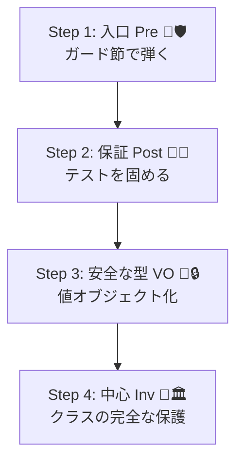
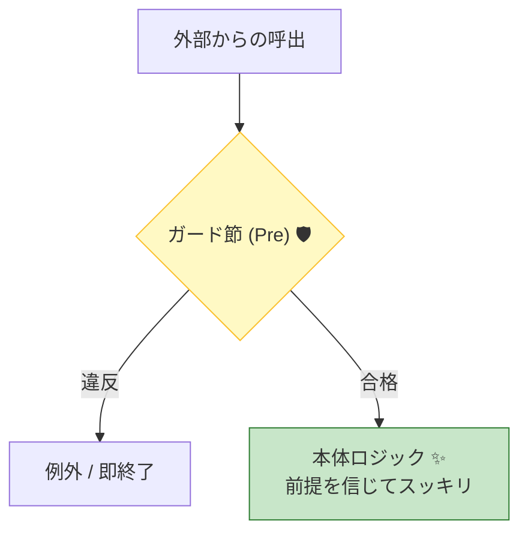

# 第25章 段階導入の実戦手順：既存コードにDbCを入れる🪜🏁

## この章でできるようになること🎯✨

* 既存のC#コードに、**壊さず・揉めず**にDbCを入れる手順がわかる🧯🛠️
* 「どこから入れる？」を迷わない、**導入の優先順位**が作れる🗺️✅
* 契約（Pre/Post/Inv）を**文章→コード→テスト**に落とし込める📝➡️💻➡️🧪
* 契約違反（バグ）と業務エラー（仕様）を**混ぜずに運用**できる🧩🚫
* AI（Copilot/Codex）を「加速装置」として安全に使える🤖⚡️

---

## 0️⃣ まずは“導入する場所”を決める（全部やらない！）🧠🛑


DbCは「全部のメソッドに一気に！」をやると、だいたい失敗します😵‍💫💦
最初は **“効果が大きくて事故りやすいところ”** だけに絞るのがコツです🌸

### ✅ 優先度が高いのはここ（上から順におすすめ）🔝

1. 外部入力に近いところ（API/画面/ファイル読み込み）📩🚪
2. 金額・在庫・権限・日付など、ミスると痛いところ💰🔐📅
3. 例外がよく出る・nullがよく来る・バグ履歴が多いところ🔥🐞
4. チームがよく触る“中心のService/UseCase”🧑‍💻👥

### 🚫 まだ触らないほうがいい場所（後回し）🙅‍♀️

* 低レベルの最適化コード（性能が命のループの中）🏎️💨
* 近々捨てる予定のコード🗑️
* 仕様が固まってない“揺れてる機能”🌪️

---

## 1️⃣ 導入の“型”を決める（迷子防止テンプレ）📐🧭

既存コードにDbCを入れるときは、次の「型」にすると安定します😊✨

🧩 導入テンプレ（おすすめ順）

1. **入口（public境界）にPre**を足す🚪🛡️
2. **Postは“テスト”で可視化**する🧪🎁
3. 壊れやすいルールを**値オブジェクト化**する💎🔒
4. 最後に**不変条件（Inv）をクラスの中心に寄せる**🧱🏛️



> ちなみに、最新のC#は **C# 14**、.NETは **.NET 10** が現行の主役です（C# 14は .NET 10 でサポート）。([Microsoft Learn][1])
> Visual Studio 2026 には .NET 10 SDK が含まれます。([Microsoft Learn][1])

---

## 2️⃣ いきなりコードを書かず、契約を“日本語で1行”にする📝🌷

導入がスムーズになる魔法はこれ👇✨
**「Pre/Post/Invを、まず1行で書く」** です🪄

### ✅ 1行テンプレ

* Pre：`〜であること（入力の約束）`☎️
* Post：`〜になっていること（結果の保証）`🎁
* Inv：`いつ見ても〜であること（壊れない条件）`🧱

### 例（すごくよくあるやつ）📦

* Pre：`quantity は 1以上`
* Pre：`productId は空じゃない`
* Post：`追加後、カート内の合計個数が増える`
* Inv：`カート内の数量は常に1以上`

この「1行」があると、後のガード節・テスト・型設計が全部ラクになります😊💗

---

## 3️⃣ Step1：入口（public）に“最小のPre”を入れる🚪🛡️

### 🎀 ガード節は「短く・上で弾く・下を綺麗に」

* 上：入力チェック（Pre）
* 下：本体ロジック（信頼してスッキリ）✨

### ✅ まずは“壊れやすい3兄弟”から

* null（参照型）🕳️
* 空（文字列/配列/コレクション）🧺
* 範囲（0以上、上限、開始<=終了）📏



### C#のガード節（定番）🧁

```csharp
public void AddItem(string productId, int quantity)
{
    ArgumentException.ThrowIfNullOrWhiteSpace(productId);
    if (quantity <= 0)
        throw new ArgumentOutOfRangeException(nameof(quantity), "quantity は 1以上でね😊");

    // 👇 ここから下は「信じてOK」な世界✨
    _items.Add(new CartLine(productId, quantity));
}
```

* `ArgumentNullException.ThrowIfNull` などの“throw helper”は、ガード節をスッキリさせる定番です📌([Microsoft Learn][2])

### ⚠️ ありがち落とし穴：Nullable構造体にThrowIfNullしない

`int?` や `Guid?` に `ThrowIfNull` を当てると、ボックス化でムダが出やすいです💦
その場合は `HasValue` を使う方がよい、という分析ルールもあります🔎([Microsoft Learn][3])

---

## 4️⃣ Step2：契約違反（バグ）と業務エラー（仕様）を分ける🧩🚫

ここ、DbC導入でいちばん揉めやすいポイントです😵‍💫💥
でも分けられると、運用がめちゃくちゃ楽になります🌈

### 🧨 契約違反（バグ）

* 「呼ぶ側が約束を破った」
* 直すべき（開発者の修正対象）🧑‍💻🔧
* 例：`quantity = 0` を渡してきた、null渡してきた、など

➡️ **入口で例外で落としてOK**（早期発見が価値）🧯✨

### 📩 業務エラー（仕様）

* 「仕様として起こりうる」
* ユーザーに丁寧に返す対象🙂
* 例：在庫切れ、クーポン期限切れ、権限なし

➡️ **Result型（成功/失敗）で返す**、または境界でHTTP/画面メッセージに変換🔁

---

## 5️⃣ Step3：Postは“コードに直書き”より、まずテストにする🧪🎁

既存コードって、たいてい **「本当の仕様がテストにない」** んですよね💦
なので最初は Post を **テストで固定** するのが超おすすめです😊

### ✅ Postをテストにするメリット

* “仕様の合意”が早い🤝
* リファクタで壊してもすぐ気づける🔔
* 後から値オブジェクト化しても安心💎

### 例：Postをテストで固定（ざっくり）🌸

```csharp
[Fact]
public void AddItem_正常系_合計個数が増える()
{
    var cart = new Cart();
    cart.AddItem("A001", 2);

    cart.AddItem("A001", 1);

    cart.TotalQuantity.Should().Be(3); // ✅ Postの一部
}
```

---

## 6️⃣ Step4：不変条件（Inv）を“中心へ寄せる”🧱🏛️

既存コードが壊れやすい理由の多くは👇
**「状態を変える入口が多すぎる」** です😵‍💫

### ✅ Inv導入の王道ムーブ

* フィールド/コレクションを直接触らせない🧤
* 変更はメソッド経由に集約する🏛️
* そのメソッド内で Inv を守る🧱✅

### 例：カートの行は外から触らせない🎀

```csharp
public sealed class Cart
{
    private readonly List<CartLine> _items = new();

    public IReadOnlyList<CartLine> Items => _items;

    public void AddItem(string productId, int quantity)
    {
        ArgumentException.ThrowIfNullOrWhiteSpace(productId);
        if (quantity <= 0) throw new ArgumentOutOfRangeException(nameof(quantity));

        // ここで Inv を守る（数量は常に1以上）
        _items.Add(new CartLine(productId, quantity));
    }
}

public sealed record CartLine(string ProductId, int Quantity);
```

---

## 7️⃣ Step5：壊れやすいルールを“値オブジェクト化”する💎🔒

DbCは、最終的にここへ進むと強いです✨
**「不正な値が作れない」** ＝ 最強🧠💗

### ✅ まず値オブジェクト化しやすい候補

* Email / Phone / PostalCode 📧📞🏣
* Money（金額）💰
* Quantity（個数）📦
* Period（開始/終了）⏳

### 例：Quantityを専用型にする📦💎

```csharp
public readonly record struct Quantity(int Value)
{
    public static Quantity Create(int value)
    {
        if (value <= 0) throw new ArgumentOutOfRangeException(nameof(value), "1以上だよ😊");
        return new Quantity(value);
    }
}
```

こうすると、`int` のままより **契約が型に埋まる** ので、入口チェックが減っていきます🌱✨

---

## 8️⃣ Step6：散らからないための“運用ルール”を決める🧹🎀

### ✅ ルール例（これだけでかなり綺麗になる）

* Preは **public境界でまとめて** 書く🚪
* 内部は「信頼」して if地獄を増やさない🧘‍♀️
* Postは **テストで固定**（慣れたら軽いassert追加）🧪
* Invは **生成と更新の入口** で守る🏗️🔒
* エラーメッセージは「未来の自分に優しく」💌

---

## 9️⃣ AIで爆速にする（でも“最後は人が握る”）🤖⚡️🤝

### 💡 AIに投げると速いもの

* 契約文（Pre/Post/Inv）を箇条書き化📝
* ガード節の雛形生成🛡️
* 境界値テスト候補の列挙🧪
* 例外メッセージ案の改善💌

### 🧯 AIに任せすぎないほうがいいもの

* 「どれが契約違反で、どれが業務エラー？」の最終判断⚖️
* 値オブジェクトの境界（どこまで型に押し込む？）📦
* 例外型・Result設計の方針（プロダクト規約）📐

### 🪄 そのまま使えるAIプロンプト例

```text
以下のC#メソッドに対して DbC の観点で
Preconditions / Postconditions / Invariants を箇条書きで提案して。
次に、それを guard clause（throw helper優先）と単体テスト案に落として。
ただし、業務エラーと契約違反は分離して書いて。
```

---

## 🔟 “段階導入”のおすすめコミット順（実戦）🪜📌

### ✅ 1回目（最短で効果を出す）

* public入口にPre（null/空/範囲）を追加🚪🛡️
* 例外メッセージを最低限整える💌

### ✅ 2回目（事故を減らす）

* Postをテストで固定🧪🎁
* バグが多い箇所だけInvを強化🧱

### ✅ 3回目（設計の質が上がる）

* Money/Quantity/Periodなどを値オブジェクトへ💎
* DTO→ドメイン変換を綺麗にする🧳➡️🏠

---

## ✅ 仕上げチェックリスト（これを満たせば“導入成功”）🌈✅

* 入口チェックが散らかってない？（入口に寄ってる？）🚪🧹
* 契約違反（バグ）と業務エラー（仕様）が混ざってない？🧩🚫
* 不変条件が、生成/更新の入口で守られてる？🧱🔒
* Postがテストでカバーされてる？🧪🎁
* “プリミティブ地獄”になってるところ、値オブジェクト候補になってる？💎👀
* 追加したチェックが、将来の変更の邪魔になってない？（やりすぎてない？）🌿🙂

---

## 🧁 ミニ演習：あなたの既存コードに当てはめよう（15分）⏰✨

1. 既存のpublicメソッドを1つ選ぶ（バグが出がちなやつ）🎯
2. Pre/Post/Inv を“1行ずつ”書く📝
3. Preをガード節にする（throw helper優先）🛡️
4. Postを1本だけテストにする🧪
5. 余裕があれば、壊れやすい引数を値オブジェクト候補にする💎

---

### 📌 最新ツールの小ネタ（導入の判断に使えるよ）🔍✨

* .NET 10 は提供中で、2026年1月のサービス更新情報も公開されています。([Microsoft for Developers][4])
* C# 14 は最新のC#で、.NET 10でサポートされています。([Microsoft Learn][1])
* Visual Studio 2026 のリリースノート（2026年1月更新）も確認できます。([Microsoft Learn][5])

[1]: https://learn.microsoft.com/en-us/dotnet/csharp/whats-new/csharp-14?utm_source=chatgpt.com "What's new in C# 14"
[2]: https://learn.microsoft.com/ja-jp/dotnet/api/system.argumentnullexception.throwifnull?view=net-10.0&utm_source=chatgpt.com "ArgumentNullException.ThrowIfNull Method (System)"
[3]: https://learn.microsoft.com/ja-jp/dotnet/fundamentals/code-analysis/quality-rules/ca1871?utm_source=chatgpt.com "'ArgumentNullException.ThrowIfNull' に null 許容構造体を ..."
[4]: https://devblogs.microsoft.com/dotnet/dotnet-and-dotnet-framework-january-2026-servicing-updates/?utm_source=chatgpt.com ".NET and .NET Framework January 2026 servicing ..."
[5]: https://learn.microsoft.com/en-us/visualstudio/releases/2026/release-notes?utm_source=chatgpt.com "Visual Studio 2026 Release Notes"
