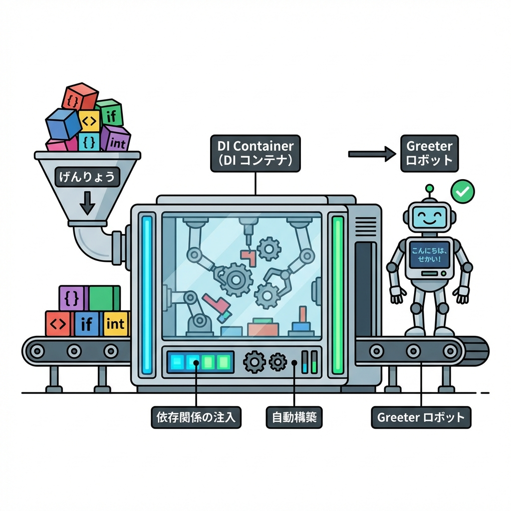
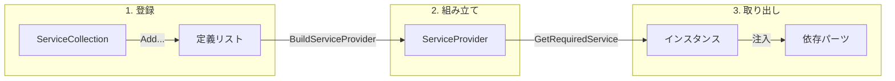

# 第16章　DIコンテナ入門：Microsoftの標準的なやつを使う🧩

この章はね、**「DIコンテナって何者？どう触ればいいの？」**を、こわくない範囲でサクッと体験する回だよ〜😊💉
（深追いはしない！“まず動かす”が勝ち🏆）

---

## 1) 今日のゴール🎯🌸

この章が終わったら、こんな状態になってればOK🙆‍♀️✨

* **DIコンテナ＝“new係（組み立て係）”**だと説明できる👷‍♀️🧱
* **登録（Register）→組み立て（Build）→取り出し（Resolve）**の流れがわかる🔁
* `ServiceCollection` と `ServiceProvider` を触って、**最小のDIコンテナ導入**ができる🧩
* `GetService` と `GetRequiredService` の違いがわかる（超だいじ）✅ ([Microsoft Learn][1])

---

## 2) DIコンテナって何？🧠💡（超ざっくり）

DIコンテナは、ひとことで言うと…



**「依存関係を自動で組み立ててくれる係」**だよ👷‍♀️✨

あなたがやるのは主にこれだけ👇

1. **登録する**（例：`IClock` が欲しいなら `SystemClock` を作ってね〜って教える）📝
2. **組み立てる**（登録内容から“工場”を完成させる）🏭
3. **取り出す**（必要なサービスをもらう）🎁

Microsoftの標準DIは、`Microsoft.Extensions.DependencyInjection` が中心だよ🧩 ([NuGet][2])

---

## 3) 今日の主役たち👑✨（用語ミニ辞典）

* `IServiceCollection`（だいたい `ServiceCollection` でOK）
  → **サービスの登録帳**📒✨（「何が欲しい時、何を作るか」）
* `IServiceProvider`（`BuildServiceProvider()` の成果物）
  → **実際に作って渡してくれる人**🤝🎁
* Register（登録）
  → `AddTransient` / `AddSingleton` みたいなやつ（寿命は次章でちゃんとやるよ😉）
* Resolve（解決）
  → `GetRequiredService<T>()` で取り出す🎣 ([Microsoft Learn][1])

---

## 4) ハンズオン①：いちばん小さいDIコンテナ体験🧪✨

### やること💪🌷

コンソールアプリで、こういう依存関係を **コンテナに組み立ててもらう**よ！

* `Greeter`（あいさつ係）
  ↳ `IClock`（時刻係）が必要⏰

---

### Step A：NuGet追加📦✨

Visual Studioで👇
**プロジェクト → NuGetパッケージの管理 → “Microsoft.Extensions.DependencyInjection”** を追加してね🧩
（NuGet側の最新は 10.0.2 などの 10.0系が並ぶはずだよ）([NuGet][2])

---

### Step B：コードを書く✍️💖（Program.cs 1枚でOK）

```csharp
using System;
using Microsoft.Extensions.DependencyInjection;

// 1) 依存の“差し替え口”を作る🧷
public interface IClock
{
    DateTime Now { get; }
}

// 2) 実装（本物）を作る⏰
public sealed class SystemClock : IClock
{
    public DateTime Now => DateTime.Now;
}

// 3) 依存を受け取る側（ここがDIの見せ場）💉✨
public sealed class Greeter
{
    private readonly IClock _clock;

    // コンテナがここに SystemClock を入れてくれる🥳
    public Greeter(IClock clock)
    {
        _clock = clock;
    }

    public void Hello(string name)
    {
        Console.WriteLine($"やっほー {name} さん😊 いまは {_clock.Now} だよ⏰✨");
    }
}

public static class Program
{
    public static void Main()
    {
        // 4) 登録帳を作る📒
        var services = new ServiceCollection();

        // 5) 登録する📝
        services.AddSingleton<IClock, SystemClock>();
        services.AddTransient<Greeter>();

        // 6) 工場を完成させる🏭（ServiceProviderを作る）
        using var provider = services.BuildServiceProvider();

        // 7) 取り出す🎁（登録されてないと例外で教えてくれるのが Required）
        var greeter = provider.GetRequiredService<Greeter>(); // ←ここ注目👀
        greeter.Hello("こみやんま");
    }
}
```

✅ ここで起きてること（超だいじ）

* `Greeter` を取り出した瞬間、コンテナが **「Greeterのコンストラクタに IClock 要るじゃん」**って気づく
* `IClock` は登録されてるから `SystemClock` を作って注入💉✨
* つまり **依存関係の連鎖（オブジェクトグラフ）を自動で組み立てる**ってことだよ🧱🧱🧱


```mermaid
flowchart LR
    subgraph Register [1. 登録]
        SC[ServiceCollection] -- Add... --> Def[定義リスト]
    end
    subgraph Build [2. 組み立て]
        Def -- BuildServiceProvider --> SP[ServiceProvider]
    end
    subgraph Resolve [3. 取り出し]
        SP -- GetRequiredService --> Inst[インスタンス]
        Inst -- 注入 --> Dep[依存パーツ]
    end
```

---

## 5) `GetService` と `GetRequiredService` の違い🥺➡️😤

* `GetService<T>()`：無かったら **null**（気づきにくい事故が起きがち）😇
* `GetRequiredService<T>()`：無かったら **例外**（早めに気づける！）🚨✨ ([Microsoft Learn][1])

最初は **Requiredの方を使う**のが安心だよ〜✅

---

## 6) ハンズオン②：いまどきの“Host”版もチラ見せ👀✨（雰囲気だけ）

最近の.NETは、コンソールでも **Generic Host** を使う流れが一般的になってるよ〜🚀
（DI・ログ・設定…をまとめて面倒見てくれる箱）📦✨ ([Microsoft Learn][3])

```csharp
using Microsoft.Extensions.DependencyInjection;
using Microsoft.Extensions.Hosting;

var builder = Host.CreateApplicationBuilder(args);

builder.Services.AddSingleton<IClock, SystemClock>();
builder.Services.AddTransient<Greeter>();

using var host = builder.Build();

var greeter = host.Services.GetRequiredService<Greeter>();
greeter.Hello("こみやんま");
```

この `CreateApplicationBuilder` が「最初からいい感じに用意しといたよ✨」ってやつだよ🧁 ([Microsoft Learn][4])

---

## 7) 今日の“落とし穴”だけ先に回避しとこ🕳️⚠️

### 落とし穴①：登録し忘れ😵

`IClock` を登録してないのに `Greeter` を取ろうとすると…
**「IClockがないよ！」**でコケる💥（だから `GetRequiredService` が便利）

### 落とし穴②：アプリの中で `BuildServiceProvider()` を何回も作る🔁😇

小さいサンプルならOKだけど、実アプリではむやみに作らない方がいいよ〜💦
（特にASP.NET Coreの設定中に無理やり作るのは避けよう、って公式でも注意されがち）([Microsoft Learn][5])

---

## 8) ミニ課題🎒✨（5〜10分）

1. `Greeter` にもう1個依存を増やしてみよ💉
   例：`IEmoji`（絵文字係）を作って、メッセージ末尾に「🌸✨」を付ける
   → 登録して、ちゃんと動いたら勝ち🏆

2. わざと登録を外してみよ😈
   `services.AddSingleton<IClock, SystemClock>();` を消す
   → どんなエラーになるか観察👀（“Required”の強さを体感！）

---

## 9) AI（Copilot等）に頼むと爆速になるお願いテンプレ🤖💞

* 「このクラスの依存を**コンストラクタ注入**に直して🙏💉」
* 「`ServiceCollection` に必要な登録を全部列挙して📝」
* 「登録漏れが起きやすいポイントをチェックリスト化して✅」
* 「このDI構成、`Host.CreateApplicationBuilder` 版に書き換えて🚀」 ([Microsoft Learn][4])

---

## 10) まとめ🏁✨

この章で覚えたのはこれだけでOKだよ😊💖

* DIコンテナは **“new係（組み立て係）”**👷‍♀️🧱
* 流れは **登録→Build→取り出し**🔁
* 取り出しはまず **`GetRequiredService`** が安心🎁🚨 ([Microsoft Learn][1])
* Microsoft標準DIは `Microsoft.Extensions.DependencyInjection` が中心🧩 ([NuGet][2])
* いまどきは `Host.CreateApplicationBuilder` の形もよく見る👀🚀 ([Microsoft Learn][4])

---

次の第17章で、いよいよ **AddTransient / AddSingleton / AddScoped** の“寿命”をちゃんと整理するよ〜📝⏳✨

[1]: https://learn.microsoft.com/en-us/dotnet/api/microsoft.extensions.dependencyinjection.serviceproviderserviceextensions.getrequiredservice?view=net-10.0-pp&utm_source=chatgpt.com "ServiceProviderServiceExtensions.GetRequiredService ..."
[2]: https://www.nuget.org/packages/microsoft.extensions.dependencyinjection?utm_source=chatgpt.com "Microsoft.Extensions.DependencyInjection 10.0.2"
[3]: https://learn.microsoft.com/en-us/dotnet/core/extensions/dependency-injection-usage?utm_source=chatgpt.com "Tutorial: Use dependency injection in .NET"
[4]: https://learn.microsoft.com/en-us/dotnet/api/microsoft.extensions.hosting.host.createapplicationbuilder?view=net-10.0-pp&utm_source=chatgpt.com "Host.CreateApplicationBuilder Method"
[5]: https://learn.microsoft.com/en-us/aspnet/core/fundamentals/dependency-injection?view=aspnetcore-10.0&utm_source=chatgpt.com "Dependency injection in ASP.NET Core"
