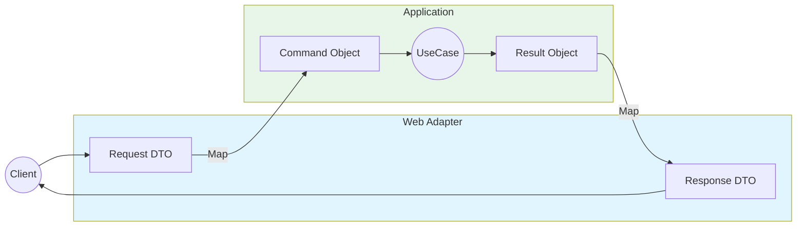

# 第9章 境界の型：DTO/Port/Adapterの超入門🚪📦

この章は「層をまたぐときの“箱（型）”をどう作る？」がテーマだよ〜！😆🧁
依存関係ルールを**日常のコードで“破らない”**ための、めちゃ重要パート💪🌸

---

## 1. まず結論：境界には“専用の型”を置く🎁🧭


層をまたぐとき（例：Web→Application、Application→DB）に、**そのまま中身（ドメイン型）を渡す**と事故が起きやすいのね😵💥

だから、境界ではこれを使うよ👇✨

* **DTO**：境界を通るための“配送用の箱”📦
* **Port**：境界の“差し込み口（インターフェース）”🔌
* **Adapter**：差し込み口に合わせる“変換器（実装側）”🔧

いちばん大事な感覚はこれ👇
**「層をまたぐときは、その層の都合（詳細）を中に持ち込まない」**🧼✨

---

## 2. 今の最新前提（2026/01）🆕✨

* **.NET 10 が “latest（LTS）”** 扱いで、**10.0.2 が 2026/01/13**に出てるよ📌 ([Microsoft][1])
* **C# 14** は **.NET 10 / Visual Studio 2026** で試せる前提になってるよ🧠✨ ([Microsoft Learn][2])
* **Visual Studio 2026** は **2026/01/13 に 18.2.0（January Update）**が出てるよ🛠️ ([Microsoft Learn][3])
* ASP.NET Core も **aspnetcore-10.0** のドキュメントが整備されてる（Minimal API含む）よ🚀 ([Microsoft Learn][4])

---

## 3. DTOってなに？（箱📦）

DTO（Data Transfer Object）は、**境界を通るための“ただのデータ”**だよ🙂🌷
ポイントは「**ロジックを持たない**」「**境界の外に漏れて困る型を含めない**」の2つ！

## DTOの良いところ😊💗

* Webの都合（JSONの形）と、アプリの都合（ユースケース）を分離できる
* ドメイン型（OrderとかMoneyとか）が外に漏れにくい🫧
* 変更が局所化する（APIの項目追加とかが楽）✨

## DTOのダメ例あるある😇💥

* **EF CoreのEntityをそのまま返す**（DB都合がAPIに漏れる）
* **ドメインのValueObjectをそのままJSONに出す**（将来の変更が地獄）
* DTOに if/for とかのロジックが増殖（箱のはずが本体に…）🌀

---

## 4. Portってなに？（差し込み口🔌）


Portは「**中心側が外側に要求する“型付きの窓口”**」だよ🪟✨
Hexagonal（Ports & Adapters）でよく出てくるやつ〜！🧭

Portには2種類あるよ👇

* **入力Port（Input Port）**：外（UI/Web）が中心（UseCase）を呼ぶ入口
* **出力Port（Output Port）**：中心（UseCase）が外（DB/外部API）を呼ぶ出口

Portはだいたい **interface** で表現するのがC#では自然だよ😺

---

## 5. Adapterってなに？（変換器🔧）

Adapterは「Portに合わせて動く実装側」！
**Web/API** も Adapter、**DBアクセス** も Adapter だよ〜🚪✨

* Web Adapter：HTTP/JSON ⇄ DTO ⇄ UseCase呼び出し
* DB Adapter：Repository実装（EF Core / Dapper / InMemoryなど）

**変換（マッピング）**は、基本 Adapter 側に寄せるのが安全🙆‍♀️💕

---

## 6. ミニ題材：注文APIで “境界の型” を体感しよう🛒✨

ここからは、雰囲気がつかめる最小セットでいくよ〜！🍓
（コードは短めだけど「型の置き場所」が本題！）

## 全体イメージ🗺️

```text
[Web(UI)]  --(DTO)-->  [Application]  --(Port)-->  [Infrastructure]
   |                          |                        |
 Adapter                  UseCase                  Adapter
```

---



## 6.1 Domain（中心のさらに中心🌱）

ドメインは“業務の言葉”だけにしたい✨（JSONとかDBとか知らない🙅‍♀️）

```csharp
// Domain project
namespace Domain;

public readonly record struct OrderId(Guid Value);

public sealed class Order
{
    public OrderId Id { get; }
    public string CustomerName { get; }
    public IReadOnlyList<OrderLine> Lines { get; }

    public Order(OrderId id, string customerName, IReadOnlyList<OrderLine> lines)
    {
        if (string.IsNullOrWhiteSpace(customerName))
            throw new ArgumentException("CustomerName is required.");

        if (lines.Count == 0)
            throw new ArgumentException("At least one line is required.");

        Id = id;
        CustomerName = customerName;
        Lines = lines;
    }
}

public readonly record struct OrderLine(string Sku, int Quantity);
```

---

## 6.2 Application（ユースケース＋Port🔌）

ここが「方針」側だよ🧭✨
WebのDTOは置かない！代わりに **Command / Result** を用意するとスッキリするよ😊

```csharp
// Application project
using Domain;

namespace Application;

public sealed record CreateOrderCommand(
    string CustomerName,
    IReadOnlyList<CreateOrderLineCommand> Lines
);

public sealed record CreateOrderLineCommand(string Sku, int Quantity);

public sealed record CreateOrderResult(Guid OrderId);

// ✅ Input Port（入力側Port）
public interface ICreateOrderUseCase
{
    Task<CreateOrderResult> HandleAsync(CreateOrderCommand command, CancellationToken ct);
}

// ✅ Output Port（出力側Port）
public interface IOrderRepository
{
    Task SaveAsync(Order order, CancellationToken ct);
}

public sealed class CreateOrderUseCase : ICreateOrderUseCase
{
    private readonly IOrderRepository _repo;

    public CreateOrderUseCase(IOrderRepository repo)
    {
        _repo = repo;
    }

    public async Task<CreateOrderResult> HandleAsync(CreateOrderCommand command, CancellationToken ct)
    {
        var id = new OrderId(Guid.NewGuid());

        var lines = command.Lines
            .Select(x => new OrderLine(x.Sku, x.Quantity))
            .ToList();

        var order = new Order(id, command.CustomerName, lines);

        await _repo.SaveAsync(order, ct);

        return new CreateOrderResult(order.Id.Value);
    }
}
```

ここでの気持ちいいポイント💖

* Application は **DTO（Webの都合）**を知らない🫥
* 外に出るのは **Port（interface）**だけ🔌✨

---

## 6.3 Web Adapter（DTO📦 ＋ マッピング🔁）

Webは “外側の詳細” なので、DTOはここに置くのが自然😊🌸
（Minimal API の形は aspnetcore-10.0 にも整理されてるよ🚀） ([Microsoft Learn][4])

```csharp
// Web project (ASP.NET Core)

// ✅ DTO（境界の箱）
public sealed record CreateOrderRequest(
    string CustomerName,
    List<CreateOrderLineRequest> Lines
);

public sealed record CreateOrderLineRequest(string Sku, int Quantity);

public sealed record CreateOrderResponse(Guid OrderId);
```

次に「DTO → Command」「Result → DTO」の変換（マッピング）を作るよ🔁✨
（最初は手書きがいちばん安全！慣れたらMapper導入でもOK🙂）

```csharp
using Application;

public static class OrderMappings
{
    public static CreateOrderCommand ToCommand(this CreateOrderRequest dto)
        => new(
            CustomerName: dto.CustomerName,
            Lines: dto.Lines.Select(x => new CreateOrderLineCommand(x.Sku, x.Quantity)).ToList()
        );

    public static CreateOrderResponse ToResponse(this CreateOrderResult result)
        => new(result.OrderId);
}
```

そしてエンドポイント（Adapter）側で呼ぶ！🚪✨

```csharp
using Application;

var builder = WebApplication.CreateBuilder(args);

// DI（Composition Root は外側に置くのが定石🧩）
builder.Services.AddScoped<ICreateOrderUseCase, CreateOrderUseCase>();

// 仮のRepositoryは後でInfraに差し替える想定
builder.Services.AddSingleton<IOrderRepository, InMemoryOrderRepository>();

var app = builder.Build();

app.MapPost("/orders", async (
    CreateOrderRequest request,
    ICreateOrderUseCase useCase,
    CancellationToken ct) =>
{
    var result = await useCase.HandleAsync(request.ToCommand(), ct);
    return Results.Ok(result.ToResponse());
});

app.Run();

// --- 仮Adapter（ほんとはInfraプロジェクトに置くイメージ） ---
public sealed class InMemoryOrderRepository : IOrderRepository
{
    private readonly List<Domain.Order> _orders = new();

    public Task SaveAsync(Domain.Order order, CancellationToken ct)
    {
        _orders.Add(order);
        return Task.CompletedTask;
    }
}
```

✅ ここが超大事💥

* HTTP/JSONの都合（DTO）は **Webに閉じ込める**📦
* UseCaseは **Command/Result** で受ける（中心の言葉）🧠
* Domainは **Webを知らない**（めちゃ強い）🧱✨

---

## 7. “ドメイン型を外に漏らさない”って、具体的に何が嬉しい？🥰

たとえば将来こうなる時👇

* APIの項目名が変わった（`customer_name`にしたい等）
* 外部公開APIと社内APIで形が違う
* ドメインの型をリファクタしたい（OrderLineの構造変更など）
* DBが変わった（EF→Dapper、SQL→別など）

このとき **DTOが境界のクッション**になってくれるから、中心が守られるよ🛡️💕

---

## 8. よくある事故パターン集🚧😇

## 🚫 事故1：Controller/EndpointがDomainを返す

「動くからOK！」ってやりがちだけど、後で変更が怖くなる😱
→ **Response DTO**に変えて返すのが安心✨

## 🚫 事故2：Entity（DB都合）をDTO代わりにする

Entityに `JsonPropertyName` とか付け始めたら赤信号🚥💥
→ WebのDTOはWebへ、DBのEntityはInfraへ📦

## 🚫 事故3：UseCaseがDTOを受け取る

中心が外側の都合に引っ張られるやつ😭
→ Command/Resultを挟もう✨

```mermaid
flowchart TD
    subgraph Bad1["事故1: Domain漏れ"]
        Controller -->|"Return Entity 😱"| Client
        Note1["Domain Entityが<br>そのまま外へ出る"] -.-> Controller
    end
    
    subgraph Bad2["事故3: 外の都合が侵入"]
        Controller -->|"Pass DTO 😱"| UseCase
        Note2["UseCaseが<br>Webの型を知ってしまう"] -.-> UseCase
    end
    
    style Bad1 fill:#ffebee,stroke:#c62828
    style Bad2 fill:#fff3e0,stroke:#ef6c00
```



---

## 9. 演習（やってみよう！）💪🍰

## 演習1：DTOに項目を追加しても中心を守る🧤✨

* `CreateOrderRequest` に `Note`（備考）を追加
* でも Domain の `Order` は変えない（今は使わない仕様）
* マッピングだけ直す

👉 「外側の変更が中心に波及しない」を体で覚えられるよ😊

## 演習2：Adapterを増やす（Console版UI）🖥️🎀

* Webの代わりにConsoleから `ICreateOrderUseCase` を呼ぶ
* DTOはConsole側に作ってOK（また別の箱📦）

👉 Adapterが増えても中心が同じで使えるのが快感✨

## 演習3：Responseの形だけ変える（v2）🔁🧁

* `CreateOrderResponseV2` を作って `orderId` 以外も返す
* UseCaseは変えず、Web側の組み立てだけで対応

---

## 10. AI（Copilot/Codex）に頼むと強いところ🤖💖

“境界の型”は作業量が地味に多いから、AIが超相性いいよ〜！🎯

## そのままコピペで使える指示例📝✨

```text
Create DTOs for CreateOrderRequest/CreateOrderResponse in C# using record types.
Keep DTOs free of domain types. Use primitives only.
Then generate mapping methods DTO -> CreateOrderCommand and CreateOrderResult -> DTO.
```

```text
Review this solution structure for dependency rule violations.
Identify if Web project references Domain types in its public API surface.
Suggest changes to keep domain types inside.
```

```text
Generate an ASCII diagram of Ports & Adapters for this codebase:
Web (adapter) -> ICreateOrderUseCase (input port) -> CreateOrderUseCase
CreateOrderUseCase -> IOrderRepository (output port) -> InMemoryOrderRepository (adapter)
```

---

## 11. この章のチェックリスト✅🌸

* DTOは **境界専用**の箱になってる？📦
* UseCaseは DTOを知らず、**Command/Result** で話してる？🧠
* Port（interface）は **中心側**に置けてる？🔌
* Adapter（Web/DB）は **外側**に置けてる？🔧
* 変換（マッピング）は **境界でやってる**？🔁

---

もしこのまま続けて、次の章（第10章：参照を切って守る✂️🚫）へ繋がる形で、**「この章の完成形（プロジェクト分割版）」**まで一気に組み上げる教材にもできるよ〜！😆✨

[1]: https://dotnet.microsoft.com/en-us/download/dotnet?utm_source=chatgpt.com "Browse all .NET versions to download | .NET"
[2]: https://learn.microsoft.com/ja-jp/dotnet/csharp/whats-new/csharp-14?utm_source=chatgpt.com "C# 14 の新機能"
[3]: https://learn.microsoft.com/en-us/visualstudio/releases/2026/release-notes?utm_source=chatgpt.com "Visual Studio 2026 Release Notes"
[4]: https://learn.microsoft.com/en-us/aspnet/core/fundamentals/minimal-apis?view=aspnetcore-10.0&utm_source=chatgpt.com "Minimal APIs quick reference"
