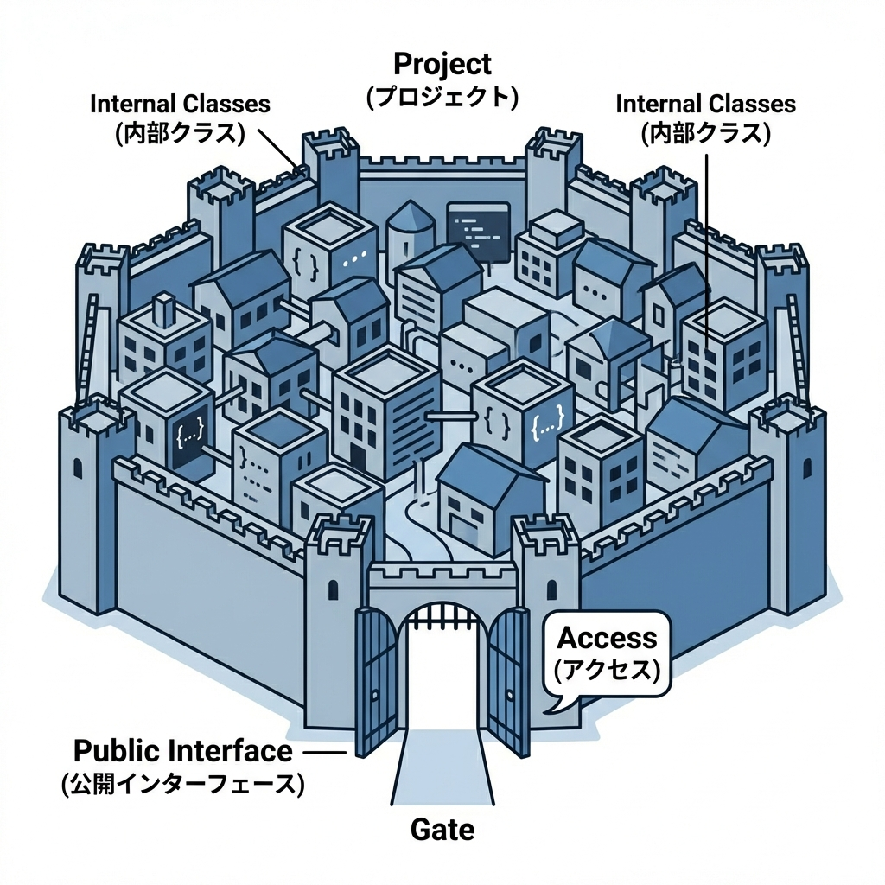
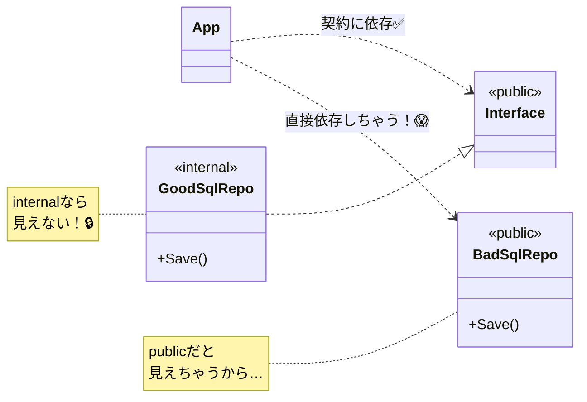

# 第11章 “破れない”最短ルート②：公開範囲を絞って守る🔒🧼

この章はひとことで言うと👇
**「public を最小にして、依存の“漏れ”を物理的に止める」**だよ〜！🧱✨

---

## 1. なんで “公開しすぎ” が危ないの？😵‍💫💥

`public` を増やすと何が起きるかというと…

* 他プロジェクトから **自由に触れる** 👆
* すると、だんだん **「便利だから使っちゃえ」** が増える🌀
* 気づくと **層を飛び越えた依存** が発生（UI→Infra直呼びとか）😇
* そして一番つらいのが…
  **“あとで変えられない”**（使われてるから）😭🔧

つまり `public` は、**未来の自分に「これは一生守る契約ね？」って誓わせる魔法**みたいなもの🪄💍

---

## 2. 今日の結論：公開は「入口だけ」🚪✨



✅ ルールはこれだけでかなり強いよ！

* **基本は internal（か、そもそも修飾子を書かない）** 🧼
  トップレベル型はデフォルト `internal` だよ（明記しない限り）📌 ([Microsoft Learn][1])
* **public は“入口”だけ** 🚪
  入口＝「他の層が使ってOKなもの」
* **実装詳細は外に見せない** 🙈
  Repository実装・DBクラス・細かいHelper・変換クラス…は基本 hidden！

---

## 3. C#で使える “公開を絞る道具” 一覧🧰✨

### 3.1 よく使うアクセス修飾子🔑

* `public`：誰でもOK（＝契約）📣
* `internal`：同じアセンブリ（同じプロジェクト）だけOK🏠
* `private`：同じ型の中だけOK🧸
* `protected`：継承した子だけOK🌱
* `protected internal` / `private protected`：合体系（必要になった時だけでOK）🧩 ([Microsoft Learn][2])

### 3.2 “ファイル内だけ” に隠せる `file` 🫥📄

C# には **「その .cs ファイルの中でだけ見える型」** を作れる `file` 修飾子があるよ！
トップレベル型を **ファイルローカル** にできる✨ ([Microsoft Learn][3])

例👇（この `HiddenMapper` は同じファイル内だけで使用可能）

```csharp
// OrderMapping.cs
file static class HiddenMapper
{
    public static OrderDto ToDto(Order order) => new(order.Id, order.Total);
}
```

---

## 4. “依存が漏れる” 典型パターンあるある😇🧨

### パターンA：Infraの実装が public になってる🧯

* `SqlOrderRepository` が `public`
* Application/UI が「便利〜！」で直接使い始める
* **インターフェース（中心）をすっ飛ばす** → 依存が崩壊💥

✅ 対策：**実装は internal** にして、DIでしか触れないようにする🧩

### パターンB：Domain の “便利クラス” が public で外にバレる👀

* Domain 内の `OrderValidator` とか `RuleEngine` とかが public
* 外側が依存しちゃう
* Domain の内部構造を変えるたびに外側が壊れる😭

✅ 対策：Domain の public は **モデルと契約に必要な最小限** に💡


```mermaid
classDiagram
    direction LR
    class BadSqlRepo {
        +Save()
        <<public>>
    }
    class App
    
    App ..> BadSqlRepo : 直接依存しちゃう！😱
    note for BadSqlRepo "publicだと<br>見えちゃうから…"
    
    class GoodSqlRepo {
        +Save()
        <<internal>>
    }
    class Interface {
        <<public>>
    }
    
    App ..> Interface : 契約に依存✅
    GoodSqlRepo ..|> Interface
    note for GoodSqlRepo "internalなら<br>見えない！🔒"
```

---

## 5. “層ごとの公開方針” テンプレ（超つよ）🧭🧱

ここ、めっちゃ実務で効くやつだよ〜！💖

### 5.1 Domain（中心）🏰

**公開してOK（例）** ✅

* Entity / ValueObject（外に出して良い形にしてるなら）
* Domain error（ドメイン用語で表現されたエラー）
* Domain event（必要なら）

**隠すべき（例）** 🙈

* ルールの細かい部品、内部ヘルパ、判定器
* “保存の都合” みたいなもの（それは外側の事情！）

> 迷ったら internal でOKだよ〜🧼✨

### 5.2 Application（中心寄り）🧠

**公開してOK** ✅

* UseCase の入口（例：`IOrderUseCase`）
* UI が呼ぶ “アプリの顔” 👩‍💼

**隠すべき** 🙈

* UseCase の実装クラス（ワークフロー詳細）
* Mapper や内部手続き

✅ 入口だけ `public interface`、実装は `internal class` が鉄板✨

### 5.3 Infrastructure（外側）🏭

**公開してOK** ✅

* DI登録用の拡張メソッド（例：`AddInfrastructure()`）だけ！

**隠すべき** 🙈

* DB実装、Repository実装、HTTPクライアント実装、設定クラス…

> Infra の public は「ゼロに近いほど勝ち」🏆✨

---

## 6. 実装例：公開範囲で “漏れ” を止める🧪🔒

### 6.1 Application：入口だけ public、実装は internal🚪🧠

```csharp
// Application プロジェクト
public interface IOrderUseCase
{
    Task<OrderResult> PlaceAsync(PlaceOrderCommand command, CancellationToken ct);
}

// 実装は隠す
internal sealed class OrderUseCase : IOrderUseCase
{
    private readonly IOrderRepository _repo;

    public OrderUseCase(IOrderRepository repo)
    {
        _repo = repo;
    }

    public async Task<OrderResult> PlaceAsync(PlaceOrderCommand command, CancellationToken ct)
    {
        // 業務の流れはここ（外に見せない）
        var order = Order.Create(command.UserId, command.Items);
        await _repo.SaveAsync(order, ct);
        return OrderResult.Success(order.Id);
    }
}
```

👉 こうすると、UI は `IOrderUseCase` だけ知ってればOK☺️🎀
`OrderUseCase` の存在すら見えないから、依存が増えないよ〜！

---

### 6.2 Infrastructure：実装は internal、公開は AddInfrastructure だけ🏭🧩

```csharp
// Infrastructure プロジェクト
internal sealed class SqlOrderRepository : IOrderRepository
{
    public Task SaveAsync(Order order, CancellationToken ct)
    {
        // DB保存（外に見せない）
        return Task.CompletedTask;
    }
}

public static class ServiceCollectionExtensions
{
    public static IServiceCollection AddInfrastructure(this IServiceCollection services)
    {
        // ここだけ外に公開（Composition Rootから呼ばれる）
        services.AddScoped<IOrderRepository, SqlOrderRepository>();
        return services;
    }
}
```

入口（DI登録）以外は見えないから、
「便利だから Infra を直に使う」が物理的にできなくなる😎🔒

---

## 7. 演習：公開したいものだけ残して整理🧹✨（手を動かすよ〜！）

### ゴール🎯

**「外側から触っていい入口だけ public」** にする！

---

### ステップA：まず “public を数える” 🔎📣

Visual Studio でおすすめ👇

* ソリューション全体検索（`public class` / `public interface`）🔍
* 「この public、外の層から本当に必要？」って1個ずつ確認👀

💡 迷ったら、こう聞く：
**「それ、入口（契約）？ それとも実装詳細？」**

---

### ステップB：Infra を “ほぼ非公開” にする🏭🔒

1. Infrastructure の `public class Sql...` を **internal** に変更
2. もし外から使われてビルドが落ちたら…
   👉 **その依存が漏れてた証拠** 😇💥
3. 直呼びしてた側を修正して、DI経由に戻す🧩

---

### ステップC：Domain の “便利クラス” を内側へ🧼🏰

* `public` な helper/validator/mapper を `internal` にしてみる
* もし外側が使って落ちたら、
  👉 **Domain の内部を外に漏らしてた** ってことだよ〜🫢

---

### ステップD：ファイル内だけでいい型は `file` に📄🫥

Mapperとか、変換の小物とかにピッタリ✨ ([Microsoft Learn][3])

---

## 8. テストはどうするの？🤔🧪（internal を見たい時）

「テストから internal を触りたい〜！」ってなるよね☺️
そのときに使えるのが **InternalsVisibleTo** 👀✨

* `internal` を **指定したアセンブリ（テストプロジェクト）にだけ公開**できる
* .NET の公式にある仕組みだよ📌 ([Microsoft Learn][4])

例👇（Domain 側に追加）

```csharp
using System.Runtime.CompilerServices;

[assembly: InternalsVisibleTo("MyApp.Domain.Tests")]
```

⚠️ 注意：便利だけど、乱用すると「結局ほぼ public」になりがち😇
**“テストのための最小限”** で使うのがコツだよ〜🧡

---

## 9. “公開API一覧” を作ろう🤖📋（AI活用コーナー）

ここ超おすすめ！✨
AI に **「このプロジェクトの public は契約だから、一覧にしてレビュー」** させると強い💪🤖

### 9.1 公開APIの棚卸しプロンプト📌

```text
このプロジェクト内の public 型/メンバーを「公開API一覧」として列挙して。
それぞれについて：
- 何のための入口か（誰が使うか）
- public のままで良い理由
- internal に落としても良さそうな候補
も書いて。
```

### 9.2 public を減らす提案をもらうプロンプト🧹

```text
依存関係ルールを守るために「公開範囲を最小化」したい。
このソリューションで、外側が内側の詳細に依存してしまいそうな public を検出して、
internal化の手順と影響範囲を提案して。
```

### 9.3 PRレビュー観点プロンプト👩‍⚖️

```text
この変更で public が増えた/変わった箇所を指摘して。
それが「契約として妥当か」をレビューコメント案で出して。
```

---

## 10. ちいさな最強チェックリスト✅🔒

* [ ] **public は入口だけ？** 🚪
* [ ] 実装（Infra/UseCase実装/Helper）が public になってない？🙈
* [ ] 迷った型は internal にして、必要なら入口を設計し直した？🧠
* [ ] `file` を使える場所は使った？📄 ([Microsoft Learn][3])
* [ ] テスト目的の公開は `InternalsVisibleTo` で最小限？🧪 ([Microsoft Learn][4])

---

## まとめ🎀✨

この章でいちばん大事なのはこれ👇

**public を減らす = 依存の“通り道”を塞ぐ = 破れにくくなる** 🔒🧱✨

そして `public` は「契約」だから、
**“入口だけにして、あとは隠す”** が最強の守り方だよ〜😌💖

---

次の第12章では、さらに強くして
**「破ったら検知する（アーキテクチャテスト）」** に進むよ〜！🧪🚨

[1]: https://learn.microsoft.com/en-us/dotnet/csharp/language-reference/keywords/accessibility-levels?utm_source=chatgpt.com "Accessibility Levels - C# reference"
[2]: https://learn.microsoft.com/en-us/dotnet/csharp/programming-guide/classes-and-structs/access-modifiers?utm_source=chatgpt.com "Access Modifiers (C# Programming Guide)"
[3]: https://learn.microsoft.com/en-us/dotnet/csharp/language-reference/keywords/file?utm_source=chatgpt.com "The file keyword - C# reference"
[4]: https://learn.microsoft.com/ja-jp/dotnet/api/system.runtime.compilerservices.internalsvisibletoattribute?view=net-9.0&utm_source=chatgpt.com "InternalsVisibleToAttribute クラス (System.Runtime. ..."
