# 第2章：開発環境セットアップ（Windows）🪟🛠️✨

## この章のゴール 🎯

学習用の「学内カフェ注文アプリ」☕️🧾で、**ドメイン用プロジェクト（Domain）**と**テスト用プロジェクト（Tests）**を分けたソリューションを作って、**迷わず実行＆テストできる**状態にするよ〜！💪😊

---

## まづ、今日の“完成形”をイメージしよ 📦✨


フォルダ構成はこうするのが分かりやすいよ👇

```text
CafeOrder/
  CafeOrder.sln
  src/
    CafeOrder.Domain/
      CafeOrder.Domain.csproj
  tests/
    CafeOrder.Domain.Tests/
      CafeOrder.Domain.Tests.csproj
```

この形にしておくと、後の章でプロジェクトが増えても散らからないの🥰🧹✨

---

## 1) .NET（SDK）を最新にする 🔧✨

本日時点の最新だと、**.NET 10（LTS）**が中心になるよ〜！
.NET 10 のSDKは **10.0.102（2026-01-13リリース）**が出てるよ。([Microsoft][1])

### ✅ いま入ってるか確認（超だいじ）

PowerShell（またはコマンドプロンプト）で👇

```bash
dotnet --info
```

* `SDK` のところに **10.0.102** みたいに出ればOK🙆‍♀️✨
* もし `dotnet` が見つからないとか、SDKが古いなら更新しよ〜！

> Visual Studio のワークロードでも .NET は入るけど、特定バージョンは「個別コンポーネント」から入れられるよ。([Microsoft Learn][2])

---

## 2) Visual Studio を入れる（or 最新にする）🎛️✨

Visual Studio のインストールは、Microsoft Learn の手順がいちばん安全だよ〜🫶
（インストーラーが起動して、ワークロード選んで…って流れ）([Microsoft Learn][3])

### ✅ 入れておくと安心なワークロード（目安）

* **.NET関連（C#を気持ちよく書くやつ）**
* テストもやるので、テスト周りが入る構成にしておく（不足したら後で追加できるよ）✨

> あとから追加・変更したいときは Visual Studio Installer で「Modify」できるよ。([Microsoft Learn][4])

---

## 3) ソリューション作成（いちばん迷わない方法）🧱✨

ここは **dotnet CLI** で作っちゃうのが安定！
作ったあとに Visual Studio で開けばOKだよ〜😊

### 📌 手順：まるごとコピペでOK

作業したい場所（例：`C:\dev`）で👇

```bash
mkdir CafeOrder
cd CafeOrder

dotnet new sln -n CafeOrder

mkdir src
mkdir tests

dotnet new classlib -n CafeOrder.Domain -o src/CafeOrder.Domain -f net10.0
dotnet new xunit   -n CafeOrder.Domain.Tests -o tests/CafeOrder.Domain.Tests -f net10.0

dotnet sln add src/CafeOrder.Domain/CafeOrder.Domain.csproj
dotnet sln add tests/CafeOrder.Domain.Tests/CafeOrder.Domain.Tests.csproj

dotnet add tests/CafeOrder.Domain.Tests/CafeOrder.Domain.Tests.csproj reference src/CafeOrder.Domain/CafeOrder.Domain.csproj
```

* `dotnet new xunit` は公式テンプレで作るやつだよ🧪✨([Microsoft Learn][5])
* `dotnet sln` はソリューションにプロジェクトを足し引きする公式コマンドだよ📁✨([Microsoft Learn][6])

---

## 4) “動く＆テスト通る”まで一気にいこ 🧪💨

```mermaid
flowchart TD
    A[スタート] --> B[1. .NET SDK 確認<br>dotnet --info]
    B --> C[2. ソリューション作成<br>dotnet new sln]
    C --> D[3. プロジェクト作成<br>ClassLib + xUnit]
    D --> E[4. ソリューションに追加<br>dotnet sln add]
    E --> F[5. テスト実行<br>dotnet test]
    F -->|Green! ✅| G[環境構築完了🎉]
```




### ✅ まずテスト実行（コマンドでOK）

```bash
dotnet test
```

ここでテストが走ってグリーンになれば、もう勝ち🏆✨
（xUnitでの基本の流れは Microsoft のチュートリアルが超わかりやすいよ）([Microsoft Learn][7])

### ✅ Visual Studioで開く

`CafeOrder.sln` をダブルクリックして開いてね😊
開けたら…

* 右上あたりの **Test Explorer**（テスト）から実行してみよ〜🧪✨
* もしくは、Visual Studio内のターミナルで `dotnet test` でもOK👌

---

## 5) Git：最低限だけ入れる🌿✨

「学習でもGitは早めに習慣化」がおすすめ〜！🥰

### いちばん簡単：Visual Studio から作る

Visual Studio のメニューで **Git → Create Git Repository** って流れで作れるよ。([Microsoft Learn][8])

💡このタイミングで、まず1回コミットしちゃお！

* `chore: initial solution structure` みたいなのでOK😊

---

## 6) AI拡張（Copilot / Codex）を“学習に使える状態”にする 🤖✨

### ✅ Copilot（Visual Studio）

Copilot を Visual Studio で使うには、**Visual Studio 2022 17.8以上**が条件だよ。([GitHub Docs][9])
（いまの Visual Studio 2022 の最新は 17.14 系が出てるよ）([Microsoft Learn][10])

Visual Studio 側で Copilot の状態を確認・インストール管理できるよ（バッジから操作できる感じ）🪄([Microsoft Learn][11])

### 🤖 AIへのお願いテンプレ（この章で超使える）

コピペで使ってOK👇

* 「この教材用に、`src/` と `tests/` に分かれた最小のC#ソリューション構成を提案して。プロジェクト名も候補を3つ出して✨」
* 「xUnitテストの雛形を、**テストが検出される形**で作って（余計な凝りは無しで）🧪」
* 「この構成で、後から `Application` 層（UIやAPI）を追加するなら、どのフォルダに何を置くのが自然？📁」

AIは便利だけど、**“採用するのは自分”**でね😉🫶

---

## 🧪 ミニ演習（10分）🎓✨

チェックリスト形式でいこ〜✅

1. `CafeOrder.sln` がルートにある📌
2. `src/CafeOrder.Domain` がある📌
3. `tests/CafeOrder.Domain.Tests` がある📌
4. `dotnet test` が通る（緑！）🟢
5. Gitリポジトリ作って、初回コミットした🌿✨

全部できたら、この章はクリアだよ〜！🎉😊

---

## よくある詰まりポイント（ここだけ見れば助かる）😵‍💫🛟

* **`dotnet` が見つからない**
  → .NET SDKが入ってない or パスが通ってない可能性。まず `dotnet --info` が出る状態へ🔧([Microsoft Learn][2])
* **テストが見つからない**
  → `dotnet test` を先に試すのが早い！xUnitの作り方は公式手順が安定🧪([Microsoft Learn][7])
* **Visual Studioでワークロード足りない**
  → Installer の「Modify」で追加できるよ🎛️([Microsoft Learn][4])

---

次の第3章に行く前に、いまの `CafeOrder` フォルダをそのまま使って進めるよ☕️✨
もし「ここまでやったけど、どこで躓きやすい？」みたいに不安なら、`dotnet --info` と `dotnet test` の結果（テキスト）貼ってくれたら、すぐ診断するね🫶😊

[1]: https://dotnet.microsoft.com/en-us/download?utm_source=chatgpt.com "Download .NET (Linux, macOS, and Windows) | .NET"
[2]: https://learn.microsoft.com/en-us/dotnet/core/install/windows?utm_source=chatgpt.com "Install .NET on Windows"
[3]: https://learn.microsoft.com/en-us/visualstudio/install/install-visual-studio?view=visualstudio&utm_source=chatgpt.com "Install Visual Studio and Choose Your Preferred Features"
[4]: https://learn.microsoft.com/en-us/visualstudio/install/modify-visual-studio?view=visualstudio&utm_source=chatgpt.com "Modify Visual Studio Workloads and Components"
[5]: https://learn.microsoft.com/ja-jp/dotnet/core/tools/dotnet-new?utm_source=chatgpt.com "dotnet new <TEMPLATE> - .NET CLI"
[6]: https://learn.microsoft.com/en-us/dotnet/core/tools/dotnet-sln?utm_source=chatgpt.com "dotnet sln command - .NET CLI"
[7]: https://learn.microsoft.com/en-us/dotnet/core/testing/unit-testing-csharp-with-xunit?utm_source=chatgpt.com "Unit testing C# in .NET using dotnet test and xUnit"
[8]: https://learn.microsoft.com/en-us/visualstudio/version-control/git-create-repository?view=visualstudio&utm_source=chatgpt.com "Create a Git repository from Visual Studio"
[9]: https://docs.github.com/copilot/using-github-copilot/getting-code-suggestions-in-your-ide-with-github-copilot "Getting code suggestions in your IDE with GitHub Copilot - GitHub Docs"
[10]: https://learn.microsoft.com/en-us/visualstudio/releases/2022/release-history "Visual Studio 2022 Release History | Microsoft Learn"
[11]: https://learn.microsoft.com/en-us/visualstudio/ide/visual-studio-github-copilot-install-and-states?view=visualstudio&utm_source=chatgpt.com "Manage GitHub Copilot installation and state"
