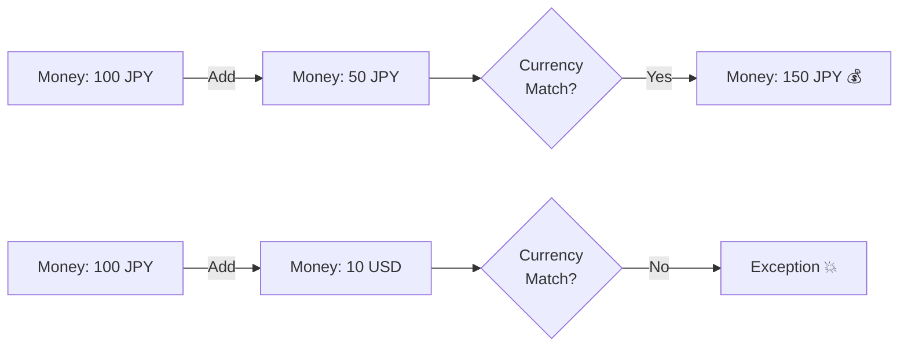

# 第10章：VO実装② Money（通貨・丸め・演算）💰🧮✨

（学内カフェ注文アプリ☕️🧾）

---

## 1) この章のゴール🎯✨

この章が終わると、こんな状態になります👇😆

* `decimal` をそのまま金額に使うのを卒業できる💪💰
* **金額＝Amount＋Currency** で表現できる🌍✨
* **同じ通貨どうしだけ足せる**、みたいなルールをコードで守れる🔒✅
* **丸め（Round）を散らさず、Moneyの中で統一**できる🧹✨
* テストで安心して運用できる🧪🛡️

（※今どきの前提として、.NET 10（LTS）が 2025-11-11 にリリースされていて、C# 14 と一緒に使えます📦✨）([Microsoft for Developers][1])

---

## 2) まず「decimalだけ金額」って何が怖いの？😱💥

たとえばカフェで、こういうコードを書きがち👇

* `decimal price = 480;`
* `decimal total = price * qty;`
* 税や割引も `decimal` で計算…

これ、**通貨が消える**んです😵
JPYなの？USDなの？EURなの？って情報がどこにもない…🌪️

さらに、丸めがバラバラになりがち👇

* ある場所では `Math.Round`
* ある場所では `decimal.Round`
* ある場所では「丸めずに放置」

結果：**合計が1円ズレる**とか、地味に嫌なバグが出ます😇💸

---

## 3) Money VOの設計の芯💎✨


Moneyは、最低これを持つのが鉄板です👇

* `Amount`（金額）💰
* `Currency`（通貨）🌍

通貨コードは基本 **ISO 4217（JPY, USD, EUR…）** を使うのが定番です📌([ISO][2])

そして、通貨には「小数桁（最小単位）」があるよね、って話🪙✨

* **JPYは小数0桁（円）**
* **USDは小数2桁（セント）**
  みたいな世界観です🌍💡（代表例）([ウィキペディア][3])

---

## 4) 金額の型は `decimal` が基本でOK🙂💰

C#では `decimal` が「金融・通貨計算に向く」型として位置づけられています✅([Microsoft Learn][4])

ただし！ここ大事👇😤
`decimal` を使っても **丸めが不要になるわけじゃない** です。
「丸め方をどこで統一するか」が勝負です🔥([Microsoft Learn][5])

---

## 5) 丸めの基本（超重要）🔁⚠️


### ✅ `decimal.Round` のデフォルトは「ToEven（銀行丸め）」

`decimal.Round(x, 2)` みたいに **modeを指定しない**と、
**MidpointRounding.ToEven**（いわゆる銀行丸め）になります🏦✨([Microsoft Learn][6])

例（小数2桁）👇

* `2.345 → 2.34`
* `2.355 → 2.36`
  みたいな挙動になることがあります🧠([Microsoft Learn][6])

### ✅ 業務では「AwayFromZero（いわゆる四捨五入寄り）」が欲しいことも多い

なので Money 側で **明示的に mode を決める**のが安全です🔒✨

---

## 6) 実装してみよう：Currency（通貨）🌍✨

まずは「通貨の情報」を1か所に集めます📦

```csharp
namespace Cafe.Domain;

public readonly record struct Currency
{
    public string Code { get; }
    public int MinorUnit { get; } // 小数桁（JPY=0, USD=2 みたいな）

    private Currency(string code, int minorUnit)
    {
        if (string.IsNullOrWhiteSpace(code)) throw new ArgumentException("Currency code is required.");
        code = code.Trim().ToUpperInvariant();

        if (code.Length != 3) throw new ArgumentException("Currency code must be 3 letters (ISO 4217).");
        if (minorUnit is < 0 or > 4) throw new ArgumentOutOfRangeException(nameof(minorUnit));

        Code = code;
        MinorUnit = minorUnit;
    }

    // 学習用に、まずは代表だけ持つ（必要になったら増やす）
    public static readonly Currency Jpy = new("JPY", 0);
    public static readonly Currency Usd = new("USD", 2);
    public static readonly Currency Eur = new("EUR", 2);

    public static Currency Of(string code) => code.Trim().ToUpperInvariant() switch
    {
        "JPY" => Jpy,
        "USD" => Usd,
        "EUR" => Eur,
        _ => throw new ArgumentException($"Unsupported currency: {code}")
    };

    public override string ToString() => Code;
}
```

ポイント💡

* 「小数桁（MinorUnit）」をここに置くと、**丸めが統一**できる✨
* 全通貨を網羅するのは大変なので、学習では代表だけでOK👌

---

## 7) 実装してみよう：Money（本体）💰✨


```mermaid
flowchart LR
    A[Money: 100 JPY] -->|Add| B[Money: 50 JPY]
    B --> Check{Currency<br>Match?}
    Check -- Yes --> Result[Money: 150 JPY 💰]
    
    C[Money: 100 JPY] -->|Add| D[Money: 10 USD]
    D --> Check2{Currency<br>Match?}
    Check2 -- No --> Error[Exception 💥]
```


狙いはこれ👇

* 生成時に **通貨の桁数に丸める**
* 足し算は **同じ通貨だけ**
* 比較も **同じ通貨だけ**

```csharp
namespace Cafe.Domain;

public readonly record struct Money : IComparable<Money>
{
    public decimal Amount { get; }
    public Currency Currency { get; }

    public Money(decimal amount, Currency currency, MidpointRounding rounding = MidpointRounding.ToEven)
    {
        Currency = currency;
        Amount = RoundToCurrency(amount, currency, rounding);
    }

    private static decimal RoundToCurrency(decimal value, Currency currency, MidpointRounding rounding)
        => decimal.Round(value, currency.MinorUnit, rounding);

    private static void EnsureSameCurrency(Money a, Money b)
    {
        if (a.Currency.Code != b.Currency.Code)
            throw new InvalidOperationException($"Currency mismatch: {a.Currency} vs {b.Currency}");
    }

    public Money Add(Money other)
    {
        EnsureSameCurrency(this, other);
        return new Money(Amount + other.Amount, Currency);
    }

    public Money Subtract(Money other)
    {
        EnsureSameCurrency(this, other);
        return new Money(Amount - other.Amount, Currency);
    }

    // 係数を掛ける（例：2杯分、割引、税率など）
    public Money Multiply(decimal factor, MidpointRounding rounding = MidpointRounding.ToEven)
        => new Money(Amount * factor, Currency, rounding);

    public int CompareTo(Money other)
    {
        EnsureSameCurrency(this, other);
        return Amount.CompareTo(other.Amount);
    }

    public static Money operator +(Money a, Money b) => a.Add(b);
    public static Money operator -(Money a, Money b) => a.Subtract(b);

    public override string ToString() => $"{Amount} {Currency.Code}";
}
```

ここが「Moneyにしてよかった〜😭✨」ってなる所👇

* `Currency mismatch` を **即死（例外）**させられる🧨
  → 変な合算が「静かに」起きない✅

---

## 8) 税・割引・丸めはどこでやる？🤔🧾

ここ、現場でめっちゃ差が出ます⚠️
「税の丸め」って、たとえば👇

* 明細ごとに丸めるのか
* 合計してから丸めるのか
  で結果が変わることがあります😇💸

学習用の落とし所としては👇

* **Moneyの中で丸めの道具は用意する**🧰✨
* 「どのタイミングで丸めるか」は、Order側（ルール側）で決める🧠🧾

たとえば「税込み金額」を簡易に作るなら👇

```csharp
namespace Cafe.Domain;

public static class MoneyExtensions
{
    // taxRate: 0.10m = 10%
    public static Money AddTax(this Money baseMoney, decimal taxRate)
    {
        // 例：四捨五入寄り（AwayFromZero）にしたい、などのルールはここで明示
        var tax = baseMoney.Multiply(taxRate, MidpointRounding.AwayFromZero);
        return baseMoney + tax;
    }
}
```

※ `decimal.Round` の既定が ToEven なので、**ここで意思を持って選ぶ**のが大事です🫶([Microsoft Learn][6])

---

## 9) 使ってみる：カフェの明細で合計を出す☕️➕💰

```csharp
namespace Cafe.Domain;

public sealed class OrderLine
{
    public string ItemName { get; }
    public Money UnitPrice { get; }
    public int Quantity { get; }

    public OrderLine(string itemName, Money unitPrice, int quantity)
    {
        if (string.IsNullOrWhiteSpace(itemName)) throw new ArgumentException("Item name is required.");
        if (quantity <= 0) throw new ArgumentOutOfRangeException(nameof(quantity));

        ItemName = itemName.Trim();
        UnitPrice = unitPrice;
        Quantity = quantity;
    }

    public Money LineTotal => UnitPrice.Multiply(Quantity);
}
```

これで「単価×数量」の時点で **Moneyが保たれる**ので、
どこまで行っても通貨が消えません🌍✨

---

## 10) テストを書こう（Moneyはテスト相性が最高）🧪💖

xUnitでサクッといきます👇

```csharp
using Cafe.Domain;
using Xunit;

public class MoneyTests
{
    [Fact]
    public void Add_SameCurrency_Works()
    {
        var a = new Money(100m, Currency.Jpy);
        var b = new Money(50m, Currency.Jpy);

        var sum = a + b;

        Assert.Equal(new Money(150m, Currency.Jpy), sum);
    }

    [Fact]
    public void Add_DifferentCurrency_Throws()
    {
        var jpy = new Money(100m, Currency.Jpy);
        var usd = new Money(1m, Currency.Usd);

        Assert.Throws<InvalidOperationException>(() => _ = jpy + usd);
    }

    [Fact]
    public void Jpy_RoundsTo0Decimals()
    {
        var m = new Money(100.6m, Currency.Jpy, MidpointRounding.AwayFromZero);
        Assert.Equal(new Money(101m, Currency.Jpy), m);
    }

    [Fact]
    public void Usd_RoundsTo2Decimals()
    {
        var m = new Money(1.239m, Currency.Usd, MidpointRounding.AwayFromZero);
        Assert.Equal(new Money(1.24m, Currency.Usd), m);
    }
}
```

テストで守れるポイント👇😍

* 通貨違いを足す事故🚫
* JPYが小数を持ってしまう事故🚫
* 丸め方のズレ事故🚫

---

## 11) ミニ演習（10〜20分）⏱️✨

### 演習A：Moneyを実戦っぽくする💪

1. `Money` に `IsZero` を追加してみよう🟰✨
2. `Money` に `Zero(Currency c)` を追加してみよう0️⃣💰

### 演習B：OrderLineの合計を作る🧾

* `List<OrderLine>` を足し上げて、注文合計を `Money` で返してみよう➕✨
* 通貨が混ざったら例外になるのも確認しよう🧨

---

## 12) 🤖 AI活用（Copilot / Codexで爆速）✨

### そのままコピペで使える指示例💬

* 「`Money` を `readonly record struct` で作って。**通貨違いの加算は例外**、生成時に **MinorUnit で丸め**、xUnitテストも付けて。丸めモードは引数で指定可能にして。」
* 「JPY(0桁)とUSD(2桁)の丸めテストケースを10個出して。境界値（ちょうど0.005とか）も含めて。」
* 「この Money 実装の危険ポイントをレビューして。『丸めのタイミング』『税の計算位置』『負の値の扱い』に注目して。」

AIは雛形とテスト案が得意なので、**最後の判断（どこで丸めるか）は人間が決める**のがコツです🧠🤝🤖

---

## 13) よくある落とし穴まとめ🧯✨

* ✅ **丸めをあちこちでやる** → Moneyに寄せる🧹
* ✅ **通貨がstringのまま散らばる** → `Currency` に集める📦
* ✅ **税の丸めタイミングが未定** → Orderのルールとして決める🧾
* ✅ `decimal.Round` の既定が ToEven なのを知らない → **明示しよう**🏦⚠️([Microsoft Learn][6])

---

## 14) まとめ（この章で得た武器）🗡️✨

* Money = Amount + Currency 🌍💰
* 丸めは Money に寄せて統一🔒
* 「同通貨だけ演算」をコードで守る✅
* テストが超書きやすくて、安心が増える🧪💖

---

次の章（第11章）では、Money以外の **Quantity / Percentage / Code** を量産できる形にして、プリミティブ地獄をどんどん減らしていこうね〜😆📦💎✨

[1]: https://devblogs.microsoft.com/dotnet/announcing-dotnet-10/?utm_source=chatgpt.com "Announcing .NET 10"
[2]: https://www.iso.org/iso-4217-currency-codes.html?utm_source=chatgpt.com "ISO 4217 — Currency codes"
[3]: https://en.wikipedia.org/wiki/ISO_4217?utm_source=chatgpt.com "ISO 4217"
[4]: https://learn.microsoft.com/en-us/dotnet/csharp/language-reference/language-specification/types?utm_source=chatgpt.com "Types - C# language specification"
[5]: https://learn.microsoft.com/en-us/dotnet/fundamentals/runtime-libraries/system-decimal?utm_source=chatgpt.com "System.Decimal struct - .NET"
[6]: https://learn.microsoft.com/ja-jp/dotnet/api/system.decimal.round?source=recommendations&view=net-10.0&utm_source=chatgpt.com "Decimal.Round Method (System)"
