# 第20章：集約② Order/OrderLine設計（VOの置き場所）🧾📦💎

この章は「学内カフェ注文アプリ☕️」で、**Order集約を“それっぽく完成”**させる回だよ〜！😆✨
ポイントはこれ👇

* **Order（集約ルート）**が、配下（OrderLine）の整合性をぜんぶ守る🏰✨
* **VO（Money/Quantity/ProductCodeなど）**は「値のまま」中に埋め込む💎
* **OrderLineをEntityにする？VOにする？**を、判断できるようになる🧠🧭

※なお、今の最新環境だと **.NET 10 + C# 14** が前提で進めやすいよ（C# 14は .NET 10 SDK で使える）🆕✨ ([Microsoft Learn][1])

---

## 1) まず「集約」って、ここが大事！📦✨

```mermaid
classDiagram
    note "Root controls access 🧱"
    class Order {
        +OrderId Id
        -List~OrderLine~ _lines
        +void AddLine()
        +Money Total()
    }
    class OrderLine {
        +ProductCode Code
        +Quantity Qty
        +Money Price
        +Money Subtotal
    }
    class Money {
        ((VO))
    }
    
    Order *-- OrderLine : Composes (1..*)
    OrderLine --> Money : Uses
```




集約はひとことで言うと…

**「一緒に正しさを守る範囲（整合性の境界）」**だよ🧸✨

そして鉄則👇

* 集約の外からは **集約ルート（Order）だけ** を触る🚪
* 配下の子（OrderLine）を、外から直接いじらせない🙅‍♀️
* 追加や変更は **Orderのメソッド経由**でやる✅

MicrosoftのDDDガイダンスでも「集約ルートが子の更新をコントロールする」考え方が明示されてるよ🧠✨ ([Microsoft Learn][2])

---

## 2) ここが本題：OrderLineは Entity？それとも VO？🤔🧾

迷うよね〜！でも判断のコツはあるよ✅✨

### ✅ OrderLineを「Entity」に寄せたいとき

こんな要件があるなら Entity が自然🆔✨

* 明細行を **個別に更新**したい（数量だけ変える、とか）🧮
* 明細行に **行ID（LineId）**がある/必要🧷
* 「この行」って指せる（UIで行を選んで編集する等）🖱️
* 将来、行単位でイベント・履歴を残したくなりそう📜

### ✅ OrderLineを「VO」に寄せたいとき

こういう世界なら VO でも全然OK💎✨

* 明細行はただの「値のセット」で、**丸ごと差し替え**で十分🔁
* 行にIDはいらない（「この行」より「この内容」）
* 「同じ商品はまとめる」運用で、行の概念が薄い🧾➡️🧾

---

## 3) この教材ではこう作るよ！🏗️✨（おすすめ構成）


今回は学習用に分かりやすく、そして実務でも使いやすい👇

* **Order：集約ルート（Entity）**🆔
* **OrderLine：集約の子Entity（ローカルID持ち）**🧾🆔
* **Money / Quantity / ProductCode：VO**💰📦🔤

理由はシンプル👇
「明細の追加・削除・数量変更・合計計算」を、Orderの責務として自然に置けるからだよ✅✨

---

## 4) 実装してみよう！🎮✨（最小で気持ちいい形）

> 目的：**Orderに「明細追加」「合計計算」を持たせる**➕💰

### 4-1) VO（値）たち：ID / ProductCode（例）💎

（Money/Quantityは前の章で作った想定でOKだよ〜！😆）

```csharp
public readonly record struct OrderId(Guid Value)
{
    public static OrderId New() => new(Guid.NewGuid());
    public override string ToString() => Value.ToString();
}

public readonly record struct OrderLineId(Guid Value)
{
    public static OrderLineId New() => new(Guid.NewGuid());
    public override string ToString() => Value.ToString();
}

public sealed record ProductCode
{
    public string Value { get; }

    public ProductCode(string value)
    {
        value = (value ?? "").Trim();

        if (value.Length is < 1 or > 20)
            throw new ArgumentException("商品コードは1〜20文字だよ！🧾");

        Value = value;
    }

    public override string ToString() => Value;
}
```

* `record struct` は **軽いID**に相性いいよ🧷✨（値として扱える）
* `ProductCode` は **文字列をそのまま使わない**のが大事！事故が減る😇💕

---

### 4-2) OrderLine（子Entity）🧾🆔

```csharp
public sealed class OrderLine
{
    public OrderLineId Id { get; }
    public ProductCode ProductCode { get; }
    public Quantity Quantity { get; private set; }
    public Money UnitPrice { get; }

    public Money Subtotal => UnitPrice * Quantity; // MoneyとQuantityに演算を用意してる想定✨

    internal OrderLine(OrderLineId id, ProductCode productCode, Quantity quantity, Money unitPrice)
    {
        Id = id;
        ProductCode = productCode;
        Quantity = quantity;
        UnitPrice = unitPrice;
    }

    internal void ChangeQuantity(Quantity newQuantity)
    {
        Quantity = newQuantity;
    }

    internal void Increase(Quantity addQuantity)
    {
        Quantity = Quantity + addQuantity;
    }
}
```

ポイント💡

* `internal` にして、**Order以外から勝手に作れない/変えられない**ようにするのがコツだよ🔒✨
* 「OrderLineを直接newできる」ようにすると、集約の境界が崩れやすい😱

---

### 4-3) Order（集約ルート）🏰✨

```csharp
public enum OrderStatus
{
    Draft,
    Confirmed,
    Canceled
}

public sealed class Order
{
    private readonly List<OrderLine> _lines = new();

    public OrderId Id { get; }
    public OrderStatus Status { get; private set; } = OrderStatus.Draft;

    public IReadOnlyList<OrderLine> Lines => _lines.AsReadOnly();

    public Order(OrderId id)
    {
        Id = id;
    }

    public void AddLine(ProductCode productCode, Quantity quantity, Money unitPrice)
    {
        EnsureEditable();

        // 同じ商品は「行を増やさず数量を足す」運用にしてみる🧾✨
        var existing = _lines.FirstOrDefault(x => x.ProductCode == productCode && x.UnitPrice == unitPrice);
        if (existing is not null)
        {
            existing.Increase(quantity);
            return;
        }

        var line = new OrderLine(OrderLineId.New(), productCode, quantity, unitPrice);
        _lines.Add(line);
    }

    public void ChangeLineQuantity(OrderLineId lineId, Quantity newQuantity)
    {
        EnsureEditable();

        var line = _lines.FirstOrDefault(x => x.Id == lineId)
            ?? throw new InvalidOperationException("その明細行が見つからないよ😢");

        line.ChangeQuantity(newQuantity);
    }

    public void RemoveLine(OrderLineId lineId)
    {
        EnsureEditable();

        var removed = _lines.RemoveAll(x => x.Id == lineId);
        if (removed == 0)
            throw new InvalidOperationException("その明細行が見つからないよ😢");
    }

    public Money Total()
    {
        // DraftでもConfirmedでも「合計」は出せる想定💰✨
        return _lines.Aggregate(Money.Zero(), (acc, line) => acc + line.Subtotal);
    }

    public void Confirm()
    {
        EnsureEditable();

        if (_lines.Count == 0)
            throw new InvalidOperationException("明細が0件だと確定できないよ🙅‍♀️");

        Status = OrderStatus.Confirmed;
    }

    public void Cancel()
    {
        if (Status == OrderStatus.Canceled) return;
        if (Status == OrderStatus.Confirmed)
            throw new InvalidOperationException("確定後キャンセル不可、みたいなルールならここで止めるよ🚫");

        Status = OrderStatus.Canceled;
    }

    private void EnsureEditable()
    {
        if (Status != OrderStatus.Draft)
            throw new InvalidOperationException("確定/キャンセル後は編集できないよ🔒");
    }
}
```

ここが「集約っぽさ」爆発ポイント🔥

* **Orderが全部ルールを持つ**（編集可能か、0件確定禁止、など）✅
* OrderLineは **Orderの内側の都合で動く子**👶✨
* 外からは `Lines` を読むだけ（いじらせない）🔒

---

## 5) ミニ演習（10〜20分）⏱️✨

### 演習A：合計計算をテストしよう🧪💰

* 2行追加して `Total()` が期待通りか確認✅
* 同じ商品を2回 `AddLine` したとき、行が増えず数量が増えるのを確認✅

### 演習B：ルールを1個だけ追加しよう🧠✨

おすすめ👇（どれか1つでOK！）

* 明細は最大10行まで📏
* Quantityの上限（例：1〜99）📦
* Confirmしたら `AddLine` できないのをテストで確認🔒🧪

---

## 6) テスト例（xUnitの雰囲気）🧪✨

```csharp
public class OrderTests
{
    [Fact]
    public void AddLine_SameProductAndPrice_MergesQuantity()
    {
        var order = new Order(OrderId.New());
        order.AddLine(new ProductCode("COFFEE"), Quantity.Of(1), Money.Jpy(300));
        order.AddLine(new ProductCode("COFFEE"), Quantity.Of(2), Money.Jpy(300));

        order.Lines.Count.Should().Be(1);
        order.Lines[0].Quantity.Should().Be(Quantity.Of(3));
        order.Total().Should().Be(Money.Jpy(900));
    }

    [Fact]
    public void Confirm_EmptyLines_Throws()
    {
        var order = new Order(OrderId.New());
        Assert.Throws<InvalidOperationException>(() => order.Confirm());
    }
}
```

※ `Quantity.Of`, `Money.Jpy`, `Money.Zero` は前章で作った想定だよ〜！（なければ自作でOK）💎✨

---

## 7) AI活用（Copilot / Codex）🤖✨：この章で強い使い方

### ✅ その1：テストケース案を量産してもらう🧪

こんな感じで投げると便利👇

* 「OrderのAddLine/RemoveLine/Confirmの**境界値テスト**案を20個出して」
* 「StatusがDraft/Confirmed/Canceledのとき、許可/禁止の表を作って」📊

### ✅ その2：レビュー観点をAIに出させる✅

* 「このOrder集約コード、**集約境界が破れてる箇所**ない？」
* 「VOっぽいのにミュータブルになってる部分ない？」😱

AIは速いけど、最後の判断（ルール決め）は人間がやるのが大事だよ🫶✨

---

## 8) ありがちな落とし穴（超重要）⚠️😵‍💫

* `public set;` を開けて、外からOrderLineを改造される🔓➡️崩壊
* `List<OrderLine>` をそのまま公開して、勝手に `Add` される📦➡️崩壊
* 「OrderLineを外でnewして渡す」設計にして、境界があいまいになる🌀
* Money/QuantityをミュータブルにしてHash系で事故る（前章のやつ！）😱

---

## 9) まとめ（この章でできるようになったこと）🎉✨

* 集約ルート（Order）が、配下（OrderLine）の整合性を守る感覚がつかめた🏰
* OrderLineを **Entity/VOどっちにするかの判断軸**ができた🧭
* `AddLine` と `Total` を「ドメインっぽく」実装できた➕💰💕

---

次の第21章は、いよいよ **判断チェックリスト**を作って「迷ったら戻れる軸」を完成させるよ✅🧠✨

[1]: https://learn.microsoft.com/en-us/dotnet/csharp/whats-new/csharp-14?utm_source=chatgpt.com "What's new in C# 14"
[2]: https://learn.microsoft.com/en-us/azure/architecture/microservices/model/tactical-ddd?utm_source=chatgpt.com "Using tactical DDD to design microservices"
