# 第23章：境界① DTO/API/画面入力 → ドメイン変換🌉🧾✨

この章はね、ひとことで言うと…
**「外から来たグチャグチャ入力を、ドメインに入れる前に“きれいに整える”」回だよ〜！**😆🧼✨
（ここが弱いと、VO/Entityを頑張ってもドメインがすぐ汚れちゃう…🥲）

---

## この章でできるようになること🎯✨

* DTO（API/画面入力）を **ドメインに持ち込まない** 🧳🚫
* 入口で **VO化して検証 → 中はスッキリ** 💎✨
* 失敗したときに、ユーザーへ **わかりやすくエラー返却** 🫶📨
* Minimal APIで **.NET 10の組み込みバリデーション** を使えるようになる✅
  （`AddValidation()` で DataAnnotations が効くやつ！） ([Microsoft Learn][1])

---

## 23-1. まず「境界」ってどこ？🚪🧱


境界はだいたいここ👇

* 🌐 **APIの入口**（HTTPで受け取る JSON / Query / Header）
* 🖥️ **画面入力の入口**（フォーム・UI）
* 🗄️ **DBの出口/入口**（永続化は次章で本格的にやるよ）

そして超大事ポイント💡
✅ **ドメイン（Entity/VO）は“入力の都合”を知らなくていい**
DTOの `string` や `int` の都合をドメインに流し込むと、すぐに「プリミティブ地獄」になるの〜😇🔢

---

## 23-2. 入口が弱いと起きる事故あるある😱💥

たとえば「学内カフェ注文アプリ」☕️で…

* `"quantity": 0` が通ってしまう → 注文が “無料で増殖” 😇📈
* `"currency": "yen"` と `"JPY"` が混ざる → Moneyがカオス🌪️💰
* `"email": "aaa"` が通る → 連絡不能📧🚫
* ドメインのあちこちで `if (string.IsNullOrWhiteSpace(...))` 地獄 😵‍💫🧟‍♀️

だから入口は、**①形チェック → ②VO化 → ③ドメイン生成** の3段階にしよ💪✨

---

## 23-3. 入口の「3ステップ変換」🪄✨

```mermaid
flowchart LR
    DTO["DTO (Raw)"] --> Val["Validation (Shape)"]
    Val --> Factory["VO Factory (Rule)"]
    Factory --> Domain["Domain Object 💎"]
```




### ✅ ステップ①：DTOで受け取る（外の形そのまま）📦

* API/画面に都合がいい形でOK
* ただし **DTOはドメインと別プロジェクト/別名前空間** がおすすめ🏠🚪

### ✅ ステップ②：形の検証（DataAnnotationsなど）🧪

* 必須、範囲、最大長、Email形式…みたいな「最低限の形チェック」
* .NET 10 では Minimal API に **組み込み検証**が入ったよ（`AddValidation()`）✅ ([Microsoft Learn][1])

### ✅ ステップ③：VO化してドメイン生成（ここが本丸）💎👑

* `Email` / `Money` / `Quantity` / `ProductCode` みたいにVOへ変換
* ここで “ドメインのルール” を守る（第16〜17章のノリ！）🔒✨

---

## 23-4. 実装してみよ！（Minimal API + DTO → ドメイン変換）🛠️🚀

ここでは **「DTOの形エラーは400」**、
**「形はOKだけどドメイン的にNGは422」** にしてみるよ🙂✨
（ユーザー体験がめちゃ良くなる〜🫶）

---

### ① DTO（入力モデル）を作る📦🧾

```csharp
using System.ComponentModel.DataAnnotations;

public sealed record CreateOrderRequest(
    [Required, EmailAddress] string CustomerEmail,
    [Required, StringLength(3, MinimumLength = 3)] string Currency, // "JPY" など想定
    [Required, MinLength(1)] IReadOnlyList<CreateOrderLineRequest> Lines
);

public sealed record CreateOrderLineRequest(
    [Required, StringLength(20)] string ProductCode,
    [Range(1, 99)] int Quantity,
    [Range(typeof(decimal), "0.01", "999999")] decimal UnitPrice
);
```

👉 ここは「形」だけを見るイメージ！
（ドメインの厳密ルールはVO側でやるよ💎）

---

### ② ドメイン変換で使う Result（簡易版）⚠️➡️✅

```csharp
public sealed record Error(string Code, string Message, string? Target = null);

public readonly record struct Result<T>(T? Value, IReadOnlyList<Error> Errors)
{
    public bool IsSuccess => Errors.Count == 0;

    public static Result<T> Ok(T value) => new(value, Array.Empty<Error>());
    public static Result<T> Fail(params Error[] errors) => new(default, errors);
}
```

---

### ③ VO（例：Email / Quantity / Money / ProductCode）💎✨

```csharp
using System.Text.RegularExpressions;

public sealed record Email
{
    private Email(string value) => Value = value;
    public string Value { get; }

    public static Result<Email> TryCreate(string? input)
    {
        if (string.IsNullOrWhiteSpace(input))
            return Result<Email>.Fail(new("email.required", "メールアドレスは必須だよ📧", "customerEmail"));

        // ゆるめの例（本格は DataAnnotations + 追加ルール等で調整）
        if (!Regex.IsMatch(input, @"^[^@\s]+@[^@\s]+\.[^@\s]+$"))
            return Result<Email>.Fail(new("email.invalid", "メールアドレスの形が変だよ😢", "customerEmail"));

        return Result<Email>.Ok(new Email(input.Trim()));
    }
}

public readonly record struct Quantity(int Value)
{
    public static Result<Quantity> TryCreate(int value)
        => value is >= 1 and <= 99
            ? Result<Quantity>.Ok(new Quantity(value))
            : Result<Quantity>.Fail(new("quantity.invalid", "数量は1〜99だよ📦", "quantity"));
}

public sealed record ProductCode
{
    private ProductCode(string value) => Value = value;
    public string Value { get; }

    public static Result<ProductCode> TryCreate(string? input)
    {
        if (string.IsNullOrWhiteSpace(input))
            return Result<ProductCode>.Fail(new("productCode.required", "商品コードは必須だよ🏷️", "productCode"));

        var v = input.Trim();
        return Result<ProductCode>.Ok(new ProductCode(v));
    }
}

public sealed record Money
{
    private Money(decimal amount, string currency)
    {
        Amount = amount;
        Currency = currency;
    }

    public decimal Amount { get; }
    public string Currency { get; }

    public static Result<Money> TryCreate(decimal amount, string? currency)
    {
        if (amount <= 0)
            return Result<Money>.Fail(new("money.amount.invalid", "金額は0より大きくしてね💰", "unitPrice"));

        if (string.IsNullOrWhiteSpace(currency) || currency.Trim().Length != 3)
            return Result<Money>.Fail(new("money.currency.invalid", "通貨は3文字（例: JPY）だよ🌍", "currency"));

        return Result<Money>.Ok(new Money(amount, currency.Trim().ToUpperInvariant()));
    }
}
```

---

### ④ DTO → ドメイン生成（マッピング関数）🌉✨

```csharp
public static class CreateOrderMapper
{
    public static Result<Order> ToDomain(CreateOrderRequest dto)
    {
        var errors = new List<Error>();

        var emailR = Email.TryCreate(dto.CustomerEmail);
        if (!emailR.IsSuccess) errors.AddRange(emailR.Errors);

        // 通貨はまとめて使いたいので、先に正規化だけして Money に渡す
        var currency = dto.Currency?.Trim().ToUpperInvariant();

        var lines = new List<OrderLine>();
        for (var i = 0; i < dto.Lines.Count; i++)
        {
            var line = dto.Lines[i];

            var codeR = ProductCode.TryCreate(line.ProductCode);
            if (!codeR.IsSuccess) errors.AddRange(FixIndex(codeR.Errors, i));

            var qtyR = Quantity.TryCreate(line.Quantity);
            if (!qtyR.IsSuccess) errors.AddRange(FixIndex(qtyR.Errors, i));

            var priceR = Money.TryCreate(line.UnitPrice, currency);
            if (!priceR.IsSuccess) errors.AddRange(FixIndex(priceR.Errors, i));

            if (codeR.IsSuccess && qtyR.IsSuccess && priceR.IsSuccess)
                lines.Add(new OrderLine(codeR.Value!, qtyR.Value, priceR.Value!));
        }

        if (errors.Count > 0) return Result<Order>.Fail(errors.ToArray());

        return Result<Order>.Ok(Order.Create(emailR.Value!, currency!, lines));
    }

    private static IEnumerable<Error> FixIndex(IEnumerable<Error> errors, int index)
        => errors.Select(e => e with { Target = $"lines[{index}].{e.Target}" });
}
```

---

### ⑤ ドメイン側（超ミニ版）🧾🏠

```csharp
public sealed class Order
{
    private Order(Guid id, Email customerEmail, string currency, IReadOnlyList<OrderLine> lines)
    {
        Id = id;
        CustomerEmail = customerEmail;
        Currency = currency;
        Lines = lines;
    }

    public Guid Id { get; }
    public Email CustomerEmail { get; }
    public string Currency { get; }
    public IReadOnlyList<OrderLine> Lines { get; }

    public static Order Create(Email email, string currency, IReadOnlyList<OrderLine> lines)
        => new(Guid.NewGuid(), email, currency, lines);
}

public sealed record OrderLine(ProductCode ProductCode, Quantity Quantity, Money UnitPrice);
```

---

### ⑥ API（Minimal API）でつなぐ🚀✨

.NET 10 では Minimal API に **組み込みバリデーション**が追加されたよ〜！
`builder.Services.AddValidation();` を入れると、DataAnnotations が効く✅ ([Microsoft Learn][1])

```csharp
using Microsoft.AspNetCore.Http;

var builder = WebApplication.CreateBuilder(args);

builder.Services.AddEndpointsApiExplorer();
builder.Services.AddSwaggerGen();

// ✅ .NET 10: Minimal API validation（DataAnnotations）
builder.Services.AddValidation(); // ←これ！ :contentReference[oaicite:3]{index=3}

var app = builder.Build();

app.MapPost("/orders", (CreateOrderRequest request) =>
{
    // ここに来た時点で「形エラー（必須/範囲/長さ）」は 400 で自動返却される✨

    var domainR = CreateOrderMapper.ToDomain(request);
    if (!domainR.IsSuccess)
    {
        // 形はOK、でもドメイン変換でNG → 422 にしてみる🙂
        return TypedResults.Problem(
            statusCode: StatusCodes.Status422UnprocessableEntity,
            title: "注文として受け付けられなかったよ😢",
            detail: "入力の形はOKだけど、内容がルールに合ってないみたい🙏",
            extensions: new Dictionary<string, object?> { ["errors"] = domainR.Errors }
        );
    }

    var order = domainR.Value!;
    return TypedResults.Created($"/orders/{order.Id}", new { orderId = order.Id });
});

app.Run();
```

---

## 23-5. エラー返却を “標準フォーマット” に寄せる（ProblemDetails）📨🧩

ASP.NET Core では、エラーレスポンスの標準として **ProblemDetails（RFC 7807）** を使えるよ🧠✨ ([IETF Datatracker][2])
そして .NET 10 の Minimal API バリデーションは、失敗時に 400 を返す仕組みが用意されてる✅ ([Microsoft Learn][1])

さらに、**`IProblemDetailsService`** を実装/登録すると、Minimal API の検証エラー応答をカスタムできるよ🎨✨ ([Microsoft Learn][3])

（ここは“やり込み”なので、まずは「422で errors を返せた！」ができればOK🙆‍♀️✨）

---

## 23-6. テストのコツ（境界はテストしやすい！）🧪💖

入口変換は、DBもHTTPもいらないからテストが超ラク！😆✨

* ✅ DTO → ドメイン変換が成功するケース
* ✅ どの入力で、どの Error が出るか（Targetも含めて）

例：xUnit（超ミニ）

```csharp
using Xunit;

public class CreateOrderMapperTests
{
    [Fact]
    public void Invalid_Email_Should_Fail()
    {
        var dto = new CreateOrderRequest(
            CustomerEmail: "aaa",
            Currency: "JPY",
            Lines: new[] { new CreateOrderLineRequest("COFFEE", 1, 300m) }
        );

        var r = CreateOrderMapper.ToDomain(dto);

        Assert.False(r.IsSuccess);
        Assert.Contains(r.Errors, e => e.Code == "email.invalid");
    }
}
```

---

## 23-7. Copilot/Codexの使いどころ（時短ポイント）🤖⚡️

### 使うと気持ちいいやつ😍

* DTOの雛形（DataAnnotations込み）📦
* Mapperの骨格（エラーの集め方まで）🌉
* テストケースの洗い出し（境界値・異常系）🧪✨

### そのまま鵜呑みにしないやつ⚠️

* 「通貨」「丸め」「数量上限」みたいな **業務ルール**（これは人間が決める👩‍⚖️✨）

**おすすめプロンプト例**（そのまま投げてOKだよ）💬✨

* 「CreateOrderRequest DTO を record で作って。DataAnnotations も付けて」
* 「DTO→Domain の Mapper を、Result でエラー収集する形で書いて」
* 「Order作成の異常系テストを10個、境界値も混ぜて提案して」

---

## ミニ演習（10〜20分）✍️☕️✨

### 演習A：DTO → ドメイン変換を完成させよう💪

* `Currency` を `"jpy"` で送っても `"JPY"` に正規化されるようにする🌍✨
* `lines[0].quantity` みたいな **Target整形** をちゃんと付ける🎯

### 演習B：エラーの見せ方（UX）を良くしよう🫶

* 422 の `ProblemDetails` に `errors` を入れる（もうやったね！）🎉
* `title` と `detail` をユーザー向けにやさしくする🙂✨

---

## この章の「持ち帰り」まとめ🍀✨

* DTOは外の都合、ドメインは内の都合🏠🌉
* **入口でVO化して検証 → 中を安心して書ける** 💎✨
* .NET 10 の Minimal API なら `AddValidation()` で DataAnnotations 検証が効く✅ ([Microsoft Learn][1])
* エラーは ProblemDetails（RFC 7807）に寄せると気持ちいい📨✨ ([IETF Datatracker][2])

---

次は **第24章（永続化＆テスト＆リファクタ＆AI総仕上げ）** だね🎓✨
そこで **EF CoreでVOをどう保存する？** とか **テスト戦略** を“現実運用っぽく”まとめていくよ〜！😆🧱🧪

[1]: https://learn.microsoft.com/en-us/aspnet/core/release-notes/aspnetcore-10.0?view=aspnetcore-10.0 "What's new in ASP.NET Core in .NET 10 | Microsoft Learn"
[2]: https://datatracker.ietf.org/doc/html/rfc7807?utm_source=chatgpt.com "RFC 7807 - Problem Details for HTTP APIs - Datatracker - IETF"
[3]: https://learn.microsoft.com/en-us/aspnet/core/fundamentals/minimal-apis?view=aspnetcore-10.0 "Minimal APIs quick reference | Microsoft Learn"
