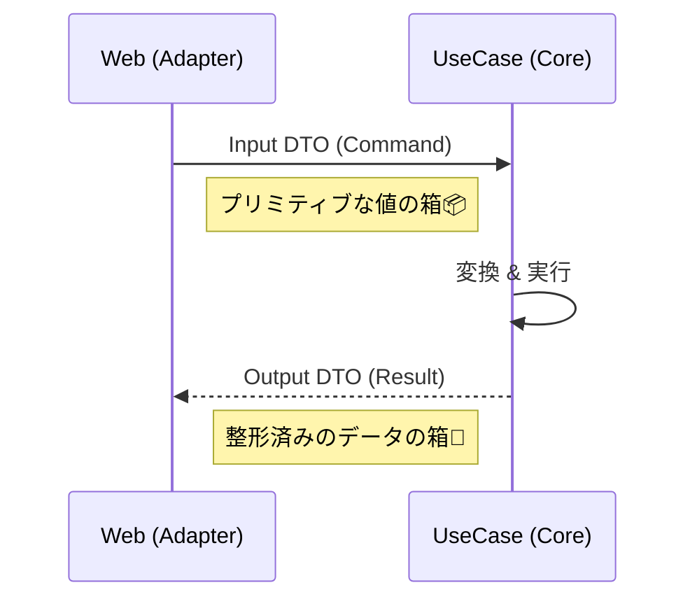

# 第23章　Inbound Port設計②：DTO（入力/出力）を作る📦✨

前の章で「ユースケースの入口＝Inbound Port（interface）」を用意したよね？😊
この章では、そのPortが受け取る **入力DTO** と、返す **出力DTO** を作っていくよ〜！🧁💕

※いまの最新だと、C# 14 が “最新のC#” で .NET 10 に対応してるよ🆕✨ ([Microsoft Learn][1])
（.NET 10 は 2025/11/11 リリース、2026/01/13 時点で 10.0.2 が最新パッチとして載ってる） ([Microsoft Learn][2])

---

## 1) DTOってなに？なんで必要？🤔📦



```mermaid
sequenceDiagram
    participant Web as Web (Adapter)
    participant UC as UseCase (Core)
    
    Web->>UC: Input DTO (Command)
    Note right of Web: プリミティブな値の箱📦
    UC->>UC: 変換 & 実行
    UC-->>Web: Output DTO (Result)
    Note left of UC: 整形済みのデータの箱🎁
```

DTO（Data Transfer Object）は一言でいうと…

* **「データを運ぶためだけの入れ物」**📦🚚
* ロジック（振る舞い）じゃなく、**項目（プロパティ）中心**✨
* 入力用（Input）と出力用（Output）を分けるのが基本だよ😊

### なぜDomain型をそのまま外へ出さないの？🙅‍♀️🏠

理由はめちゃ大事！

* **Domainが“外部都合”に汚染される**（JSON都合、画面都合、DB都合）🧼💦
* Domainが変わるたびに、APIや画面まで連鎖で壊れやすい🍝😭
* “見せちゃいけない情報”が混ざりやすい（内部IDや管理用フラグ等）🔒😇

だから、**Coreの外へはDTOで出す**が安定！🛡️✨

---

## 2) Inbound DTOの設計ルール（超重要）✅✨

ここ、設計の芯だよ❤️

### ✅ Input DTO（入力）

* 外から来る値は **プリミティブ寄り**（string/int/decimal など）で受ける🧺
* 受けた後、UseCase内部で Domain の ValueObject に変換する🔁💎
* 必須・任意をハッキリ（nullabilityで表現）🧠✨

### ✅ Output DTO（出力）

* 画面やAPIが欲しい形に “整形した結果” を返す🎁
* DomainのEntityを丸ごと返さない（プロパティを絞る）✂️✨
* 日時・金額なども「表示しやすい形」でOK（ただし責務を考える）🕒💰

---

## 3) どこにDTOを置くの？📁👀

おすすめはこのどちらか：

* **Application（UseCase側）に置く**：Portが使う型だから自然😊
* **Portsと同じ近くに置く**：`Application/Ports` とか `Application/Dtos` とか📦

> ポイント：**ControllerやHTTPの事情（属性とか）はCore側に入れない**🚫🌐
> （必要なら Controller 側に “API用Request/Response” を作って、そこからUseCase DTOへ変換するのがキレイ✨）

---

## 4) カフェ注文アプリ：DTOを作ってみよう☕🧾✨

ここでは「注文作成」を例にするね！

### 想定ユースケース

* 注文作成（CreateOrder）
* 入力：注文者名 / 注文明細（商品IDと数量）
* 出力：注文ID / 合計金額 / 作成日時

---

## 5) DTOの実装例（C#）🧑‍💻✨

### (1) 入力DTO（Command / Input）📥

* “外から来る値”を運ぶだけ！

```csharp
namespace CafeOrder.Core.Application.Dtos;

public sealed record OrderItemInputDto(
    string MenuItemId,
    int Quantity
);

public sealed record CreateOrderInputDto(
    string CustomerName,
    IReadOnlyList<OrderItemInputDto> Items
);
```

（record は「不変っぽく扱いやすいDTO」に相性いいよ😊💎）

### (2) 出力DTO（Result / Output）📤

* UI/APIが欲しい結果を返す！

```csharp
namespace CafeOrder.Core.Application.Dtos;

public sealed record CreateOrderOutputDto(
    Guid OrderId,
    decimal TotalAmount,
    string Currency,
    DateTimeOffset CreatedAt
);
```

---

## 6) Port（UseCase interface）にDTOを刺す🧩🔌

前章のPortを、DTO付きにするとこうなるよ！

```csharp
using CafeOrder.Core.Application.Dtos;

namespace CafeOrder.Core.Application.Ports.Inbound;

public interface ICreateOrderUseCase
{
    Task<CreateOrderOutputDto> HandleAsync(CreateOrderInputDto input, CancellationToken ct);
}
```

> ここが気持ちいいところ：
> **外（Controller）がこのPortを呼べば、Coreに正しい形で届く**🚪✨

---

## 7) 変換（DTO ↔ Domain）はどこでやる？🔁🧼

結論：**Coreの中でも、UseCase側でDomainへ変換する**のが初心者に優しいよ😊
（HTTP由来の変換は Controller 側に寄せるのが定石✨）

### よくある変換の流れ（イメージ）🗺️

* Controller：HTTP Request →（必要なら）UseCase Input DTO
* UseCase：Input DTO → Domain（Entity/VO）へ変換して実行
* UseCase：Domain結果 → Output DTO に整形
* Controller：Output DTO → HTTP Response

> この章の合言葉：**「変換で“外の都合”を止める」**🛑✨

---

## 8) バリデーションはどこでやる？✅🧯

「全部Controllerでチェックすべき？」って迷いがちだけど、分けると楽！

### ✅ Controller側でやる（形のチェック）

* null/空
* 数値がパースできる
* 配列が空じゃない など

### ✅ UseCase側でやる（業務ルール）

* 数量は1以上
* 同じ商品を2回頼んだらまとめる？
* 存在しない商品はダメ など

“業務ルール”は **Core（UseCase/Domain）に残す**のが勝ち筋だよ🛡️❤️

---

## 9) DTO命名のおすすめ（迷ったらこれ）🧠✨

初心者だと命名で溺れやすいので、最初は固定でOK！

* 入力：`CreateOrderInputDto`（または `CreateOrderCommand`）
* 出力：`CreateOrderOutputDto`（または `CreateOrderResult`）
* 明細：`OrderItemInputDto` みたいに役割が分かる名前📛

> 大事なのは「統一感」だよ〜😊🧡

---

## 10) AI（Copilot/Codex等）に頼むときのコツ🤖🪄

AIにDTOを作らせるの、めちゃ相性いい！
でも **境界ルールだけは人が守る**🚦✨

### 使えるプロンプト例💬

* 「注文作成の Input/Output DTO を record で作って。Domain型は使わず、primitive中心で」
* 「UseCaseのPort interfaceを、Input DTO と Output DTO を使う形で提案して」

### ただし注意⚠️

* AIは油断すると **Domain Entity をそのまま返す**案を出してくる😂
  → その瞬間に「それはやめよっか😊」って止める！🛑✨

---

## 11) チェックリスト✅✅✅

作り終えたら、ここ見てね！

* [ ] DomainのEntity/VOをそのまま外へ出してない？🙅‍♀️
* [ ] Portが受け取る型・返す型はDTOになってる？📦
* [ ] JSON属性やHTTP都合がCore側に入ってない？🚫🌐
* [ ] 変換の場所が決まってる？（外の都合がCoreに漏れてない？）🧼✨

---

## 12) ミニ練習🎯☕

1. `ListOrdersOutputDto` を作ってみよう（注文一覧用）📃✨
2. `OrderSummaryDto`（注文ID、合計、作成日時）を作って一覧に使ってみよう🧾
3. 入力DTOの `Items` が空のとき、どこで弾くか決めてみよう（Controller？UseCase？）🤔✅

---

次の章では、いよいよ **Inbound Adapter（Controller）を“薄く”作る**よ〜！🌐🙂
DTOができたから、Controllerはスッキリしやすくなるはず😆✨

[1]: https://learn.microsoft.com/en-us/dotnet/csharp/whats-new/csharp-14?utm_source=chatgpt.com "What's new in C# 14"
[2]: https://learn.microsoft.com/ja-jp/lifecycle/products/microsoft-net-and-net-core?utm_source=chatgpt.com "Microsoft .NET および .NET Core - Microsoft Lifecycle"
