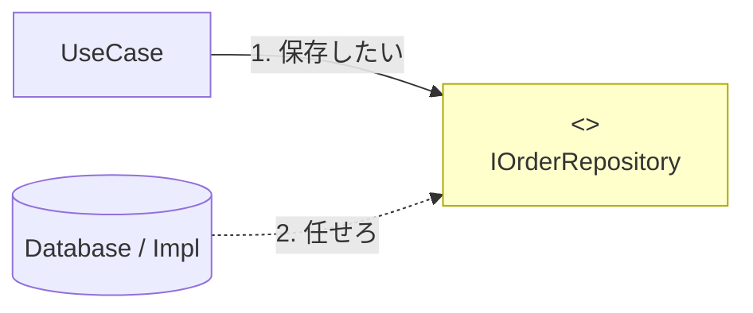

# 第25章　Outbound Port設計①：Repositoryの約束🗄️📝

ここからいよいよ「Coreが外部（保存先）にお願いする約束＝Outbound Port」を作るよ〜！😆
第25章は **Repository（リポジトリ）** を “Port（interface）” として定義する回です🔌✨

---

## 1) 今日やること（ゴール）🎯💖

✅ **Coreが欲しいのは「保存できること」「取り出せること」だけ**
✅ だから **IOrderRepository（interface）** をCore側に置く
✅ DBの名前も、EF Coreも、SQLも、ファイルも… **全部まだ出さない**🙅‍♀️🧼

> Repositoryは「ドメインと保存の間を仲介して、メモリ上のコレクションみたいに扱えるようにするもの」って定義が有名だよ📚✨ ([martinfowler.com][1])

---

## 2) Outbound Port（Repository）って何？🤔🔌



```mermaid
flowchart LR
    Core[UseCase]
    Repo[<<interface>><br>IOrderRepository]
    DB[(Database / Impl)]
    
    Core -->|1. 保存したい| Repo
    DB -.->|"2. 任せろ"| Repo
    
    style Repo fill:#ffffcc,stroke:#aaaa00
```

Core（UseCase）がやりたいのは例えばこんな感じ👇

* 注文を保存したい🧾➡️💾
* 注文一覧を取得したい📃✨
* 注文IDで探したい🔎

でもCoreはこう思ってるわけ👇

* 「DB？知らん！😇」
* 「SQL？知らん！😇」
* 「とにかく *保存* と *取得* ができればいい！💪」

だから、Coreは **“できることの約束” だけを interface にする**よ〜！📝✨

---

## 3) Repository設計の超重要ルール5つ🧠✨

### ルール①：Coreが欲しい言葉で約束する（DB言葉は禁止）🚫🗃️

✅ `OrderId` や `Order` を使う
❌ `DbContext` / `DbSet` / `IQueryable` / `Include` とかをPortに出さない🙅‍♀️

（それ出すと「外の都合」がCoreに漏れる＝境界が溶ける🍨💦）

---

### ルール②：「何でもCRUDできる汎用IRepository<T>」は最初は作らない🧯

汎用にすると一見キレイだけど、だいたい後でこうなる👇

* 「フィルタしたい」→ Expression をPortに出す
* 「Includeしたい」→ さらにDB都合が漏れる
* 「最適化したい」→ PortがDB操作パネル化😇

なので今回は **注文（Order）専用**で行こう☕🧾✨

---

### ルール③：Aggregate RootごとにRepositoryを作る感覚🌳✨

DDD寄りの設計では **集約（Aggregate）ごとにRepository** を用意するのが基本の考え方だよ〜📚 ([Microsoft Learn][2])
今回の題材なら「Order」が集約ルートって感じだね👑🧾

---

### ルール④：I/Oは基本 async にする（保存先は遅いから）⏳➡️⚡

DB・外部サービス・ファイルは遅いのが普通！
Repositoryの約束は **async前提**にしておくと自然だよ😊✨

---

### ルール⑤：CancellationTokenを最後に付ける（今どき作法）🧯🧵

キャンセルは「呼び出し側が興味なくなったから止めたい」って超よくあるやつ！
.NETのガイドラインでも **キャンセルトークンを受け取るのは一般的**って扱いだよ📌 ([Microsoft Learn][3])

---

## 4) IOrderRepository：まずは最小の約束にしよう✂️📝

今回の要件（注文作成／注文一覧）に必要な最小セットはこんな感じでOK👇

* `AddAsync`：注文を追加する
* `GetByIdAsync`：IDで1件取る（無ければnull）
* `ListAsync`：一覧を取る（まずは全部でOK）

> 「一覧のページング？」とか「検索条件？」は、必要になった瞬間に足すのが勝ち！😊（YAGNI寄り✨）

---

## 5) 実装例（Core側に置くPort）🧩🔌

ファイル例：`Core/Application/Ports/Outbound/IOrderRepository.cs` みたいな場所に置く想定だよ📦✨

```csharp
using System.Threading;

namespace CafeOrders.Core.Application.Ports.Outbound;

public interface IOrderRepository
{
    Task AddAsync(Order order, CancellationToken cancellationToken);

    Task<Order?> GetByIdAsync(OrderId id, CancellationToken cancellationToken);

    Task<IReadOnlyList<Order>> ListAsync(CancellationToken cancellationToken);
}
```

### 💡ポイント解説（やさしめ）😊🫶

* `Order` / `OrderId` みたいに **ドメインの言葉**で約束してるのが偉い✨
* `IReadOnlyList<Order>` にしておくと「内部でList化して返す」意図が伝わりやすいよ📃
* `Order?` は「見つからないかも」って意味（null許容）だよ〜🔎💭

---

## 6) OrderId / Order も “外に漏れない形” に🧾💎

すでに前の章で作っててもOKなんだけど、Repositoryの約束が分かりやすくなるので最小例だけ置くね👇

```csharp
namespace CafeOrders.Core.Domain;

public readonly record struct OrderId(Guid Value);

public sealed class Order
{
    public OrderId Id { get; }
    public DateTimeOffset OrderedAt { get; }

    public Order(OrderId id, DateTimeOffset orderedAt)
    {
        Id = id;
        OrderedAt = orderedAt;
    }
}
```

---

## 7) UseCase側はこう使う（Core → Portに依存）🧭✨

UseCaseは **IOrderRepositoryしか知らない** のがポイントだよ🛡️

```csharp
using CafeOrders.Core.Application.Ports.Outbound;
using CafeOrders.Core.Domain;

namespace CafeOrders.Core.Application.UseCases;

public sealed class CreateOrderUseCase
{
    private readonly IOrderRepository _orders;

    public CreateOrderUseCase(IOrderRepository orders)
    {
        _orders = orders;
    }

    public async Task<OrderId> HandleAsync(CancellationToken cancellationToken)
    {
        var orderId = new OrderId(Guid.NewGuid());
        var order = new Order(orderId, DateTimeOffset.UtcNow);

        await _orders.AddAsync(order, cancellationToken);

        return orderId;
    }
}
```

この状態だと、次の章（第26章）で **InMemory実装** を作るだけで動くようになるよ😆🧪📦

---

## 8) “やりがち事故” を先に潰すコーナー🚧😭➡️😊

### ❌事故①：RepositoryがDTOを返し始める📦💥

Repositoryは基本 **ドメイン（Order）を返す**のが自然！
DTOは **Inbound/Outbound（APIの入出力）側**で使うことが多いよ〜🔁✨

### ❌事故②：Repositoryが「画面都合の検索」を全部背負う🎮💥

「画面のフィルタ全部をRepositoryに…」ってやるとPortが肥大化しがち🍔🍟
まずは **UseCaseで必要な操作だけ** 用意しよ😊✨

### ❌事故③：`IQueryable` を返す（ほぼ漏れる）🫠

`IQueryable` 返すと、呼び出し側がLINQを書いて、結果としてDB都合がCoreに侵入しやすいよ〜🙅‍♀️🧼

---

## 9) AI（Copilot/Codex等）に頼むときのコツ🤖✨

AIに雛形を作らせるのは超アリ！ただし **境界ルールは人間が守る**🚦✨

### 使える指示例（コピペOK）📋💞

* 「C#で `IOrderRepository` を作って。メソッドは Add/GetById/List。PortなのでDbContextやIQueryableは絶対に出さないで」
* 「CancellationToken を必ず最後の引数にして」

> C# 14 が .NET 10 で最新として案内されてるので、言語機能・SDKもその前提でOKだよ🆕✨ ([Microsoft Learn][4])

---

## 10) ミニ演習（手を動かすやつ）✍️😆

### 演習①：Existsを足してみよ🔎✨

「注文IDが存在するか」だけ欲しい場面もあるよね！

```csharp
Task<bool> ExistsAsync(OrderId id, CancellationToken cancellationToken);
```

これをPortに追加してみてね😊

### 演習②：Listに上限を付けてみよ📃🧯

大量データが来ると危ないので、まずは件数だけ制限！

```csharp
Task<IReadOnlyList<Order>> ListRecentAsync(int take, CancellationToken cancellationToken);
```

---

## 11) 章末チェックリスト✅💖

* [ ] Core側に `IOrderRepository`（interface）がある🔌
* [ ] Portは **ドメインの言葉**で話してる（DB用語ゼロ）🧼
* [ ] asyncになってる（保存先は遅い前提）⚡
* [ ] `CancellationToken` が最後に付いてる🧵
* [ ] 次章で InMemory実装に差し替えできそう！🔁😆

---

次の第26章で、いよいよ **InMemoryのOutbound Adapter** を作って「動いたー！🎉」を体験しようね🧪📦✨

[1]: https://martinfowler.com/eaaCatalog/repository.html?utm_source=chatgpt.com "Repository"
[2]: https://learn.microsoft.com/en-us/dotnet/architecture/microservices/microservice-ddd-cqrs-patterns/infrastructure-persistence-layer-design?utm_source=chatgpt.com "Designing the infrastructure persistence layer - .NET"
[3]: https://learn.microsoft.com/en-us/dotnet/fundamentals/code-analysis/quality-rules/ca1068?utm_source=chatgpt.com "CA1068: CancellationToken parameters must come last"
[4]: https://learn.microsoft.com/en-us/dotnet/csharp/whats-new/csharp-14?utm_source=chatgpt.com "What's new in C# 14"
