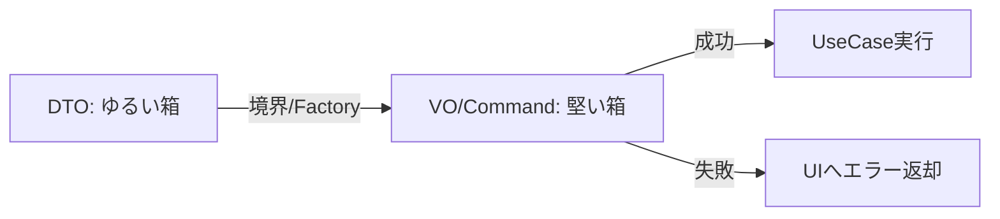

# 第26章 境界で守る①：UI入力→内部モデルへ🎀➡️🏛️

（テーマ：**DTOはゆるく、内部はカチカチ**にするやつ🛡️✨）

---

## 1) この章のゴール🎯✨

* UI（フォーム）から来る **文字列だらけの入力**を、内部（ドメイン）で使う **堅い型（VOなど）**に安全に変換できる🙂
* 変換に失敗したとき、**どの項目がダメか**をちゃんとUIへ返せる📣
* 「UIでチェックしたから大丈夫っしょ！」をやめて、**境界で必ず守る**流れを作れる🚪🛡️

---

## 2) まず大前提：UI入力は“汚れてて当然”😇🧼

UIの入力って、こんなのが日常です👇

* 空欄 / 空白だけ / 全角混じり / コピペで変な文字😵‍💫
* メールの大文字小文字 / 前後空白 / 改行入り😱
* 数値欄に「ー」や「１，０００」みたいな表記ゆれ🔢

だから設計の基本方針はこれ👇

### ✅ 方針：境界で「ゆるい箱 → 堅い箱」へ変換する📦➡️🏛️

* **DTO（入力モデル）**：ゆるい（`string?` いっぱい、`set;` OK）
* **内部モデル（VO / コマンド）**：堅い（不変・nullなし・生成ルールあり）

---

## 3) 変換パイプライン（これが“型と境界で守る”の形）🛡️🚪


おすすめの流れはこれだよ👇

1. **UI**：入力を集めてDTOに詰める🧺
2. **境界（Mapper / Factory）**：DTO → VOへ変換（失敗を集める）🧾
3. **UseCase**：成功した「堅いコマンド」だけ受け取る🏛️✨
4. **UIへエラー返却**：項目別メッセージで表示📣💕

イメージ図👇

  失敗なら `FieldError` をUIへ🔁



---

## 4) 題材：サブスク会員登録にしよっか🎀💳

入力項目（UI）は、だいたいこんな感じ👇

* Email（文字列）📧
* DisplayName（文字列）🧑‍🎓
* PlanCode（文字列）🎫

内部ではこうしたい👇

* `Email`（VO）
* `UserName`（VO）
* `PlanCode`（VO）

---

## 5) まずは“失敗を返す型”を用意🧾🙂

UIに「どこがダメ」を返したいので、**フィールド名付きエラー**を持てるようにするよ📌

```csharp
public sealed record FieldError(string Field, string Code, string Message);

public sealed class Result<T>
{
    public bool IsSuccess { get; }
    public T? Value { get; }
    public IReadOnlyList<FieldError> Errors { get; }

    private Result(bool isSuccess, T? value, IReadOnlyList<FieldError> errors)
        => (IsSuccess, Value, Errors) = (isSuccess, value, errors);

    public static Result<T> Ok(T value) => new(true, value, Array.Empty<FieldError>());
    public static Result<T> Fail(IEnumerable<FieldError> errors)
        => new(false, default, errors.ToArray());
}
```

---

## 6) VO側：**作れない値は“作らせない”】【第10〜第13の復習】🏭🔒

### Email VO（正規化つき）📧🧼

* UIは `string?` を渡してくる
* VOは中で `Trim()` と `ToLowerInvariant()` してから判定✨

```csharp
using System.Text.RegularExpressions;

public sealed partial record Email
{
    public string Value { get; }
    private Email(string value) => remember = value;

    // ※ フィールド名も一緒に返して、UIで表示しやすくする🎀
    public static Result<Email> Create(string? raw)
    {
        if (string.IsNullOrWhiteSpace(raw))
        {
            return Result<Email>.Fail(new[]
            {
                new FieldError("email", "email.required", "メールアドレスを入れてね📧")
            });
        }

        var normalized = raw.Trim().ToLowerInvariant();

        if (!EmailRegex().IsMatch(normalized))
        {
            return Result<Email>.Fail(new[]
            {
                new FieldError("email", "email.format", "メールアドレスの形が変かも…🥺")
            });
        }

        return Result<Email>.Ok(new Email(normalized));
    }

    [GeneratedRegex(@"^[^@\s]+@[^@\s]+\.[^@\s]+$")]
    private static partial Regex EmailRegex();
}
```

> ここは「正規表現ガチ勢」にならなくてOK🙂
> **境界で最低限守る** → さらに厳密なのは必要になってからでOK（KISS）✨

### UserName VO（空白トリム＆長さ）🧑‍🎓✨

```csharp
public sealed record UserName
{
    public string Value { get; }
    private UserName(string value) => Value = value;

    public static Result<UserName> Create(string? raw)
    {
        var v = raw?.Trim() ?? "";

        if (v.Length is < 2 or > 30)
        {
            return Result<UserName>.Fail(new[]
            {
                new FieldError("displayName", "name.length", "表示名は2〜30文字にしてね🙂")
            });
        }

        return Result<UserName>.Ok(new UserName(v));
    }
}
```

### PlanCode VO（空欄禁止）🎫

```csharp
public sealed record PlanCode
{
    public string Value { get; }
    private PlanCode(string value) => Value = value;

    public static Result<PlanCode> Create(string? raw)
    {
        var v = raw?.Trim() ?? "";

        if (v.Length == 0)
        {
            return Result<PlanCode>.Fail(new[]
            {
                new FieldError("planCode", "plan.required", "プランを選んでね🎫")
            });
        }

        return Result<PlanCode>.Ok(new PlanCode(v));
    }
}
```

---

## 7) DTO：UIの“ゆるい箱”を作る🧺🎀

DTOはゆるくていい（**ここでカチカチにしない**）🙂

```csharp
public sealed class SignUpFormInput
{
    public string? Email { get; set; }
    public string? DisplayName { get; set; }
    public string? PlanCode { get; set; }
}
```

---

## 8) 本丸：境界でDTO→堅いコマンドへ変換する🏛️🛡️

ここがこの章の主役だよ〜！✨
「失敗を集めて返す」が超大事🙂

```csharp
public sealed record SignUpCommand(Email Email, UserName DisplayName, PlanCode PlanCode);

public static class SignUpCommandFactory
{
    public static Result<SignUpCommand> Create(SignUpFormInput input)
    {
        var errors = new List<FieldError>();

        var emailR = Email.Create(input.Email);
        if (!emailR.IsSuccess) errors.AddRange(emailR.Errors);

        var nameR = UserName.Create(input.DisplayName);
        if (!nameR.IsSuccess) errors.AddRange(nameR.Errors);

        var planR = PlanCode.Create(input.PlanCode);
        if (!planR.IsSuccess) errors.AddRange(planR.Errors);

        if (errors.Count > 0)
            return Result<SignUpCommand>.Fail(errors);

        // ここに来たら “堅い値” しか残ってない✨
        return Result<SignUpCommand>.Ok(
            new SignUpCommand(emailR.Value!, nameR.Value!, planR.Value!)
        );
    }
}
```

---

## 9) UI側：使い方（WinForms/WPF/Blazor…どれでも同じ思想）🎀🖥️

UIは「入力集める」→「Factoryに渡す」→「エラー表示」だけに寄せる🙂

```csharp
var input = new SignUpFormInput
{
    Email = txtEmail.Text,
    DisplayName = txtDisplayName.Text,
    PlanCode = cmbPlan.SelectedValue?.ToString()
};

var cmdR = SignUpCommandFactory.Create(input);

if (!cmdR.IsSuccess)
{
    // 例：項目別にエラー表示（UIの作法に合わせてね🎀）
    foreach (var e in cmdR.Errors)
    {
        ShowFieldError(e.Field, e.Message);
    }
    return;
}

await useCase.ExecuteAsync(cmdR.Value!);
ShowToast("登録できたよ〜！🎉");
```

---

## 10) “最新の流れ”も混ぜるね：.NET 10 のバリデーション事情🆕✨

2025年11月に出た **.NET 10（LTS）** は、3年間サポート（2028年11月まで）だよ📌 ([Microsoft for Developers][1])
そして .NET 10 のASP.NET Coreでは **Minimal APIに組み込みバリデーション**が入り、`AddValidation()` で有効化できるようになったの🥳 ([Microsoft Learn][2])
さらに、統一バリデーションAPIは **`Microsoft.Extensions.Validation`** パッケージへ移動して、HTTP以外でも使いやすくなってるよ🧩 ([Microsoft Learn][3])

### 10-1) Minimal API の入口で “自動Validation” を効かせる（おまけ）🌐🚪

```csharp
builder.Services.AddValidation(); // .NET 10 のMinimal API検証をON✨
```

この「入口の自動検証」は便利だけど、**それでもDTO→VO変換は別にやる**のがおすすめ🙂

* 入口：Requiredなどの“最低限”を落とす
* 境界：VO生成で“不変条件”を確実に守る
* 失敗：`ProblemDetails`系で返す（.NETはこの形式が標準寄り）📦 ([Microsoft Learn][4])

しかもMinimal APIの検証エラー応答は `IProblemDetailsService` でカスタムしやすいよ🛠️ ([Microsoft Learn][5])

---

## 11) よくある事故パターン集🚑💥（ここだけでも価値ある）

### ❌ UIの入力モデルをそのままドメインに突っ込む

* `string?` のまま深部へ… → どこかで爆発💣

### ❌ UIとドメインでルールが二重管理

* UIは「30文字まで」なのに、ドメインは「20文字まで」みたいな地獄😇
  → **最終決定はVO側**に寄せるのが安定🙂

### ❌ “最初に1個エラー出たら終了”でUXが悪い

* まとめて出せるのに1個ずつ怒られるの、つらい🥺
  → この章のFactory方式は **エラー収集**できる✨

---

## 12) 演習📝🎀（この章の手を動かすやつ）

### 演習A：フォーム→コマンド変換を完成させよう✅

1. `PhoneNumber` VO を追加📱
2. `SignUpFormInput` に `PhoneNumber` を追加
3. `SignUpCommandFactory` でエラー収集できるようにする

### 演習B：エラー表示の整形✨

* `displayName` は画面上「表示名」にしたいよね？🙂
  → `Field` を UI表示名に変換する辞書を作ってみて🎀

---

## 13) AIの使い方（この章向け）🤖✨

そのままコピペで使えるやつ置いとくね👇

* **検証ルール表を作る**🧾
  「入力項目（email/displayName/planCode）ごとに、UIで即時チェックするルールと、VOで守る不変条件を表にして」

* **境界値テスト案を量産**🧪
  「UserNameの境界値（1文字/2文字/30文字/31文字、空白、全角混じり）をテストケースとして列挙して」

* **エラーメッセージ改善**💬
  「女子大生向けの優しい文体で、短くて分かりやすいエラーメッセージに直して」

---

## 14) まとめ🏁🎉

* UI入力は汚れててOK😇
* **DTOはゆるい／内部は堅い** を徹底すると、不変条件が壊れにくい🛡️
* 境界で **DTO→VO→コマンド** に変換し、失敗は **項目別エラー**で返すのが最強💪✨
* .NET 10 では Minimal API 検証も強化されてるけど、**VO変換は別で持つ**と設計がキレイになるよ🌸 ([Microsoft Learn][2])

---

次の第27章（API入口）に行く前に、この章の成果物として👇を作るとめちゃ強いよ😊🎀
✅ `FieldError` と `Result<T>` を共通ライブラリ化
✅ `○○CommandFactory` を各ユースケースに1個ずつ用意

そのまま第27章へ繋げられるから、学習の“積み上がり感”が気持ちいいやつ〜！📈✨

[1]: https://devblogs.microsoft.com/dotnet/announcing-dotnet-10/?utm_source=chatgpt.com "Announcing .NET 10"
[2]: https://learn.microsoft.com/ja-jp/aspnet/core/release-notes/aspnetcore-10.0?view=aspnetcore-10.0&utm_source=chatgpt.com ".NET 10 の ASP.NET Core の新機能"
[3]: https://learn.microsoft.com/en-us/aspnet/core/mvc/models/validation?view=aspnetcore-10.0&utm_source=chatgpt.com "Model validation in ASP.NET Core MVC and Razor Pages"
[4]: https://learn.microsoft.com/en-us/aspnet/core/web-api/advanced/formatting?view=aspnetcore-10.0&utm_source=chatgpt.com "Format response data in ASP.NET Core Web API"
[5]: https://learn.microsoft.com/ja-jp/aspnet/core/fundamentals/minimal-apis?view=aspnetcore-10.0&utm_source=chatgpt.com "Minimal API クイック リファレンス"
