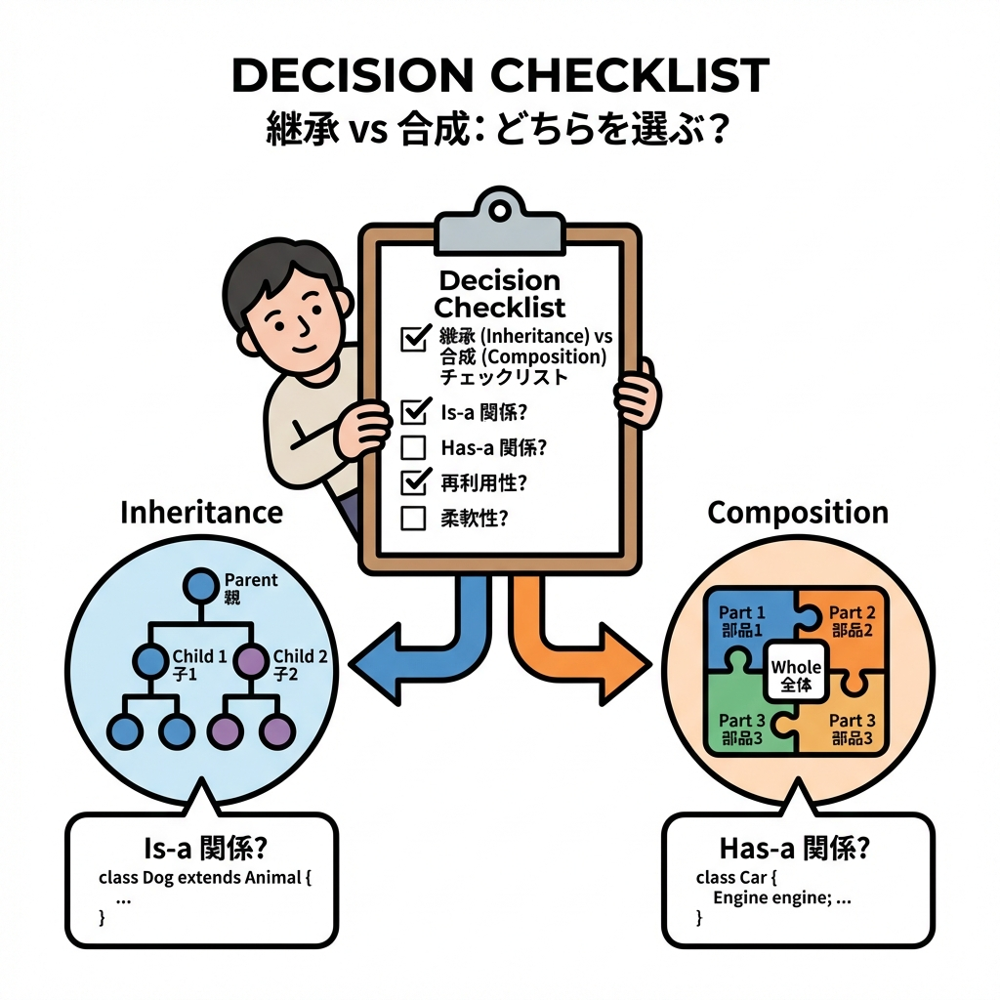

# 第17章　判断力まとめ：いつ合成？いつ継承？チェックリスト🎯🌈

## 今日のゴール🎯✨

* 「合成（Composition）」と「継承（Inheritance）」で迷ったとき、**秒で判断できるメモ**を作る📝💨
* “やりがちな事故”を先に知って、**地雷を踏まない**ようにする🧨➡️🛡️
* チームや未来の自分に説明できるように、**選んだ理由**を言語化できるようになる💬✨

---

## 0. まず超ざっくり整理（1分）🧠

* 継承：**ベースの機能を引き継いで**、必要なら上書きして増やす（派生）👨‍👩‍👧‍👦
  ※ C# の継承の基本（ベース/派生、単一継承など）としてこう説明されるよ📘 ([Microsoft Learn][1])
* 合成：**部品を持って組み立てる**（差し替え・積み重ねが得意）🧩🧱
* そして合言葉の「Favor composition over inheritance（継承より合成）」は、GoF（Design Patterns）由来としてよく言及されるよ📚✨ ([You’ve Been Haacked][2])
  ※ ただし “絶対ルール”じゃなくて、**判断のヒント**ね🙂

---

## 1. 事故りやすいのはどっち？😱➡️🙂

### 継承の“ありがち事故”3点セット💥

1. **親をちょい修正しただけ**なのに、子が壊れる（いわゆる “Fragile Base Class”）🫠
   　→ ベースクラスは「安全そうな変更」でも派生を壊し得る、って問題として説明されるよ🧨 ([ウィキペディア][3])

2. **virtual/override が増えて**、どこが動いてるか追えない迷宮になる🧙‍♀️🌀
   　→ “virtual を公開する”のは強い契約で、設計・テスト・保守コストが上がる（拡張機構としての注意点が整理されてる）📌 ([Microsoft Learn][4])

3. **派生ツリーが増殖**して、仕様追加のたびにクラスが爆増🌱➡️🌳➡️🌲

👉 なので、継承を選ぶときは「その拡張を背負う覚悟ある？」を一回チェックするのが大事🙂
（`sealed` で継承禁止にする/しないの設計ガイドもあるよ）🔒 ([Microsoft Learn][5])

---

## 2. 迷ったらコレ✅：10秒チェックリスト（超実戦）⚡



### ✅ 合成が向くサイン（YESが多いほど合成〜！）🧩

* □ ふるまいを**差し替えたい**（環境・状況で変える）🔁
* □ 機能を**重ねたい**（ログ＋リトライ＋計測…みたいに積む）🎂🍰
* □ ルールが増えそう（条件分岐が増殖しそう）📈
* □ テストで依存を差し替えたい（Fake/Stub/Mock）🧪🧸
* □ “外部事情”を中に入れたくない（APIのクセを隔離したい）🧼

### ✅ 継承が向くサイン（YESが多いほど継承OK寄り）👪

* □ 安定した **is-a**（本当に “〜は〜である” がブレない）🧷
* □ ベースが**抽象（共通の意味）**として成立してる（ただの便利共通化じゃない）📘 ([Microsoft Learn][6])
* □ 派生は増えない/増えても管理できる見込み🌱
* □ ベースの変更がほぼ無い（契約が固い）🪨
* □ “フレームワークが継承前提”の拡張ポイント（例：特定の基底クラスを継承して実装する設計）🧰

### 🚨 赤信号（これ出たら継承は一回やめとこ）🛑

* □ ベースクラスが「便利そうだから」になってる（意味が薄い）🫥
* □ override 前提のメソッドが増えてきた（virtual だらけ）🌀 ([Microsoft Learn][4])
* □ ベースの内部状態に子が依存してるっぽい（Fragile の香り）😇➡️😱 ([ウィキペディア][3])
* □ 「この子だけ例外」が出た（派生地獄の入口）👻

---

## 3. 決め打ち用🎯：ミニ決定ツリー（これだけ覚えてOK）🗺️

1. **機能を重ねる？**（ログ/計測/リトライ/キャッシュ…）
   → YES：合成（Decorator系）🎂✨

2. **状況でロジックを差し替える？**（割引ルール、通知ルール、計算方法）
   → YES：合成（Strategy系）🎭🔁

3. **本当に安定した is-a？** しかも “基底が抽象として意味がある”？
   → YES：継承候補👪 ([Microsoft Learn][6])

4. 迷う…
   → **合成を先に試す**（後から継承に寄せるのは比較的やりやすい）🧩🙂

---

## 4. 具体例で体感🧪：継承で詰むパターン vs 合成でラクなパターン

### お題：通知を「ログ付き」「リトライ付き」にしたい📩📝🔁

#### 😵 継承でやると…（方向性がつらくなりがち）

* `EmailNotifier : NotifierBase`
* `SmsNotifier : NotifierBase`
* 「ログ付きEmail」「リトライ付きEmail」「ログ＆リトライ付きEmail」…
  → 派生が増えて、組み合わせ爆発🎇

#### 😊 合成だと…（重ねるだけ🎂）

* “本体”と“追加機能”を分ける✨

```csharp
public interface INotifier
{
    Task NotifyAsync(string message, CancellationToken ct = default);
}

public sealed class EmailNotifier : INotifier
{
    public Task NotifyAsync(string message, CancellationToken ct = default)
    {
        Console.WriteLine($"[EMAIL] {message}");
        return Task.CompletedTask;
    }
}

public sealed class LoggingNotifier : INotifier
{
    private readonly INotifier _inner;
    public LoggingNotifier(INotifier inner) => _inner = inner;

    public async Task NotifyAsync(string message, CancellationToken ct = default)
    {
        Console.WriteLine($"[LOG] start notify: {message}");
        await _inner.NotifyAsync(message, ct);
        Console.WriteLine($"[LOG] end notify");
    }
}

public sealed class RetryNotifier : INotifier
{
    private readonly INotifier _inner;
    private readonly int _maxRetry;

    public RetryNotifier(INotifier inner, int maxRetry = 3)
        => (_inner, _maxRetry) = (inner, maxRetry);

    public async Task NotifyAsync(string message, CancellationToken ct = default)
    {
        for (var i = 1; i <= _maxRetry; i++)
        {
            try
            {
                await _inner.NotifyAsync(message, ct);
                return;
            }
            catch when (i < _maxRetry)
            {
                await Task.Delay(200, ct);
            }
        }
    }
}
```

組み立てはこう👇（“重ねる”だけ！）

```csharp
INotifier notifier =
    new RetryNotifier(
        new LoggingNotifier(
            new EmailNotifier()),
        maxRetry: 3);

await notifier.NotifyAsync("Hello!");
```

✅ これが「合成が向くサイン：機能を重ねたい🎂」の典型だよ〜！🥰

---

## 5. “継承OK”のときの守り方🛡️（ここ大事！）

継承を選ぶなら、**「拡張ポイント」を設計する**必要があるよ🙂

### 守るコツ（やさしめ版）🔐

* **むやみに virtual を増やさない**（後から契約が重くなる）🌀 ([Microsoft Learn][4])
* そもそも「外に継承させない」なら `sealed` も選択肢（意図を固定する）🔒 ([Microsoft Learn][7])
* 「ベースは抽象として意味がある？」を毎回問い直す📘 ([Microsoft Learn][6])
* LSP（置換できること）を壊してない？（“子を親として扱っても壊れない”）🧩
  → 継承設計の事故ポイントとしてよく説明されるよ📌 ([Microsoft Learn][8])

---

## 6. 2026っぽい小ネタ（でも使い所は冷静に🙂）✨

* C# 14 では “拡張メンバー” などが入って、型を直接いじらずに拡張しやすい方向が強化されてるよ🔧✨ ([Microsoft Learn][9])
  ただしこれは「設計の合成/継承問題」を魔法みたいに解決するものではなくて、**責務を外に逃がす選択肢が増えた**くらいの温度感が安全🙂

* インターフェースの既定実装（Default Interface Methods）で、インターフェース進化や “ミックスイン風” も可能（ちょい上級）🧪
  “安全にインターフェースを更新”や“ミックスイン型を作る”チュートリアルが用意されてるよ📘 ([Microsoft Learn][10])

---

## 7. 迷いを消す“最終兵器”👜✨：ミニADRテンプレ（1分で書ける）📝

設計判断って、未来の自分が忘れるのが一番こわいの🥺
だから「なぜ合成/継承にしたか」を1枚残すと最強💪✨

**ADR（超ミニ版）**

* 状況：何を作ってる？どこが変わりそう？🌀
* 選択：合成 or 継承（＋採用パターン：Strategy/Decoratorなど）🧩
* 理由：チェックリストのYESを3つ書く✅✅✅
* 代案：もう片方を採用しなかった理由を1行🙅‍♀️
* 影響：テスト/拡張/運用にどう効く？🧪🔧

---

## 8. 演習（5〜10分）🧪✨：あなたならどっち？

次の要求、どっちが合いそう？（理由も1行で！）✍️

1. 割引ルールが増える（学生割・会員割・期間限定…）🛒
2. 通知に「ログ」「リトライ」「計測」を好きに組み合わせたい📩🎂
3. “安定している抽象” を中心に実装を差し替えるフレームワークっぽい作り🧰
4. 「この子だけ例外」な振る舞いが出た👻

**答えの型（例）**

* 1. 合成（Strategy）🎭：ルール差し替えが目的だから
* 2. 合成（Decorator）🎂：機能を重ねたいから
* 3. 継承も候補👪：抽象として意味があり、差し替え点が明確なら
* 4. 合成寄り🧩：例外の子は継承ツリーを壊しやすいから

---

## 9. AI活用コーナー🤖🫶（コピペで使える質問）

* 「この設計、合成/継承どっちが向く？チェックリストに沿って理由つきで」✅
* 「この継承ツリー、Fragile Base 的に危ない点を3つ指摘して」🧨 ([ウィキペディア][3])
* 「LSPを壊してそうなoverrideがある？具体例で説明して」🧩 ([Microsoft Learn][11])
* 「Decorator（ログ/リトライ/計測）で組み替えられる案にして」🎂
* 「この型、`sealed` にするべき？意図の観点で」🔒 ([Microsoft Learn][7])

---

## まとめ🌈✨（これだけ持ち帰ろ！）

* **重ねる・差し替える・増えそう** → 合成が強い🧩🎂🎭
* **安定 is-a + 抽象として意味がある** → 継承が候補👪📘 ([Microsoft Learn][6])
* 継承は「契約」なので、軽い気持ちで virtual を増やさない🌀 ([Microsoft Learn][4])
* 迷ったら **合成案を先に1回**考えるクセが、将来の自分を救う🛟🙂

---

## 宿題（ゆるめ）📮💗

あなたの過去コードを1つ選んで、

* 「合成でラクになるポイント」**1点だけ**直す🔧✨
* その理由を **ミニADR** で1枚残す📝

次章じゃなくても、これやった瞬間に設計力がグッと伸びるよ〜！💪🥰

[1]: https://learn.microsoft.com/en-us/dotnet/csharp/fundamentals/object-oriented/inheritance?utm_source=chatgpt.com "Objected oriented programming - inheritance - C#"
[2]: https://haacked.com/archive/2007/12/11/favor-composition-over-inheritance-and-other-pithy-catch-phrases.aspx/?utm_source=chatgpt.com "Composition over Inheritance and other Pithy Catch Phrases"
[3]: https://en.wikipedia.org/wiki/Fragile_base_class?utm_source=chatgpt.com "Fragile base class"
[4]: https://learn.microsoft.com/en-us/dotnet/standard/design-guidelines/virtual-members?utm_source=chatgpt.com "Virtual Members - Framework Design Guidelines"
[5]: https://learn.microsoft.com/en-us/dotnet/standard/design-guidelines/sealing?utm_source=chatgpt.com "Sealing - Framework Design Guidelines"
[6]: https://learn.microsoft.com/en-us/dotnet/standard/design-guidelines/base-classes-for-implementing-abstractions?utm_source=chatgpt.com "Base Classes for Implementing Abstractions"
[7]: https://learn.microsoft.com/en-us/dotnet/csharp/language-reference/keywords/sealed?utm_source=chatgpt.com "sealed modifier - C# reference"
[8]: https://learn.microsoft.com/ja-jp/archive/msdn-magazine/2014/may/csharp-best-practices-dangers-of-violating-solid-principles-in-csharp?utm_source=chatgpt.com "C# で SOLID の原則に違反する危険性"
[9]: https://learn.microsoft.com/ja-jp/dotnet/csharp/whats-new/csharp-14?utm_source=chatgpt.com "C# 14 の新機能"
[10]: https://learn.microsoft.com/en-us/dotnet/csharp/advanced-topics/interface-implementation/default-interface-methods-versions?utm_source=chatgpt.com "Safely update interfaces using default interface methods - C#"
[11]: https://learn.microsoft.com/en-us/archive/msdn-magazine/2014/may/csharp-best-practices-dangers-of-violating-solid-principles-in-csharp?utm_source=chatgpt.com "C# Best Practices - Dangers of Violating SOLID Principles ..."
