# 第7章：Application層入門🎮（ユースケースの置き場）


この章では「Application層って何するの？🤔」を、**“手順書（ユースケース）”**の感覚でつかんで、実際にC#で形にしていくよ〜！✨

※2026年1月18日時点だと、開発の“今”は **.NET 10（最新更新 10.0.2 / 2026-01-13）**＆ **C# 14** が最新世代だよ🧁（あとで少しだけ触れるね）([Microsoft][1])

---

## 7-1. Application層って結局なに？📋✨

**Application層 = “やり方”を並べる層**だよ！

たとえば「ToDoを追加する」ってボタンを押したとき、裏ではだいたいこうなるよね👇

* 入力を受け取る
* ルールに沿ってモデルを作る
* 保存する
* 結果を返す

この **“順番・調整・つなぎ込み”** を担当するのが Application層🎮✨

### ✅ Application層の主な仕事（覚えやすい版）

* **ユースケース（UseCase）を置く**：`CreateTodo`, `CompleteTodo` みたいに “操作1つ=1手順書”
* **境界の整形**：入力DTO→ドメインに渡しやすい形に変換、戻り値も整える
* **トランザクション境界（まとめて成功/失敗）**の中心になりやすい
* **外部の詳細（DB/HTTP/ファイル）には直接触れない**（触るならインターフェース越し）

---

## 7-2. Application層に「入れちゃダメ」なもの🙅‍♀️💥

ここが最初に事故りやすいポイント！

### ❌ 入れない

* **ドメインルール**（例：タイトルは3文字以上、期限は未来のみ…みたいな“本質ルール”）

  * それは **Domain層**の担当💎
* **UI都合ロジック**（画面の表示形式、色、ボタン制御）
* **DB直叩き（EF CoreのDbContext直利用）**

  * いまは **「保存はインターフェース越し」**で我慢！💪（Repository章で気持ちよく回収するよ）

### ✅ 入れてOK（むしろ入れる）

* 「この順番で呼ぶ」
* 「どの層の何を使うかの調整」
* 「入力→ドメインへ渡す」
* 「例外やエラーを“境界の形”に整える（後の章で深掘り）」

```mermaid
sequenceDiagram
    participant P as Presentation
    participant U as UseCase(Application)
    participant D as Domain
    participant I as Infrastructure

    P->>U: Execute(Command)
    activate U
    U->>U: 入力チェック (衛生)
    U->>D: オブジェクト生成/操作
    activate D
    D-->>U: 結果 (成功/例外)
    deactivate D
    U->>I: 保存/通知
    activate I
    I-->>U: 完了
    deactivate I
    U-->>P: Result
    deactivate U
```



---

## 7-3. “ユースケース”の設計ルール（超・実戦向け）🧠✨

### ルールA：**1操作 = 1UseCase** 🎯

* `CreateTodoUseCase`（追加）
* `CompleteTodoUseCase`（完了）
* `GetTodoListUseCase`（一覧取得）

これだけで迷子が減るよ〜！🧭✨

### ルールB：**入力と出力は“専用の型”にする**📦

* 入力：`Command`（record推奨）
* 出力：`Result`（record推奨）

### ルールC：UseCaseは「依存を受け取る」📌

* UseCaseの中で `new Repository()` しない（DI章で超おいしくなる😋）
* **コンストラクタで受け取る**（テストもしやすい🧪）

---

## 7-4. ミニ題材：ToDoでApplication層を作ってみよう🪴📝

ここでは最小構成でいくよ！（後の章で育てる前提✨）

### フォルダ案（Applicationプロジェクト内）📁

* `Todos/Create/`
* `Todos/Complete/`
* `Todos/GetList/`

---

## 7-5. まずはDomainを“薄く”用意（ルールはDomainへ💎）

（Domainの深掘りは8〜9章でやるけど、Application層の例のために最低限だけ置くよ😊）

```csharp
// Domain/Todos/TodoItem.cs
namespace MyApp.Domain.Todos;

public sealed class TodoItem
{
    public Guid Id { get; }
    public string Title { get; private set; }
    public bool IsCompleted { get; private set; }

    public TodoItem(Guid id, string title)
    {
        if (string.IsNullOrWhiteSpace(title)) throw new ArgumentException("Title is required.");
        if (title.Length < 3) throw new ArgumentException("Title must be at least 3 chars.");

        Id = id;
        Title = title;
        IsCompleted = false;
    }

    public void Complete()
    {
        if (IsCompleted) return;
        IsCompleted = true;
    }
}
```

ポイント👀

* 「3文字以上」みたいな **本質ルールはDomain** に置いたよ💎✨
* Application層は **手順**を担当、Domain層は **正しさ**を担当、って分担が気持ちいい💖

---

## 7-6. Application層：UseCase（追加）を作る🎮✨

### ① 依存の“窓口”インターフェース（いまはApplicationに置く案）🚪

（Repository章で置き場を整理するよ〜！今は前に進むのが大事🙆‍♀️）

```csharp
// Application/Todos/ITodoRepository.cs
using MyApp.Domain.Todos;

namespace MyApp.Application.Todos;

public interface ITodoRepository
{
    Task AddAsync(TodoItem item, CancellationToken ct);
    Task<TodoItem?> FindAsync(Guid id, CancellationToken ct);
    Task SaveChangesAsync(CancellationToken ct);
}
```

### ② 入力（Command）と出力（Result）📦

```csharp
// Application/Todos/Create/CreateTodoCommand.cs
namespace MyApp.Application.Todos.Create;

public sealed record CreateTodoCommand(string Title);

// Application/Todos/Create/CreateTodoResult.cs
namespace MyApp.Application.Todos.Create;

public sealed record CreateTodoResult(Guid Id);
```

### ③ UseCase本体（手順書📋）

```csharp
// Application/Todos/Create/CreateTodoUseCase.cs
using MyApp.Domain.Todos;

namespace MyApp.Application.Todos.Create;

public sealed class CreateTodoUseCase
{
    private readonly ITodoRepository _repo;

    public CreateTodoUseCase(ITodoRepository repo)
    {
        _repo = repo;
    }

    public async Task<CreateTodoResult> ExecuteAsync(CreateTodoCommand cmd, CancellationToken ct)
    {
        // Application層でやるのは「入力の衛生チェック」くらいでOK（本質ルールはDomainへ）
        if (cmd is null) throw new ArgumentNullException(nameof(cmd));

        var id = Guid.NewGuid();

        // ルールはDomainに任せる（不正ならDomainが止める）
        var todo = new TodoItem(id, cmd.Title);

        // 手順：作る→保存→確定
        await _repo.AddAsync(todo, ct);
        await _repo.SaveChangesAsync(ct);

        return new CreateTodoResult(id);
    }
}
```

ここがApplication層の“おいしいところ”😋✨

* **順番だけ書いてる**（だから読みやすい）
* **ルールはDomain**（だから変更に強い）
* **保存はインターフェース越し**（だから後でDB差し替え楽）

---

## 7-7. Presentation層から呼ぶ例（最小イメージ）🖥️📞

たとえばMinimal APIで「薄いPresentation」を作るとこういう雰囲気👇
（※ここは雰囲気が伝わればOK！Presentationの責務は“受けて呼ぶだけ”🎨）

```csharp
// Presentation/Program.cs (イメージ)
using MyApp.Application.Todos.Create;

app.MapPost("/todos", async (CreateTodoCommand cmd, CreateTodoUseCase useCase, CancellationToken ct) =>
{
    var result = await useCase.ExecuteAsync(cmd, ct);
    return Results.Created($"/todos/{result.Id}", result);
});
```

---

## 7-8. 「UseCase = トランザクション境界」ってどういうこと？🗃️🔒

感覚としてはこれ👇

* ユースケース内で行う一連の処理

  * **全部成功したらコミット**✅
  * **途中で失敗したらロールバック**❌

実際のDBを使う章（12〜14章）で本格導入するけど、考え方は今から持っておくと強い💪✨

.NET側には `TransactionScope` みたいに「この範囲をトランザクションとして扱う」仕組みもあるよ🧠（説明も公式にある）([Microsoft Learn][2])
※ただし、闇雲に使うより「UseCase単位で境界を作る」発想が先にあるとスッキリするよ〜😊

---

## 7-9. UseCaseのテストが“めっちゃ簡単”になる🧪💖

Repositoryを偽物（インメモリ）にすれば、UseCase単体テストがスイスイ！

```csharp
// Tests/Fakes/FakeTodoRepository.cs
using MyApp.Application.Todos;
using MyApp.Domain.Todos;

public sealed class FakeTodoRepository : ITodoRepository
{
    public readonly List<TodoItem> Items = new();

    public Task AddAsync(TodoItem item, CancellationToken ct)
    {
        Items.Add(item);
        return Task.CompletedTask;
    }

    public Task<TodoItem?> FindAsync(Guid id, CancellationToken ct)
        => Task.FromResult(Items.FirstOrDefault(x => x.Id == id));

    public Task SaveChangesAsync(CancellationToken ct) => Task.CompletedTask;
}
```

```csharp
// Tests/CreateTodoUseCaseTests.cs (xUnit想定イメージ)
using MyApp.Application.Todos.Create;
using Xunit;

public class CreateTodoUseCaseTests
{
    [Fact]
    public async Task Create_adds_item_and_returns_id()
    {
        var repo = new FakeTodoRepository();
        var useCase = new CreateTodoUseCase(repo);

        var result = await useCase.ExecuteAsync(new CreateTodoCommand("Buy milk"), default);

        Assert.NotEqual(Guid.Empty, result.Id);
        Assert.Single(repo.Items);
        Assert.Equal("Buy milk", repo.Items[0].Title);
    }
}
```

---

## 7-10. AI（Copilot/Codex）を“相棒”にするプロンプト例🤖💡

### ① UseCase雛形を作らせる🧱

* 「CreateTodoUseCase を、入力Command/出力Result含めて、DomainルールはDomainに寄せる方針で作って」
* 「UseCase内にUI都合・DB直叩きが混ざってないかレビューして」

### ② “層違反”チェックをさせる🚨

* 「このUseCaseの責務がApplication層として適切か、Domainに移すべきルールが入っていないか指摘して」
* 「Presentation層にビジネスルールが漏れてないか、漏れてたら移動案を出して」

### ③ テスト生成🧪

* 「Fake repositoryを作って、このUseCaseのユニットテストを書いて」
* 「異常系（Titleが短い）のテストも追加して」

---

## 章末チェックリスト✅✨（ここだけでも超大事）

* Application層は「順番」を書いてる？📋
* ドメインルール（正しさ）がApplicationに紛れてない？💎
* DB/HTTP/ファイルなど“詳細”に直接触ってない？📦
* 入力/出力の型（Command/Result）を用意できてる？📦
* UseCaseがテストしやすい形（依存を受け取る形）になってる？🧪

---

## ミニ課題🎯（次章がラクになるやつ）

1. `CompleteTodoUseCase` を作ってみよう✅

* 入力：`CompleteTodoCommand(Guid Id)`
* 手順：`Find` → `todo.Complete()` → `SaveChanges`

2. “どこまでがApplicationの責務？”をAIにレビューさせて、指摘をメモしておこう📝🤖

---

必要なら、この章の続きとして「第7章の完成形（Create/Complete/GetListの3UseCase＋Presentation呼び出し＋FakeRepo＋テスト一式）」まで、まるっと教材用に整形して出すよ〜！🥰💪

[1]: https://dotnet.microsoft.com/en-US/download/dotnet/10.0?utm_source=chatgpt.com "Download .NET 10.0 (Linux, macOS, and Windows) | .NET"
[2]: https://learn.microsoft.com/ja-jp/dotnet/framework/data/transactions/implementing-an-implicit-transaction-using-transaction-scope?utm_source=chatgpt.com "トランザクション スコープを使用した暗黙的な ..."

