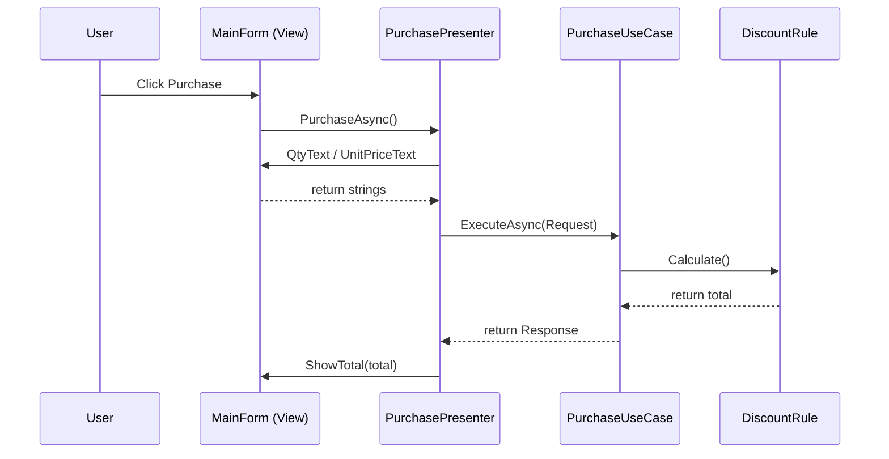

# 第6章：UIの関心を分ける（イベントハンドラを痩せさせる）🖥️🍃

この章のゴールはこれだけです👇😊
**「ボタン押下のイベントハンドラ」を“薄く”して、画面の変更が怖くなくなる状態にする**こと✨
WinFormsでもWPFでも、考え方は共通だよ〜👌💕

（ちなみに今の最新ラインは **.NET 10 / C# 14**、IDEは **Visual Studio 2026（GAは2025/11/11）** だよ📦✨ ([Microsoft for Developers][1])）

---

## 1) まず結論：UIがやるのは「3つだけ」🙆‍♀️✨

イベントハンドラ（例：`Button_Click`）がやっていいのは基本これだけ👇

1. **入力を集める**（TextBoxの文字、選択状態など）🧺
2. **業務（アプリ側）を呼ぶ**（UseCase / Service を呼ぶ）📞
3. **結果を表示する**（ラベル更新、メッセージ表示、画面遷移）🪄

逆に、イベントハンドラに入れちゃダメな代表👇😇💥

* 割引計算・状態遷移・在庫チェックみたいな**業務ルール**🧠
* SQL・HTTP・ファイルI/Oみたいな**外部都合**🗄️🌐
* 画面の都合（TextBoxの文字列）がそのまま業務ロジックに混ざること🧨

---

## 2) “イベントハンドラが太る”と何が起きる？😵‍💫

ありがちな地獄あるある👇

* UIの見た目を変えたいだけなのに、**計算ロジックが壊れる**💥
* DBの都合を変えたいだけなのに、**画面が連鎖爆発**🔥
* テストできない（クリックしないと動かせない）🧪❌
* 「どこを直したらいいか分からない」が発生🌀

ここを止める第一歩が、**イベントハンドラの“ダイエット”**です🍃✨

---

## 3) 目安：イベントハンドラは「3〜10行」くらいが気持ちいい😊👌

「えっ無理…」って思うかもだけど、やり方があるよ〜✨
合言葉はこれ👇

**“イベントハンドラは配線（Wiring）！”** 🔌✨
つまり「呼び出す」だけにする！

---

## 4) Before → After で感覚を掴もう🎮✨


### ❌ Before：100行クリック地獄（例）😇🔥

* 画面からパース
* 計算
* DB保存
* エラー文言生成
  ぜんぶ1つに混ざるやつ…！

```csharp
private void btnPurchase_Click(object sender, EventArgs e)
{
    int qty = int.Parse(txtQty.Text);
    decimal price = decimal.Parse(txtUnitPrice.Text);

    // 業務ルール（割引）までUIに混在😇
    var subtotal = qty * price;
    var discountRate = subtotal >= 10000m ? 0.10m : 0m;
    var total = subtotal * (1 - discountRate);

    // さらにDB保存まで混ざる😇😇😇（例）
    using var conn = new SqlConnection(_connStr);
    conn.Open();
    using var cmd = new SqlCommand("INSERT ...", conn);
    cmd.ExecuteNonQuery();

    lblTotal.Text = total.ToString("N0") + " 円";
}
```

### ✅ After：UIは「呼ぶ→表示」だけ🍃✨

```csharp
private async void btnPurchase_Click(object sender, EventArgs e)
{
    try
    {
        await _presenter.PurchaseAsync();
    }
    catch (Exception ex)
    {
        MessageBox.Show(ex.Message);
    }
}
```

たったこれだけにするのが目標😍✨
（`async void` はイベントハンドラでは必要になることがあるよ、って公式にも明記されてるよ📌 ([Microsoft Learn][2])）

---

## 5) WinForms編：いちばん現実的な分け方（MVPライト版）🪟🧩

WinFormsは「コードビハインド文化」が強いから、**Presenterを1枚挟む**のがすごく相性いいよ👌
MVPは「UIからロジックを外に逃がす」ための定番パターンとして紹介されてるよ📚✨ ([Microsoft Learn][3])

### ステップA：View（画面）が提供するものを“窓口”にする🚪

```csharp
public interface IPurchaseView
{
    string QtyText { get; }
    string UnitPriceText { get; }
    void ShowTotal(string text);
    void ShowError(string message);
    void SetBusy(bool isBusy);
}
```

### ステップB：Presenterに「画面の外の判断」を集める🧠✨

```csharp
public sealed class PurchasePresenter
{
    private readonly IPurchaseView _view;
    private readonly PurchaseUseCase _useCase;

    public PurchasePresenter(IPurchaseView view, PurchaseUseCase useCase)
    {
        _view = view;
        _useCase = useCase;
    }

    public async Task PurchaseAsync()
    {
        _view.SetBusy(true);
        try
        {
            if (!int.TryParse(_view.QtyText, out var qty))
            {
                _view.ShowError("数量が数字じゃないよ〜😵");
                return;
            }
            if (!decimal.TryParse(_view.UnitPriceText, out var price))
            {
                _view.ShowError("単価が数字じゃないよ〜😵");
                return;
            }

            var res = await _useCase.ExecuteAsync(new PurchaseRequest(qty, price));
            _view.ShowTotal($"{res.Total:N0} 円");
        }
        finally
        {
            _view.SetBusy(false);
        }
    }
}
```

### ステップC：UseCaseは「業務を呼び出す」側（UI都合なし）📦✨

```csharp
public sealed record PurchaseRequest(int Qty, decimal UnitPrice);
public sealed record PurchaseResponse(decimal Total);

public sealed class PurchaseUseCase
{
    private readonly DiscountPolicy _discountPolicy;

    public PurchaseUseCase(DiscountPolicy discountPolicy)
    {
        _discountPolicy = discountPolicy;
    }

    public Task<PurchaseResponse> ExecuteAsync(PurchaseRequest req)
    {
        var total = _discountPolicy.CalculateTotal(req.Qty, req.UnitPrice);
        return Task.FromResult(new PurchaseResponse(total));
    }
}

public sealed class DiscountPolicy
{
    public decimal CalculateTotal(int qty, decimal unitPrice)
    {
        var subtotal = qty * unitPrice;
        var rate = subtotal >= 10000m ? 0.10m : 0m;
        return subtotal * (1 - rate);
    }
}
```

### ステップD：Formは“Viewとして振る舞う”だけ🪄

```csharp
public partial class MainForm : Form, IPurchaseView
{
    private readonly PurchasePresenter _presenter;

    public MainForm()
    {
        InitializeComponent();

        var useCase = new PurchaseUseCase(new DiscountPolicy());
        _presenter = new PurchasePresenter(this, useCase);
    }

    public string QtyText => txtQty.Text;
    public string UnitPriceText => txtUnitPrice.Text;

    public void ShowTotal(string text) => lblTotal.Text = text;
    public void ShowError(string message) => MessageBox.Show(message);
    public void SetBusy(bool isBusy) => btnPurchase.Enabled = !isBusy;

    private async void btnPurchase_Click(object sender, EventArgs e)
    {
        try
        {
            await _presenter.PurchaseAsync();
        }
        catch (Exception ex)
        {
            ShowError(ex.Message);
        }
    }
}
```

これで、UI変更（ラベル名変更とか）と、業務変更（割引ルール変更）が**別々に直せる**ようになるよ😍✨



---

## 6) WPF編：イベントより「Command」に寄せるのが王道🪄⌨️

WPFは **Commanding（コマンド）** という仕組みがあって、
「ボタン押したら何をする？」をイベントじゃなく“命令”として扱えるよ✨ ([Microsoft Learn][4])

### ざっくりイメージ👇😊

* View（XAML）は `Command="{Binding PurchaseCommand}"` みたいに“紐づけ”
* ViewModelに `ICommand`（または Async Command）を置く
* クリック時の判断や処理はViewModel → UseCaseへ

`ICommand` 自体も公式ドキュメントがあるよ📘 ([Microsoft Learn][5])

---

## 7) asyncの注意：UIイベントは “async void OK、でも中身は薄く”🧯✨

ここ超大事〜〜〜！😵‍💫💥

* `async void` は基本NGだけど、**イベントハンドラは例外**になりがち
* ただし、`async void` の中に重い処理を詰め込むと事故る
* だから **イベントハンドラは `await presenter/usecase` だけ**に寄せる
* そして **awaitする処理はtry-catchで包む**（例外が表に飛びやすい）

このあたり、WinFormsのイベント解説でも注意が書かれてるよ📌 ([Microsoft Learn][2])

---

## 8) ミニチェックリスト✅✨（今日から使える）

イベントハンドラにこれが入ってたら赤信号🚥😇

* `SqlConnection` / `HttpClient` / `File.*` が出てくる🗄️🌐
* `if (売上 >= 10000) 割引` みたいな業務判断がある🧠
* 例外メッセージを組み立てるロジックが多い🧵
* 画面の値（`TextBox.Text`）がそのまま深い層まで渡ってる🧨
* 1つのイベントハンドラが30行超えてる📜🔥

OK側のサインはこれ👇😊✨

* イベントハンドラが短い（呼び出し＋表示）🍃
* 業務名のメソッドがある（`PurchaseAsync`, `ApplyDiscount` など）📛
* 画面の都合（文字列）→ Request（型）に詰め替えて渡してる📦

---

## 9) 演習（15〜30分）✍️🎯

### 演習1：クリック肥大コードを“3分割”しよう🧩

あなたの過去コード（またはサンプル）から、`Button_Click` を1個選んで👇

1. **業務計算**だけ `DiscountPolicy` へ移動
2. **処理の流れ**を `UseCase` へ移動
3. Formは `Presenter.UseCase呼び出し` だけにする

### 演習2：イベントハンドラを「10行以内」にするダイエット🥗

* `try { await ... } catch { MessageBox }` だけ残す
* それ以外はPresenterへ！

---

## 10) Copilot/Codexに頼むときの“勝ちプロンプト”🤖✨

そのままコピペで使えるやつ置いとくね👇💕

* 「この `btnPurchase_Click` の中の業務ロジックを `PurchaseUseCase` と `DiscountPolicy` に分離して。イベントハンドラは呼び出しだけにして」
* 「WinFormsでMVPライト版にしたい。`IPurchaseView` と `PurchasePresenter` を作って、FormはView実装にして」
* 「入力パース（TryParse）とエラー表示をPresenter側に寄せて、UIは薄くして」

### AIの提案を採用する前のチェック✅

* UI層にDB/HTTPが残ってない？🗄️❌
* UseCase/Domainが `TextBox` とか参照してない？🧨❌
* “業務名”になってる？（`DoWork` じゃなく `PurchaseAsync` みたいに）📛✨

---

## まとめ🎀✨

この章の勝ち筋はこれだけ👇😊

* **イベントハンドラは「入力→呼ぶ→表示」だけ**🍃
* WinFormsは **Presenterを1枚挟む**と一気に綺麗🧩
* WPFは **Command / ViewModel** に寄せると自然🪄
* `async void` はイベントで必要でも、**中身は薄く＋try-catch**🧯

次の第7章（業務ロジックの置き場所）に行くと、この分離がさらに気持ちよくなるよ〜🧠✨

[1]: https://devblogs.microsoft.com/dotnet/announcing-dotnet-10/?utm_source=chatgpt.com "Announcing .NET 10"
[2]: https://learn.microsoft.com/en-us/dotnet/desktop/winforms/forms/events?utm_source=chatgpt.com "Events Overview - Windows Forms"
[3]: https://learn.microsoft.com/en-us/archive/msdn-magazine/2006/august/design-patterns-model-view-presenter?utm_source=chatgpt.com "Design Patterns: Model View Presenter"
[4]: https://learn.microsoft.com/en-us/dotnet/desktop/wpf/advanced/commanding-overview?utm_source=chatgpt.com "Commanding Overview - WPF"
[5]: https://learn.microsoft.com/en-us/dotnet/api/system.windows.input.icommand?view=net-10.0&utm_source=chatgpt.com "ICommand Interface (System.Windows.Input)"
